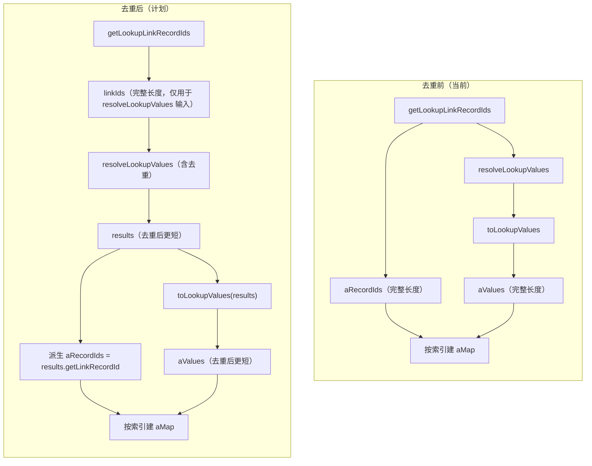

# feat: Lookup 列值去重

## Summary

为 lookup 列(type=26)增加按值去重能力。在 `resolveLookupValues` 末尾按 property 的 `dedupe` 标志去重结果，切换开关时 `updateNoteColumn` 全量重算该列所有记录。包含集合运算路径的索引对齐修复——去重后从 `resolveLookupValues` 结果派生 recordIds，保持与 values 对齐。

---

## Problem Frame

lookup 列通过 `double_link_column_id` 关联多条记录，每条记录在 `source_column_id` 上取值后用逗号拼接展示。当多条关联记录在源列上有相同值时（如三条记录的分类都是"苹果"），lookup 显示"苹果,苹果,苹果"。当前无去重机制。brainstorm 确认方案：在核心解析层 `resolveLookupValues` 去重，影响展示、存储、集合运算三路；切换开关时全量重算。（见 origin: docs/brainstorms/2026-07-06-lookup-column-value-dedupe-requirements.md）

---

## Requirements

**去重配置**

- R1. lookup 列 type=26 的 property JSON 支持 `dedupe` 布尔字段。
- R2. property 中无 `dedupe` 字段或值为 null 时，按 false 处理，保持现有行为。

**去重逻辑**

- R3. `resolveLookupValues` 在返回结果前，当 `dedupe` 为 true 时，按 `LookupResult.value` 去重，保留首次出现的 LookupResult（含其 linkRecordId），丢弃后续相同 value 的结果。
- R4. 去重保持原顺序，不改变首次出现值的相对位置。
- R5. 多个空 value 同样按值去重为一个，不特殊处理空字符串。

**集合运算对齐**

- R9. 集合运算路径中 lookup 列的 recordIds 与 values 在 dedupe 开启时保持长度对齐。从 `resolveLookupValues` 结果派生 recordIds，而非直接使用 `getLookupLinkRecordIds` 的原始返回值。

**重算触发**

- R6. `updateNoteColumn` 检测到 type=26 列的 `dedupe` 字段从旧值变为新值时，触发该列所有记录的全量重算。
- R7. 重算遍历该列所属表的所有记录，对每条记录重新调用 `resolveLookupValue` 并更新其 lookup item 的存储值。
- R8. 重算失败的单条记录不中断整体流程，记录错误日志后继续处理下一条。

---

## Key Technical Decisions

**去重在 `resolveLookupValues` 末尾执行**：统一影响展示、存储、集合运算三路。相比只在 join 步骤去重更彻底，但需要配套修复集合运算的索引对齐。（brainstorm 方案 C）

**集合运算从 `resolveLookupValues` 结果派生 recordIds**：`getLookupLinkRecordIds` 返回的原始 recordIds 长度不变，但 `resolveLookupValues` 去重后 results 更短。当前代码按索引构建 `recordId→value` 映射（L383-390），错位会导致值错误。改为从 results 的 `getLinkRecordId()` 派生 recordIds，保证两者同源对齐。

**重算方法放在 `NoteRecordServiceImpl`**：该类拥有 `resolveLookupValue` 和所需全部 mapper（noteRecordMapper、noteDwtableItemMapper、noteColumnMapper），避免 `NoteColumnServiceImpl` 重复实现解析逻辑。

**`NoteColumnServiceImpl` 注入 `NoteRecordService`**：该类目前仅注入 mapper，这是首次跨 service 调用。无循环依赖——`NoteRecordServiceImpl` 依赖 `NoteColumnMapper` 不依赖 `NoteColumnService`。

**`dedupe` 缺省 false**：property 无此字段时按 false 处理，向后兼容现有 lookup 列。读取用 `JSONObject.getBoolean("dedupe")`，null 返回即视为 false。

---

## High-Level Technical Design

集合运算中 lookup 列数据获取的数据流变化：

关键变化：`aRecordIds` 不再来自 `getLookupLinkRecordIds` 的直接返回，而是从 `resolveLookupValues` 的结果派生。当 dedupe 关闭时，results 长度 == linkIds 长度，行为与当前一致；dedupe 开启时，两者同步缩短，保持对齐。

---

## Implementation Units

### U1. resolveLookupValues 去重逻辑

**Goal:** 在 `resolveLookupValues` 末尾按 property 的 `dedupe` 标志对结果按值去重。

**Requirements:** R1, R2, R3, R4, R5

**Dependencies:** 无

**Files:**
- `ruoyi-system/src/main/java/com/ruoyi/system/service/impl/NoteRecordServiceImpl.java`
- `ruoyi-system/src/test/java/com/ruoyi/system/service/impl/NoteRecordServiceImplTest.java`

**Approach:** 在 `resolveLookupValues`（L1002）现有遍历构建 `results` 后、return 前，读取 `itemColumn.getProperty()` 的 `dedupe` 布尔值。为 true 时，用 `LinkedHashMap<value, LookupResult>` 过滤重复：遍历 results，首次出现的 value 放入 map，后续相同 value 跳过。最终返回 `new ArrayList<>(map.values())`，保持首次出现顺序。dedupe 为 false 或 null 时直接返回原 results。

**Patterns to follow:** `resolveLookupValues` 已有遍历构建 results 的逻辑（L1032-1041），去重在遍历后加一步过滤。`JSONObject.parseObject(itemColumn.getProperty())` 已在 L1010 使用，复用此模式读取 dedupe。

**Test scenarios:**
- Covers AE1. dedupe=true，3 条关联记录值分别为"苹果/苹果/梨"，结果为 `["苹果","梨"]`，linkRecordId 为前两个
- Covers AE2. dedupe=false，同上数据，结果为 `["苹果","苹果","梨"]`，3 条全保留
- dedupe 字段缺失（property 无此 key），按 false 处理，结果含全部重复值
- Covers R5. 多个空 value（如 `["","","梨"]`），dedupe=true 时结果为 `["","梨"]`
- Covers R4. dedupe=true，值顺序"梨/苹果/苹果/梨"，结果为 `["梨","苹果"]`，保持首次出现顺序
- source column 是 lookup 列（链式解析）+ dedupe=true，去重仍生效

**Verification:** `resolveLookupValues` 在 dedupe=true 时返回的 results 无重复 value，linkRecordId 为首次出现值对应的 ID；dedupe=false 时行为与修改前完全一致。

---

### U2. 集合运算索引对齐修复

**Goal:** 修复 4 个 lookup 数据获取块中 recordIds 与 values 的索引对齐，使去重后两者同源。

**Requirements:** R9

**Dependencies:** U1

**Files:**
- `ruoyi-system/src/main/java/com/ruoyi/system/service/impl/NoteRecordServiceImpl.java`
- `ruoyi-system/src/test/java/com/ruoyi/system/service/impl/NoteRecordServiceImplTest.java`

**Approach:** 4 个对称块（L275-279、L304-308、L327-331、L349-353）当前模式为：`recordIds = getLookupLinkRecordIds(...)` 后 `values = toLookupValues(resolveLookupValues(column, recordIds))`。改为：先调 `getLookupLinkRecordIds`（保留 null 跳过检查），再调 `resolveLookupValues` 拿 results，然后 `recordIds = results.stream().map(LookupResult::getLinkRecordId).collect(toList())`，`values = toLookupValues(results)`。dedupe 关闭时 results 长度 == 原 recordIds 长度，行为不变；dedupe 开启时两者同步缩短。`LookupResult.getLinkRecordId()` 已存在（L932）。

**Patterns to follow:** `getLookupLinkRecordIds` 返回 null 表示 DB 无数据需跳过（L276-278），保留此语义。4 个块改动模式完全对称。

**Test scenarios:**
- dedupe=true 时 union 运算，A 为 lookup 列，运算后 aRecordIds.size() == aValues.size()（对齐验证）
- dedupe=false 时 union 运算，A 为 lookup 列，aRecordIds.size() == aValues.size()（无回归）
- dedupe=true 时 subtract（差集）A-B，A 为 lookup 列，结果值通过 aMap 反查正确（不错位）
- dedupe=true 时 intersection（交集），A/B 均为 lookup 列，结果 recordIds 与 values 对齐
- getLookupLinkRecordIds 返回 null 时跳过（无回归，4 个块均验证）

**Verification:** 4 个 lookup 数据获取块中 recordIds 与 values 长度始终一致，无论 dedupe 开关状态。集合运算结果值与 recordIds 通过 aMap/bMap 正确对应。

---

### U3. 重算方法与切换触发

**Goal:** `updateNoteColumn` 检测 dedupe 变化时触发全量重算；`NoteRecordServiceImpl` 新增重算方法遍历所有记录更新存储值。

**Requirements:** R6, R7, R8

**Dependencies:** U1

**Files:**
- `ruoyi-system/src/main/java/com/ruoyi/system/service/impl/NoteColumnServiceImpl.java`
- `ruoyi-system/src/main/java/com/ruoyi/system/service/impl/NoteRecordServiceImpl.java`
- `ruoyi-system/src/test/java/com/ruoyi/system/service/impl/NoteColumnServiceImplTest.java`

**Approach:**
`NoteRecordServiceImpl` 新增 `recomputeLookupColumnValues(NoteColumn lookupColumn)` 方法：用 `noteRecordMapper.selectNoteRecordList`（按 `dwtableId` 查询，参照 L155/L259 模式）获取该列所属表所有记录。对每条记录调 `resolveLookupValue(lookupColumn, record.getId())` 获取新值。查询 `NoteDwtableItem`（recordId + columnId），存在则更新 value，不存在则新建（参照集合运算 L430-435 模式）。单条失败 try-catch 记录日志后继续（R8）。

`NoteColumnServiceImpl` 注入 `INoteRecordService`。`updateNoteColumn`（L185）中，在 `noteColumnMapper.updateNoteColumn(noteColumn)` 之后，检测 `originColumn.getType() == 26L` 且 originColumn property 的 dedupe 与新 property 的 dedupe 不同时，调用 `noteRecordService.recomputeLookupColumnValues(noteColumn)`。dedupe 读取：`JSONObject.parseObject(property).getBoolean("dedupe")`，null 视为 false。property 为 null 时不触发。

**Patterns to follow:** `updateNoteColumn` 已有 `originColumn` 读取（L189），复用。`selectNoteRecordList` 按 dwtableId 查询在 L155、L259 已有先例。item 不存在时新建的模式在 L430-435。

**Test scenarios:**
- Covers AE3. dedupe 从 false 变 true，表中有 5 条记录，重算后 5 条记录的 lookup item value 全部更新为去重值
- dedupe 从 true 变 false，重算后 value 恢复为含重复值
- dedupe 未变化（true→true），不触发重算（noteRecordService.recomputeLookupColumnValues 不被调用）
- 列类型非 26（如 type=21），不触发重算
- Covers R7. 重算时某记录无 lookup item，新建 item 并写入 value
- Covers R8. 重算时第 3 条记录抛异常，第 4、5 条仍正常处理，日志记录第 3 条错误

**Verification:** 切换 dedupe 开关后，该 lookup 列所有记录的存储值反映新状态。未切换时不触发重算。单条失败不中断整体。

---

## Scope Boundaries

**不在本次范围：**
- 前端切换 UI 的实现（后端契约与逻辑先定义，前端由后续工作处理）
- 记录级去重（同一 recordId 在 linkRecordId 中重复，属数据完整性问题）
- 去重时附带计数展示（如"苹果×3"）
- 去重时的排序（保持原顺序，不引入排序能力）

### Deferred to Follow-Up Work

- 大表重算性能优化：当前同步全量重算，数据量大的表可能卡顿。后续可考虑异步或分批重算。

---

## Risks & Dependencies

- **集合运算路径无现有测试**：4 个 lookup 数据获取块当前无单元测试覆盖。U2 的对齐修复依赖新增测试验证正确性，无法靠回归测试保障。
- **`NoteColumnServiceImpl` 首次注入 service**：引入新的依赖关系。虽无循环依赖，但需确认 Spring 上下文正常装配。
- **重算同步执行**：大表（数百记录以上）切换开关时可能阻塞请求。当前接受同步执行，性能优化 deferred。

---

## Sources / Research

- `resolveLookupValues` 核心：`ruoyi-system/src/main/java/com/ruoyi/system/service/impl/NoteRecordServiceImpl.java:1002`
- `resolveLookupValue`（join + 存储）：同文件 `:1055`
- `toLookupValues` helper：同文件 `:984`
- `getLookupLinkRecordIds` helper：同文件 `:953`
- `LookupResult` 类（含 `getLinkRecordId()`）：同文件 `:916`、`:932`
- 集合运算索引对齐代码（aMap/bMap 构建）：同文件 `:383-390`
- 4 个 lookup 数据获取块：同文件 `:275-279`、`:304-308`、`:327-331`、`:349-353`
- 集合运算结果 item 新建模式：同文件 `:430-435`
- 显示路径（re-resolve on read）：同文件 `:852`
- `updateNoteColumn` 入口 + originColumn 读取：`ruoyi-system/src/main/java/com/ruoyi/system/service/impl/NoteColumnServiceImpl.java:185`、`:189`
- `selectNoteRecordList` 按 dwtableId 查询先例：`NoteColumnServiceImpl.java:155`、`:259`
- 测试模式（Mockito @ExtendWith）：`ruoyi-system/src/test/java/com/ruoyi/system/service/impl/NoteRecordServiceImplTest.java`
- 既有 lookup 列逻辑错误修复记录：`docs/solutions/logic-errors/lookup-column-set-operation-logic-errors.md`
- Brainstorm 需求文档：`docs/brainstorms/2026-07-06-lookup-column-value-dedupe-requirements.md`
