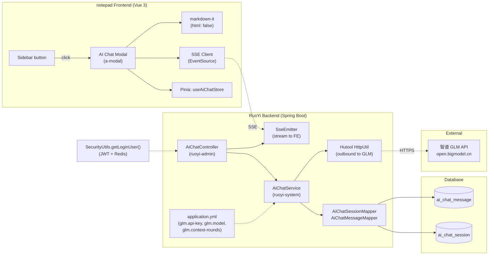

# GLM AI Chat Dialog with Java Backend Proxy

## Summary

Add an AI chat dialog to the notepad sidebar — a GLM-native-style modal with a conversation sidebar, streaming message area, and Markdown rendering. The RuoYi Java backend proxies GLM API calls (key in config), streams responses via SSE, and persists conversations per-user. This plan supersedes the stale DeepSeek+Node.js plan at `notepad/docs/plans/2026-07-08-001-feat-deepseek-ai-chat-plan.md` and reuses its provider-agnostic data model and API contract shapes while rewriting the backend for Spring Boot and switching the LLM provider to GLM (智谱开放平台).

## Problem Frame

notepad has a WebSocket human chat room but no AI assistance. Users must leave the app to reach chatglm.cn, breaking their note/table workflow. This feature embeds an AI conversation dialog in the sidebar so users get AI help without context-switching. See origin: `docs/brainstorms/2026-07-13-homepage-ai-chat-dialog-requirements.md`.

## Requirements

Carried forward from the origin document (R1-R13). Each requirement is traced to the implementation unit that delivers it.

- R1. New AI chat button in `notepad/src/layout/sidebar/index.vue`, left of "进入聊天室". → U4
- R2. Click opens an `a-modal` dialog, styled consistent with the existing chat room modal. → U4
- R3. Dialog layout: GLM-native style — left conversation sidebar, right message area, bottom input. → U4, U5
- R4. User can create / switch / delete conversations. → U3, U5
- R5. AI replies stream in via SSE (typewriter effect). → U2, U5
- R6. AI replies render as Markdown (code blocks, tables, lists, syntax highlighting). → U5
- R7. Conversation maintains multi-round context. → U2
- R8. Context sent to GLM API is capped at the last N rounds (N configurable in `application.yml`). → U2
- R9. Conversation history persists to DB, isolated per user. → U1, U3
- R10. Reopening the dialog restores the user's conversation list and last-selected conversation. → U4
- R11. Java backend proxies GLM API calls; frontend never calls GLM directly. → U2
- R12. API Key and model name stored in `application.yml`, not hardcoded. → U2
- R13. All logged-in users can use AI chat; no extra role authorization required. → U2, U3
- R4a. Title auto-derive (~20 chars) + editable + "新对话" placeholder before first message. → U2, U5
- R4b. Delete confirmation dialog + post-delete empty state (no auto-switch to other conversations). → U5
- R5a. Stop button (send button transforms to "停止生成") + incomplete marking during streaming. → U2, U5
- R5b. Cancel SSE on modal close / page switch / conversation switch. → U2, U5
- R6a. DOMPurify sanitization before rendering (prevent stored XSS). → U5
- R9a. Explicit verifyOwnership + 403 on every endpoint (prevent IDOR). → U3

> **Note (2026-07-14 review):** R4a-R9a were promoted to mandatory in Round 1 of the requirements review. The plan originally deferred these; per the governance decision (Group A: "Implement in v1"), they are now in-scope for v1. See corresponding units and the updated Scope Boundaries.

## Key Technical Decisions

### KTD1. Backend: RuoYi Java (Spring Boot 2.5.14), not Node.js

The origin requirements specify the RuoYi Java backend as the proxy host (`application.yml`, R11/R12). This supersedes the old plan's Node.js choice (`notepad/server/`). The RuoYi backend already holds the auth context (SecurityUtils, JWT, Redis-cached LoginUser) and the database connection — running the proxy here avoids a second backend service and a second auth boundary.

### KTD2. SSE via SseEmitter (Spring MVC), not WebFlux

Spring Boot 2.5.14 here does not include `spring-boot-starter-webflux` (verified: no reactive dependency in `pom.xml`). `SseEmitter` from Spring MVC is the standard SSE mechanism for this stack and is sufficient for the single-client-per-stream proxy use case. No reactive migration is warranted.

### KTD3. HTTP client: Hutool HttpUtil for outbound GLM calls

RuoYi has no existing outbound HTTP client pattern (verified: no RestTemplate, WebClient, or OkHttp usage in `ruoyi-admin` or `ruoyi-system`). Hutool HttpUtil is the de facto choice across the RuoYi ecosystem and supports streaming response bodies, which is required for forwarding the GLM SSE stream. Add `hutool-http` as a dependency in `ruoyi-system/pom.xml`. Fallback if Hutool's streaming support proves insufficient: `java.net.HttpURLConnection` (JDK-built-in, compatible with Java 1.8 pinned in `ruoyi-admin/pom.xml` via `<java.version>1.8</java.version>`, verified).

### KTD4. Database: snake_case table names with CamelCase columns, MyBatis mapper layer

Business tables in this repo use snake_case table names with CamelCase columns (verified: table `note_dwtable` with columns `noteId`, `delFlag`; Java class `NoteDwtable`). The AI chat tables follow the same convention: tables `ai_chat_session` and `ai_chat_message`, with CamelCase columns matching the Java domain objects. ORM is MyBatis (`*Mapper.java` + `*Mapper.xml`), matching every other business domain in `ruoyi-system`. No foreign keys are defined (consistent with `note_dwtable` — `userId` is a logical reference, not a DB-level FK).

### KTD5. Context truncation: round-count cap

R8 specifies "last N rounds, N configurable". The backend loads the last N rounds (a round = one user + one assistant message pair) for the current session and sends them to GLM. N is read from `glm.context-rounds` in config. A token-aware overflow guard is deferred to the next iteration (canonical decision — see Deferred to Next Iteration for the consolidated deferral).

### KTD6. Frontend state: Pinia aiChat store

A new Pinia store `useAiChatStore` manages conversation list, active conversation ID, message list, streaming state, and loading flags. This matches the project's existing Pinia usage and the old plan's store design. The store is the single source of truth for the modal's state; components read from it reactively.

### KTD7. Markdown rendering: markdown-it with html disabled + DOMPurify sanitization

`markdown-it` ^14.3.0 and `highlight.js` ^11.8.0 are already dependencies (`notepad/package.json`). Add `dompurify` ^3.0.0 as a dependency. The renderer pipeline is: (1) `markdown-it` with `html: false` (no raw HTML pass-through) and `highlight` wired to `highlight.js`, (2) `DOMPurify.sanitize(html, {ALLOWED_TAGS: [...], ALLOWED_ATTR: [...]})` to strip XSS vectors that markdown constructs can produce (e.g., `javascript:` URLs), (3) set the sanitized HTML as `innerHTML`. Per R6a (Round 1 review promotion, 2026-07-14), DOMPurify is now in-scope for v1.

## High-Level Technical Design



## Implementation Units

### U1. Database schema and MyBatis persistence layer

**Goal:** Create the `ai_chat_session` and `ai_chat_message` tables, domain objects, and MyBatis mappers that all other units depend on.

**Requirements:** R9 (per-user persistence).

**Dependencies:** None (foundation unit).

**Files:**
- `sql/aiChatMenu.sql` — DDL for both tables (new)
- `ruoyi-system/src/main/java/com/ruoyi/system/domain/AiChatSession.java` — domain object (new)
- `ruoyi-system/src/main/java/com/ruoyi/system/domain/AiChatMessage.java` — domain object (new)
- `ruoyi-system/src/main/java/com/ruoyi/system/mapper/AiChatSessionMapper.java` — mapper interface (new)
- `ruoyi-system/src/main/java/com/ruoyi/system/mapper/AiChatMessageMapper.java` — mapper interface (new)
- `ruoyi-system/src/main/resources/mapper/system/AiChatSessionMapper.xml` — mapper XML (new)
- `ruoyi-system/src/main/resources/mapper/system/AiChatMessageMapper.xml` — mapper XML (new)

**Approach:**

Table `ai_chat_session`:
- `id` BIGINT PRIMARY KEY AUTO_INCREMENT
- `userId` BIGINT NOT NULL — logical reference to `sys_user.user_id` (no DB-level FK, matching `NoteDwtable` convention)
- `title` VARCHAR(200) — auto-derived from first user message (per R4a), nullable until first message; updatable via the title-edit endpoint (Group F, R4a)
- `lastSelectedAt` DATETIME — used by R10 restore-on-reopen to pick the last active conversation
- `delFlag` CHAR(1) DEFAULT '0' — soft delete, matching RuoYi convention
- `createTime`, `createBy`, `updateTime`, `updateBy` — standard audit columns

Table `ai_chat_message`:
- `id` BIGINT PRIMARY KEY AUTO_INCREMENT
- `sessionId` BIGINT NOT NULL — logical reference to `ai_chat_session.id`
- `role` VARCHAR(20) NOT NULL — 'user' | 'assistant'
- `content` TEXT NOT NULL — full message text
- `createTime` — audit column

Index: `idx_session_user(userId)` on `ai_chat_session` for the list query; `idx_message_session(sessionId)` on `ai_chat_message` for the message-list query.

Domain objects follow the existing `NoteDwtable` pattern (CamelCase properties, matching column names). Mapper XMLs follow `NoteDwtableMapper.xml` structure (resultMap, selectVo, CRUD methods).

**Patterns to follow:** `ruoyi-system/src/main/resources/mapper/system/NoteDwtableMapper.xml` for mapper structure; `ruoyi-system/src/main/java/com/ruoyi/system/domain/NoteDwtable.java` for domain object shape.

**Test scenarios:**
- Happy path: insert a session, insert a message, select by sessionId — verify round-trip
- Edge case: soft-delete a session (`delFlag='1'`) — verify it's excluded from list queries but messages remain
- Integration: select sessions by userId — verify only the target user's sessions return

**Verification:** Domain objects serialize to/from mapper queries without data loss; soft-delete flag excludes records from active queries.

---

### U2. Backend GLM proxy with SSE streaming

**Goal:** Proxy GLM API calls from the frontend, stream responses back via SSE, and enforce the N-round context cap. This is the core streaming unit.

**Requirements:** R5 (streaming), R7 (multi-round context), R8 (N-round cap), R11 (backend proxy), R12 (key in config), R13 (all logged-in users).

**Dependencies:** U1 (mappers for persistence).

**Files:**
- `ruoyi-admin/src/main/java/com/ruoyi/web/controller/ai/AiChatController.java` — controller (new)
- `ruoyi-system/src/main/java/com/ruoyi/system/service/IAiChatService.java` — service interface (new)
- `ruoyi-system/src/main/java/com/ruoyi/system/service/impl/AiChatServiceImpl.java` — service impl (new)
- `ruoyi-system/src/main/java/com/ruoyi/system/config/GlmConfig.java` — config properties holder (new)
- `ruoyi-admin/src/main/resources/application.yml` — add `glm` config block (modify)
- `ruoyi-system/pom.xml` — add `hutool-http` dependency (modify)

**Approach:**

Controller endpoint: `POST /ai/chat` — accepts `{ sessionId, message }`, returns `SseEmitter` with `text/event-stream` content type. The controller gets the current user via `SecurityUtils.getLoginUser().getUserId()` and passes it to the service. Apply `@RateLimiter` (RuoYi's Redis+AOP-based annotation, per R13/Group R) to prevent API quota exhaustion — e.g., 10 requests/minute, 100 requests/day per user.

Service flow (steps reordered per Group L — verify ownership BEFORE persisting):
1. Get the current user's `userId` from `SecurityUtils.getLoginUser().getUserId()`. Load the session by `id = sessionId`; verify `session.userId == userId` (R9a/Group C), else throw 403.
2. Persist the user's message (`role='user'`) for the verified session. Then load the last N rounds (N from `glm.context-rounds` config) for this session, prepend the new message.
3. Build the GLM API request: model from config, messages array, `stream: true`. Call via Hutool HttpUtil with the `Authorization: Bearer <api-key>` header. **Fallback (Group J):** if Hutool's streaming support proves insufficient during implementation, fall back to `java.net.HttpURLConnection` (see KTD3) — the streaming reader pattern is the same.
4. For each SSE chunk from GLM, forward to the SseEmitter as a `data:` event. Accumulate the full response text in memory.
5. On stream end: persist the assistant message (`role='assistant'`), emit a final `[DONE]` event, complete the emitter. If `ai_chat_session.title` is null, update it to the first ~20 characters of the user's message (title auto-derivation, per R4a).

**Error handling & stream cancellation (Groups D1, D2, K — in-scope per Round 1 review, 2026-07-14):**
- **GLM API failure (K):** If the GLM call returns 401/429/500 or the SSE stream errors mid-response, emit an `error` event to the frontend via the SseEmitter, then complete the emitter. The `onError`/`onTimeout` callbacks MUST reset `isStreaming` state (prevent UI dead-lock). Persist any accumulated partial response (see D3 note below).
- **Stream cancellation (D1/D2):** When the frontend aborts (stop button per R5a, or modal close/page switch/conversation switch per R5b), the SseEmitter's `onCompletion`/`onTimeout`/`onError` callback releases backend resources and stops consuming the GLM stream. The accumulated partial text is handled per D3 (see below).
- **D3 (deferred):** Incomplete-message marking (`status='incomplete'` column + recovery flow) is deferred to Open Questions (2026-07-14 review). The stop/cancel mechanism works, but partial replies are NOT persisted in v1 — they are discarded. Implement full persistence in the next iteration.

Config block in `application.yml`:
```yaml
glm:
  api-key: ${GLM_API_KEY:}
  model: glm-4
  api-url: https://open.bigmodel.cn/api/paas/v4/chat/completions
  context-rounds: 20
  max-tokens: 4096
```

The `GlmConfig` class uses `@ConfigurationProperties(prefix = "glm")` to bind these. The API key supports environment variable override (`GLM_API_KEY`) for production deployment.

**Patterns to follow:** `ruoyi-common/src/main/java/com/ruoyi/common/config/RuoYiConfig.java` for `@ConfigurationProperties` config binding pattern (GlmConfig mirrors this); `ruoyi-admin` controller package structure for controller placement.

**Test scenarios:**
- Happy path: send a message → GLM returns a stream → frontend receives SSE chunks → assistant message persisted
- Covers F1 (new conversation + send message): create session, send message, verify SSE stream and persistence
- Covers F3 (streaming): verify chunks forward correctly and final message is persisted
- Edge case: conversation has 30 messages (15 rounds), N=10 (test-specific override of default 20) → verify only last 10 rounds (20 messages) sent to GLM (Covers AE1 — round/message disambiguation)
- Integration: full flow — create session (U3), send message (U2), verify both session and message persisted with correct userId

**Verification:** A message sent through `/ai/chat` produces a streamed SSE response on the frontend and a persisted assistant message in the database.

---

### U3. Backend session and message CRUD

**Goal:** Provide CRUD endpoints for conversations and messages, filtered by the current user.

**Requirements:** R4 (create/switch/delete), R9 (per-user isolation), R10 (restore on reopen), R13 (all logged-in users).

**Dependencies:** U1 (mappers).

**Files:**
- `ruoyi-admin/src/main/java/com/ruoyi/web/controller/ai/AiChatController.java` — add CRUD endpoints (modify, same controller as U2)
- `ruoyi-system/src/main/java/com/ruoyi/system/service/IAiChatService.java` — add CRUD methods (modify)
- `ruoyi-system/src/main/java/com/ruoyi/system/service/impl/AiChatServiceImpl.java` — add CRUD impl (modify)

**Approach:**

Endpoints (following the old plan's contract shape, adjusted for RuoYi conventions):
- `POST /ai/session/create` — create a new session for the current user, return `{ code, msg, data: { id, title, createTime } }`
- `GET /ai/session/list` — return all sessions for the current user where `delFlag='0'`, ordered by `lastSelectedAt DESC`
- `DELETE /ai/session/{id}` — soft-delete a session. **Ownership check (R9a/Group C):** load by `id`; if `session.userId != currentUser.userId`, return 403. Then soft-delete.
- `GET /ai/message/list?sessionId={id}` — return messages for a session. **Ownership check (R9a/Group C):** verify `session.userId == currentUser.userId`, else 403.
- `GET /ai/session/{id}` — return a single session. **Ownership check (R9a/Group C):** if `session.userId != currentUser.userId`, return 403.
- `POST /ai/session/{id}/select` — update `lastSelectedAt` to now (supports R10 restore-on-reopen). Changed from PUT to POST per Group O (action semantics — `select` is an action, not a resource replacement).
- `POST /ai/session/{id}/title` — update `ai_chat_session.title` (Group F/R4a editable title). Accepts `{ title: string }`. **Ownership check (R9a/Group C):** verify `session.userId == currentUser.userId`, else 403. Title length capped at ~50 chars.

**Ownership enforcement (R9a/Group C — in-scope per Round 1 review, 2026-07-14):** Every endpoint that accesses a session by `id` MUST call `verifyOwnership(sessionId, userId)` which loads the session and checks `session.userId == userId`. On mismatch, return 403 via `ServletUtils.renderString` with `HttpStatus.FORBIDDEN` (or a `ServiceException` mapped to 403). This is in addition to userId-filtered list queries. Open Question #5 updated to "Addressed".

Response shape follows RuoYi's `AjaxResult` / `TableDataInfo` convention (`{ code, msg, data }` or `{ code, msg, rows, total }`), matching existing controllers like `CloudAppController`.

**Patterns to follow:** `ruoyi-admin/src/main/java/com/ruoyi/web/controller/system/CloudAppController.java` for controller + AjaxResult pattern; `ruoyi-system/src/main/java/com/ruoyi/system/service/impl/CloudAppServiceImpl.java` for service structure.

**Test scenarios:**
- Happy path: create session → list sessions → verify the new session appears
- Happy path: create session → add message (via U2) → list messages → verify message appears
- Covers F2 (switch conversation): create 2 sessions, switch between them, verify correct message lists
- Covers F4 (restore on reopen): call `POST /ai/session/{id}/select` (changed from PUT per Group O), then `GET /ai/session/list` — verify the selected session sorts first
- Edge case: soft-deleted session — `GET /ai/session/list` excludes it
- Edge case: delete the currently-active session — verify the frontend handles the empty state (U4/U5 responsibility)

**Verification:** Session list and message list endpoints return only data belonging to the current authenticated user.

---

### U4. Frontend modal shell and Pinia store

**Goal:** Add the AI chat button to the sidebar, create the modal shell, and set up the Pinia store that holds all AI chat state.

**Requirements:** R1 (button), R2 (modal), R3 (GLM-native layout), R10 (restore on reopen).

**Dependencies:** U3 (API endpoints for session list).

**Files:**
- `notepad/src/layout/sidebar/index.vue` — add AI chat button + modal (modify)
- `notepad/src/views/aiChat/index.vue` — AI chat modal content component (new)
- `notepad/src/stores/aiChat.ts` — Pinia store (new)
- `notepad/src/api/aiChat.ts` — API functions wrapping useFetch (new)

**Approach:**

In `sidebar/index.vue`, add a new button to the left of the existing "进入聊天室" button (around line 25). The button sets `isAiChatVisible = true`, which opens an `a-modal` with `v-model:open="isAiChatVisible"`, `footer=null`, `centered`, `width="900px"`, `:body-style="{ padding: 0, height: '600px' }"`. The modal renders `<ai-chat-dialog />` (the new component). This mirrors the existing chat room modal pattern at the same location. **Styling note (Group U):** `a-modal` is the container shell; GLM-native styling (dark sidebar, message bubbles, input area) is achieved via custom CSS scoped to `aiChat/index.vue` and child components, overriding `a-modal`'s default theme. The `a-modal` provides the overlay/centering/close behavior; visual design is fully custom.

The `aiChat/index.vue` component has a three-section layout matching R3: left sidebar (conversation list, ~250px), right area (message list + input). The split uses flexbox; the sidebar is collapsible on narrow screens. Full responsive/a11y is deferred (see Deferred to Next Iteration).

Pinia store `useAiChatStore` holds:
- `sessions: Session[]` — conversation list
- `activeSessionId: number | null` — currently selected conversation
- `messages: Message[]` — messages for the active session
- `isStreaming: boolean` — true while an AI response is streaming
- `isLoadingSessions: boolean` — loading flag for the session list
- `isLoadingMessages: boolean` — loading flag for the message list

Store actions:
- `loadSessions()` — calls `GET /ai/session/list`, populates `sessions`
- `loadMessages(sessionId)` — calls `GET /ai/message/list`, populates `messages`
- `createSession()` — calls `POST /ai/session/create`, prepends to `sessions`, sets `activeSessionId`
- `selectSession(id)` — calls `POST /ai/session/{id}/select` (changed from PUT per Group O), sets `activeSessionId`, calls `loadMessages(id)` (delivers the F4 restore flow)
- `deleteSession(id)` — calls `DELETE /ai/session/{id}`, removes from `sessions`, clears `activeSessionId` if it was active

**Restore on reopen (R10 / F4):** On modal open, the store calls `loadSessions()`. If sessions exist, it picks the first one (sorted by `lastSelectedAt DESC` from the backend) and calls `selectSession(id)` to load its messages. If no sessions exist, it shows an empty state with a "New conversation" CTA (Covers AE3 — new user first open).

**API client:** `notepad/src/api/aiChat.ts` wraps `useFetch` (the existing HTTP client pattern at `notepad/src/hooks/useFetch.ts`) for each endpoint. The auth token is auto-injected by the existing `useFetch` interceptor (reads from cookie, adds `Authorization` header).

**Patterns to follow:** `notepad/src/layout/sidebar/index.vue` (existing chat room button + modal pattern); `notepad/src/layout/sidebar/addFolder.vue` (a-modal pattern with `v-model:open`); existing Pinia stores in `notepad/src/stores/`.

**Test scenarios:**
- Happy path: click AI chat button → modal opens → store loads sessions → first session's messages load
- Covers AE3: first-time user opens modal → empty state with "New conversation" CTA shown
- Covers F4 / R10: reopen modal after previous use → last-selected session's messages restored (uses `POST /ai/session/{id}/select` per Group O)
- Edge case: open modal while sessions are loading → loading state shown (skeleton or spinner)
- Edge case: delete the active session → empty state shown, session list updates
- Integration: create session in UI → verify it appears in sidebar list → send message (U5) → verify message persists

**Verification:** Opening the modal shows the conversation list and, if conversations exist, the last-selected conversation's messages.

---

### U5. Frontend conversation sidebar and chat area with SSE + Markdown

**Goal:** Build the conversation sidebar (list, create, switch, delete) and the chat area (message list, input, SSE streaming client, Markdown rendering).

**Requirements:** R3 (layout), R4 (create/switch/delete), R5 (streaming), R6 (Markdown), R7 (multi-round context handled by backend).

**Dependencies:** U4 (modal shell + store), U2 (SSE endpoint).

**Files:**
- `notepad/src/views/aiChat/ConversationSidebar.vue` — sidebar component (new)
- `notepad/src/views/aiChat/ChatArea.vue` — message area + input (new)
- `notepad/src/views/aiChat/MessageBubble.vue` — single message renderer (new)
- `notepad/src/utils/markdown.ts` — markdown-it setup + DOMPurify pipeline (new)
- `notepad/package.json` — add `dompurify` ^3.0.0 dependency (modify, per Group B/R6a)

**Approach:**

`ConversationSidebar.vue`: renders the session list from the store. Each item shows the session title (auto-derived from first user message by the backend on first message send) and a delete button on hover. Clicking a session calls `store.selectSession(id)`. A "New conversation" button at the top calls `store.createSession()`. The active session is highlighted.

**Conversation interactions (Groups E, F, G — in-scope per Round 1 review, 2026-07-14):**
- **"新对话" placeholder (G/R4a):** A newly created session with no messages and no title displays "新对话" as its sidebar label. Once the first message is sent and the backend auto-derives the title, the placeholder is replaced on next list reload.
- **Delete confirmation (E/R4b):** Clicking the delete button on a session opens a confirmation `a-modal` with text "确定删除此对话？删除后不可恢复". Only on confirm does `store.deleteSession(id)` fire. If the deleted session was the active one, the message area shows an empty state + "新建对话" CTA — it does NOT auto-switch to another conversation.
- **Editable title (F/R4a):** Clicking the session title text enters edit mode (an `a-input` replaces the text). Enter or blur submits the new title via `store.updateTitle(id, title)` → `POST /ai/session/{id}/title` (U3). ESC cancels. Title length capped at ~50 chars.

`ChatArea.vue`: renders `MessageBubble` for each message in `store.messages`. Below the list is a text input (textarea, auto-grow) and a send button. **PII disclosure (Group S/R5a-context):** A static disclosure line is displayed above the input: "消息将发送至智谱 GLM 用于生成 AI 回复" — informs users their messages are sent to a third-party LLM provider. Send calls a store action that opens a stream to `POST /ai/chat` (using `fetch` with `ReadableStream` since `EventSource` only supports GET — the request body carries `sessionId` and `message`).

**SSE client detail:** Because `EventSource` is GET-only and the proxy endpoint is POST, the frontend uses `fetch` with a `ReadableStream` reader on the response body. The `fetch` call must manually include the `Authorization` header (read from the same cookie source as the `useFetch` interceptor at `notepad/src/hooks/useFetch.ts`) — `useFetch`'s interceptor does not cover raw `fetch` calls. Each `data:` line is parsed; the chunk content is appended to the streaming assistant message in the store. On `[DONE]`, the stream closes and `isStreaming` resets to false.

**Streaming controls & error handling (Groups D1, D2, K — in-scope per Round 1 review, 2026-07-14):**
- **Stop button (D1/R5a):** While `isStreaming=true`, the send button transforms into a "停止生成" button. Clicking it calls `AbortController.abort()` (or closes the `ReadableStream` reader), which triggers the backend `onCompletion`/`onError` callback (U2) to release resources. `isStreaming` resets to false. Partial replies are NOT persisted in v1 (D3 deferred — see Open Questions).
- **Cancel on close/switch (D2/R5b):** Three hooks abort an in-progress stream when `isStreaming=true`: (1) `a-modal` `@cancel`/`@close` (modal close), (2) `beforeRouteLeave` guard (page switch), (3) `selectSession()` before loading the new session (conversation switch). All call the same `abortStream()` action as the stop button.
- **Error indicator (K):** The frontend listens for an `error` SSE event from the backend (U2). On receipt, it displays an error banner in the chat area ("AI 服务暂时不可用，请稍后重试"), resets `isStreaming` to false, and re-enables the input — preventing the UI dead-lock that would occur if `isStreaming` stayed true on error.

`MessageBubble.vue`: renders a single message. User messages render as plain text. Assistant messages render through the Markdown pipeline in `markdown.ts`.

`markdown.ts`: configures `markdown-it` with `html: false` (no raw HTML pass-through), `highlight` option wired to `highlight.js`. **DOMPurify sanitization (Group B/R6a — in-scope per Round 1 review, 2026-07-14):** The rendering pipeline is: `md.render(text)` → `DOMPurify.sanitize(html, {ALLOWED_TAGS: [...], ALLOWED_ATTR: [...]})` → set as `innerHTML`. This strips XSS vectors that markdown constructs can produce (e.g., `javascript:` URLs in links). Add `dompurify` to `notepad/package.json` dependencies (see KTD7).

**Title auto-derivation:** When the backend (U2) persists the first user message for a session, it updates `ai_chat_session.title` to the first ~20 characters of the user message (per R4a). The frontend sidebar reflects this on next list reload.

**Patterns to follow:** `notepad/src/views/chat/index.vue` for message list layout and scroll-to-bottom behavior; existing `markdown-it` usage if any exists in the repo (none found — this is the first Markdown rendering use).

**Test scenarios:**
- Happy path: type a message → send → SSE stream renders token-by-token → final message persisted and rendered as Markdown
- Covers AE2: AI reply contains a code block and a table → verify code block has syntax highlighting, table renders as HTML
- Covers F1: new conversation → send message → AI streams reply
- Covers F2: switch to a historical conversation → message list renders → continue sending

**Verification:** A user can create a conversation, send a message, see the AI reply stream in as Markdown with code highlighting, and switch to another conversation.

## Scope Boundaries

### In scope

- GLM AI chat dialog with conversation sidebar, streaming, Markdown rendering, per-user persistence
- Java backend proxy with SSE and explicit ownership verification (verifyOwnership + 403, per R9a/Group C)
- Database schema for `ai_chat_session` and `ai_chat_message`
- Happy-path end-to-end flow: create conversation → send message → stream AI reply → persist → restore on reopen
- **(2026-07-14 review, Group A "Implement in v1") now also in-scope:**
  - DOMPurify XSS sanitization in the Markdown rendering pipeline (R6a/Group B)
  - Explicit verifyOwnership + 403 on all endpoints (R9a/Group C)
  - Stop button during streaming (R5a/Group D1)
  - Cancel SSE on modal close / page switch / conversation switch (R5b/Group D2)
  - Delete confirmation dialog + post-delete empty state (R4b/Group E)
  - Editable title interaction (R4a/Group F)
  - "新对话" placeholder before first message (R4a/Group G)
  - Error events + UI error indicators to prevent dead-lock on GLM failure (Group K)
  - Basic per-user rate limiting via `@RateLimiter` (Group R)
  - PII disclosure UI text (Group S)

### Deferred to Next Iteration

Per the user's directive ("U1到U6的发现先搁置,优先实现效果"), the security, error-handling, and edge-case enhancements surfaced by the doc review are deferred from v1 to keep the implementation focused on the happy-path effect. These are consolidated here as reference for the next iteration.

> **(2026-07-14 review update):** Items promoted to in-scope by the Round 1 requirements review (R4a/R4b/R5a/R5b/R6a/R9a) have been removed from this section and moved to "In scope" above. The remaining items are genuinely deferred.

**Security hardening**
- Final security audit pass on IDOR, XSS, PII disclosure — deferred
- Advanced multi-instance rate limiting (Redis-backed, burst + daily quota) — v1 uses basic `@RateLimiter` only (Group R); multi-instance coordination deferred

**Error handling & stream resilience**
- Partial persistence on stream interruption (`status='incomplete'` column, recovery flow) — deferred (Group D3, 2026-07-14 review)
- Concurrent-action guards during streaming (beyond the basic disable-send-while-streaming flag)

**UX polish**
- Loading skeletons/spinners beyond basic boolean flags
- Full responsive/accessibility pass (ARIA, keyboard nav, screen reader support for streaming)

### Deferred for later (product-level)

- Multi-model selection — v1 uses one GLM model, model name in config. Future: model selector.
- Multimodal input (images, file upload) — v1 is text-only.
- Sophisticated cost monitoring and alerting — ops-level cost dashboards.
- PII scrubbing before forwarding to GLM — automated PII redaction. (Basic disclosure UI is now in-scope per Group S; automated scrubbing remains deferred.)
- Redis-backed rate limiting for multi-instance deployments.
- WebSocket reuse for AI chat — SSE is used because GLM's API is SSE-native and the existing WebSocket is for human chat with different lifecycle. Re-evaluating the transport is deferred.

### Deferred to follow-up work (technical)

- Migration script for any existing `ai_chat_*` tables from the old Node.js plan — the old plan used snake_case table names (`ai_chat_session`), which now match this plan's convention. Only schema differences (column types, missing columns) would need migration, not table renaming. **Pre-deployment check (Group P, 2026-07-14 review):** before deploying, check if the target environment has existing `ai_chat_session` tables from the old Node.js plan; if so and schema differs, run the migration script first.
- Token-precise context truncation — KTD5 uses a round-count cap; upgrading to a real tokenizer (e.g., tiktoken) is a follow-up if the cap proves inaccurate in production. (Canonical reference — the duplicate entry formerly in "Context & token management" was removed per Group T, 2026-07-14 review.)

## Open Questions

Per the user's directive ("问题暂时搁置"), the open questions from the doc review are temporarily set aside — v1 prioritizes the happy-path implementation effect. They are retained here as reference for the next iteration. Entries marked **Resolved** or **Addressed** remain valid under the simplified plan; entries marked **Deferred** correspond to finding-based enhancements that were stripped from v1 (see Deferred to Next Iteration).

1. **Existing plan conflict** — Resolved. This plan supersedes `notepad/docs/plans/2026-07-08-001-feat-deepseek-ai-chat-plan.md`. The old plan's Node.js backend and DeepSeek provider are dropped; provider-agnostic parts (data model, API contract shapes) are reused.
2. **Error states for API/SSE failures** — Addressed (2026-07-14 review, Group K). v1 now includes: SSE `error` event from backend on GLM failure, frontend error banner, `isStreaming` reset on error to prevent UI dead-lock.
3. **Concurrent actions during streaming** — Addressed (2026-07-14 review, Groups D1, D2). v1 now includes: stop button (send button transforms to "停止生成"), abort-on-modal-close, abort-on-page-switch (`beforeRouteLeave`), abort-on-conversation-switch.
4. **Loading states** — Partially addressed. Pinia store carries basic `isLoadingSessions`/`isLoadingMessages` flags. Skeletons/spinners beyond basic flags are deferred.
5. **IDOR** — Addressed (2026-07-14 review, Group C/R9a). v1 now includes explicit `verifyOwnership` + 403 on every endpoint (GET/DELETE session, message list).
6. **Stored XSS** — Addressed (2026-07-14 review, Group B/R6a). v1 now includes DOMPurify sanitization in the markdown.ts pipeline (render → sanitize → setInnerHTML).
7. **Token-based overflow** — Deferred (canonical decision: KTD5). v1 uses round-count cap only.
8. **Rate limiting** — Partially addressed (2026-07-14 review, Group R). v1 now includes basic `@RateLimiter` (RuoYi Redis+AOP, e.g., 10/min, 100/day per user). Advanced multi-instance rate limiting remains deferred.
9. **R10 restore-on-reopen flow** — Addressed in U3 (`POST /ai/session/{id}/select`, changed from PUT per Group O) and U4 (modal-open restore logic). This is the missing F4.
10. **Workflow integration premise** — Not addressed. The Problem Frame's "workflow integration" language is decorative; this plan ships a standalone modal. Adjusting the Problem Frame is a brainstorm-level concern, not a planning one.
11. **Conversation naming** — Addressed in U2/U5 (auto-derive title from first user message, first ~20 chars per R4a).
12. **Backend host conflict** — Resolved by KTD1 (Java backend, superseding the Node.js plan).
13. **Persistence on stream interruption** — Deferred (2026-07-14 review, Group D3). The stop/cancel mechanism works (D1/D2), but partial replies are NOT persisted in v1 — `status='incomplete'` column + recovery flow deferred to next iteration.
14. **Round vs message unit drift** — Addressed in KTD5 (N is explicitly a round count; a round = user+assistant pair). Test scenarios use "messages" and "rounds" disambiguated.
15. **R3 scope-exceeds-goal** — Not addressed. The sidebar remains in scope per the origin doc's R3. Scaling back to single-conversation is a brainstorm-level decision.
16. **R8 config-ahead-of-need** — Partially addressed. N remains configurable (per the origin doc's R8) as a round-count cap. Token guard ceiling is deferred.
17. **PII flowing to GLM** — Partially addressed (2026-07-14 review, Group S). v1 now includes a static disclosure line above the input ("消息将发送至智谱 GLM 用于生成 AI 回复"). Full automated PII scrubbing remains deferred.
18. **API key rotation/environment separation** — Addressed in U2 (`GLM_API_KEY` env var override).
19. **WebSocket reuse** — Deferred (see Scope Boundaries).
20. **Delete active conversation behavior** — Addressed in U4 (empty state with "New conversation" CTA).
21. **Product-lens review observation (PL1)** — Deferred. Product premise/prioritization observation from the doc review; deferred per "问题暂时搁置" directive. Revisit in next iteration.
22. **Design-lens review observation (D1)** — Deferred. UI/UX detail observation from the doc review; deferred per "问题暂时搁置" directive. Revisit in next iteration.
23. **Design-lens review observation (D2)** — Deferred. UI/UX detail observation from the doc review; deferred per "问题暂时搁置" directive. Revisit in next iteration.
24. **Design-lens review observation (D3)** — Deferred. UI/UX detail observation from the doc review; deferred per "问题暂时搁置" directive. Revisit in next iteration.
25. **Adversarial review observation (A1)** — Deferred. Assumption stress-test observation from the doc review; deferred per "问题暂时搁置" directive. Revisit in next iteration.
26. **Adversarial review observation (A2)** — Deferred. Assumption stress-test observation from the doc review; deferred per "问题暂时搁置" directive. Revisit in next iteration.
27. **Adversarial review observation (A3)** — Deferred. Assumption stress-test observation from the doc review; deferred per "问题暂时搁置" directive. Revisit in next iteration.
28. **Adversarial review observation (A4)** — Deferred. Assumption stress-test observation from the doc review; deferred per "问题暂时搁置" directive. Revisit in next iteration.

### From 2026-07-14 review

- **Incomplete message marking + schema (D3/R5a) deferred** — P0, design-lens/coherence/feasibility (cross-persona, confidence 100). The stop button (D1) and cancel-on-close (D2) are implemented, so stopped/cancelled streams now work — but partial replies are NOT persisted in v1 because `status='incomplete'` column + recovery flow were deferred. This means: (1) a user who stops a response loses the partial text, (2) a network error mid-stream discards accumulated text, (3) the `ai_chat_message` schema has no `status` column to distinguish complete from incomplete replies. Rationale for deferral: the user deferred this finding during the 2026-07-14 plan review walk-through. Implement `status='incomplete'` column, partial-text persistence on emitter `onCompletion`/`onTimeout`/`onError`, and a UI "已停止"/"不完整" marker in the next iteration.

## Risks & Dependencies

- **GLM API compatibility** — The plan assumes GLM's SSE format follows the OpenAI-compatible `data: {json}\n\n` convention with `data: [DONE]` termination. If GLM's format differs, U2's SSE parsing needs adjustment. Mitigation: verify against GLM API docs during U2 implementation.
- **`SseEmitter` timeout** — Spring MVC's `SseEmitter` has a default timeout. Long GLM streams may exceed it. Mitigation: set a generous timeout (e.g., 5 minutes) in the controller. (Partial persistence on `onTimeout` is deferred — see Group D3 in Open Questions, 2026-07-14 review.)
- **Hutool HttpUtil streaming** — Hutool's HTTP client must support reading the response body as a stream (for SSE forwarding). If it buffers the full response, the streaming UX breaks. Mitigation: verify Hutool's streaming support during U2; fall back to `HttpURLConnection` or Java 11+ `HttpClient` if needed.
- **`fetch` + `ReadableStream` browser support** — The SSE client uses `fetch` with a `ReadableStream` reader (because the endpoint is POST, not GET). This is supported in all modern browsers but may need a polyfill for legacy Edge/IE. Mitigation: target modern browsers only (notepad already uses Vue 3 + Vite, implying modern browser support).
- **Database migration** — The DDL in `sql/aiChatMenu.sql` must be run manually against the target database. There is no Flyway/Liquibase in this project (verified: no migration tooling). Mitigation: document the migration step in the plan and in the SQL file header.

## Sources

- Origin: `docs/brainstorms/2026-07-13-homepage-ai-chat-dialog-requirements.md`
- Superseded: `notepad/docs/plans/2026-07-08-001-feat-deepseek-ai-chat-plan.md` (provider-agnostic data model and API contract shapes reused)
- Frontend patterns: `notepad/src/layout/sidebar/index.vue`, `notepad/src/views/chat/index.vue`, `notepad/src/hooks/useFetch.ts`, `notepad/package.json`
- Backend patterns: `ruoyi-admin/src/main/java/com/ruoyi/web/controller/system/CloudAppController.java`, `ruoyi-system/src/main/java/com/ruoyi/system/service/impl/CloudAppServiceImpl.java`, `ruoyi-system/src/main/resources/mapper/system/NoteDwtableMapper.xml`, `ruoyi-framework/src/main/java/com/ruoyi/framework/web/service/TokenService.java`
- Config: `ruoyi-admin/src/main/resources/application.yml`, `pom.xml`
