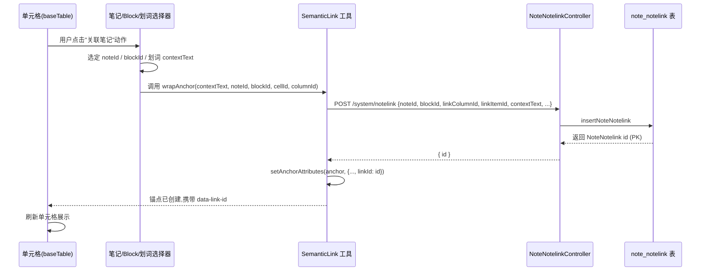
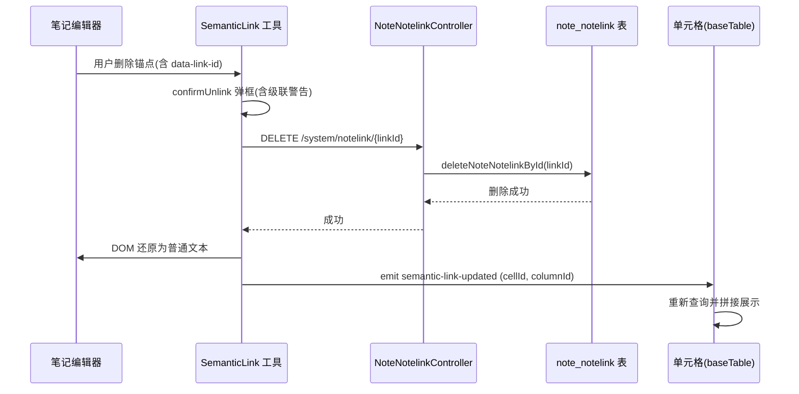

# feat: 语义关联列反向方向(表格→笔记)与词级粒度

## Summary

为语义关联列(type=25)补齐反向(表格→笔记)链路,并把关联粒度从笔记/block 级细化到块内划词级。单元格可发起对笔记的关联,精确指向笔记 block 内某个划词锚点;点击单元格跳转至该锚点并高亮;笔记侧展示被引用状态与追溯面板;删除锚点时级联清理表格侧单条关联记录。

## Status

> 经 2026-07-15 ce-doc-review 审查后,基于代码现实更新本节,使 plan 与当前实现状态对齐。

- **U1–U4 已在代码中实现**(由 feasibility-reviewer 验证):SemanticLink `data-link-id` 已落地、NoteNotelinkController `/cell+/byNote` 端点已存在、baseTable 双源合并渲染已就位、editorjs R7 四类兜底分支已实装。本计划后续对 U1–U4 的描述作为"实现态参考",不再作为待办任务清单。
- **U5 后端已完成**(按 `noteId` 查询引用列表的接口已就绪),U5 前端(ReferencePanel + `semantic-link-locate` 反向跳转)与 U6(删除级联弹框 + `executeUnlink` 扩展)为本期剩余工作。
- **`deleteDataWhenLink` 已实现级联清理 NoteNotelink**(`NoteColumnServiceImpl` ~L463 已调用 `deleteNoteNotelinkByColumnId`),原 Risks 中"级联缺失"已解除,U2 不再列入待办。

---

## Problem Frame

正向(笔记→表格)已通过 SemanticLink Editor.js 内联工具实现:用户在笔记内选词→包裹为 `<a data-type="semantic">` 锚点→持久化到 NoteDwtableItem。反向(表格→笔记)尚未实现:无法从单元格发起关联,无法把粒度推进到 block 内划词,无法从单元格跳回笔记定位到具体词语,笔记侧也缺乏"被表格引用"的追溯入口。现有正向锚点缺唯一链接 id,多划词场景下单元格无法精确指向目标词。

---

## Requirements

### 反向创建(R1–R3)

- R1. 从语义关联列单元格可发起对笔记的关联,关联目标为笔记内的某个 block 及其中划词选中的词语。
- R2. 一个单元格可挂多个独立划词,可跨 block、跨笔记。
- R3. 创建关联时,选中词在笔记里被包裹为现有 SemanticLink 工具的 `<a data-type="semantic">` 锚点,沿用其选词包裹/内联高亮/点击基础设施。一条 NoteNotelink 记录承载一次反向关联,含 noteId、blockId、linkColumnId、linkItemId、contextText(划词文本)、itemValue(展示值)、linkNoteId、linkDwTableId、linkRecordId。

### 锚点标识(R4–R5)

- R4. 每个划词锚点带唯一链接 id,值为该关联的 NoteNotelink 主键 id,承载于锚点的 `data-link-id` 属性。该映射为 1:1 且不可变(删除后 id 不复用)。现有 SemanticLink 内联工具的锚点表示需扩展该字段。
- R5. 单元格存储它关联的 NoteNotelink id 集合,按单元格聚合多行 NoteNotelink 记录。同一笔记含多个划词时,每个锚点独立携带各自的 `data-link-id`,互不干扰。

### 单元格展示(R6)

- R6. 单元格展示该 cell 关联的所有划词文本,以逗号拼接;多个划词按 NoteNotelink 创建顺序排列。

### 跳转定位(R7)

- R7. 点击单元格,打开目标笔记,在 DOM 中按 `data-link-id` 定位锚点,滚动至该元素并高亮。同一笔记含多个划词时,按 id 精确命中目标词。兜底分支区分四类场景:
  - **锚点存在** → scrollIntoView + 高亮;
  - **data-link-id 为空(正向历史锚点,从未分配 id)** → 滚动至笔记顶部,不展示"关联已失效"(区分"陈旧"与"从未有");
  - **data-link-id 陈旧(锚点已删除)** → 滚动至笔记顶部 + `message.warning('关联已失效')`;
  - **笔记不可访问** → 不打开笔记,`message.error` 提示,不执行滚动。

### 笔记侧呈现(R8–R9)

- R8. 被表格引用的划词锚点在笔记中展示"被引用"指示(如角标/图标),与未被引用的锚点视觉区分。点击该锚点可跳回对应的表格单元格。
- R9. 笔记侧提供面板汇总当前笔记被哪些表格/单元格引用,点击面板条目可跳回对应单元格。面板与内联标记共用同一份锚点注册(基于 NoteNotelink id),不维护两套状态。

### 删除级联(R10–R11)

- R10. 用户在笔记中删除被划词选中的锚点时,弹框提醒该操作会触发表格侧对应关联删除,用户确认后执行。
- R11. 用户确认后,按该锚点的 NoteNotelink id 删除该条关联记录;单元格的其他划词保留,单元格展示重新拼接剩余词。当被删的是该单元格的最后一条 NoteNotelink 时,单元格变为空(展示空态),不删除单元格本身;空态单元格是否自动清除由 Planning 阶段决定,本期默认保留。

---

## Key Technical Decisions

- **复用 NoteNotelinkController 现有 CRUD,但 NoteNotelink 表当前处于休眠状态。** 后端已有 `/system/notelink` 的 GET/POST/PUT/DELETE 端点与 NoteNotelinkMapper 全套 SQL,但正向流程实际写 `NoteDwtableItem`(由 `NoteBlockServiceImpl.linkToDwtable()` 创建),不写 `NoteNotelink`。`NoteRecordServiceImpl` L690-707 的 type=25 分支含被注释的 NoteNotelink 占位代码,印证该表未与正向集成。反向创建/读取/删除将首次实际启用该表,走现有控制器,仅在 service/mapper 层新增按 cell 聚合查询与按 id 定向删除的路径,不新建控制器。

- **`data-link-id` ↔ NoteNotelink.id 映射 1:1 且不可变。** 一条 NoteNotelink 记录对应唯一一个 `data-link-id`,删除后该 id 不复用、不重新分配。这保证跳转定位与删除级联按 id 操作时语义稳定,且同笔记多划词可精确区分。**注:** 不可变指 id↔data-link-id 映射不可变;NoteNotelink 记录本身的字段(如 contextText、itemValue)可通过 `updateNoteNotelink` 更新,id 保持不变。

- **反向创建复用 SemanticLink 工具的包裹能力。** SemanticLink 内联工具已具备选词→包裹 `<a>`→持久化的全套基础设施。反向创建的入口从单元格发起(而非编辑器内),但锚点包裹与属性设置复用该工具的 `setAnchorAttributes`,仅扩展 `data-link-id` 字段。

- **删除按 NoteNotelink id,不走 removeLink stub。** 现有 `system/block/removeLink` 是 stub(只 fetch 返回 0,无 mapper 删除调用)。本方案反向删除是按 NoteNotelink 主键的新路径,直接调 `NoteNotelinkController DELETE /{id}`,不依赖该 stub。stub 是否一并修复由 Open Questions 决定。

- **启用休眠 NoteNotelink 表 + 双源合并渲染(本期架构决定)。** 本期首次启用 NoteNotelink 表承载反向数据,渲染时需双源合并(NoteDwtableItem 正向历史值 + NoteNotelink 反向聚合)。此决定引入长期成本:每个 type=25 单元格渲染需双查询 + 去重 + 状态同步。评估过的替代方案:(a) 扩展 NoteDwtableItem 统一数据源——超 origin 边界(不改 NoteDwtableItem);(b) 一次性迁移历史数据——迁移成本高且不可逆。本期选择双源合并因 NoteNotelink 字段已完备(无需建表),且 origin 边界明确反向操作仅涉 NoteNotelink。路径依赖:未来所有 type=25 渲染需维护双源合并;收敂路径:若未来正向 linkToDwtable 改为也写 NoteNotelink,可退化为单源。

- **正向锚点 data-link-id 永久为空(产品折中)。** 现有 `linkToDwtable()` 只返回 0/1,正向锚点无 NoteNotelink id,`data-link-id` 为空字符串。点击正向词走兜底回退(打开笔记顶部,不展示"关联已失效")。这是本期引入的体验不对称:正反方向本应对称,但正向锚点是"二等公民"——点击降级、无精确定位、无收敛路径(除非迁移历史数据或改造 linkToDwtable 返回值,均超本期 scope)。回填策略见 Open Questions。

- **单元格展示按 cell 实时聚合(非缓存)。** 单元格渲染时,按 (linkColumnId + linkItemId) 实时查询 NoteNotelink 聚合结果,与 NoteDwtableItem 正向值合并去重展示。无独立缓存字段;创建/删除后通过 `semantic-link-updated` 事件触发单元格重新查询刷新。

- **NoteNotelink 字段语义(反向流程)。** 反向创建时各字段取值:
  - `id`:主键,自增,即 data-link-id
  - `noteId`:目标笔记 id(被关联的笔记)
  - `blockId`:目标 block id(划词所在 block)
  - `linkColumnId` + `linkItemId`:标识发起关联的单元格(linkItemId = NoteDwtableItem.id,反向创建前需确保该 cell 的 NoteDwtableItem 存在)
  - `contextText`:划词文本(展示值)
  - `itemValue`:展示值(可与 contextText 一致)
  - `linkNoteId`/`linkDwTableId`/`linkRecordId`:反向流程中分别等于 noteId/单元格所属表 id/linkItemId,或允许为 null(由前端不传、后端不校验);具体取值待 U2 实现时确认

---

## High-Level Technical Design

### 反向创建流程(F1)



### 单元格跳转定位流程(F2)

```mermaid
sequenceDiagram
    participant Cell as 单元格(baseTable)
    participant Note as 笔记组件
    participant DOM as 笔记 DOM

    Cell->>Cell: 用户点击词,提取 data-link-id
    alt 笔记不可访问
        Cell->>Cell: message.error("笔记不可访问")
        Note-->>Cell: 不打开笔记
    else 笔记可访问
        Cell->>Note: 打开笔记(noteId, linkId)
        Note->>Note: 渲染笔记
        Note->>DOM: querySelector(a[data-link-id="<linkId>"])
        alt 锚点存在(linkId 非空且匹配)
            DOM-->>Note: 找到锚点元素
            Note->>DOM: scrollIntoView + 添加 highlight class
            Note-->>Cell: 跳转完成
        else data-link-id 为空(正向历史锚点)
            Note->>Note: 滚动至笔记顶部
            Note-->>Cell: 无 warning(区分"从未有")
        else data-link-id 陈旧(锚点已删除)
            Note->>Note: 滚动至笔记顶部
            Note->>Note: message.warning("关联已失效")
            Note-->>Cell: 降级提示(不报错)
        end
    end
```

### 删除级联流程(F3)



---

## Implementation Units

### U1. 扩展 SemanticLink 锚点表示层,新增 data-link-id

- **Goal:** 为 `<a data-type="semantic">` 锚点新增 `data-link-id` 属性,值为 NoteNotelink 主键。
- **Requirements:** R4, R5
- **Dependencies:** 无(基础层)
- **Files:**
  - `notepad/src/components/editorjs/tools/inline/SemanticLink/index.ts` — 修改
  - `notepad/src/components/editorjs/tools/inline/SemanticLink/index.test.ts` — 新建(若不存在)或扩展(**注:notepad/package.json 当前未集成 vitest/jest 等测试框架,测试文件需待框架引入后执行;本期测试场景作为实现规范,验证方式见 Verification**)
- **Approach:**
  - 扩展 `setAnchorAttributes` 方法签名,接收 `linkId` 参数,调用 `anchor.setAttribute('data-link-id', linkId != null ? String(linkId) : '')`。**注:** 必须显式归一化 null/undefined 为空字符串,避免 `String(undefined)` 产生字面量 `'undefined'`(会导致 querySelector 命中错误元素)。
  - 更新 `sanitize` 白名单,允许 `data-link-id` 属性通过(现有白名单含 data-type/data-table-id 等,参照其格式)。
  - `executeUnlink` 读取 `data-link-id` 并纳入 payload,供 U6 删除时使用。
  - **正向(笔记→表格)创建锚点时 `data-link-id` 为空。** 现有 `linkToDwtable()` 仅返回 0/1(成功/失败),不返回 NoteNotelink id,且正向不写 NoteNotelink 表。因此正向锚点的 `data-link-id` 为空字符串,跳转时走兜底回退路径(R7 的"data-link-id 为空"分支,不展示"关联已失效")。历史锚点的回填策略见 Open Questions。
- **Patterns to follow:** 现有 `setAnchorAttributes` 的 `anchor.setAttribute('data-xxx', String(value))` 模式(扩展为带 null 归一化)。
- **Test scenarios:**
  - Happy: 创建反向锚点并传入 linkId → DOM 中 `data-link-id` 等于传入值。
  - Sanitize: 含 `data-link-id` 的粘贴内容 → 经 sanitize 后属性保留。
  - Edge: 未传 linkId 或传 null/undefined(正向旧路径) → `data-link-id` 为空字符串(非 'undefined'),不报错。
  - Read: `executeUnlink` 读取 `data-link-id` → payload 包含该值(空字符串时跳过删除调用)。
- **Verification:** 编辑器内创建的反向锚点 DOM 节点携带 `data-link-id`;sanitize 不丢失该属性。正向锚点 `data-link-id` 为空字符串(非 'undefined')且不报错。(本期因无前端测试框架,以手动 DOM 检查验证)

### U2. 后端 NoteNotelink 反向创建/按 cell 聚合查询/按 id 删除

- **Goal:** 后端支持反向创建(持久化 NoteNotelink 全字段)、按单元格聚合查询(供 R6 展示)、按主键定向删除(供 R11 级联)。
- **Requirements:** R1, R2, R3, R5, R10, R11(后端)
- **Dependencies:** 无(后端独立)
- **Files:**
  - `ruoyi-admin/src/main/java/com/ruoyi/web/controller/system/NoteNotelinkController.java` — 修改(新增聚合查询端点)
  - `ruoyi-system/src/main/java/com/ruoyi/system/service/INoteNotelinkService.java` — 修改
  - `ruoyi-system/src/main/java/com/ruoyi/system/service/impl/NoteNotelinkServiceImpl.java` — 修改
  - `ruoyi-system/src/main/java/com/ruoyi/system/mapper/NoteNotelinkMapper.java` — 修改
  - `ruoyi-system/src/main/resources/mapper/system/NoteNotelinkMapper.xml` — 修改
  - `ruoyi-system/src/main/java/com/ruoyi/system/service/impl/NoteRecordServiceImpl.java` — 保持注释(L690-707 type=25 分支含被注释的 NoteNotelink 占位代码;本期保持注释,不改正向写表逻辑,因 Scope Boundaries 已明确"不改正向的选词/包裹/点击/取消逻辑"。未来是否同步改造见 Open Questions)
  - `ruoyi-system/src/test/java/com/ruoyi/system/service/impl/NoteNotelinkServiceImplTest.java` — 新建或扩展
- **Approach:**
  - 现有 POST 已可创建 NoteNotelink;确认其接收反向字段(noteId、blockId、linkColumnId、linkItemId、contextText、itemValue、linkNoteId、linkDwTableId、linkRecordId)。若字段缺失则补全 insert 映射。**反向创建前需确保该 cell 的 NoteDwtableItem 存在**(linkItemId = NoteDwtableItem.id);若不存在,先 insert 空项或复用 linkToDwtable 的等价逻辑(待 U3 实现时确认)。
  - 新增 `GET /system/notelink/cell/{linkColumnId}/{linkItemId}` 聚合查询:按 (linkColumnId + linkItemId) 查所有 NoteNotelink,返回按 id 排序的列表。Mapper XML 新增 `selectNoteNotelinkByCell` 查询。
  - 现有 `DELETE /system/notelink/{ids}` 已支持按 id 删除;确认单条删除路径可用。
  - **`deleteDataWhenLink` 级联清理 NoteNotelink 已实现**(2026-07-15 审查发现):`NoteColumnServiceImpl` ~L463 已调用 `deleteNoteNotelinkByColumnId(linkColumnId)`,删除语义关联列时同步清理关联 NoteNotelink。**本节不再列入待办**,但需保留回归测试覆盖正向列删除流程,验证级联生效且不产生孤儿记录。
  - **行删除级联声明(原 Open Question):** 删除表格行(整行)时,本期 **不自动级联清理** 行内单元格关联的 NoteNotelink 记录——保留为悬空记录,后续被引用锚点的"被引用"角标依然显示但点击跳转走"单元格已不存在"兜底。理由:行删除往往是临时性的(撤销/恢复场景多),立即清理会破坏可恢复性;且行删除级联需遍历该行所有 type=25 单元格,改造成本与本期 scope 不符。**显式声明为 deferred**(见 Scope Boundaries / Deferred 节)。
  - 查询与删除方法用 try-catch 包裹并记录日志(参照项目内存约束:lookup 相关方法均需 try-catch 防止静默失败)。
- **Patterns to follow:** 现有 NoteNotelinkServiceImpl 的 mapper 委托模式;NoteColumnServiceImpl 的 try-catch + `log.error("[TAG] ...", id, e)` 模式。
- **Test scenarios:**
  - Happy: POST 创建含全字段的 NoteNotelink → 查询返回记录,id 非空。
  - Happy: 按 cell 聚合查询 → 返回该 cell 的所有 NoteNotelink,按 id 排序。
  - Happy: DELETE 按 id 删除 → 记录移除,聚合查询不再返回。
  - Edge: 聚合查询 cell 无关联 → 返回空列表,不报错。
  - Edge: 反向创建时 cell 无 NoteDwtableItem → 先 insert 空项再创建 NoteNotelink(或报错并提示,待 U3 确认策略)。
  - Cascade: 删除语义关联列(deleteDataWhenLink)→ 关联的 NoteNotelink 同步清理,无孤儿记录。
  - Error: 插入失败(字段缺失/约束冲突) → 抛异常并记录日志,不静默吞。
  - Error: 删除不存在的 id → 返回 0,不报错。
- **Verification:** API 端点可创建、按 cell 查询、按 id 删除 NoteNotelink;删除列时 NoteNotelink 同步清理;返回数据结构正确。

### U3. 反向创建流程 UI:单元格 → 笔记 → block → 划词

- **Goal:** 用户从单元格发起"关联笔记"动作,选定笔记/block/划词后创建携带 data-link-id 的锚点。
- **Requirements:** R1, R2, R3, R4
- **Dependencies:** U1(锚点扩展), U2(后端创建)
- **Files:**
  - `notepad/src/components/baseTable/index.vue` — 修改(新增 cell action 入口)
  - `notepad/src/components/editorjs/tools/inline/SemanticLink/index.ts` — 修改(扩展创建入口,支持外部调用包裹锚点)
  - `ruoyi-ui/src/api/system/notelink.js` — 修改(确认 addNotelink 封装匹配)
- **Approach:**
  - 在 type=25 单元格渲染处新增"关联笔记"动作入口(按钮或单元格 action menu)。入口形态见 Open Questions。
  - 动作触发后打开笔记/block/划词选择器(复用现有 SemanticSelectComponent 或新增 picker,见 Open Questions)。
  - 用户选定后,调用 SemanticLink 工具的包裹能力:在目标 block 内的选词上包裹 `<a data-type="semantic">` 锚点,设置 data-link-id。
  - **DOM/DB 操作顺序(与 F1 一致):先 POST 创建 NoteNotelink → 成功返回 id → 再 setAnchorAttributes 包裹锚点写入 data-link-id。** 失败时无需 DOM 回滚(DOM 尚未包裹)。**禁止先包裹再 POST**——若 DB 失败需 executeUnlink 还原 DOM,增加复杂性。
  - 创建成功后 emit `semantic-link-updated` 事件通知 baseTable 刷新单元格。
  - **并发去重:** NoteNotelink 表无 UNIQUE(noteId, blockId, contextText) 约束,并发创建同一选词可能产生重复记录。本期接受由 UI 防抖(创建按钮点击后立即禁用)防止重复,不强制 DB 约束。
- **Patterns to follow:** 现有 SemanticLink `save` 方法的 `useFetch → emit Bus` 模式。
- **Test scenarios:**
  - Happy: 单元格"关联笔记" → 选 note/block/word → 锚点创建,DOM 含 data-link-id,单元格刷新显示新词。
  - Edge: 单元格已有 2 个划词 → 再添加 1 个 → 3 个共存,各自 data-link-id 独立。
  - Edge: 跨 block 跨笔记(R2):单元格关联同一笔记的 block B1 和 B2 各一词,以及另一笔记一词 → 3 个锚点独立存在,单元格展示 3 词。
  - Error: 后端创建失败 → 锚点不创建,展示错误提示。
  - Error: 目标笔记不可访问 → 选择器报错,不进入包裹流程。
- **Verification:** 从单元格可创建反向关联;锚点出现在笔记编辑器并携带 data-link-id;单元格展示新词;跨 block/跨笔记场景共存正确。

### U4. 单元格展示 + 点击跳转定位

- **Goal:** 单元格展示拼接词;点击词 → 打开笔记 → 按 data-link-id 滚动至锚点并高亮;缺失时回退。
- **Requirements:** R6, R7
- **Dependencies:** U1(锚点含 data-link-id), U2(按 cell 聚合查询)
- **Files:**
  - `notepad/src/components/baseTable/index.vue` — 修改(渲染 + click handler)
- **Approach:**
  - **单元格渲染层改造(前置):** 现有 type=25 单元格渲染为单一字符串(`row[column]`),不支持词级可点击。需将渲染从字符串改为词级 `<button>` 列表:每个词渲染为独立 `<button class="semantic-word" data-link-id="...">`(反向词携带 data-link-id,正向历史词 data-link-id 为空字符串)。**选用 `<button>` 而非 `<span>`/`<a>` 的理由:原生键盘可达(Tab 聚焦 + Enter/Space 触发 click),无需手写 tabindex/keydown 处理;满足本期最小 a11y 承诺。** CSS 重置 `appearance:none; background:transparent; border:none; padding:0; cursor:pointer;` 以保留原视觉。此改造是 U4 点击跳转的前提,AE1 的"点击第 2 个词"验收例依赖此结构。
  - **渲染策略(双源合并):** type=25 单元格当前读 `row[column]`(来自 NoteDwtableItem,正向历史数据)。反向需在此基础上合并 NoteNotelink 聚合查询结果。具体策略:
    - 优先展示 NoteDwtableItem 中已有的正向展示值(避免破坏正向历史数据展示);
    - 追加 NoteNotelink 聚合查询返回的 contextText 列表(按 id 排序,逗号拼接);
    - **去重键明确:** NoteNotelink 内部多条记录即使 contextText 相同也分别展示(各自 data-link-id 独立,不丢词);仅 NoteDwtableItem 正向值与 NoteNotelink 反向值之间按文本去重,保留反向词的 data-link-id(优先展示带 id 的版本)。
  - **最小状态机(原 Open Question,本期实现):**
    - **loading:** NoteNotelink 聚合查询进行中 → 单元格显示 `<a-spin size="small" />` + dimmed 占位。
    - **empty:** 查询完成且 NoteNotelink 与 NoteDwtableItem 均为空 → 显示 `—`(灰色破折号),不渲染词按钮。
    - **error:** 查询失败 → 显示 `<a-tooltip title="加载失败">!</a-tooltip>`,点击可重试。
    - **data:** 查询成功且非空 → 按双源合并策略渲染词按钮列表。
  - **异步加载抖动缓解:** row[column] 同步可得,NoteNotelink 聚合查询异步。初次渲染显示正向数据,异步返回后整体替换(避免词数突变的视觉跳跃)。
  - 点击:扩展现有 cell.click 的 `FieldEnum.语义关联` 分支(~L304),从被点击的词 button 提取对应 data-link-id → 传给 note 组件 → 笔记打开后在 DOM 按 `a[data-link-id="..."]` 查找锚点 → `scrollIntoView` + 高亮 class。
  - **R7 分支4「笔记不可访问」预检 API(原 Open Question):** 点击词时,先发起轻量预检 `GET /system/note/{noteId}`(或现有等价的 getInfo 端点),HTTP 200 且 `code=0` 视为可访问,失败(404/403/网络错误)视为不可访问。预检失败 → `message.error('笔记不可访问')`,不打开笔记组件;预检通过 → 进入 DOM 查找锚点流程。**性能取舍:** 预检增加一次 RTT,但避免笔记组件渲染失败的中途态闪烁,本期接受。后续可优化为先打开笔记骨架再异步校验失败时回滚。
  - **点击优先级(去重后同文本):** 若同一文本在正向与反向都存在且去重为单一展示,点击该词优先跳反向(有 data-link-id 的精确定位);若仅有正向则走兜底。
  - **正向锚点无 data-link-id 的兼容:** 正向锚点 `data-link-id` 为空(U1 已声明),点击正向词时无法精确定位,走兜底回退(打开笔记顶部,不展示"关联已失效"——区分"陈旧"与"从未有")。
  - 回退:见 R7 四类兜底分支。
- **Patterns to follow:** 现有 cell.click 语义关联分支的 `note.visible = true; note.id = noteId` 模式;词级 button 渲染参照其他类型列的 tag/badge 渲染模式;a-spin/a-tooltip 组件用法参照项目现有加载/提示模式。
- **Test scenarios:**
  - Happy: 单元格含 3 个反向词 → 展示"词1, 词2, 词3"为 3 个 button;点击词2 → 笔记打开,滚动至词2 锚点并高亮。
  - Edge: 多锚点笔记 → 点击不同词 → 各自跳转到正确锚点。
  - Edge: 单元格同时含正向历史词(无 data-link-id)与反向词 → 展示合并去重;点击正向词 → 打开笔记顶部(兜底);点击反向词 → 精确定位。
  - Edge: 2 条 NoteNotelink contextText 相同(不同 block)→ 展示 2 个 button,各自 data-link-id 独立,点击各自跳到正确锚点。
  - Edge: 同文本正向+反向 → 去重为单一展示,点击优先跳反向。
  - Loading: 查询进行中 → 显示 a-spin;查询返回 → 切换到 data/empty/error 态。
  - Empty: 查询返回空 + 无正向值 → 显示"—"。
  - Error: 锚点已删除 → 点击 → 笔记打开在顶部 + "关联已失效"提示。
  - Error: 笔记已删除 → 预检 API 404 → message.error,不打开笔记。
  - A11y: Tab 可聚焦到每个词 button;Enter/Space 触发与点击相同的跳转。
- **Verification:** 单元格渲染为词级 button 列表;双源合并去重(同 id 不丢词);点击反向词跳转至正确锚点并高亮;点击正向词走兜底;最小状态机四态可见;缺失场景优雅回退;键盘可达。

### U5. 笔记侧呈现:被引用指示 + 追溯面板

- **Goal:** 被引用锚点展示指示标记;面板汇总引用关系,点击条目跳回单元格。
- **Requirements:** R8, R9
- **Dependencies:** U1(锚点存在), U2(按 noteId 查询引用列表供面板数据,后端接口已就绪)
- **Files:**
  - `notepad/src/components/editorjs/tools/inline/SemanticLink/index.ts` — 修改(渲染指示)
  - 新建面板组件(路径待定,建议 `notepad/src/components/noteLink/ReferencePanel.vue`)
  - `notepad/src/components/baseTable/index.vue` — 修改(监听 `semantic-link-locate` 事件定位单元格)
  - `ruoyi-ui/src/api/system/notelink.js` — 修改(按 noteId 查询引用列表)
- **Approach:**
  - **R9 约束重述:** 面板与内联标记均由按 noteId 查询 NoteNotelink 的同一结果驱动,不在各自组件内维护独立缓存(对应 R9"共用同一份锚点注册,不维护两套状态"约束)。
  - **R8 指示器形态选定(原 Open Question):** 选用 **右上角小角标(badge)** 作为"被引用"指示——在锚点 `<a>` 元素右上角叠一个 `position:absolute` 的圆点或小数字角标,用 `::after` 伪元素或包装 span 实现。理由:角标视觉成本低、不破坏词流式排版、与"被引用次数"语义天然对齐(角标数字=被引用次数)。**排除项:** 边框方案会改变锚点盒模型影响行高;独立图标方案在词内联场景下视觉过重。
  - **R9 ReferencePanel 入口选定(原 Open Question):** 选用 **笔记编辑器右上角常驻图标按钮**(`ReferencePanel` toggle,带未读数字角标)作为入口。常驻可见保证可发现性,数字角标在无引用时为 0 不显示。点击切换面板显隐,面板浮层位于按钮下方,关闭后销毁内部状态(下次打开重新查询)。
  - **批量查询时机(原 Open Question):** 笔记组件 `onReady`(editorjs 实例化完成 + DOM 渲染完成)时,一次性 `GET /system/notelink/byNote?noteId={id}`(或现有等价端点)拉取该笔记所有引用列表,缓存到笔记组件作用域内。内联角标渲染与 ReferencePanel 数据共用该缓存,二者不重复发起请求。
  - 锚点渲染:渲染锚点时读取缓存,若该锚点 NoteNotelink id 出现在引用列表中(linkColumnId + linkItemId 非空),在锚点上添加"被引用"角标。
  - **ReferencePanel 状态机(原 Open Question):**
    - **加载态:** 面板正文显示 `<a-spin>` + "加载中…";按钮数字角标为 0 或不显示。
    - **空态:** 面板正文显示居中图标 + 文案"当前笔记暂未被多维表格引用";按钮数字角标为 0。
    - **错误态:** 面板正文显示 `<a-result status="error">` + 文案"加载引用列表失败,请稍后重试",并附"重试"按钮(重新发起查询)。按钮数字角标保持上次成功值或 0。
    - **数据态:** 面板正文按表格/单元格分组展示,每条条目显示"表格名 / 单元格坐标 / 划词文本",点击触发 `semantic-link-locate` 跳转。
  - **反向跳转机制(笔记→单元格)与 scrollIntoCell 实现说明:** R8(点击锚点跳回)与 R9(点击面板条目跳回)都需要反向跳转。机制:emit `semantic-link-locate` 事件,payload={ linkDwTableId, linkColumnId, linkItemId };baseTable 监听后按 payload 定位单元格。
    - **scrollIntoCell 实现说明:** 依赖 vxe-table 的 `scrollToRow(rowId)` + `scrollToColumn(field)` API 先把目标行/列滚入可视区,再通过 `getCellNode(row, column)` 拿到 DOM 节点后 `scrollIntoView({ block: 'center', behavior: 'smooth' })` 精确定位,最后添加高亮 class(与 U4 的 cell.click 分支共用同一 highlight class)。若 vxe-table 实例未就绪或目标行未加载(虚拟滚动场景),回退为打开表格页签 + 提示"请手动滚动至该单元格"(本期不实现虚拟滚动的强制加载,记为已知缺陷)。
- **Patterns to follow:** 现有 `Bus.emit('semantic-link-updated')` 事件总线模式;新增 `semantic-link-locate` 事件;角标视觉参照现有 a-badge 组件样式。
- **Test scenarios:**
  - Happy: 锚点被单元格引用 → 角标可见;打开面板 → 列表含该引用;点击条目 → emit semantic-link-locate → baseTable 滚动至目标行/列并高亮。
  - Edge: 锚点未被引用 → 无角标;面板空态展示对应文案。
  - Edge: 多次被引用(同一锚点被多单元格引用,未来扩展)→ 角标数字=引用次数;面板列出多条。
  - Sync: 删除锚点 → 内联角标消失 + 面板条目同步消失,二者无时差(共用同一查询结果)。
  - Loading: 笔记 onReady → 面板与角标显示加载态 → 数据返回后切换为数据态。
  - Error: 单元格已删除 → 面板条目点击 → 优雅提示"单元格已不存在"而非崩溃。
  - Error: 查询失败 → 面板显示错误态 + 重试按钮。
- **Verification:** 被引用锚点有角标;面板正确列出引用关系;点击跳转有效且滚动定位;内联与面板状态同步;加载/空/错误态有明确文案。

### U6. 删除级联:笔记锚点 → 表格单元格

- **Goal:** 删除锚点时弹框含级联警告,确认后按 NoteNotelink id 删除,单元格同步更新,处理 last-anchor 1→0。
- **Requirements:** R10, R11
- **Dependencies:** U2(按 id 删除), U4(单元格刷新)
- **Files:**
  - `notepad/src/components/editorjs/tools/inline/SemanticLink/index.ts` — 修改(confirmUnlink + executeUnlink)
  - `notepad/src/components/baseTable/index.vue` — 修改(监听删除事件刷新)
- **Approach:**
  - 扩展 `confirmUnlink` 弹框内容,新增级联警告:"此操作会同时删除多维表格中的对应关联。"
  - 扩展 `executeUnlink`:读取 `data-link-id` → 调 `DELETE /system/notelink/{linkId}` → 成功后 DOM 还原 → emit `semantic-link-updated` 通知 baseTable 刷新。
  - **Modal.confirm onOk 按钮禁用语义(原 Open Question):** 依赖 antd `Modal.confirm` 的 `onOk` 回调支持返回 Promise 的原生能力——`onOk: () => useFetch(...)` 返回未 settle 的 Promise 期间,Modal 自动禁用"确定"按钮并显示 loading 指示,直到 Promise resolve(关闭弹框)或 reject(保持弹框打开 + 按钮恢复可点)。**因此无需手动管理按钮 loading 状态**,实现时直接在 `onOk` 内 `return useFetch(deleteNotelink(linkId)).then(...)` 即可,失败的 catch 路径需显式 `throw error` 以阻止弹框关闭(让用户看到错误并选择重试或取消)。
  - last-anchor 处理:删除后聚合查询返回空列表 → 单元格展示空态(`—`,见 U4 最小状态机),不删除单元格本身。
- **Patterns to follow:** 现有 `confirmUnlink` 的 `Modal.confirm` 模式;现有 `executeUnlink` 的 `useFetch → replaceChild → emit Bus` 模式;antd Modal.confirm onOk Promise 语义文档。
- **Test scenarios:**
  - Happy: 删除锚点 → 弹框含级联警告 → 确定按钮显示 loading → NoteNotelink 删除成功 → 弹框关闭 → 单元格移除该词。
  - Edge: 删除最后一条 → 单元格变空但保留(显示"—",不删除单元格)。
  - Edge: 删除多锚点中的一条 → 其余词保留在单元格。
  - Error: 后端删除失败 → 弹框保持打开 + 按钮恢复可点 → 用户可见错误提示 → 可重试或取消。
  - Loading: onOk 期间确定按钮持续 loading,重复点击无效(antd 原生防抖)。
  - Integration: 删除 → emit 事件 → baseTable 监听 → 重新聚合查询 → 展示更新。
- **Verification:** 锚点从笔记移除;单元格不再显示已删词;last-anchor 时空态保留;其他词不受影响;删除进行时按钮正确 loading。

---

## Scope Boundaries

### In scope

- R1–R11 全部需求:反向创建、锚点 data-link-id 扩展、单元格展示、跳转定位、笔记侧呈现、删除级联。
- R4 对 SemanticLink 锚点表示层的 `data-link-id` 扩展(正向与反向共用的表示层)。

### Deferred to Follow-Up Work

- 现有 `system/block/removeLink` stub 修复(pre-existing,不阻塞本方案;反向删除走新路径)。
- cell loading/empty/error 状态展示(本期已实现最小四态状态机——loading/empty/error/data,见 U4 Approach;完整的高级状态机如 stale-while-revalidate、debounce 等延后)。
- 侧边面板入口形态/可见性规则/空状态(本期已选定入口形态=常驻图标按钮 + 状态机文案,见 U5 Approach;精修如动画、布局密度等延后)。
- 交互的 a11y 承诺(本期已实现最小承诺=词级 `<button>` 元素原生键盘可达,见 U4 Approach;屏幕阅读器/焦点环/ARIA 完整方案延后)。
- F1 反向创建的外部驱动编辑器入口协议精化。
- **删除 block 时反向锚点的悬空记录处理**(本期默认保留悬空,点击跳转走"关联已失效"兜底;完整级联清理延后)。
- **删除表格行(整行)时行内单元格关联 NoteNotelink 的级联清理**(本期保留为悬空记录,见 U2 Approach 行删除级联声明;完整级联清理延后)。
- **正向锚点 data-link-id 回填与体验对称**(本期正向锚点为"二等公民",点击降级;回填策略见 Open Questions)。

### Outside this product's identity

- 现有正向(笔记→表格)创建流程的交互与逻辑改动。例外:R4 的 `data-link-id` 表示层扩展属本期,但仅限属性新增,不改正向的选词/包裹/点击/取消逻辑。
- 多对一引用场景(当前假设一个词最多被一个单元格引用)。

---

## Open Questions

- 从单元格发起关联时的创建 UI 形态:复用现有 SemanticSelectComponent 选词界面,还是新增单元格内 picker?(影响 U3 实现路径)
- block 被整体删除时,其内划词锚点的级联处理(随 block 删除并通知表格侧,还是保留悬空记录待清理)。
- **`data-link-id` 字段对历史/正向锚点的回填策略(关键决策,影响 U1/U4 实现方向):** 备选:(a) 永不回填,正向锚点接受降级(本期默认);(b) 反向启用时同步改正向 `linkToDwtable` 返回 NoteNotelink id 并写入 data-link-id(需正向流程改造,可能超 scope);(c) 提供离线回填脚本。本期采用 (a),U4 兼容逻辑已显式注释"空 data-link-id 假设为正向历史锚点,若未来回填需同步更新此判断"。
- NoteDwtableItem 与 NoteNotelink 是同一链接的正/反向视图还是独立存储?需读源码核实。(影响 U2/U4 数据模型理解;U2 启动前需设置验证 gate)
- **NoteRecordServiceImpl type=25 分支(L690-707)的启用范围:** 保持注释(本期默认,反向操作不联动记录更新)还是同步改造(列/行增改时联动 NoteNotelink)?作者自述需触达列/行增改、linkToDwtable、removeLink。
- 反向创建时 cell 无 NoteDwtableItem 的处理:先 insert 空项还是报错?(影响 U3 实现路径)
- 双源异步加载的渲染抖动缓解策略:骨架屏/占位/批量预聚合?(U4 最小可用状态)
- 单元格的 loading/empty/error 完整状态机。(延后)
- 侧边面板(R9)的入口形态、可见性规则、空状态。(延后)
- 空态单元格是否自动清除。(影响 U6 行为,本期默认保留)

### From 2026-07-15 review

> 以下 3 项为 ce-doc-review 2026-07-15 审查中由 product-lens reviewer 提出、归类为 `manual` 的产品/架构决策项。本期已通过 Apply 编辑落地了具体的实现选择(角标形态、入口形态、状态机等),但以下产品身份级与架构假设级问题需要明确签收或在未来重新评估,故 defer 至本节。

- **正向锚点永久降级为"二等公民"是否应作为显式产品签收?** — Key Technical Decisions (P2, product-lens, confidence 75)

  现有 `linkToDwtable()` 只返回 0/1,正向锚点无 NoteNotelink id,`data-link-id` 永久为空。本期 plan 接受这一"体验不对称":正反方向本应对称,但正向锚点是"二等公民"——点击降级、无精确定位、无收敛路径。这是一个产品身份级折中:它决定了本期发布后正向用户(从笔记发起关联的用户)与反向用户(从表格发起关联的用户)的体验割裂是否可接受。当前 plan 把该折中埋在 Key Technical Decisions 一段文字中,未作为显式签收项。建议在产品侧明确签收或在未来 plan 中重估(配合回填策略 (b)/(c))。

- **双源合并渲染架构假设的事后验证** — Key Technical Decisions (P2, product-lens, confidence 75)

  本期选择"双源合并渲染"(NoteDwtableItem 正向值 + NoteNotelink 反向聚合)基于一个核心假设:linkToDwtable 不会同步写 NoteNotelink,即两源独立共存。该假设在 plan 流程中未被先验证就作为架构决定落地,scope-guardian reviewer 在 residual_risks 中事后验证为真(linkToDwtable 仅写 NoteDwtableItem,NoteRecordServiceImpl L690-707 全段注释),但"先落地架构决定、再事后验证"的流程存在风险——若假设为假,U4 双源合并方案需返工为单源。建议在未来类似架构决定中先设验证 gate 再落地。

- **双写单源渲染替代方案是否需重新评估?** — Key Technical Decisions (P2, product-lens, confidence 75)

  本期 Key Technical Decisions 评估了替代方案 (a) 扩展 NoteDwtableItem 统一数据源,以"超 origin 边界"为由排除。但 product-lens reviewer 指出该排除可能过严:origin 边界限制的是"不改正向的选词/包裹/点击/取消逻辑",而"反向写入时也写一份到 NoteDwtableItem"属于反向流程的存储选择,不触达正向逻辑变更。若双写单源可行,可省去双源合并的长期成本(每个 type=25 单元格渲染需双查询 + 去重 + 状态同步)。当前本期已选定双源合并,后续是否需重新评估该替代方案,留待未来 plan 决策。

---

## System-Wide Impact

- **数据模型:** NoteNotelink 表的新增读写路径(反向创建/聚合查询/按 id 删除/按 linkColumnId 级联清理),不改表结构(字段已存在)。
- **事件总线:** 新增 `semantic-link-updated` 事件的触发点(创建/删除时),baseTable 监听该事件刷新单元格。新增 `semantic-link-locate` 事件(笔记→单元格反向跳转)。需确保不与现有正向事件冲突。
- **跨组件状态:** 单元格展示与笔记锚点的双向状态同步——创建/删除任一侧时另一侧需刷新。通过事件总线 + 聚合查询实现最终一致,无强事务保证。
- **渲染一致性:** 单元格展示值通过 NoteNotelink 实时聚合查询得到(与 NoteDwtableItem 正向值双源合并去重),无独立缓存字段;创建/删除后通过 `semantic-link-updated` 事件触发单元格重新查询刷新。

---

## Risks & Dependencies

> **2026-07-15 审查更新:** 原列出的 deleteDataWhenLink 级联缺失风险已被代码实现解除(NoteColumnServiceImpl ~L463 已调用 deleteNoteNotelinkByColumnId);原 Open Questions 中"NoteDwtableItem 与 NoteNotelink 关系未验证"已由 scope-guardian residual_risks 验证为"双源独立共存"(linkToDwtable 仅写 NoteDwtableItem,NoteRecordServiceImpl L690-707 全段注释)。以下为当前剩余风险。

- **removeLink stub:** 现有 `system/block/removeLink` 是 stub(只 fetch 返回 0)。本方案不依赖它(走 NoteNotelink DELETE 新路径),但需确认正向流程未受影响。
- **多划词 data-link-id 唯一性:** 依赖 NoteNotelink 主键自增保证唯一性。若并发创建产生竞态,需确认数据库自增策略可靠。
- **锚点 DOM 与 DB 一致性:** 采用"先 POST 再 setAnchorAttributes"顺序(见 U3),DB 失败时 DOM 尚未包裹,无需回滚。U3 错误路径已覆盖此场景。
- **NoteDwtableItem 与 NoteNotelink 关系已验证:** linkToDwtable 仅写 NoteDwtableItem,NoteRecordServiceImpl L690-707 全段注释,二者"双源独立共存"假设成立。U4 双源合并方案无需返工。
- **deleteDataWhenLink 级联已实现(原"级联缺失"风险解除):** `NoteColumnServiceImpl` ~L463 已调用 `deleteNoteNotelinkByColumnId(linkColumnId)`。剩余风险为"行删除级联"——本期默认保留悬空(见 U2 行删除级联声明),已在 Scope Boundaries / Deferred 节声明,无归属矛盾。
- **NoteRecordServiceImpl type=25 分支:** L690-707 含被注释的 NoteNotelink 占位,作者自述"会改动的地方有:列的新增和修改,行的新增和修改,linkToDwtable 以及 removeLink"。本期保持注释(不改正向),但行/列操作时 NoteNotelink 不联动,可能导致数据脱节。未来是否同步改造见 Open Questions。
- **并发去重约束缺失:** NoteNotelink 表无 UNIQUE(noteId, blockId, contextText) 约束,并发创建同一选词可能产生重复记录。本期由 UI 防抖防止,不强制 DB 约束。
- **多对一引用假设无 DB 约束:** "一词一引用"假设仅由应用层保证,表结构无强制。R8/R9 面板实现应按 NoteNotelink 记录维度展示(每条记录一行),而非假设 1:1,以便未来扩展多对一。
- **block 删除级联 deferred:** 本期发布后,用户删除 block 会导致反向锚点悬空(表格侧单元格展示的词还在,点击跳转走"关联已失效"兜底)。该已知缺陷已在 Scope Boundaries / Deferred 节显式声明。
- **行删除级联 deferred(2026-07-15 新增):** 删除表格整行时,本期不自动级联清理行内 type=25 单元格关联的 NoteNotelink 记录(保留悬空)。点击该悬空锚点的"被引用"角标会跳转到"单元格已不存在"兜底。已在 U2 Approach 行删除级联声明 + Scope Boundaries / Deferred 节显式声明。
- **依赖现有基础设施:** SemanticLink 工具的 sanitize 白名单、baseTable 的 cell.click 机制、NoteNotelinkController CRUD —— 修改这些共享组件时需回归测试正向流程。

---

## Acceptance Examples

- AE1. 多划词跳转精确性
  - **Given:** 笔记 N 含 3 个划词锚点,data-link-id 分别为 10、11、12,均关联到单元格 C。
  - **When:** 用户在单元格 C 点击第 2 个词(data-link-id=11)。
  - **Then:** 打开笔记 N,滚动至 data-link-id=11 的锚点并高亮,不受锚点 10 和 12 干扰。

- AE2. 单锚点删除级联
  - **Given:** 单元格 C 关联 2 条 NoteNotelink(id=10 "苹果"、id=11 "香蕉"),展示"苹果, 香蕉"。
  - **When:** 用户在笔记中删除 id=10 的锚点,弹框确认。
  - **Then:** id=10 的 NoteNotelink 删除,单元格 C 刷新为"香蕉";id=11 不受影响。若再删 id=11,单元格 C 变空但保留。

---

## Sources / Research

- **需求文档:** `docs/brainstorms/2026-07-15-semantic-link-reverse-requirements.md` — R1–R11、F1–F3、AE1–AE2 的来源。
- **前端单元格渲染与点击:** `notepad/src/components/baseTable/index.vue` — type=25 单元格渲染(~L26)与 cell.click 语义关联分支(~L304)。
- **SemanticLink 内联工具:** `notepad/src/components/editorjs/tools/inline/SemanticLink/index.ts` — `setAnchorAttributes`(~L199)、`confirmUnlink`(~L216)、`executeUnlink`(~L234)、`sanitize` 白名单(~L39)。
- **后端 NoteNotelink CRUD:** `ruoyi-admin/src/main/java/com/ruoyi/web/controller/system/NoteNotelinkController.java` — `/system/notelink` 全套端点。
- **NoteNotelink 领域模型:** `ruoyi-system/src/main/java/com/ruoyi/system/domain/NoteNotelink.java` — id(PK)、noteId、blockId、linkColumnId、linkItemId、contextText、itemValue、linkNoteId、linkDwTableId、linkRecordId。
- **正向创建流程:** `ruoyi-system/src/main/java/com/ruoyi/system/service/impl/NoteBlockServiceImpl.java` `linkToDwtable()`(~L191) — 创建 type=25 列 + NoteDwtableItem。
- **列删除级联:** `ruoyi-system/src/main/java/com/ruoyi/system/service/impl/NoteColumnServiceImpl.java` `deleteDataWhenLink()`(~L444) — type=25 删除路径(被 `deleteNoteColumnByIds` 在 ~L370 调用)。
- **前端 API 封装:** `ruoyi-ui/src/api/system/notelink.js` — listNotelink/getNotelink/addNotelink/updateNotelink/delNotelink。
- **级联重算模式:** `docs/solutions/architecture-patterns/lookup-column-dedupe-cascade-recompute.md` — try-catch + 日志、String.join 序列化等工程惯例。
- **领域词汇表:** `CONCEPTS.md` — Semantic Link Column (type=25) 定义。
