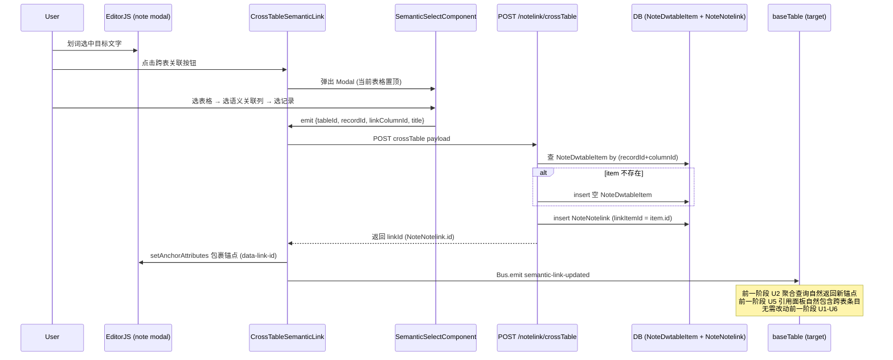

## Summary

在多维表格语义关联列(type=25)打开的 note modal 内,新增第二个内联工具按钮触发跨表选择器,让用户划词关联到其他多维表格(含当前表格其他记录)的语义关联列单元格,建立完整双向语义关联。新增一个后端封装端点保证事务一致性,前端复用现有 SemanticSelectComponent(扩展选列步骤)与前一阶段 U1-U6 反向追溯机制。

## Problem Frame

当前 note modal 内的 SemanticLink 工具走 `isModal=true` 分支,划词后直接用 config 中固定的当前表格/当前单元格信息创建关联,跳过了表格选择器。用户无法在 note modal 内关联到其他多维表格的记录。

项目已有跨表选择器组件 `SemanticSelectComponent`,但只在普通 doc 场景(`isModal=false`)使用,且不写入 `linkColumnId/linkItemId`,不建立反向追溯。数据层 `NoteNotelink` 已具备 `linkDwTableId/linkRecordId/linkColumnId/linkItemId` 字段,完全支持跨表关联。

plan-time research 发现关键约束:`insertNoteNotelink` 只插入 NoteNotelink 记录,不创建 NoteDwtableItem;而 `linkItemId` 必须是已存在的 NoteDwtableItem.id。跨表场景下目标记录在目标语义关联列可能没有 item(尤其列创建后新增的记录),需要"获取或创建"item 再创建关联。为保证事务一致性,新增后端封装端点(偏离 origin R8,见 KTD1)。

## Requirements

**入口与触发**

1. note modal 内的 EditorJS 内联工具栏新增第二个按钮(区别于现有"语义关联"按钮),用户划词后点击该按钮触发跨表关联流程。
2. 新按钮触发的流程独立于现有 `isModal=true` 快捷关联分支,不改动原按钮的行为与数据路径。

**目标表格选择**

3. 跨表选择器展示多维表格列表,当前表格置顶显示,其余表格按现有顺序排列。
4. 选择器只展示含有语义关联列(type=25)的表格;无语义关联列的表格不可选或选后给出"该表格需先创建语义关联列"提示。
5. 选定表格后,若该表格有多个语义关联列,提供选列步骤让用户指定具体列;只有一个时自动选用。

**关联创建与数据**

6. 用户选定"表格 + 语义关联列 + 记录"后,选中词被包裹为现有 `<a data-type="semantic">` 锚点,锚点带 `data-link-id` 承载新创建的 NoteNotelink 主键。
7. 创建的 NoteNotelink 记录:`noteId/blockId/contextText` 来自当前笔记与划词位置;`linkDwTableId/linkRecordId` 指向目标表格的目标记录;`linkColumnId/linkItemId` 指向目标表格的目标语义关联列与对应单元格。
8. 关联创建走**新增**的 `POST /system/notelink/crossTable` 端点,后端在一个事务内获取或创建 NoteDwtableItem 并创建 NoteNotelink(偏离 origin R8"不新增后端 API"假设,理由见 KTD1)。

**反向追溯复用**

9. 关联创建后,目标表格的语义关联列单元格自然显示该笔记锚点(复用前一阶段 U2 `selectNoteNotelinkByCell` 聚合查询),无需改动前一阶段 U1-U6 已实现逻辑。
10. 笔记侧的前一阶段 U5 引用面板与内联角标自然包含该跨表关联(复用 `selectNoteNotelinkByNoteId`),无需额外适配。

**取消关联**

11. 删除跨表关联锚点时复用前一阶段 U6 的 `DELETE system/notelink/{linkId}` 路径与级联确认弹框,不新建删除流程。

## Key Technical Decisions

- **KTD1. 新增后端封装端点 `POST /system/notelink/crossTable`,而非前端编排现有端点。** Research 发现 `insertNoteNotelink` 只插 NoteNotelink 不创建 NoteDwtableItem,跨表场景需先"获取或创建"目标记录在目标列的 item。前端编排(GET item → 无则 POST add → POST notelink)在中途失败时会产生孤立 NoteDwtableItem,事务一致性靠前端保证不可靠。新增后端 `@Transactional` 端点封装"获取或创建 item + 创建 NoteNotelink",一次调用事务安全。这偏离 origin R8"不新增后端 API",但事务安全性优先于 API 数量约束。
- **KTD2. 新建独立工具类 `CrossTableSemanticLink`,而非在现有 SemanticLink 类内加第二个按钮。** EditorJS 内联工具的 button/render/surround 耦合在单个类,强行在一个类内支持两种模式会增加分支复杂度。独立工具类职责单一,可独立注册到 inlineToolbar,与原 SemanticLink 零耦合。两个类共享 `setAnchorAttributes` 等工具方法(提取到 BaseClass 或 util)。
- **KTD3. 新工具仅在 `isModal=true`(note modal)场景注册启用。** origin 范围是"note modal 内",普通 doc 场景(`isModal=false`)已有 SemanticSelectComponent 做正向跨表选择(不建立反向追溯)。新工具不扩展到普通 doc,避免 scope 蔓延。若后续需要,可单独 plan。
- **KTD4. 自引用关联(当前表格当前记录)默认允许,不做预校验。** 用户在 note modal 里选当前表格的当前记录(即 note modal 依托的单元格)会创建自引用 NoteNotelink。数据层支持,语义上虽少见但合法。预校验禁止增加复杂度且收益低,遵循 YAGNI 不加。
- **KTD5. U1 条件性新增 `(record_id, column_id)` UNIQUE 约束(conditional schema migration)。** U1 catch-retry 并发保护依赖该约束,但 RuoYi 现有 schema 无此约束。新增约束偏离 plan 原本的"数据层完全复用"边界,故作为 KTD 显式记录(平行于 KTD1 的 API deviation)。migration 必须在 catch-retry 代码启用前执行,并含 pre-migration dedup step 清理 `NoteBlockServiceImpl.linkToDwtable` L192-231 历史 insert 产生的潜在重复行。这是 conditional migration — 仅在 U1 实现时确实新增约束时执行,否则跳过。

## High-Level Technical Design

跨表关联创建流程涉及前端工具按钮、选择器组件、后端封装端点、NoteNotelink/NoteDwtableItem 数据层,以及复用前一阶段 U1-U6 反向追溯。序列如下:

## Implementation Units

### U1. 后端跨表关联封装端点

- **Goal:** 新增 `POST /system/notelink/crossTable` 端点,在单个 `@Transactional` 方法内获取或创建 NoteDwtableItem 并创建 NoteNotelink,返回 NoteNotelink 主键 id。
- **Requirements:** R7, R8.
- **Dependencies:** 无.
- **Files:**
  - `ruoyi-admin/src/main/java/com/ruoyi/web/controller/system/NoteNotelinkController.java` (新增端点)
  - `ruoyi-system/src/main/java/com/ruoyi/system/service/INoteNotelinkService.java` (新增方法声明)
  - `ruoyi-system/src/main/java/com/ruoyi/system/service/impl/NoteNotelinkServiceImpl.java` (实现,注入 `NoteDwtableItemMapper`)
  - `ruoyi-system/src/main/java/com/ruoyi/system/mapper/NoteDwtableItemMapper.java` (已有 `selectNoteDwtableItemByRecordAndColumn` + `insertNoteDwtableItem`,复用;catch-retry path 需在 mapper XML 的 `selectNoteDwtableItemByRecordAndColumn` SQL 末尾追加 `LIMIT 1`,详见 U1 Approach)
  - `sql/2026-07-17-001-unique-constraint-note-dwtable-item.sql` (conditional DDL migration script,新增 `(record_id, column_id)` UNIQUE 约束 + pre-migration dedup;详见 KTD5)
- **Approach:**
  - Controller 新增 `@PostMapping("/crossTable")` 并加 `@PreAuthorize("@ss.hasPermi('system:notelink:add')")` 注解(与同 controller 内现有 add 端点保持一致),接收 payload(noteId/blockId/contextText/itemValue/linkDwTableId/linkRecordId/linkColumnId),调用 service。
  - Service 新增 `createCrossTableLink(payload)` 方法,`@Transactional`:调 `noteDwtableItemMapper.selectNoteDwtableItemByRecordAndColumn(recordId, columnId)`,返回空则 `insertNoteDwtableItem`(空 value 占位,参考 `NoteBlockServiceImpl.linkToDwtable` L216-227 的空 item 模式);拿 item.id 作 linkItemId;`insertNoteNotelink`;返回 NoteNotelink.id。
  - 异常用 try-catch 包裹,记录日志并抛出,让事务回滚(参考 project_memory 约定:middleware 和 service 方法用 try-catch + 错误日志防静默失败)。
  - 并发保护:依赖 DB 在 `(record_id, column_id)` 上的唯一约束防重复 item;`insertNoteDwtableItem` 抛 `DuplicateKeyException` 时 catch 并 retry `selectNoteDwtableItemByRecordAndColumn` 复用已存在 item(net-new pattern;`DuplicateKeyException` catch-retry 是标准 Spring/MyBatis idiom,RuoYi 代码库无既有先例,不引用不存在的先例)。若该约束尚不存在,实现时新增(DDL migration 在 U1 范围内,详见 KTD5)。
  - IDOR 防护:service 方法入口校验当前用户对目标 `linkDwTableId` 的访问权限(参考 RuoYi `@DataScope` 或现有 dwtable 访问校验路径),失败抛 `AccessDeniedException`,Controller 自然返回 403。
  - Migration 排序与 LIMIT 1 defense-in-depth:DDL migration(若新增 UNIQUE 约束,详见 KTD5)必须在 catch-retry 代码启用前执行;migration 应包含 pre-migration dedup step(清理 `NoteBlockServiceImpl.linkToDwtable` L192-231 历史 insert 无 dedup 产生的潜在重复行),否则 catch-retry 在重复行存在时会触发 `TooManyResultsException`(`selectNoteDwtableItemByRecordAndColumn` 返回单个对象,mapper XML 无 LIMIT 1)。作为 defense-in-depth,在 mapper SQL 末尾追加 `LIMIT 1`(MySQL 方言)。
- **Patterns to follow:**
  - `NoteBlockServiceImpl.linkToDwtable` (L192-231) 的 item 创建模式(空 value 占位)。
  - `NoteNotelinkServiceImpl.insertNoteNotelink` (L91-94) 的 NoteNotelink 插入。
  - project_memory 约定:try-catch + 错误日志,防静默失败。
- **Test scenarios:**
  - **Happy path:** 目标记录已有 NoteDwtableItem → 复用 item.id → 创建 NoteNotelink → 返回 linkId;DB 中 NoteNotelink.linkItemId 与 item.id 一致。
  - **Edge case (item 不存在):** 目标记录在目标列无 item → 创建空 item → 用其 id → 创建 NoteNotelink;DB 中新增一条 NoteDwtableItem 和一条 NoteNotelink,linkItemId 指向新 item。
  - **Edge case (空 value item):** 新建 item 的 value/linkBlockId/linkNoteId 为 null(占位),与 linkToDwtable 非发起记录的 item 模式一致。
  - **Error path (columnId 不存在):** linkColumnId 指向不存在的列 → 查询/插入失败 → 事务回滚 → 返回错误,不产生孤立数据。
  - **Error path (DB 异常):** insertNoteNotelink 失败 → 事务回滚 → 已创建的 item 也回滚,不产生孤立 item。
  - **Integration:** 端点返回的 linkId 能被前端用于 `data-link-id` 属性;该 NoteNotelink 能被 `selectNoteNotelinkByCell(linkColumnId, linkItemId)` 查询到。
- **Verification:** 调用端点返回非空 linkId;DB 中 NoteNotelink 与 NoteDwtableItem 状态一致;事务失败时不留孤立数据。

### U2. 扩展 SemanticSelectComponent 支持选列与预校验

- **Goal:** 选择器增加"选语义关联列"步骤,过滤无 type=25 列的表格,当前表格置顶;选定后回传 linkColumnId 等字段(不含 linkItemId,后端处理)。
- **Requirements:** R3, R4, R5.
- **Dependencies:** 无(选择器只管选,端点在 U3 调用).
- **Files:**
  - `notepad/src/components/editorjs/components/SemanticLink/index.vue` (扩展)
- **Approach:**
  - **场景隔离**:以下所有扩展仅在 `isModal=true`(note modal)调用时激活;`isModal=false`(普通 doc forward 关联)路径走原逻辑,不受选列/置顶/过滤改动影响。通过 prop `isModal` 在 onMounted / handleTableChange / handleConfirmSelection 内做条件分支,不在 `isModal=false` 路径执行新逻辑。
  - onMounted 拉 `/system/dwtable/list` 时显示 `a-spin` loading;失败 `message.error("表格列表加载失败")` 且不阻塞关闭 Modal;成功后将当前表格(`this.config.tableId` 或通过 props 注入)置顶排列。
  - `handleTableChange` 拉列时显示 `a-spin` loading;失败 `message.error("列加载失败")` 且禁用选记录步骤;成功后过滤 `type === 25` 的列;无则 `message.warning("该表格需先创建语义关联列")` 并禁用下一步。
  - 有多个 type=25 列时,渲染选列下拉(`a-select`),用户选后存 `selectedColumnId`;只有一个时自动选用。
  - `handleConfirmSelection` 的 emit payload 增加 `linkColumnId: selectedColumnId`,移除 `noteId`(noteId 由工具类从 config 提供,非选择器职责)。
  - 选择器回传字段:`{tableId, recordId, linkColumnId, title}`(contextText 由工具类从划词 range 提取)。
- **Patterns to follow:**
  - 现有 `handleTableChange` (L72-125) 的表格/记录加载模式。
  - 现有 `handleConfirmSelection` (L147-158) 的 emit 模式。
- **Test scenarios:**
  - **Covers AE1.** 当前表格置顶显示在选择器顶部;选当前表格的语义关联列、记录 R2,回传 `{tableId: 当前, recordId: R2, linkColumnId}`。
  - **Covers AE2.** 选无 type=25 列的表格 → 提示"该表格需先创建语义关联列",无法进入选记录步骤。
  - **Covers AE3.** 目标表格有两个 type=25 列 col1/col2 → 展示选列下拉 → 用户选 col2 → 回传 `linkColumnId: col2`。
  - **Edge case (单个语义关联列):** 目标表格只有一个 type=25 列 → 自动选用,跳过选列步骤。
  - **Edge case (空表格):** 目标表格无记录 → 记录列表为空 → 提示"该表格无记录"。
  - **Edge case (全局无 type=25 列表格):** 整个系统无任何表格含 type=25 列 → 选择器打开即显示空状态文案"暂无可关联的表格,请先创建含语义关联列的表格",禁用所有后续步骤。
- **Verification:** 选择器交互正常;回传 payload 含 `linkColumnId`;当前表格置顶;无 type=25 列的表格被拦截。

### U3. 跨表关联内联工具按钮 + 创建链路

- **Goal:** 新建 `CrossTableSemanticLink` 工具类,注册到 note modal 的 EditorJS inlineToolbar;surround 弹扩展选择器;选定后调 `crossTable` 端点,包裹锚点写入 `data-link-id`,通知 baseTable 刷新;取消关联复用前一阶段 U6 DELETE 路径。
- **Requirements:** R1, R2, R6, R9, R10, R11.
- **Dependencies:** U1 (crossTable 端点), U2 (扩展选择器).
- **Files:**
  - `notepad/src/components/editorjs/tools/inline/SemanticLink/index.ts` (提取 `setAnchorAttributes` 到 util 或 BaseClass 复用)
  - `notepad/src/components/editorjs/tools/inline/CrossTableSemanticLink/index.ts` (新建工具类)
  - `notepad/src/components/editorjs/tools/inline/CrossTableSemanticLink/index.scss` (新建样式,ICON 区分)
  - `notepad/src/components/editorjs/index.vue` (注册新工具,仅在 `isModal=true` 时)
- **Approach:**
  - 新建工具类,参考 `SemanticLink` 结构:`constructor`/`render`/`surround`/`checkState`/`clear`。
  - `surround(range)`:克隆 range → 弹 Modal 内嵌扩展版 `SemanticSelectComponent`(传 `currentTableId` 用于置顶)。
  - Modal 取消行为遵循 ant-design-vue `a-modal` 默认(`maskClosable=true` + ESC 关闭),不自定义 onCancel;关闭即视为放弃,不调端点、不包裹锚点。
  - `onSelect` 回调:提取 contextText = range.toString().trim();POST `system/notelink/crossTable` payload `{noteId: this.config.id, blockId, contextText, itemValue: contextText, linkDwTableId: tableId, linkRecordId: recordId, linkColumnId}`;拿到 linkId。
  - 调共享的 `setAnchorAttributes(anchor, {tableId, recordId, blockId, noteId, linkId})` 包裹锚点(复用 SemanticLink 的 sanitize 与属性写入)。
  - `Bus.emit semantic-link-updated` 通知 baseTable 刷新目标单元格(复用前一阶段 U4 双源合并)。
  - `executeUnlink`/`confirmUnlink`:因锚点有 `data-link-id`,复用前一阶段 U6 的 `DELETE system/notelink/{linkId}` 路径与级联确认文案(可直接调用 SemanticLink 的方法,或提取共享)。
  - 注册:`editorjs/index.vue` L459-475 的 tools 配置,新增 `crossTableSemanticLink: { class: CrossTableSemanticLink, config: props }`,并在 inlineToolbar 配置中包含(仅 note modal 场景,判断 `props.isModal`)。
- **Patterns to follow:**
  - `SemanticLink` (L17-393) 的工具类结构、surround/showSemanticModal/addOrUpdateLink 反向分支(L145-191)、setAnchorAttributes (L254-270)、executeUnlink (L321-361)。
  - `Bus.emit semantic-link-updated` 事件通知模式。
- **Test scenarios:**
  - **Happy path (创建):** note modal 内划词 → 点新按钮 → 选择器 → 选表格/列/记录 → 确认 → 锚点显示带 `data-link-id`;DB 中 NoteNotelink 创建。
  - **Covers F1.** 完整创建流程:划词 → 选目标 → 锚点包裹 → 通知。
  - **Covers AE4.** 关联创建后打开目标表格 → 语义关联列单元格显示该词;点击词跳回笔记定位高亮;笔记侧前一阶段 U5 面板包含跨表条目。
  - **Covers F2.** 目标表格侧反向追溯:前一阶段 U2 聚合查询返回新锚点;无需改动前一阶段 U1-U6。
  - **Covers F3.** 取消跨表关联:在笔记删除锚点 → 前一阶段 U6 确认弹框(级联警告) → DELETE notelink/{linkId} → 目标单元格刷新移除该词。
  - **Edge case (空选词):** 用户未选词点按钮 → range 为空 → 提示"请先选中文字"。
  - **Error path (端点失败):** crossTable 端点返回错误 → message.error → 不包裹锚点,DOM 保持原状。
  - **Integration:** 锚点点击触发 `open-semantic-detail` 跳转目标表格记录(复用 setAnchorAttributes 的 onclick)。
  - **Integration:** `semantic-link-updated` 事件被 baseTable 监听 → 刷新目标单元格(前一阶段 U4 双源合并)。
- **Verification:** note modal 内划词跨表关联端到端通畅;目标表格侧反向追溯自然生效(无需改动前一阶段 U1-U6);取消关联复用前一阶段 U6 DELETE 路径成功级联。

## Scope Boundaries

**In scope**

- 新增后端 `POST /system/notelink/crossTable` 封装端点(U1)。
- 扩展 SemanticSelectComponent 选列步骤与预校验(U2)。
- 新建 CrossTableSemanticLink 工具类与注册(U3)。
- 复用前一阶段 U1-U6 反向追溯(验证性,不改动)。

### Deferred to Follow-Up Work

- 新按钮的图标与 tooltip 文案最终设计(实现时定,非架构决策)。
- 普通 doc 场景(`isModal=false`)启用跨表关联按钮(KTD3 明确不扩展,后续可单独 plan)。
- 跨表关联的批量创建(一次选多词或多记录)。
- 选择器内表格搜索/分页(当前表格列表规模小)。

**Outside this scope**

- 改动现有 `isModal=true` 快捷关联分支(原 SemanticLink 按钮行为零改动)。
- 改动前一阶段 U1-U6 已实现的反向追溯逻辑。
- 改动 NoteNotelink 表结构(数据层完全复用)。
- 改动普通 doc 场景现有 SemanticSelectComponent 行为(仅扩展,不破坏)。

## Risks & Dependencies

- **依赖前一阶段 U1-U6 已实现且可用**:前一阶段 U2 `selectNoteNotelinkByCell`、前一阶段 U5 `selectNoteNotelinkByNoteId`、前一阶段 U6 `DELETE system/notelink/{linkId}`。若前一阶段 U1-U6 有缺陷,跨表关联的反向追溯会受影响。
- **依赖现有 NoteNotelink 数据模型**:已含 `linkDwTableId/linkRecordId/linkColumnId/linkItemId` 字段,无需 schema 变更。
- **风险:事务边界**:U1 端点必须 `@Transactional`,否则"获取或创建 item + 创建 NoteNotelink"中途失败会产生孤立数据。参考 project_memory 约定:deduplicate 方法必须 `@Transactional` 保证一致性,同模式适用此处。
- **风险:EditorJS onChange 持久化运行时 UI**(已记录在 project_memory):新工具若在 DOM 上添加运行时 class/元素(如角标),会被 onChange 持久化到 note_block.property。U3 的 setAnchorAttributes 只写锚点属性,不添加运行时 UI,无此风险;但若后续扩展需注意。
- **风险:目标表格语义关联列预校验准确性**:U2 过滤 type=25 列依赖 `/system/column/columnList` 返回 type 字段。需确认该 API 返回 type(已知 SemanticSelectComponent 已用此 API 拉列)。

## Open Questions

**Resolve during implementation**

- 新按钮的 ICON SVG 与 tooltip 文案(参考现有 SemanticLink 的 ICON_LINK 模式)。
- `setAnchorAttributes` 提取到 BaseClass 还是 util 函数(影响 U3 的 import 结构)。
- 新工具在 EditorJS inlineToolbar 配置中的位置(在原 SemanticLink 按钮之后)。

**Resolve during planning verification**

- 确认 `/system/column/columnList?dwtableId=` 返回的列对象含 `type` 字段(U2 过滤依赖)。
- 确认 `selectNoteDwtableItemByRecordAndColumn` mapper 的 SQL 条件与 U1 payload 字段匹配.

**[Round 2 Defer] Implementation-time author-judgment findings**

- **U1 Approach — IDOR 防护引用了不存在的访问校验路径。** Codebase 验证:`@DataScope` 仅用于 list-query filtering(`SysUser`/`SysRole`/`SysDept`/`NoteRoleMenu`),`NoteDwtableController` 所有 `@PreAuthorize` 已注释,无 dwtable access-check method。Approach 第 103 行的"参考 RuoYi `@DataScope` 或现有 dwtable 访问校验路径"不存在。需选择 authority source:(a) 查 `NoteDwtable` by `linkDwTableId` → 查 `NoteNote` by `noteId` → 校验 `NoteNote.auth == SecurityUtils.getUserId()`(feasibility 建议);(b) 基于 `create_by` 字段;(c) 基于 `note_role_menu` 关系。作者决断后修订 Approach 第 103 行。
- **U3 Approach — 已有锚点上的 surround 行为未规范。** Plan 列出 `checkState` 但 surround 无条件打开 create-Modal。现有 SemanticLink 在已有锚点时 branch。新工具若无等价 spec 会嵌套锚点或静默覆盖。需明确:(a) modify mode(替换 linkId);(b) no-op(报错或提示用户先取消关联);(c) message(弹消息提示)。作者决断后补充到 U3 Approach。
- **U2 Test scenarios — 全局空状态测试与 per-table 流程不一致。** Round-1-added edge case "整个系统无任何表格含 type=25 列 → 选择器打开即显示空状态文案"要求 upfront 检测,但 U2 Approach 只在 `handleTableChange` 内 per-table 拉取 columns — 无 upfront batch fetch 在用户选表前检测。需:(a) mount 时 pre-fetch all tables' columns 检测全局空状态;或 (b) 修订测试场景为 per-table 空状态(用户选表后才显示空状态)。作者决断后同步 Approach 或 Test scenarios。

## Sources / Research

- SemanticLink 内联工具: `notepad/src/components/editorjs/tools/inline/SemanticLink/index.ts` — `showSemanticModal()` 的 `isModal` 分支(L82-124)、`addOrUpdateLink()` 反向模式分支(L145-191)、`setAnchorAttributes()` (L254-270)、`executeUnlink()` 前一阶段 U6 删除路径(L321-361)。
- 跨表选择器组件: `notepad/src/components/editorjs/components/SemanticLink/index.vue` — 现有选表格+选记录逻辑(U2 扩展基础)。
- Editor 注册: `notepad/src/components/editorjs/index.vue` — L459-475 tools 配置,L460 `semanticLink: { class: SemanticLink, config: props }`。
- note modal 结构: `notepad/src/components/baseTable/index.vue` — L126-132 note modal,L505-516 `openNotePicker` 从 `row.itemId?.[columnId]` 获取 linkItemId。
- NoteNotelink 实体: `ruoyi-system/src/main/java/com/ruoyi/system/domain/NoteNotelink.java` — 已含 `linkDwTableId/linkRecordId/linkColumnId/linkItemId` 字段。
- NoteNotelinkServiceImpl: `ruoyi-system/src/main/java/com/ruoyi/system/service/impl/NoteNotelinkServiceImpl.java` — `insertNoteNotelink` (L91-94) 只插 NoteNotelink 不创建 item。
- NoteBlockServiceImpl: `ruoyi-system/src/main/java/com/ruoyi/system/service/impl/NoteBlockServiceImpl.java` — `linkToDwtable` (L192-231) 创建 type=25 列时批量插入 NoteDwtableItem 的模式(U1 空 item 占位参考)。
- NoteDwtableItemMapper: `ruoyi-system/src/main/java/com/ruoyi/system/mapper/NoteDwtableItemMapper.java` — `selectNoteDwtableItemByRecordAndColumn` + `insertNoteDwtableItem` (U1 复用)。
- NoteDwtableItemController: `ruoyi-admin/src/main/java/com/ruoyi/web/controller/system/NoteDwtableItemController.java` — 通用 CRUD 端点(U1 不直接用,新端点在 NoteNotelinkController)。
- Origin requirements: `docs/brainstorms/2026-07-17-cross-table-semantic-link-requirements.md`。
- 前一阶段 plan: `docs/plans/2026-07-15-001-feat-semantic-link-reverse-direction-plan.md` — U1-U6 反向方向实现,本 plan 在其基础上扩展跨表能力。
