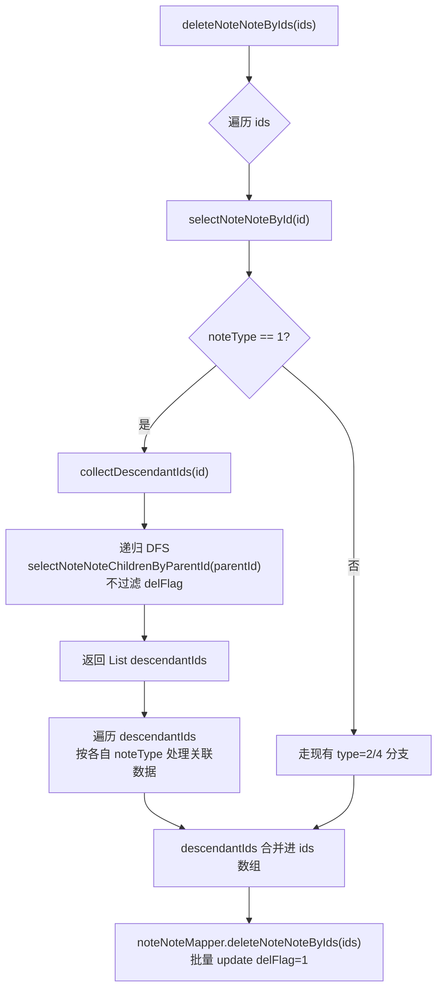

# fix: 文件夹笔记级联删除

## Summary

补齐 `NoteNoteServiceImpl` 三个生命周期方法中 `noteType==1L`（文件夹）分支的级联处理：软删除进回收站、物理清空回收站、从回收站恢复。删除/恢复文件夹时递归收集所有子孙笔记 ID，让子孙笔记及其关联数据（NoteMeta、NoteDwtable）与文件夹保持 `delFlag` 状态一致。配套新增按 `parentId` 查询子笔记且不过滤 `delFlag` 的 Mapper 方法、Service 层递归收集 helper，并为三个方法补 `@Transactional` 保证 R11 事务一致性。

---

## Problem Frame

当前 `NoteNoteServiceImpl` 的三个删除/恢复方法按 `noteType` 用 if/else 分发处理：

- [deleteNoteNoteByIds](ruoyi-system/src/main/java/com/ruoyi/system/service/impl/NoteNoteServiceImpl.java)（软删除/移入回收站）：`noteType==1L` 分支为空实现，注释写着"如果是文件夹,就级联删除"但无任何代码。
- [deleteNoteFromGarbageByIds](ruoyi-system/src/main/java/com/ruoyi/system/service/impl/NoteNoteServiceImpl.java)（物理清空回收站）：完全没有 `noteType==1L` 分支。
- [recoverNoteNoteByIds](ruoyi-system/src/main/java/com/ruoyi/system/service/impl/NoteNoteServiceImpl.java)（从回收站恢复）：完全没有 `noteType==1L` 分支。

删除文件夹后，`parentId` 指向该文件夹的所有子孙笔记保持原 `delFlag` 状态残留为孤儿，仍显示在用户笔记树中；物理清空回收站时子孙及关联数据（NoteMeta/NoteBlock/NoteDwtable/NoteColumn/NoteRecord/NoteDwtableItem/NoteView）全部残留。三个方法当前都没有 `@Transactional` 注解，级联操作中途失败会留下"文件夹已变更/子孙未变更"的中间状态。

详细需求与设计决策见 origin: [docs/brainstorms/2026-07-20-folder-cascade-delete-requirements.md](docs/brainstorms/2026-07-20-folder-cascade-delete-requirements.md)。

---

## Requirements

**递归子孙收集**

- R1. 新增按 `parentId` 查询直接子笔记且**不过滤 `delFlag`** 的 Mapper 方法。
- R2. 在 `NoteNoteServiceImpl` 中新增递归收集方法，输入文件夹 ID，返回所有子孙笔记 ID（含子文件夹的子孙，深度无限）。
- R3. 递归必须处理嵌套子文件夹（type=1 的子节点继续向下递归）。
- R4. 递归过程中遇到环时通过 visited 集合防御，被跳过的节点记入日志。

**软删除阶段级联（`deleteNoteNoteByIds`）**

- R5. `noteType==1L` 分支：递归收集子孙 ID，对每个子孙按其 `noteType` 走与现有 type=2/type=4 分支一致的关联数据处理（NoteMeta 同步 deleteFlag=1，NoteDwtable 调用 `deleteNoteDwtableByNoteId` 软删）。
- R6. 子孙 ID 合并进批量软删除 ID 列表，最终一次性 `update note_note set delFlag=1 where id in (folderId + descendants)`。

**物理删除阶段级联（`deleteNoteFromGarbageByIds`）**

- R7. `noteType==1L` 分支：递归收集子孙 ID，对每个子孙按其 `noteType` 走与现有 type=2/type=4 分支一致的关联数据物理清理（NoteMeta.deleteFlag=2，type=4 调用 `noteDwtableServiceImpl.deleteNoteDwtableById` 物理删除含 view/record/item/column）。
- R8. 子孙 ID 合并进批量物理删除 ID 列表，最终一次性 `delete from note_note where id in (folderId + descendants)`。

**恢复阶段级联（`recoverNoteNoteByIds`）**

- R9. `noteType==1L` 分支：递归收集子孙 ID，对每个子孙按其 `noteType` 走与现有 type=2/type=4 分支一致的关联数据恢复处理（NoteMeta.deleteFlag=0，NoteDwtable 调用 `recoverNoteDwtableByNoteId` 软恢复）。
- R10. 子孙 ID 合并进批量恢复 ID 列表，最终一次性 `update note_note set delFlag=0 where id in (folderId + descendants)`。

**事务一致性**

- R11. 三个方法整体在事务中执行（补 `@Transactional` 注解），任一子孙级联失败应回滚整个操作。

---

## Key Technical Decisions

**递归收集放在 Service 层而非 SQL 递归 CTE**：MySQL Server 实际版本未知（项目未在 DDL 或配置中显式声明，可能 5.7 或 8.x），保守起见不依赖 MySQL 8+ 的 `WITH RECURSIVE`。Service 层迭代式 DFS + 新增 Mapper 方法（按 parentId 简单查询）兼容所有 MySQL 版本，代价是 N 次 DB 查询（N=文件夹深度）。对一般笔记层级（深度通常 < 5）影响可忽略。

**新增 Mapper 方法必须忽略 `delFlag`**：现有 [selectNoteNoteList](ruoyi-system/src/main/resources/mapper/system/NoteNoteMapper.xml) 带 `delFlag=0` 过滤，物理删除和恢复场景下子孙已是 `delFlag=1`，用此方法会漏查。三个场景共用同一个递归 helper，必须跨状态查询。

**子孙关联数据按各自 `noteType` 复用现有分支逻辑**：不抽取统一分发器、不新建 NoteDeleteService。对每个子孙按其 `noteType` 走与现有方法体一致的分支处理（type=2 → NoteMeta.deleteFlag 同步；type=4 → NoteDwtable 软删/物理删/恢复），保持代码风格统一，避免引入新抽象层。

**补 `@Transactional` 注解**：当前 [NoteNoteServiceImpl](ruoyi-system/src/main/java/com/ruoyi/system/service/impl/NoteNoteServiceImpl.java) 类及三个方法都没有 `@Transactional`。R11 要求事务一致性，每个方法加 `@Transactional(rollbackFor = Exception.class)` 保证级联失败时整体回滚。

**迭代式 DFS + visited 集合防环（不引入 maxDepth）**：业务上 `parentId` 不应形成环，但 R4 要求防御性处理。helper 用 `Deque<Long>` 作为栈实现迭代式 DFS（规避递归栈溢出），用 `Set<Long> visited` 记录已访问 ID，遇到重复跳过并记录日志（不抛异常，避免误判中断正常流程）。业务笔记层级通常 < 5 层，visited 防环 + 迭代 DFS 已足够，不引入 `maxDepth` 参数避免增加配置复杂度。

**helper 返回 `List<NoteNote>` 而非 `List<Long>`**：递归过程中 `selectNoteNoteChildrenByParentId` 已返回完整 NoteNote 对象，调用方直接 `child.getNoteType()` 即可，避免对每个子孙再调 `selectNoteNoteById` 造成 N+1 查询。

**子孙收集后合并进批量操作**：不逐条 `update/delete`，而是收集完所有子孙后合并进 `ids` 数组（将 Long ID 转为 String 以匹配现有方法签名 `String[] ids`），由现有 `deleteNoteNoteByIds`/`deleteNoteFromGarbageByIds`/`recoverNoteNoteByIds` 的批量 SQL 一次性处理，减少 DB 往返。

---

## High-Level Technical Design

文件夹级联删除的核心数据流（以软删除为例，物理删除/恢复同理）：

三个方法的差异仅在第 I 步的关联数据处理：
- 软删除：NoteMeta.deleteFlag=1，NoteDwtable.deleteNoteDwtableByNoteId（软删）
- 物理删除：NoteMeta.deleteFlag=2，type=4 调 `noteDwtableServiceImpl.deleteNoteDwtableById`（物理删）
- 恢复：NoteMeta.deleteFlag=0，NoteDwtable.recoverNoteDwtableByNoteId（软恢复）

---

## Implementation Units

### U1. 递归子孙收集能力（Mapper 方法 + Service helper）

**Goal:** 提供跨 `delFlag` 状态递归收集文件夹所有子孙笔记 ID 的能力，供三个生命周期方法复用。

**Requirements:** R1, R2, R3, R4

**Dependencies:** 无

**Files:**
- 修改：[ruoyi-system/src/main/java/com/ruoyi/system/mapper/NoteNoteMapper.java](ruoyi-system/src/main/java/com/ruoyi/system/mapper/NoteNoteMapper.java)
- 修改：[ruoyi-system/src/main/resources/mapper/system/NoteNoteMapper.xml](ruoyi-system/src/main/resources/mapper/system/NoteNoteMapper.xml)
- 修改：[ruoyi-system/src/main/java/com/ruoyi/system/service/impl/NoteNoteServiceImpl.java](ruoyi-system/src/main/java/com/ruoyi/system/service/impl/NoteNoteServiceImpl.java)

**Approach:**
- Mapper 接口新增 `List<NoteNote> selectNoteNoteChildrenByParentId(Long parentId)`，对应 XML 中新增 `<select>` 语句：`select ... from note_note where parentId = #{parentId}`（**不带** `delFlag` 过滤）。
- Service 中新增 `private List<NoteNote> collectDescendantNotes(Long folderId)` 方法，使用**迭代式 DFS**（避免递归栈溢出）：
  - 维护 `Set<Long> visited` 防环，初始包含 `folderId` 自身。
  - 维护 `Deque<Long> stack` 作为待访问栈，初始压入 `folderId`。
  - 循环弹出栈顶 ID，调用 `selectNoteNoteChildrenByParentId(currentId)` 获取直接子节点列表。
  - 若子节点列表为 null（防御性：MyBatis 默认不返回 null，但加 `if(children==null) continue` 保险），跳过当前循环。
  - 遍历子节点：若 `child == null` 或 `child.getNoteId() == null` 跳过（防御脏数据）；若 ID 已在 visited 中，记录日志（`logger.warn`）跳过；否则加入结果列表、visited，并压入栈等待后续展开。
  - 返回所有子孙 NoteNote 对象列表（不含 folderId 自身）。
- 调用方直接 `child.getNoteType()` 取得类型，无需再查 DB。

**Patterns to follow:**
- 现有 `selectNoteNoteList` 的 SQL 风格（[NoteNoteMapper.xml](ruoyi-system/src/main/resources/mapper/system/NoteNoteMapper.xml) L26-L38）。
- 项目已有 `org.slf4j.Logger` 日志风格（参考其他 ServiceImpl 中的 `logger.warn` 用法）。

**Test scenarios:**
- Happy path：3 层嵌套（folder→subfolder→doc），收集返回所有子孙 NoteNote 对象（含子文件夹的子孙）。
- Edge case：空文件夹（无子节点），返回空列表。
- Edge case：子孙跨 `delFlag` 状态（部分 delFlag=0，部分 delFlag=1），全部被收集。
- Error path：parentId 形成环（A→B→A），迭代不无限循环，环节点被跳过并记日志。
- Edge case：单层扁平文件夹（多个直接子节点无嵌套），全部被收集。

**Verification:** 调用 `collectDescendantNotes(folderId)` 返回的列表包含所有期望的子孙 NoteNote 对象，无重复，无遗漏；环场景下不抛异常且日志有 warn 记录。

---

### U2. 补齐 `deleteNoteNoteByIds` 文件夹级联软删除

**Goal:** 软删除文件夹时递归软删除所有子孙笔记，同步标记子孙关联数据。

**Requirements:** R5, R6, R11

**Dependencies:** U1

**Files:**
- 修改：[ruoyi-system/src/main/java/com/ruoyi/system/service/impl/NoteNoteServiceImpl.java](ruoyi-system/src/main/java/com/ruoyi/system/service/impl/NoteNoteServiceImpl.java)

**Approach:**
- 在 `deleteNoteNoteByIds` 方法上加 `@Transactional(rollbackFor = Exception.class)`。
- 在 `noteType==1L` 分支补齐实现：
  - 调用 `collectDescendantNotes(noteId)` 获取子孙 NoteNote 对象列表。
  - 遍历子孙 NoteNote 对象，按各自 `noteType` 处理关联数据：
    - 对所有子孙统一调用 `noteDwtableMapper.deleteNoteDwtableByNoteId(child.getId())`（软删，与现有循环末尾对所有类型调用此方法的逻辑一致）。
    - type=2 子孙额外执行：`noteMetaMapper.selectNoteMetaByNoteId(child.getId())` + `setDeleteFlag(1L)` + `updateNoteMeta`（与现有 type=2 分支一致，含 `if(noteMeta!=null)` 防御）。
  - 收集所有子孙 ID 字符串加入新的 `List<String> allIds`（初始包含原 `ids` 数组元素）。
- 方法末尾改用 `allIds.toArray(new String[0])` 传给 `noteNoteMapper.deleteNoteNoteByIds`，一次性批量软删除。

**Patterns to follow:**
- 现有 `deleteNoteNoteByIds` 方法体（[NoteNoteServiceImpl.java](ruoyi-system/src/main/java/com/ruoyi/system/service/impl/NoteNoteServiceImpl.java) L500-L523）的 if/else 分发风格。
- 现有 type=2/type=4 关联数据处理代码原样复用，不重构。

**Execution note:** 实现前先写失败测试（U5 中的 T3/T4），验证当前空实现下子孙未被级联，再补齐分支使测试通过。

**Test scenarios:**
- Happy path：删除含 1 层子节点（1 个文档 + 1 个多维表格）的文件夹，断言子文档 NoteMeta.deleteFlag=1，子多维表格的 NoteDwtable.delFlag=1，子笔记 delFlag=1。
- Happy path：删除含 3 层嵌套（folder→subfolder→doc）的文件夹，断言所有子孙 delFlag=1。
- Integration：删除文件夹后 `noteNoteMapper.deleteNoteNoteByIds` 被调用一次，参数包含 folderId + 所有子孙 ID。
- Error path：某个子孙的 NoteMeta 查询返回 null，不抛 NPE（与现有 type=2 分支 `if(noteMeta!=null)` 检查一致），其他子孙仍被处理。
- Edge case：空文件夹（无子孙），行为与当前空实现一致，仅删除文件夹自身。

**Verification:** 删除文件夹后，DB 中文件夹及所有子孙 `delFlag=1`，NoteMeta/NoteDwtable 同步标记；事务回滚场景下任一子孙处理失败时整体回滚。

---

### U3. 补齐 `deleteNoteFromGarbageByIds` 文件夹级联物理删除

**Goal:** 物理清空回收站中的文件夹时递归物理删除所有子孙笔记及关联数据。

**Requirements:** R7, R8, R11

**Dependencies:** U1

**Files:**
- 修改：[ruoyi-system/src/main/java/com/ruoyi/system/service/impl/NoteNoteServiceImpl.java](ruoyi-system/src/main/java/com/ruoyi/system/service/impl/NoteNoteServiceImpl.java)

**Approach:**
- 在 `deleteNoteFromGarbageByIds` 方法上加 `@Transactional(rollbackFor = Exception.class)`。
- 在循环体中补 `noteType==1L` 分支：
  - 调用 `collectDescendantNotes(noteId)` 获取子孙 NoteNote 对象列表（**忽略 delFlag**，因为子孙已是 delFlag=1）。
  - 遍历子孙 NoteNote 对象，按各自 `noteType` 处理关联数据：
    - type=2：`noteMetaMapper.selectNoteMetaByNoteId(child.getId())` + `setDeleteFlag(2L)` + `updateNoteMeta`（与现有 type=2 分支一致）。
    - type=4：`noteDwtableMapper.selectDWTableList(child.getId())` + 遍历调用 `noteDwtableServiceImpl.deleteNoteDwtableById(dwtable.getId())`（与现有 type=4 分支一致，已含 view/record/item(type=21)/column(type=21)/dwtable 物理删除）。
    - 其他类型（type=1/3/5）：当前方法体未对这两种类型做关联处理，保持一致不做额外处理。
  - 收集所有子孙 ID 字符串加入 `allIds` 列表。
- 方法末尾改用 `allIds` 传给 `noteNoteMapper.deleteNoteFromGarbageByIds`，一次性批量物理删除。

**Patterns to follow:**
- 现有 `deleteNoteFromGarbageByIds` 方法体（[NoteNoteServiceImpl.java](ruoyi-system/src/main/java/com/ruoyi/system/service/impl/NoteNoteServiceImpl.java) L580-L609）的 type=2/type=4 分支风格。
- `noteDwtableServiceImpl.deleteNoteDwtableById` 的级联清理（[NoteDwtableServiceImpl.java](ruoyi-system/src/main/java/com/ruoyi/system/service/impl/NoteDwtableServiceImpl.java) L159-L185）覆盖 view/record/column(type=21)/item(type=21)/dwtable；非 type=21 列及其 item 不被清理（见 Risk 4）。

**Execution note:** 实现前先写失败测试（U5 中的 T5/T6），验证当前缺分支下子孙未被物理删除，再补齐分支使测试通过。

**Test scenarios:**
- Happy path：物理清空含 1 层子节点（1 文档 + 1 多维表格）的文件夹，断言 `note_note` 中无文件夹及子孙行，`note_meta` 对应行 deleteFlag=2，`note_dwtable`/`note_view`/`note_record` 被清理，type=21 列的 `note_column`/`note_dwtable_item` 被清理。**注意**：非 type=21 列及其 item 的残留是 `deleteNoteDwtableById` 已存在的 bug（见 Risk 4），不在本测试断言范围内。
- Happy path：物理清空含 3 层嵌套的文件夹，断言所有子孙行被物理删除。
- Integration：物理清空文件夹后 `noteNoteMapper.deleteNoteFromGarbageByIds` 被调用一次，参数包含 folderId + 所有子孙 ID。
- Edge case：子孙中包含 type=3（表格）/type=5（权限字符），当前方法体未处理这两种类型的关联数据，保持现状不抛异常。
- Error path：某个子孙的多维表格 `selectDWTableList` 返回空列表，跳过 dwtable 级联不抛异常（与现有 type=4 分支 `if(selectDWTableList.size()!=0)` 检查一致）。

**Verification:** 物理清空后 `note_note`/`note_meta`/`note_dwtable`/`note_view`/`note_record`/type=21 列的 `note_column`/type=21 列的 `note_dwtable_item` 中无文件夹及子孙残留；事务回滚场景下任一子孙处理失败时整体回滚。NoteBlock 的清理不在本单元 Verification 范围内（见 Scope Boundaries/Deferred）。

---

### U4. 补齐 `recoverNoteNoteByIds` 文件夹级联恢复

**Goal:** 从回收站恢复文件夹时递归恢复所有子孙笔记及关联数据。

**Requirements:** R9, R10, R11

**Dependencies:** U1

**Files:**
- 修改：[ruoyi-system/src/main/java/com/ruoyi/system/service/impl/NoteNoteServiceImpl.java](ruoyi-system/src/main/java/com/ruoyi/system/service/impl/NoteNoteServiceImpl.java)

**Approach:**
- 在 `recoverNoteNoteByIds` 方法上加 `@Transactional(rollbackFor = Exception.class)`。
- 在循环体中补 `noteType==1L` 分支：
  - 调用 `collectDescendantNotes(noteId)` 获取子孙 NoteNote 对象列表（**忽略 delFlag**，因为子孙已是 delFlag=1）。
  - 遍历子孙 NoteNote 对象，按各自 `noteType` 处理关联数据：
    - 对所有子孙统一调用 `noteDwtableMapper.recoverNoteDwtableByNoteId(child.getId())`（软恢复，与现有循环末尾对所有类型调用此方法的逻辑一致）。
    - type=2 子孙额外执行：`noteMetaMapper.selectNoteMetaByNoteId(child.getId())` + `setDeleteFlag(0L)` + `updateNoteMeta`（与现有 type=2 分支一致，**已知**：若 NoteMeta 查询返回 null 会抛 NPE，保持现状不修复，见 Scope Boundaries/Deferred）。
  - 收集所有子孙 ID 字符串加入 `allIds` 列表。
- 方法末尾改用 `allIds` 传给 `noteNoteMapper.recoverNoteNoteByIds`，一次性批量恢复。

**Patterns to follow:**
- 现有 `recoverNoteNoteByIds` 方法体（[NoteNoteServiceImpl.java](ruoyi-system/src/main/java/com/ruoyi/system/service/impl/NoteNoteServiceImpl.java) L663-L678）的 type=2 分支风格和对所有类型调用 `recoverNoteDwtableByNoteId` 的统一逻辑。

**Execution note:** 实现前先写失败测试（U5 中的 T7/T8），验证当前缺分支下子孙未被级联恢复，再补齐分支使测试通过。

**Test scenarios:**
- Happy path：恢复含 1 层子节点（1 文档 + 1 多维表格）的文件夹，断言子文档 NoteMeta.deleteFlag=0，子多维表格的 NoteDwtable.delFlag=0，子笔记 delFlag=0。
- Happy path：恢复含 3 层嵌套的文件夹，断言所有子孙 delFlag=0。
- Integration：恢复文件夹后 `noteNoteMapper.recoverNoteNoteByIds` 被调用一次，参数包含 folderId + 所有子孙 ID。
- Error path：某个子孙的 NoteMeta 查询返回 null，现有 type=2 分支代码 `noteMeta.setDeleteFlag(0L)` 会抛 NPE——这是**已存在**的 bug（与当前 type=2 行为一致），本次不修复，保持现状。若需修复另起任务。
- Edge case：空文件夹（无子孙），行为与当前缺分支一致，仅恢复文件夹自身。

**Verification:** 恢复文件夹后，DB 中文件夹及所有子孙 `delFlag=0`，NoteMeta/NoteDwtable 同步恢复；事务回滚场景下任一子孙处理失败时整体回滚。

---

### U5. 新建 `NoteNoteServiceImplTest` 测试类

**Goal:** 验证三个生命周期方法的文件夹级联逻辑、递归收集 helper、事务回滚行为。

**Origin note:** Origin 需求文档（[docs/brainstorms/2026-07-20-folder-cascade-delete-requirements.md](docs/brainstorms/2026-07-20-folder-cascade-delete-requirements.md)）未明确要求测试覆盖。本单元基于工程最佳实践新增——级联删除涉及多分支递归、跨表状态同步、事务一致性，属于高风险变更，应配套单元测试防止回归。若实现时资源紧张可降级为关键路径冒烟测试（T1/T2/T3/T5/T7）。

**Requirements:** R1-R11（覆盖性验证）

**Dependencies:** U1, U2, U3, U4

**Files:**
- 新建：[ruoyi-system/src/test/java/com/ruoyi/system/service/impl/NoteNoteServiceImplTest.java](ruoyi-system/src/test/java/com/ruoyi/system/service/impl/NoteNoteServiceImplTest.java)

**Approach:**
- 使用 JUnit 5 + Mockito，`@ExtendWith(MockitoExtension.class)` + `@MockitoSettings(strictness = Strictness.LENIENT)`。
- `@Mock` 注入 `NoteNoteMapper`、`NoteMetaMapper`、`NoteDwtableMapper`、`NoteDwtableServiceImpl` 等依赖。
- `@InjectMocks` 注入 `NoteNoteServiceImpl`。
- 每个测试用例通过 `when(...).thenReturn(...)` 设定 mock 行为，`verify(...)` 验证调用。
- 测试覆盖：
  - T1：`collectDescendantIds` 3 层嵌套收集（覆盖 U1 happy path）。
  - T2：`collectDescendantIds` 环防御（覆盖 U1 error path）。
  - T3：`deleteNoteNoteByIds` 删除含 1 层子节点的文件夹，验证子孙 delFlag=1 + NoteMeta.deleteFlag=1 + NoteDwtable 软删（覆盖 U2）。
  - T4：`deleteNoteNoteByIds` 删除 3 层嵌套文件夹，验证所有子孙被批量软删除（覆盖 U2 嵌套）。
  - T5：`deleteNoteFromGarbageByIds` 物理清空含 1 层子节点的文件夹，验证子孙被物理删除 + NoteMeta.deleteFlag=2 + `noteDwtableServiceImpl.deleteNoteDwtableById` 被调用（覆盖 U3）。
  - T6：`deleteNoteFromGarbageByIds` 物理清空 3 层嵌套文件夹，验证所有子孙被批量物理删除（覆盖 U3 嵌套）。
  - T7：`recoverNoteNoteByIds` 恢复含 1 层子节点的文件夹，验证子孙 delFlag=0 + NoteMeta.deleteFlag=0 + NoteDwtable 软恢复（覆盖 U4）。
  - T8：`recoverNoteNoteByIds` 恢复 3 层嵌套文件夹，验证所有子孙被批量恢复（覆盖 U4 嵌套）。
  - T9：空文件夹删除/清空/恢复，行为与现状一致（覆盖 U2/U3/U4 的 edge case）。

**Patterns to follow:**
- 现有 [NoteDwtableServiceImplTest](ruoyi-system/src/test/java/com/ruoyi/system/service/impl/NoteDwtableServiceImplTest.java) 的测试风格（mock 注入、`buildTestXxx` 辅助方法、`@BeforeEach` 初始化）。

**Test scenarios:** 见上述 T1-T9，每个测试对应一个具体场景。

**Verification:** `mvn test -pl ruoyi-system -Dtest=NoteNoteServiceImplTest` 全部通过；测试覆盖三个生命周期方法的 happy path、嵌套递归、edge case、error path。事务回滚由 `@Transactional(rollbackFor = Exception.class)` 注解保证，依赖 Spring 框架契约，不单测（Mockito 无法验证事务代理行为，且 Spring 事务行为属于框架级集成测试范畴，超出本单元测试范围）。

---

## Scope Boundaries

### Deferred for later

- **统一类型分发器 / NoteDeleteService 抽象**：本次仅补齐文件夹分支，未来若再出现类型遗漏可考虑结构化重构。
- **type=3（表格）和 type=5（权限字符）的关联数据级联**：当前方法体也未处理这两种类型，本次保持现状不扩展。
- **`deleteNoteNoteById`（单条删除入口）**：未被原始请求提及，本次不动。若该入口也被前端用于文件夹删除，需另起任务同步修复。
- **前端二次确认 UI**（"该文件夹下有 N 篇笔记，是否一并删除？"）：本次仅做后端级联，前端 UI 作为后续前端任务。
- **`recoverNoteNoteByIds` 中 type=2 的 NoteMeta NPE bug**：已存在的 bug（NoteMeta 查询返回 null 时 `noteMeta.setDeleteFlag(0L)` 抛 NPE），与本次范围正交，保持现状另起任务修复。
- **NoteBlock 的物理清理**：U3 物理删除场景下，现有 `deleteNoteFromGarbageByIds` 的 type=2 分支仅处理 NoteMeta，不清理 `note_block` 表，type=4 分支走 `deleteNoteDwtableById` 也不涉及 NoteBlock。本次保持现状不扩展 NoteBlock 清理逻辑。若发现物理删除后 `note_block` 残留，另起任务补齐（与 type=2 笔记文档的块结构清理一并考虑）。

### Outside this product's identity

- 不引入软删除级联审计日志。
- 不引入"文件夹移入回收站后 N 天自动物理清理"的定时任务。
- 不改变 `parentId` 关系模型本身（不引入闭包表、物化路径等层级存储重构）。

---

## Risks & Dependencies

**风险**

- **Risk 1：递归深度过大导致栈溢出**。业务上笔记层级通常 < 5 层，但极端场景（如自动化测试数据生成 1000 层）可能触发。**缓解**：U1 的 `collectDescendantIds` 使用迭代式 DFS（用 `Deque<Long>` 栈）而非递归方法调用，避免栈溢出。若实现时选择递归方法调用，需在文档中标注深度限制。
- **Risk 2：子孙数量过大导致 SQL IN 子句超长**。MySQL 默认 `max_allowed_packet` 限制 SQL 长度。**缓解**：当前需求未限定上限，按一般规模（< 500 子孙）设计。若未来出现超大文件夹，需改用分批处理。
- **Risk 3：跨 `delFlag` 状态查询的边界**。新增的 `selectNoteNoteChildrenByParentId` 不过滤 `delFlag`，意味着递归会收集所有历史状态的子孙（包括已在回收站的）。这是设计意图（保证文件夹与子孙状态一致），但若业务上希望"已单独删除的子笔记不被父文件夹恢复影响"，需重新评估。**当前假设**：文件夹与子孙 `delFlag` 始终一致（brainstorm Key Decisions）。
- **Risk 4：`deleteNoteDwtableById` 的已存在 bug**。[NoteDwtableServiceImpl.deleteNoteDwtableById](ruoyi-system/src/main/java/com/ruoyi/system/service/impl/NoteDwtableServiceImpl.java) 只对 type=21 双向链接列做了关联列清理，普通列的 item 未显式删除（依赖 DB 外键或后续清理）。这是已存在问题，本次不修复，但 U3 物理删除依赖该方法，需在文档中标注。**注意**：DB 外键级联假设未经验证——项目 DDL 是否对 `note_column`/`note_dwtable_item` 定义了 `ON DELETE CASCADE` 外键约束本次未审查，若未定义则非 type=21 列及其 item 会残留为孤儿数据。
- **Risk 5：并发删除/恢复同一边缘节点**。文件夹级联收集与批量状态变更之间存在时间窗，若用户并发触发"删除父文件夹 A"和"删除子文档 B"（B 是 A 的子节点）两个操作，两个事务可能都收集到 B，竞态下 B 的最终状态取决于事务提交顺序。**缓解**：本次不在数据库层加锁（不引入 `SELECT ... FOR UPDATE`），R11 的事务保证单操作原子性，但跨操作并发依赖业务层串行化（如前端禁用并发删除按钮、后端后续可加基于 parentId 的分布式锁）。当前实现接受此竞态，与现有单条删除的并发模型一致。

**依赖**

- 现有 `noteDwtableServiceImpl.deleteNoteDwtableById` 已正确级联清理 view/record/column(type=21)/item(type=21)/dwtable（已在 [NoteDwtableServiceImpl.java](ruoyi-system/src/main/java/com/ruoyi/system/service/impl/NoteDwtableServiceImpl.java) L159-L185 验证）。
- `NoteNoteServiceImpl` 已注入全部 8 个 Mapper + `noteDwtableServiceImpl` + `noteRoleMenuService`（[NoteNoteServiceImpl.java](ruoyi-system/src/main/java/com/ruoyi/system/service/impl/NoteNoteServiceImpl.java) L44-L71），无需新增依赖注入。
- 项目已有 JUnit 5 + Mockito 测试基础设施（[ruoyi-system/src/test/java/com/ruoyi/system/service/impl/](ruoyi-system/src/test/java/com/ruoyi/system/service/impl/)）。

---

## Open Questions

- Q1. 超大子孙数量（如 1000+）场景是否需要分批处理？当前按一般规模设计，未做分批。若实际场景出现超大文件夹，需在 U2/U3/U4 实现时分批调用 `deleteNoteNoteByIds` 等 Mapper 方法。（`deleteNoteNoteById` 单条删除入口是否也需补齐级联回归到 Deferred 第 3 项）

---

## Implementation Sequencing

按 U1 → U2/U3/U4 → U5 顺序实施。U1 是基础能力，必须先完成；U2/U3/U4 逻辑独立但同改 `NoteNoteServiceImpl.java`，建议串行实施避免合并冲突；U5 测试需要 U1-U4 全部完成后才能运行通过。

U2/U3/U4 的 `Execution note` 已标注测试先行（先写失败测试再补实现），符合 TDD 流程。U1 是基础能力，无独立 Execution note。
