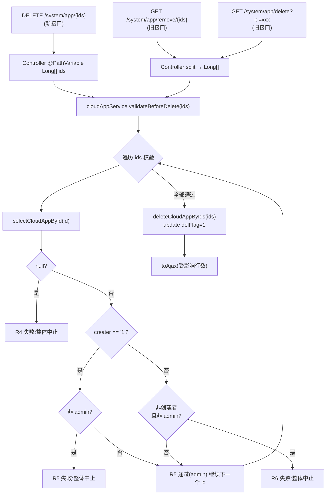

# feat: 应用管理模块删除功能

## Summary

在 [CloudAppController](ruoyi-admin/src/main/java/com/ruoyi/web/controller/system/CloudAppController.java) 新增符合 RuoYi 标准的 `@DeleteMapping("/{ids}")` 接口,对齐前端 [delApp](ruoyi-ui/src/api/system/app.js) 已有的 `DELETE /system/app/{id}` 调用,修复删除按钮 404/405 不可用问题。分期交付:第一期仅落 DELETE 接口(含注解与软删除)快速修复按钮;第二期在 Service 层抽取公共校验方法(存在性 / 默认应用仅管理员可删 / 创建者权限),并让新 DELETE 接口与旧 GET 接口共用同一套校验,以 Q1(`creater` 字段语义)确认为前置。

---

## Problem Frame

前端 [delApp](ruoyi-ui/src/api/system/app.js) 发送 `DELETE /system/app/{id}`,但后端 [CloudAppController](ruoyi-admin/src/main/java/com/ruoyi/web/controller/system/CloudAppController.java) 只提供 `GET /system/app/remove/{ids}` 和 `GET /system/app/delete?id=xxx` 两个非标准接口,路径与方法均不匹配,前端删除按钮点击后必然失败(404/405)。现有删除接口无任何前置校验,存在删除不存在的应用、误删系统默认应用(`creater="1"`)、越权删除他人应用的风险。两个 GET 删除接口本身也违反 REST 安全语义(与 project_memory 中 `deduplicate` 端点的同类教训一致),但本次为向后兼容予以保留。

详细需求与决策见 origin: [docs/brainstorms/2026-07-21-app-delete-requirements.md](docs/brainstorms/2026-07-21-app-delete-requirements.md)。

---

## Requirements

需求分两期交付。第一期修复按钮可用性;第二期补齐安全校验,以 Q1 确认为前置。

**标准 DELETE 接口(第一期)**

- R1. 在 [CloudAppController](ruoyi-admin/src/main/java/com/ruoyi/web/controller/system/CloudAppController.java) 新增 `@DeleteMapping("/{ids}")` 方法,接收 `@PathVariable Long[] ids`(Spring 自动将逗号分隔的路径变量转换为 `Long[]`)。**[Phase 1]**
- R2. 方法上加 `@PreAuthorize("@ss.hasPermi('system:app:remove')")` 与 `@Log(title = "应用", businessType = BusinessType.DELETE)` 注解,与现有删除接口保持一致。**[Phase 1]**
- R8. 校验通过后调用现有 `cloudAppService.deleteCloudAppByIds(...)` 执行软删除(`delFlag=1`),复用已有逻辑。**[Phase 1]**(第一期不做校验,直接调用)
- R9. 返回 `toAjax(受影响行数)` 作为标准响应。**[Phase 1]**

**旧 GET 接口统一校验(第二期)**

- R3. 保留现有 `GET /remove/{ids}` 与 `GET /delete` 接口路由,但其删除逻辑必须复用与 DELETE 接口相同的 Service 层公共校验方法(存在性、默认应用保护、创建者权限),三入口统一受控,关闭绕过路径。**[Phase 2]**

**删除前校验(第二期)**

- R4. **存在性校验**:对每个待删除 id,调用 `selectCloudAppById` 查询,返回 null 则说明应用不存在或已软删除,整体中止并返回错误提示(不执行任何删除)。**[Phase 2]**
- R5. **默认应用仅管理员可删**:若查询到的应用 `creater` 字段值为 `"1"`,视为系统默认应用,仅管理员(`SecurityUtils.isAdmin(SecurityUtils.getUserId())`)可删除;非管理员禁止删除,返回错误提示。R5 命中且当前用户非管理员时整体中止,不进入 R6 校验;管理员则继续(R5 通过,不抛异常)。**[Phase 2]**
- R6. **创建者权限校验**:若应用 `creater` 字段值不等于当前登录用户标识(具体比较口径依赖 Q1 结论:userId 或 username,字符串比较),且当前用户非管理员(定义为 `SecurityUtils.isAdmin(SecurityUtils.getUserId())`,即 super admin),禁止删除,返回权限错误提示。**[Phase 2,依赖 Q1]**
- R7. 任一 id 校验失败时,整体中止(不部分删除),返回首个失败原因对应的友好错误信息。**[Phase 2]**

---

## Key Technical Decisions

- **KTD1. DELETE 接口参数用 `@PathVariable Long[] ids`**:对齐 RuoYi 框架 CRUD 标准删除 pattern(参考 [SysPostController](ruoyi-admin/src/main/java/com/ruoyi/web/controller/system/SysPostController.java)、[SysMenuController](ruoyi-admin/src/main/java/com/ruoyi/web/controller/system/SysMenuController.java)、[SysUserController](ruoyi-admin/src/main/java/com/ruoyi/web/controller/system/SysUserController.java))。Spring MVC 自动将 `DELETE /system/app/1,2,3` 的逗号分隔路径变量转换为 `Long[]`,前端 [delApp](ruoyi-ui/src/api/system/app.js) 已有的 `delApp(ids)` 调用零改动。原 origin 文档 R1 描述为"接收逗号分隔的 ids 字符串路径变量",本 plan 修正为更地道的 `Long[]` 形式,避免在 Controller 内手动 `split(",")`。
- **KTD2. 管理员判断用 `SecurityUtils.isAdmin(SecurityUtils.getUserId())`**:origin 文档 R6 写的 `SecurityUtils.getUserId() == 1L` 是硬编码 user_id=1,虽然语义等价(super admin 即 user_id=1),但 [SecurityUtils](ruoyi-common/src/main/java/com/ruoyi/common/utils/SecurityUtils.java) 已提供 `isAdmin(Long userId)` 封装,优先使用框架 API 更地道、可读性更好,且与 RuoYi 其它 Service 实现保持一致。
- **KTD3. 校验逻辑抽取为 Service 层公共方法**:在 [CloudAppServiceImpl](ruoyi-system/src/main/java/com/ruoyi/system/service/impl/CloudAppServiceImpl.java) 中新增 `validateBeforeDelete(Long[] ids)`,内部完成 R4-R7 全部校验。三个入口(新 DELETE 接口、旧 `GET /remove/{ids}`、旧 `GET /delete`)统一调用此方法,确保安全姿态一致,关闭绕过路径。参考 [SysMenuController](ruoyi-admin/src/main/java/com/ruoyi/web/controller/system/SysMenuController.java) 的 `hasChildByMenuId` 删除前校验 pattern,但更彻底——校验逻辑下沉到 Service 层而非 Controller 层,便于复用与单测。
- **KTD4. 分期交付,第一期不动旧接口**:用户已确认第一期完全不动旧 GET 接口(不接公共校验),尽快修复删除按钮 404/405 问题。第二期再统一三入口校验。这避免了"第一期就引入 Service 层公共方法但只用在一个入口"的不对称状态,也避免了在 Q1 未确认时让 R6 误上线。
- **KTD5. `validateBeforeDelete` 用 `Long[]` 入参而非 `String[]`**:与新 DELETE 接口的 `@PathVariable Long[] ids` 对齐,旧 GET 接口在 Controller 内做 `String[] → Long[]` 转换后调用。统一类型避免 Service 层重复解析字符串,也降低字符串比较出错风险。

---

## High-Level Technical Design

新 DELETE 接口与三入口统一校验的数据流(第二期完成后):

第一期仅实现 A1 → B → (跳过 D) → N → O 这条路径,不做校验。

---

## Implementation Units

### U1. 新增 DELETE 接口(第一期)

- **Goal**:在 [CloudAppController](ruoyi-admin/src/main/java/com/ruoyi/web/controller/system/CloudAppController.java) 新增 `@DeleteMapping("/{ids}")`,对齐前端 [delApp](ruoyi-ui/src/api/system/app.js),修复删除按钮 404/405。
- **Requirements**: R1, R2, R8, R9(Phase 1 部分)。
- **Dependencies**: 无。不依赖 Q1。
- **Files**:
  - [ruoyi-admin/src/main/java/com/ruoyi/web/controller/system/CloudAppController.java](ruoyi-admin/src/main/java/com/ruoyi/web/controller/system/CloudAppController.java)(新增方法)
- **Approach**:
  - 在 `CloudAppController` 中新增 `remove(@PathVariable Long[] ids)` 方法,签名与 [SysPostController.remove](ruoyi-admin/src/main/java/com/ruoyi/web/controller/system/SysPostController.java) 一致。
  - 第一期直接调用 `cloudAppService.deleteCloudAppByIds(...)`——但需注意现有 Service 接口签名是 `deleteCloudAppByIds(String[] ids)`,不能直接传 `Long[]`。
  - **两种适配方案,实现时任选其一**:
    - 方案 A(推荐,改动小):Controller 内 `Arrays.stream(ids).map(String::valueOf).toArray(String[]::new)` 转换后调用现有 `deleteCloudAppByIds(String[])`。
    - 方案 B(更地道,但改动稍大):在 [ICloudAppService](ruoyi-system/src/main/java/com/ruoyi/system/service/ICloudAppService.java) 与 [CloudAppServiceImpl](ruoyi-system/src/main/java/com/ruoyi/system/service/impl/CloudAppServiceImpl.java) 中新增重载 `deleteCloudAppByIds(Long[] ids)`,内部委托给现有 String[] 版本或直接走 Mapper。
  - 第一期不做任何校验,直接软删除。
- **Patterns to follow**:
  - [SysPostController.remove](ruoyi-admin/src/main/java/com/ruoyi/web/controller/system/SysPostController.java):`@DeleteMapping("/{ids}")` + `@PathVariable Long[] ids` + `@PreAuthorize` + `@Log` 的标准 pattern。
  - [SysMenuController.remove](ruoyi-admin/src/main/java/com/ruoyi/web/controller/system/SysMenuController.java):删除前校验 pattern(第二期参考)。
- **Test scenarios**:
  - T1.1 启动后端,前端点击应用列表"删除"按钮,二次确认后,应用从列表消失,数据库 `cloud_app.delFlag=1`。
  - T1.2 前端勾选多条应用,点击批量删除,所有选中应用 `delFlag=1`。
  - T1.3 用 curl/Postman 发 `DELETE /system/app/1`,返回 200 + `{"code":200,"msg":"操作成功"}`。
  - T1.4 用 curl/Postman 发 `DELETE /system/app/1,2,3`(逗号分隔批量),三条记录均 `delFlag=1`。
  - T1.5 未登录或无 `system:app:remove` 权限的用户调用 `DELETE /system/app/1`,返回 401/403。
- **Verification**: R1-R2-R8-R9(Phase 1 部分)的需求逐条对应 T1.x 测试场景通过;前端 [handleDelete](ruoyi-ui/src/views/system/app/index.vue) 调用链路端到端可用;旧 `GET /remove/{ids}` 与 `GET /delete` 行为保持不变(本期不动)。

---

### U2. 验证 `creater` 字段语义(第二期前置研究任务)

- **Goal**:确认 [CloudApp](ruoyi-system/src/main/java/com/ruoyi/system/domain/CloudApp.java) 的 `creater` 字段实际存储的是用户 ID 还是用户名,为 R6 创建者权限校验确定比较口径。
- **Requirements**: 解除 Q1 阻塞,使 R6 具备上线条件。
- **Dependencies**: 无(可独立进行)。
- **Files**:
  - [ruoyi-system/src/main/java/com/ruoyi/system/domain/CloudApp.java](ruoyi-system/src/main/java/com/ruoyi/system/domain/CloudApp.java)(仅查阅)
  - [ruoyi-system/src/main/resources/mapper/system/CloudAppMapper.xml](ruoyi-system/src/main/resources/mapper/system/CloudAppMapper.xml)(仅查阅)
  - [ruoyi-ui/src/views/system/app/index.vue](ruoyi-ui/src/views/system/app/index.vue)(仅查阅前端表单提交 payload)
  - 数据库 `cloud_app` 表实际数据(抽样查询)
- **Approach**:
  - 查阅 [CloudAppServiceImpl](ruoyi-system/src/main/java/com/ruoyi/system/service/impl/CloudAppServiceImpl.java) 第 48 行附近 `defaultCloudApp.setCreater("1")` 的上下文,判断 "1" 是 user_id=1 的简化还是 username="1" 的字面量。
  - 查阅前端新增应用表单提交时 `creater` 字段的填充来源——是用户手输(当前 [index.vue](ruoyi-ui/src/views/system/app/index.vue) 的现状)还是从 store 取登录用户 ID/username。
  - 查数据库:`SELECT id, app_name, creater FROM cloud_app LIMIT 10`,看 `creater` 字段实际值的形态(纯数字 → 倾向 userId;含字母 → 倾向 username)。
  - 结论写入 commit message 或 PR description,Q1 关闭。
- **Patterns to follow**: 无(研究任务)。
- **Test scenarios**: 无(非代码改动)。
- **Verification**: 在 U3 实现前明确写出结论:`creater` 字段与 `SecurityUtils.getUserId()` 比较,还是与 `SecurityUtils.getUsername()` 比较。

---

### U3. Service 层公共校验方法 + 新 DELETE 接口接入(第二期)

- **Goal**:在 [CloudAppServiceImpl](ruoyi-system/src/main/java/com/ruoyi/system/service/impl/CloudAppServiceImpl.java) 中新增 `validateBeforeDelete(Long[] ids)`,完成 R4-R7 全部校验;并让 U1 的 DELETE 接口在调用 `deleteCloudAppByIds` 之前先调用此方法。
- **Requirements**: R4, R5, R6, R7, R8(Phase 2 部分)。
- **Dependencies**: U2 完成且 Q1 已关闭(决定 R6 比较口径)。
- **Files**:
  - [ruoyi-system/src/main/java/com/ruoyi/system/service/ICloudAppService.java](ruoyi-system/src/main/java/com/ruoyi/system/service/ICloudAppService.java)(新增接口方法 `validateBeforeDelete(Long[] ids)`)
  - [ruoyi-system/src/main/java/com/ruoyi/system/service/impl/CloudAppServiceImpl.java](ruoyi-system/src/main/java/com/ruoyi/system/service/impl/CloudAppServiceImpl.java)(新增实现)
  - [ruoyi-admin/src/main/java/com/ruoyi/web/controller/system/CloudAppController.java](ruoyi-admin/src/main/java/com/ruoyi/web/controller/system/CloudAppController.java)(U1 的 DELETE 接口方法体加 `validateBeforeDelete` 调用)
  - [ruoyi-system/src/test/java/com/ruoyi/system/service/impl/CloudAppServiceImplTest.java](ruoyi-system/src/test/java/com/ruoyi/system/service/impl/CloudAppServiceImplTest.java)(新建,参考 [NoteNoteServiceImplTest](ruoyi-system/src/test/java/com/ruoyi/system/service/impl/NoteNoteServiceImplTest.java) pattern)
- **Approach**:
  - `validateBeforeDelete(Long[] ids)` 方法签名返回 `void`,校验失败抛 `ServiceException("友好错误信息")`(RuoYi 标准 业务异常类,Controller 层有全局异常处理转 AjaxResult.error)。
  - 内部逻辑(对应 R4-R7):
    1. 遍历 `ids`,对每个 id 调用 `selectCloudAppById(id)`。
    2. 返回 null → 抛 `ServiceException("应用不存在或已删除")`(R4)。
    3. `"1".equals(app.getCreater()) && !SecurityUtils.isAdmin(SecurityUtils.getUserId())` → 抛 `ServiceException("系统默认应用仅管理员可删除")`(R5)。管理员则不抛异常,继续下一个 id(R5 通过,跳过 R6)。
    4. `"1".equals(app.getCreater())` 为 false 时进入 R6 校验,比较口径依 U2 结论:
       - 若 Q1 结论为 userId:`!String.valueOf(SecurityUtils.getUserId()).equals(app.getCreater()) && !SecurityUtils.isAdmin(SecurityUtils.getUserId())` → 抛 `ServiceException("没有权限删除该应用")`(R6)。注意比较左侧用 `String.valueOf(...)` 避免 `creater=null` 时 NPE。
       - 若 Q1 结论为 username:`!SecurityUtils.getUsername().equals(app.getCreater()) && !SecurityUtils.isAdmin(SecurityUtils.getUserId())` → 抛 `ServiceException("没有权限删除该应用")`(R6)。
    5. 任一 id 校验失败抛异常即整体中止(R7,由异常机制天然保证)。
  - **R5 与 R6 的关系**:R5 不再是"绝对规则优先于 R6",而是 R6 的特例——默认应用(`creater="1"`)要求 admin 才能删,普通应用要求是创建者本人或 admin。逻辑上 R5 通过(是 admin)后无需再走 R6,因为 admin 在 R6 中本就是旁路。
  - DELETE 接口方法体改为:`cloudAppService.validateBeforeDelete(ids); return toAjax(cloudAppService.deleteCloudAppByIds(...));`。
  - 单元测试参考 [NoteNoteServiceImplTest](ruoyi-system/src/test/java/com/ruoyi/system/service/impl/NoteNoteServiceImplTest.java) 的 JUnit + Mockito pattern,mock `selectCloudAppById` 返回各种场景验证校验逻辑。
- **Patterns to follow**:
  - [SecurityUtils](ruoyi-common/src/main/java/com/ruoyi/common/utils/SecurityUtils.java):`getUserId()` / `getUsername()` / `isAdmin(Long userId)` 方法签名参考。
  - [SysMenuController.remove](ruoyi-admin/src/main/java/com/ruoyi/web/controller/system/SysMenuController.java):删除前校验返回 `AjaxResult.error` pattern(本 plan 选择抛 `ServiceException` 由全局异常处理转换,避免 Controller 层重复 if/else)。
  - RuoYi `ServiceException` 用法(项目内大量使用,如 [CloudAppServiceImpl](ruoyi-system/src/main/java/com/ruoyi/system/service/impl/CloudAppServiceImpl.java) 已 import)。
- **Test scenarios**:
  - T3.1 删除不存在的 id → 抛 `ServiceException("应用不存在或已删除")`,数据库无变更。
  - T3.2 删除已软删除的 id(`selectCloudAppById` 返回 null)→ 同 T3.1。
  - T3.3 非 admin 用户删除 `creater="1"` 的默认应用 → 抛 `ServiceException("系统默认应用仅管理员可删除")`,数据库无变更(R5)。
  - T3.4 非创建者且非 admin 用户删除他人应用(creater≠"1")→ 抛 `ServiceException("没有权限删除该应用")`,数据库无变更(R6)。
  - T3.5 创建者本人删除自己的应用(creater≠"1")→ 校验通过,`delFlag=1`。
  - T3.6 admin 用户删除非默认应用(creater≠"1")→ 校验通过(R6 旁路),`delFlag=1`。
  - T3.7 admin 用户删除默认应用(creater="1")→ 校验通过(R5 admin 旁路),`delFlag=1`。**[新增,验证 R5 调整]**
  - T3.8 `creater=null` 的应用:非 admin → R6 失败(无权限);admin → 通过。验证 null-safe 比较不抛 NPE。
  - T3.9 批量删除 `[存在id, 不存在id]` → 整体中止,存在的 id 也不删除(R7 原子性)。
  - T3.10 非 admin 批量删除 `[普通应用id, 默认应用id]` → 整体中止,普通应用也不删除(R5 + R7)。
  - T3.11 admin 批量删除 `[普通应用id, 默认应用id]` → 全部通过,两个应用均 `delFlag=1`(admin 双旁路)。
  - T3.12 非 admin 批量删除 `[自己应用id, 他人应用id]` → 整体中止,自己的应用也不删除(R6 + R7)。
  - T3.13 单元测试覆盖 T3.1-T3.12 全部场景(mock `selectCloudAppById` 与 `SecurityUtils` 静态方法)。
- **Verification**: R4-R8 需求逐条对应 T3.x 通过;`SecurityUtils.isAdmin(SecurityUtils.getUserId())` 的调用符合 KTD2;`validateBeforeDelete` 三入口共用(本单元仅 DELETE 接口接入,旧 GET 接口在 U4 接入)。

---

### U4. 旧 GET 接口接入公共校验(第二期)

- **Goal**:让 [CloudAppController](ruoyi-admin/src/main/java/com/ruoyi/web/controller/system/CloudAppController.java) 现有的 `GET /remove/{ids}` 与 `GET /delete` 在执行删除前调用 `validateBeforeDelete`,关闭绕过路径,实现 R3 三入口统一受控。
- **Requirements**: R3。
- **Dependencies**: U3 完成(`validateBeforeDelete` 已可用)。
- **Files**:
  - [ruoyi-admin/src/main/java/com/ruoyi/web/controller/system/CloudAppController.java](ruoyi-admin/src/main/java/com/ruoyi/web/controller/system/CloudAppController.java)(修改两个旧方法体)
- **Approach**:
  - 现有 `GET /remove/{ids}` 签名是 `remove(@PathVariable("ids") String ids)`,内部 `ids.split(",")` 得到 `String[]`。改造:将 `String[]` 转为 `Long[]`(`Arrays.stream(arr).map(Long::valueOf).toArray(Long[]::new)`),调用 `validateBeforeDelete(Long[])`,再调用现有 `deleteCloudAppByIds(String[])`。
  - 现有 `GET /delete?id=xxx` 签名是 `delete(Long id)`。改造:包装为 `Long[]{id}` 调用 `validateBeforeDelete`,再调用现有删除逻辑。
  - 转换失败(`NumberFormatException`)由全局异常处理捕获,返回 400。
  - 不修改旧接口的路由路径与 HTTP 方法,仅修改方法体,保持向后兼容。
- **Patterns to follow**:
  - U3 中 `validateBeforeDelete` 的调用方式(本单元与 U3 中 DELETE 接口调用方式完全一致)。
- **Test scenarios**:
  - T4.1 调用 `GET /system/app/remove/1,2,3`,对每个 id 执行校验,全部通过则批量软删除;任一失败则整体中止,返回友好错误信息。
  - T4.2 调用 `GET /system/app/remove/不存在的id` → 返回 `{"code":500,"msg":"应用不存在或已删除"}`(或 RuoYi 标准错误码),数据库无变更。
  - T4.3 非 admin 用户调用 `GET /system/app/delete?id=1` 其中 id=1 是默认应用 → 返回"系统默认应用仅管理员可删除"错误,数据库无变更;admin 用户调用同接口 → 删除成功。
  - T4.4 调用 `GET /system/app/remove/abc`(非数字)→ 返回 400 或类型转换错误提示,数据库无变更。
  - T4.5 旧接口的 `@PreAuthorize` 与 `@Log` 注解保持不变(注解层面行为不变,仅方法体增加校验调用)。
- **Verification**: R3 需求对应 T4.1-T4.5 通过;新 DELETE 接口与旧 GET 接口对同一 id 的删除行为一致(校验规则相同);旧接口路由路径与 HTTP 方法未变(向后兼容)。

---

## Scope Boundaries

**Deferred for later**

- 前端 `creater` 字段自动填充:当前 [index.vue](ruoyi-ui/src/views/system/app/index.vue) 表单让用户手动输入"创建者",应改为提交时自动取当前登录用户 ID。本次不动前端。
- 现有 `GET /remove/{ids}` 与 `GET /delete` 接口路由的废弃与移除:第二期 U4 仅统一校验,不废弃路由,待调用方迁移后再清理。
- 删除接口的物理删除选项:本次仅软删除。
- 前端 `creater` 字段在表单中不可见的优化(隐藏字段):本次不动前端。

**Outside this product's identity**

- 应用与笔记/多维表格的关联校验:经全量搜索,`cloud_app` 表当前无任何业务模块通过外键或服务调用关联(`ICloudAppService` 仅在自身 CRUD 链路中被引用),无需级联校验。
- 删除审计日志(记录"谁在何时删除了哪个应用")。
- 应用图标的文件清理(logo 字段存的 URL,删除应用时是否清理上传文件)。

---

## Risks & Dependencies

- **Q1 未确认阻塞第二期**:`creater` 字段语义(userId vs username)是 R6 上线的前置条件。U2 必须先完成,U3 中的 R6 实现才能落地。在 Q1 未确认前,第二期只能交付 R4(存在性)+ R5(默认应用保护),R6 不得上线。
- **第一期旧接口仍无校验**:U1 完成后,新 DELETE 接口与旧 GET 接口均无校验,删除任意 id 都会成功(包括默认应用、他人应用)。这是用户已确认的取舍——优先修复按钮可用性,安全加固放到第二期。**风险**:在第一期上线后、第二期未完成前的时间窗口内,任何能调用旧 GET 接口的调用方(浏览器/爬虫/未鉴权脚本)都能无校验删除应用。缓解:第一期上线后尽快推进第二期。
- **旧 GET 接口违反 REST 安全语义**:`GET /remove` 与 `GET /delete` 是状态变更操作挂在 GET 方法上,可能被浏览器预取、爬虫触发、CSRF 利用。本次保留是向后兼容妥协,project_memory 中 `deduplicate` 端点的同类教训已记录。缓解:第二期 U4 至少补齐校验,后续单独清理废弃路由。
- **`creater="1"` 的语义假设**:R5 默认应用保护依赖 `creater` 字段值为字符串 `"1"` 标识系统默认应用。这是基于 [CloudAppServiceImpl](ruoyi-system/src/main/java/com/ruoyi/system/service/impl/CloudAppServiceImpl.java) 第 48 行 `defaultCloudApp.setCreater("1")` 的代码推断,假设所有系统默认应用都通过此路径创建。**风险**:若历史数据中存在其它 `creater` 值的默认应用(如手输 "admin" 创建的默认应用),R5 无法保护(普通用户可绕过 admin-only 限制删掉这类"未识别的"默认应用)。缓解:U2 阶段顺带抽样确认 `SELECT DISTINCT creater FROM cloud_app` 是否只有 "1" 这一种默认应用标识。
- **`selectCloudAppList` 当前只返回 `creater="1"` 应用**:[CloudAppServiceImpl](ruoyi-system/src/main/java/com/ruoyi/system/service/impl/CloudAppServiceImpl.java) 第 51 行 `unionList.addAll(cloudAppMapper.selectCloudAppList(cloudApp))` 被注释掉,前端列表仅显示默认应用。**R5 调整为 admin 可删后影响**:admin 仍能从 UI 删除可见应用(删除按钮对 admin 可用),但非 admin 用户在 Phase 2 上线后将无法删除任何 UI 可见应用——这符合预期(普通用户本就不应删默认应用)。若未来需要让普通用户看到并删除自己创建的应用,需先解除第 51 行注释并配合前端 `creater` 字段自动填充(见 Deferred)。
- **`Long[]` 与 `String[]` 类型转换**:KTD5 选择 Service 层统一用 `Long[]`,旧 GET 接口在 Controller 内做 `String[] → Long[]` 转换。**风险**:历史脏数据若包含非数字 id(理论上主键不会,但防御性考虑),转换会抛 `NumberFormatException`。缓解:全局异常处理已能捕获并返回 400,无需额外代码。
- **批量删除原子性依赖单事务**:`deleteCloudAppByIds` 内部是单条 `update ... where id in (...)`,本身原子。但若未来改为逐条 update,需补 `@Transactional`。当前不需要。

---

## Open Questions

- Q1. `creater` 字段实际存储的是用户 ID 还是用户名?这决定 R6 创建者权限校验时与 `SecurityUtils.getUserId()` 比较还是与 `SecurityUtils.getUsername()` 比较。**[阻塞 U3 的 R6 实现,U2 解决]**
