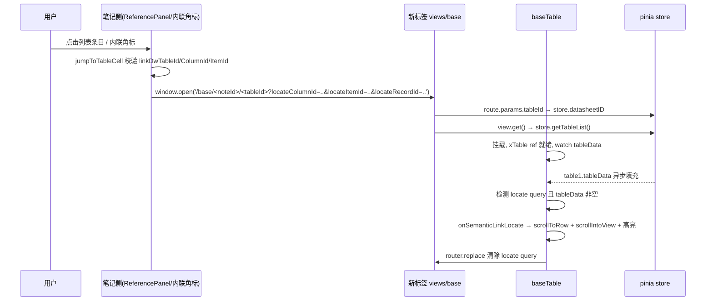

# feat: 被引用图标点击跳转多维表格并定位行

## Summary

把笔记侧"被引用"的两个点击入口（右上角被引用图标列表条目 + 笔记内联角标）从"只发 Bus 事件 + 提示请切换"升级为"新标签页打开目标多维表格视图，加载完成后自动滚动并高亮目标行/单元格"。列表形态、角标计数、正反向合并展示不动；复用现有 `onSemanticLinkLocate` 定位逻辑。

## Problem Frame

笔记界面右上角的"被引用"图标和笔记内联角标都依赖同一套 `semantic-link-locate` Bus 事件触发跳转：点击只 `Bus.emit` 一个事件并提示"已发起跳转请求,请切到对应表格视图查看"。监听者在 `baseTable/index.vue` 的 `onSemanticLinkLocate`，它在 `linkDwTableId` 不等于当前 `datasheetID` 时只 warning return，不导航——而用户在笔记视图点击时目标表格几乎总是未打开，所以跳转实际从不发生，定位也丢失。两个入口 gap 完全相同，本期一并修复。

---

## Requirements

**跳转入口**

- R1. 点击 `ReferencePanel` 列表条目，在新标签页打开目标多维表格视图（携带 tableId 与定位参数），不再依赖目标表格是否已在当前标签打开。
- R2. 点击笔记内联角标（`semantic-ref-badge`）行为与 R1 一致，走同一导航路径。

**定位与一次性消费**

- R3. 目标表格视图加载、表格数据就绪后，自动滚动到目标行/单元格并高亮，复用现有 `onSemanticLinkLocate` 的 `scrollToRow`/`scrollIntoView`/高亮 class。
- R4. 定位参数一次性消费——定位完成后从 URL 清除，刷新该标签不重复定位。

**降级**

- R5. 定位失败（目标行已删除、定位参数缺失、表格不可达）时降级为提示，不报错中断，沿用现有 warning 文案。

---

## Key Technical Decisions

- **新标签页 `window.open` 导航**：与 `toNote`（`baseTable/index.vue` 现有 `window.open('/docx/...')`）先例一致；笔记与列表保持打开，可连续点击多条。代价是连点多条开多个标签，可接受。
- **跨标签页定位走 URL query 参数**：Bus 事件不跨浏览器标签。定位目标（`linkColumnId`/`linkItemId`/`linkRecordId`）经 URL query 携带，`baseTable` 挂载后消费。无状态、可分享、不依赖 sessionStorage。
- **复用 `onSemanticLinkLocate`，不重写定位逻辑**：现有 `scrollToRow`+`scrollToColumn`+`getCellNode`+`scrollIntoView`+高亮 class 链路完整可用，仅改其触发来源（从 Bus 事件改为挂载后读 URL 参数）。
- **共享 `jumpToTableCell` helper**：两处入口（`ReferencePanel.onLocate` 与 `editorjs` 内联角标 click）共用一个 helper，负责字段校验 + URL 构造 + `window.open`，避免两处行为漂移。
- **一次性消费用 `router.replace` 清除 query**：定位成功后用 `router.replace` 去除 `locate*` 查询键，URL 干净且刷新不重定位。
- **URL `:id` 槽位用当前 noteId**：`/base/:id?/:tableId?` 中 `:id`（noteId）用于侧边栏表格列表 scope，`:tableId` 才决定打开哪张表。用当前笔记 noteId 填 `:id`；若目标表属于其他笔记，侧边栏可能不含目标表，但 `:tableId` 仍正确打开目标表——此边缘情况可接受（用户要的是表+行，不是侧边栏）。
- **`:tableId` 槽位副作用（待决策）**：`views/base/index.vue` 的 `view.get`（约 L297-299）在 `route.params.tableId` 存在时无条件覆盖传入的 id，因此新标签页里后续每次 `view.get` 调用（侧边栏 `datasheet.select`、`view.add`）都被钉死在目标表上——用户定位完目标行后想在该标签内切到同笔记下其他表，点击侧边栏会静默失效（`store.datasheetID` 更新了但 `view.get` 仍取路径里的 tableId）。此副作用每次跨标签跳转都会出现（非仅跨笔记），`router.replace` 只清 query 不清 path param，钉死状态伴随标签生命周期。**待决策**：接受（标签用完即关）还是在定位完成后 `router.replace` 到 `/base/<noteId>`（去掉 tableId）解钉——后者需评估重新触发 `datasheet.get()`/`view.get()` 的副作用。

---

## High-Level Technical Design

跨标签页跳转 + 异步定位的时序，prose 难以承载，用序列图说明 handoff：

---

## Implementation Units

### U1. 共享 jumpToTableCell helper + 迁移两个笔记侧调用点

- **Goal:** 提供统一的"跳转到表格单元格"导航入口，替换 `ReferencePanel` 与 `editorjs` 内联角标两处现有的 `Bus.emit` + `message.info` 行为。
- **Requirements:** R1, R2
- **Dependencies:** 无；定义 URL 参数契约供 U2 消费。
- **Files:**
  - 新增 `notepad/src/utils/jumpToTableCell.ts`（从 `@/utils` 入口导出）
  - 修改 `notepad/src/components/noteLink/ReferencePanel.vue`（`onLocate`，约 L160-175）
  - 修改 `notepad/src/components/editorjs/index.vue`（内联角标 `badge.onclick`，约 L209-224）
- **Approach:** helper 接收 `{ noteId, linkDwTableId, linkColumnId, linkItemId, linkRecordId }`，校验 `linkDwTableId`/`linkColumnId`/`linkItemId` 必填，缺失则 `message.warning('该引用缺少单元格定位信息')` 并返回；构造 URL `/base/${noteId}/${linkDwTableId}?locateColumnId=${linkColumnId}&locateItemId=${linkItemId}&locateRecordId=${linkRecordId}`，调用 `window.open(url, '_blank')`；检查返回值，为 `null`（被浏览器拦截）时 `message.warning('新标签页被浏览器拦截，请允许弹窗后重试')` 并返回。两处调用点把原 `Bus.emit('semantic-link-locate', ...)` + `message.info('已发起跳转请求…')` 替换为 `jumpToTableCell(payload)`。`ReferencePanel` 的 `noteId` 取 `props.noteId`；`editorjs` 内联角标的 `noteId` 取 `props.id`，`payload` 来自 `store.getReferences(props.id)` 中对应 `ref`。
- **Patterns to follow:** `toNote`（`baseTable/index.vue` 约 L1101-1109）的 `window.open` 范式；`ReferencePanel.onLocate` 现有字段校验文案。
- **Test scenarios:**（无前端测试框架，手动验证）
  - Happy：点 `ReferencePanel` 条目 → 新标签打开 `/base/<noteId>/<tableId>?locate...`，表格加载后定位高亮。
  - Happy：点笔记内联角标 → 同上。
  - Edge：条目缺 `linkItemId` → warning"该引用缺少单元格定位信息"，不开新标签。
  - Edge：连点 3 条 → 开 3 个标签，笔记与列表保持打开。
- **Verification:** 在笔记中分别创建正向（笔记→表）与反向（表→笔记）语义关联，打开被引用面板点击条目、点击内联角标，均在新标签打开目标表并定位高亮。

### U2. baseTable 消费 URL 定位参数 + 就绪后定位 + 一次性清理

- **Goal:** 目标表格视图在新标签打开后，按 URL 定位参数自动滚动+高亮目标行/单元格，定位后清除参数。
- **Requirements:** R3, R4, R5
- **Dependencies:** U1（URL 参数契约）。
- **Files:** 修改 `notepad/src/components/baseTable/index.vue`
- **Approach:**
  - 引入 `useRoute`，读取 `route.query` 的 `locateColumnId`/`locateItemId`/`locateRecordId`；`linkDwTableId` 取自 `route.params.tableId`（即 `datasheetID`），**不从 query 读取**（U1 不产生 `locateDwTableId`），使"`tableId` 由 URL 决定、必然匹配 `datasheetID`"推理成立。
  - 在现有 `watch(() => table1.value.tableData, ..., { immediate: true })`（约 L1085-1087）基础上追加一次性定位触发：当 locate 参数存在、`tableData` **非空**、`xTable` ref 就绪时，先 `message.loading('正在定位目标行…')`，调用 `onSemanticLinkLocate({ linkDwTableId, linkColumnId, linkItemId, linkRecordId })`。**不再前置"含目标行"校验**——否则目标行已删除时 `onSemanticLinkLocate` 不被调用、R5 降级 warning 不可达且 locate query 永不清理；由 `onSemanticLinkLocate` 现有 missing-row 分支（约 L660-663）负责发 warning。调用后无论成功/失败一律 `router.replace({ query: 去除 locate* 键 })` 清理并关闭 loading。
  - 时序对齐 vxe-table 滚动就绪：沿用现有 `nextTick` + `setTimeout(200)` 范式（约 L678-698）。
  - 移除 `Bus.on` 中 `semantic-link-locate` 分支（约 L1072-1075）——两处 emit 端已迁移到 `window.open`，该分支成为死代码；保留 `semantic-link-updated` 分支。
  - `onSemanticLinkLocate` 的 `linkDwTableId !== datasheetID` warning 分支（约 L645-648）保留，对任何同标签残留调用安全；新标签路径下 `tableId` 由 URL 决定、必然匹配 `datasheetID`，不会触发。
- **Patterns to follow:** `onSemanticLinkLocate`（约 L637-704）的 `scrollToRow`/`getCellNode`/高亮 class 链路；现有 `watch(tableData, …, { immediate })` 模式；`views/base/index.vue` 的 `useRoute` 范式。
- **Test scenarios:**（手动验证）
  - Happy：新标签打开带 locate 参数 → 表格加载后滚动到目标行 + 高亮 2 秒。
  - Edge：目标行已删除 → warning"未找到目标单元格所在行"，不中断。
  - Edge：locate 参数缺失/不完整 → 不触发定位，正常打开表格。
  - Edge：定位后刷新该标签 → locate 参数已清除，不重复定位。
  - Integration：U1 `window.open` → U2 消费参数 → `onSemanticLinkLocate` 完整链路贯通。
- **Verification:** 从 U1 两个入口点击 → 新标签表格自动定位高亮；定位后 URL 不含 locate 参数；刷新不重定位；目标行不存在时降级提示。

---

## Scope Boundaries

**Outside this scope**

- 不改 `ReferencePanel` 列表形态、角标计数、正反向合并展示（`byNote` 现有混合行为保持）。
- 不改 `byNote` 后端查询与 `NoteNotelink` 数据模型（无方向字段、不区分方向）。
- 不改 table→note 的 R8 内联锚点跳转与 `toNote`。
- 不新增后端 API，不改 `/base` 路由结构。

### Deferred to Follow-Up Work

- 内联角标计数展示现为硬编码 `'1'`（`editorjs/index.vue` 约 L207 注释"未来可计数"），计数能力不在本期。
- 定位高亮视觉样式迭代。
- 目标表属于其他笔记时，侧边栏自动切换到目标表所属 scope。

---

## Risks & Assumptions

- **时序风险**：`tableData` 异步填充 + vxe-table 滚动就绪时序需在实现时按实际行为调参（`nextTick` + 延迟毫秒），可能需要重试兜底（参考 `initSortable` 的 `retryCount` 范式）。
- **query 清理冲突**：`router.replace` 清除 `locate*` 键时需保留其他 query（如 `code` 嵌入模式），实现时确认只删 `locate*` 键。
- **假设：notepad 前端无测试框架**（`package.json` 无 test 脚本、无 `*.spec/test` 文件）→ test scenarios 以手动验证为准；若后续引入 vitest，`jumpToTableCell` 可补纯函数单测。
- **假设：`window.open` 根路径可靠**——router 用 `createWebHistory()` 无 base，且 `toNote` 已用 `window.open('/docx/...')` 在生产工作。

---

## Open Questions

**Deferred to implementation**

- `watch` 内追加定位触发的具体时序（`nextTick` + 延迟毫秒、是否需重试）按 vxe-table 实际滚动就绪情况调参。
- `router.replace` 清理参数与 `views/base` 其他 query（`code` 嵌入模式）的共存——实现时确认只删 `locate*` 键、不动其他键。

---

## Sources / Research

- `notepad/src/components/noteLink/ReferencePanel.vue` — L4-16 图标+角标、L18-82 浮层列表、L111 `byNote` 数据源、L160-175 `onLocate`（只 Bus.emit 不导航）。
- `notepad/src/components/editorjs/index.vue` — L7/L49 `ReferencePanel` 挂载、L139-163 引用缓存、L169-224 内联角标渲染与 `badge.onclick` 的 `semantic-link-locate` emit。
- `notepad/src/components/baseTable/index.vue` — L9/L228 `xTable` ref、L637-704 `onSemanticLinkLocate`（可复用定位逻辑，L645-648 未打开表格 warning）、L986-1081 `onMounted`+`Bus.on`、L1085-1087 `watch(tableData)`、L1101-1109 `toNote` 的 `window.open` 先例。
- `notepad/src/views/base/index.vue` — L104/L130 `useRoute`、L235-255 `datasheet.get`（`:id`=noteId）、L295-318 `view.get`（`:tableId` 覆盖 + `store.datasheetID`/`getTableList`）、L413-424 `onBeforeMount`。
- `notepad/src/router/index.js` — L143-150 `/base/:id?/:tableId?`、L254-256 `createWebHistory()` 无 base。
- `ruoyi-system/src/main/java/com/ruoyi/system/domain/NoteNotelink.java` 与 `selectNoteNotelinkByNoteId` — 无方向字段、查询仅 `where noteId=#{noteId}`，支撑正反向合并。
- `docs/brainstorms/2026-07-15-semantic-link-reverse-requirements.md`、`docs/brainstorms/2026-07-17-cross-table-semantic-link-requirements.md` — U1-U6 反向追溯与 R8 内联锚点跳转上下文。
- `docs/solutions/` — 4 份沉淀均在 lookup-column/dedupe/set-operation 主题，无跨视图跳转/参数化定位相关文档。
