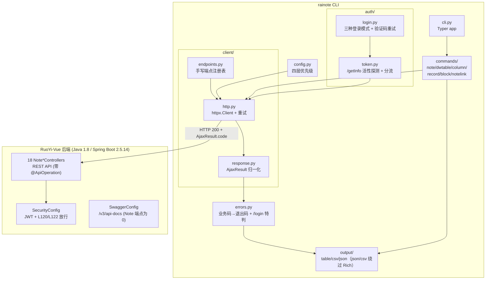
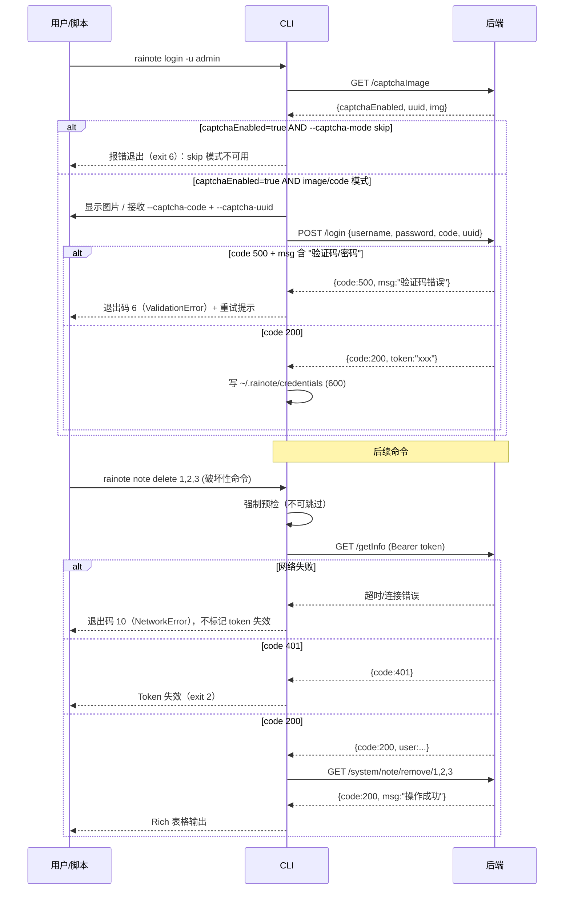

# 雨滴笔记 CLI 工具 rainote Phase 1 实现

## Summary

为雨滴笔记模块构建 `rainote` CLI 工具（Python 3.10+ / Typer / httpx / Rich），复用后端 18 个 Note*Controller 的 REST 接口，不改后端。后端基线为 Java 1.8 / Spring Boot 2.5.14 / Maven 多模块（非 Java 17，见 `pom.xml:19,44`）。Phase 1 覆盖笔记、多维表（dwtable/column/record/block）、语义关联（notelink）三类核心业务的命令行入口，支持三种认证模式、JSON/CSV/table 输出与语义化退出码。计划纳入 ce-doc-review 审查的 14 项已修复问题、5 个 sub-agent 深度强化 findings（spec-flow-analyzer、repo-research-analyst、architecture-strategist、security-sentinel、framework-docs-researcher）作为实现约束。

---

## Problem Frame

雨滴笔记模块目前仅能通过 Web 前端（Vue2 `ruoyi-ui/` + Vue3 `notepad/`）访问，后端 18 个 Controller、145+ 个 REST 接口完整可用但缺少命令行入口。运维与自动化场景（批量数据操作、CI/CD 集成、定时任务、快速诊断）无法便捷复用这些接口。

后端已有 `ruoyi-quartz` 模块覆盖服务端定时任务调度（SysJobController + Quartz），CLI 定位收窄为"外部触发 / CI 集成 / 批量运维"，不与 ruoyi-quartz 竞争。

ce-doc-review 审查（7 reviewer、38 findings）与 Phase 5.3 深度强化（5 sub-agents）识别了多项实现阻断问题：

- 后端 JWT 不含 `exp` claim（`TokenService.createToken` L172-178），过期由 Redis TTL（`expireTime=3000` 即 3000 分钟 / 50 小时，`application.yml:108`）管理 → CLI 无法离线判断有效期
- 后端恒返回 HTTP 200（`ServletUtils.renderString`），错误码在 JSON body 的 `AjaxResult.code` 中
- `SecurityConfig.java:120,122` 放行规则比预期更广：L120 `antMatchers("/system").permitAll()` 全方法放行（精确路径），L122 GET `/system/note/**` 匿名放行
- 18 个 Note*Controller 全部零 `@ApiOperation` 注解 + `SwaggerConfig.java:59` `withMethodAnnotation(ApiOperation.class)` 过滤器 → `/v3/api-docs` 不含 Note 端点 → OpenAPI codegen 评估在编码前即可判死
- NoteNoteController 多个 GET 端点（`recoverNote`/`collectionNote`/`cancelCollection`/`setTemplate`/`removeTemplate`）`@PreAuthorize` 缺失或被注释，叠加 permitAll → 匿名可执行破坏性操作
- 后端 `validateCaptcha` 在校验前先 `deleteObject(verifyKey)` → 验证码单次消费，重试必须重取图片
- 后端 `BaseController.toAjax(int rows)` 仅返回聚合结果（rows>0=success），无 per-id 信息

这些问题已在该计划中作为实现约束固化。

---

## Requirements

### 认证与凭据

- R1. CLI 可通过 `rainote login -u <user>` 完成交互式认证，处理验证码（image/skip/code 三种模式），获取并存储 JWT token。code 模式必须配合 `--captcha-uuid` 参数（用户自备 code+uuid，CLI 不绕过后端验证码机制）
- R2. CLI 可通过 `RAINOTE_TOKEN` 环境变量在 CI/CD 场景中直接复用已有 token，无需登录。CI 模式无凭据，token 失效时不支持自动重登
- R3. 每次命令执行前，CLI 通过调用 `GET /getInfo` 探测 token 活性。**破坏性命令**（delete/recover/garbage clear/collection/setTemplate/removeTemplate/backfill-names/remove-all/remove-all-data）**强制预检不可跳过**（即使距上次探测 < 5 分钟）。401 时提示重新登录并以退出码 2 退出。`/getInfo` 网络失败（超时/连接错误）→ 退出码 10（NetworkError），**不标记 token 失效**
- R4. credentials 文件存储于 `~/.rainote/credentials`（权限 600），目录内含 `.gitignore`（含 `*`）防止误提交。credentials 损坏时优雅降级（提示重新登录，不崩溃）

### 错误处理与输出

- R5. CLI 错误检测基于 `AjaxResult.code` 业务码（非 HTTP 状态码），正确映射到语义化退出码（2=认证, 3=禁止, 4=未找到, 5=服务错误, 6=校验, 7=警告, 10=网络）。**`/login` 端点特判**：code 500 + msg 含 `jcaptcha|password|captcha|验证码|密码` 关键词 → 退出码 6（ValidationError），非 5（ServerError），因后端 `CaptchaException`/`UserPasswordNotMatchException` 落入 RuntimeException handler 返回 code 500
- R6. CLI 支持 `--json`/`--csv`/table 三种输出格式；`--json` 输出完整原始响应体，stdout 纯 JSON 无 ANSI（**直接 `json.dumps` + `sys.stdout.write`，绕过 Rich**，因 Rich 的 NO_COLOR 仅移除颜色不移除样式）；`--csv` 使用 Python 标准库 `csv` 模块（绕过 Rich）
- R7. stdout 仅输出业务数据，错误一律 stderr
- R8. `--verbose` 输出中所有 `Authorization` 头值自动脱敏（保留前 8 字符 + `***`）
- R9. 空结果在 table 模式下显示灰色"无数据"提示行，退出码为 0；`--json` 模式下分页接口输出 `{"rows":[],"total":0}`
- R10. **AjaxResult.data 字段缺失检测**：后端 `AjaxResult(int code, String msg, Object data)` 在 `data == null` 时**不 put data 键**（`AjaxResult.java:51-59`）。CLI 检测"未找到"的条件是 `code==200 && 'data' not in body`，**不是** `data == null`

### 命令覆盖

- R11. CLI 覆盖笔记 CRUD（list/get/create/update/delete）、回收站（garbage list/clear/recover）、导出（export --file/-o/--stdout）
- R12. CLI 覆盖多维表（dwtable/column/record/block）的 CRUD、排序更新与导出命令
- R13. CLI 覆盖语义关联（notelink）的 CRUD 与导出命令，含 `cell`/`byNote` 查询端点

### 全局选项与配置

- R14. CLI 全局选项含 `--base-url`/`--output`/`--json`/`--csv`/`--table`/`--token`/`--token-file`/`--verbose`/`--no-color`/`--allow-anonymous`（**隐藏调试标志，不在 `--help` 默认输出中暴露**，README 明确"此标志因后端 SecurityConfig L122 配置缺陷而存在，后端修复后将移除"）；`--json`/`--csv`/`--table` 为 `--output` 的快捷别名
- R15. 配置四层优先级：CLI 全局选项 > 环境变量（含 `NO_COLOR`/`RAINOTE_NO_COLOR`）> `~/.rainote/config.toml` > 内置默认
- R16. `--token` 参数在 `--help`、README 与**stderr 一次性警告**中标注安全警告（进程列表、shell 历史、系统日志泄露风险，推荐 `RAINOTE_TOKEN` 环境变量、`--token-file` 或 `rainote login`）。README 提供 shell 配置建议（bash `HISTCONTROL=ignorespace` + 前导空格；zsh `setopt HIST_IGNORE_SPACE`）

### 并发与一致性

- R17. **CLI vs Web 前端 parity**：后端 6 个核心 Note 实体（NoteNote/NoteRecord/NoteNotelink/NoteBlock/NoteColumn/NoteDwtable）无 `@Version` 乐观锁，Web 前端 `notepad/src/stores/editor` 仅 sessionStorage 持久化无冲突检测。CLI `update` 命令默认"最后写入胜出"，但提供 `--check-revision <id>` 可选参数：CLI 调用 `GET /{id}` 取当前 `revisionId`，与用户传入的预期 revision 比较，不匹配则退出码 7（WarnResponse）拒绝写入。README 与 `--help` 明确警告"无乐观锁，并发编辑会静默覆盖"

---

## Key Technical Decisions

- **KTD1. Python 3.10+ / Typer / httpx / Rich / pydantic（可选）**: Python 3.9 已于 2025-10 EOL，基线提升到 3.10+。Java 基线为 1.8（非 17，见 `pom.xml:19`），限制了 Picocli/Spring Shell 现代特性（无 record/switch expr）。Python vs Java 对比矩阵：

  | 维度 | Python 3.10+ / Typer | Java 1.8 / Picocli 或 Spring Shell |
  |---|---|---|
  | 工具链一致性 | 异质（pip） | 同质（Maven） |
  | 跨机分发 | pip install / venv / 后续可 PyInstaller 打单文件 | 需目标机有 JVM 1.8+ 或打 fat jar |
  | 冷启动开销 | ~50ms | ~300-500ms（JVM 预热） |
  | 运维场景惯例 | 高（Python 是运维脚本事实标准） | 中 |
  | 与现有 Java 1.8 基线对齐 | 不对齐 | 对齐，但受 1.8 限制 |
  | 类型驱动 CLI 定义 | Typer（强） | Picocli（强，但 1.8 无 record/switch expr） |
  | HTTP/JSON 生态 | httpx + rich（现代化） | OkHttp + Jackson（成熟但冗长） |

  **版本约束**：
  - Typer 锁定 `>=0.27,<0.28`（0.27.0 含 metavar Breaking Change，PR #1863，需在测试中校验 `--help` 输出格式）；子 app 挂载**必须传 `name` 参数**避免 shadow（vibetuner #1160 教训）
  - httpx 锁定 `>=0.28,<0.29`（httpx 0.28.1 功能完整但**已停滞维护**，Pydantic fork 的 httpx2 接管安全补丁；respx 0.23.1 尚不支持 httpx2，PR #317 进行中 → 短期继续用 httpx，pyproject.toml 注释标记技术债，Phase 2 评估 httpx2 迁移）
  - Rich 锁定 `>=15.0,<16.0`（15.0 弃 Python 3.8）；**仅用于 table 模式与 stderr 诊断**，`--json`/`--csv` 走独立路径（Rich 的 NO_COLOR 仅移除颜色不移除样式，无法保证纯文本无 ANSI）
  - pydantic 降级为**可选依赖**（`optional-dependencies` 中），`models/common.py` 用 `dataclasses.dataclass` 而非 BaseModel（避免 pydantic V2 的 Optional 默认值等坑点，零依赖零运行时开销）

- **KTD2. Token 活性探测而非 JWT exp 解析 + 破坏性命令强制预检**: 后端 `TokenService.createToken`（L172-178）仅在 JWT claims 中写入 `LOGIN_USER_KEY`（UUID），不含 `exp` claim。过期由 Redis TTL（`expireTime=3000` 即 3000 分钟 / 50 小时，`application.yml:108`）管理，`verifyToken` 在每次鉴权请求时刷新 TTL。因此 CLI 无法从 JWT 本地判断有效期。

  **分流逻辑**：
  - 距上次成功探测 < 5 分钟时跳过预检（**仅对非破坏性命令**），直接执行目标命令
  - 破坏性命令（delete/recover/garbage clear/collection/setTemplate/removeTemplate/backfill-names/remove-all/remove-all-data）**强制预检不可跳过**
  - `GET /getInfo` 返回 code 200 → token 有效，继续执行
  - `GET /getInfo` 返回 code 401 → token 失效，标记本地 credentials 失效，提示 re-login，退出码 2（CI 模式提示刷新 `RAINOTE_TOKEN`，不尝试自动重登）
  - `GET /getInfo` 网络失败（超时/连接错误）→ 退出码 10（NetworkError），**不标记 token 失效**（避免网络抖动导致误判）

  **注意**：后端 `/getInfo` 仅在 token 剩余 ≤ 20 分钟时才自动 refresh 续签。CLI 在剩余 20-60 分钟区间调用 /getInfo **不会触发续签**。因此 CLI 不依赖"调用即续签"假设，将 /getInfo 视为纯活性探测。

- **KTD3. 业务码错误处理而非 HTTP 状态码 + /login 端点特判**: 后端 `ServletUtils.renderString` 显式设置 `response.setStatus(200)`，所有错误（401/403/500/601）均以 HTTP 200 + JSON body 中 `code` 字段返回。CLI 错误检测优先解析 `AjaxResult.code`，仅当 body 非 JSON 或 HTTP 状态非 200 时回退到 HTTP 状态码。

  **`/login` 端点特判**：后端 `CaptchaException`/`CaptchaExpireException`/`UserPasswordNotMatchException` 落入 `GlobalExceptionHandler.handleRuntimeException`（L64-70），返回 `AjaxResult.error(msg)` = code 500（`HttpStatus.ERROR=500`）。若按标准映射 code 500 → exit 5（ServerError），用户输错验证码/密码会被误报为后端故障。特判规则：`/login` 端点 code 500 + msg 匹配 `jcaptcha|password|captcha|验证码|密码` 关键词 → 退出码 6（ValidationError）。

  **重试逻辑**：基于业务码 500（而非 HTTP 5xx）与网络错误触发指数退避重试，4xx 不重试。

- **KTD4. 直接手写映射，放弃 OpenAPI codegen 评估**: 原计划"OpenAPI codegen 评估先行"在编码前即可判死：
  - 18 个 Note*Controller 全部零 `@ApiOperation` 注解（`@Api` 计数亦为 0）
  - `SwaggerConfig.java:59` 使用 `withMethodAnnotation(ApiOperation.class)` 过滤 → `/v3/api-docs` 中 Note 端点为 0
  - 即使 spec 完整，`AjaxResult`（`HashMap<String, Object>`）无 schema 定义 → 生成器只能产出 `Dict[str, Any]`，无类型安全收益
  - openapi-python-client 0.29.0 要求 Python >=3.11，与计划 Python 3.10+ 基线冲突
  - openapi-python-client issue #1442：非 IANA 状态码（502/520 等）触发 `ValueError` 而非预期退出码 5

  **fallback 手写映射策略**（U1 直接执行）：
  1. 在 `cli/src/rainote/client/endpoints.py` 中维护端点注册表：`{controller: {method: EndpointSpec}}`
  2. 每个 `EndpointSpec` 含：`http_method`、`path_template`、`path_params`、`query_params`、`body_schema`（可选）、`response_type`（`ajax_result`/`table_page`/`raw`）
  3. 端点注册表从后端 Controller Java 文件提取，注释中标注源文件:行号（如 `# Source: NoteNoteController.java:225`），便于漂移检测
  4. 命令实现仅声明 `endpoint_key` + 参数，由 `client/http.py` 统一调度
  5. 此方案优势：完全可控、无生成代码黑盒、易于与 KTD3 业务码错误处理集成

- **KTD5. stdout/stderr 分流**: stdout 仅输出业务数据（JSON/CSV/table），错误与诊断信息一律 stderr。非 TTY 环境下自动禁用颜色，`--json` 不受 TTY 影响（直接 `json.dumps`，绕过 Rich）。

- **KTD6. 不含实体 Pydantic 模型**: `--json` 透传原始响应，table/csv 基于 dict 键渲染。Phase 1 不建 `models/schema.py`（无消费方），仅保留 `models/common.py`（用 `dataclasses.dataclass` 而非 pydantic BaseModel：`ApiResponse`/`TablePage`/`ErrorPayload`）。

- **KTD7. CLI vs Web 前端 parity 策略**: 后端 6 个核心 Note 实体无 `@Version` 乐观锁，Web 前端 `notepad/src/stores/editor` 仅 sessionStorage 持久化无冲突检测。CLI 与 Web 并发编辑会静默覆盖，无审计线索（`@Log` 只记 who/when，不记 before/after diff）。

  **决策**：Phase 1 采用"CLI 写操作保守模式 + 末位写入胜出文档化"：
  1. CLI `update` 命令默认行为不变（最后写入胜出），但在 `--help` 与 README 中明确警告"无乐观锁，并发编辑会静默覆盖"
  2. 引入 `--check-revision <id>` 可选参数：CLI 调用 `GET /{id}` 取当前 `revisionId`，与用户传入的预期 revision 比较，不匹配则退出码 7（WarnResponse）拒绝写入。复用 `NoteNote.revisionId` 字段，无需后端改动
  3. Phase 1 不实现 CLI 只读模式，但在 Open Questions 中记录"是否提供 `rainote note edit --read-only` 用于纯诊断场景"

  **不推荐**：引入 ETag/If-Match 等真正的乐观锁——需后端改动，违反"不改后端"约束。

---

## High-Level Technical Design



**认证与错误分流流程**:



---

## Scope Boundaries

### In Scope

- Phase 1 命令组：note、dwtable、column、record、block、notelink
- 认证模块：三种登录模式（image/skip/code）、验证码重试（最大 3 次）、token 活性探测、credentials 管理
- HTTP 客户端：业务码错误处理、重试、--verbose 脱敏、手写端点注册表
- 输出模块：table/csv/json 渲染、空结果处理、NO_COLOR 支持
- 端到端测试与 README 文档（含安全警告、并发编辑警告）

### Deferred for Later

- Phase 2：视图（noteview）、元数据（notemeta）、任务（notetask）、元组（notetuple）、**NoteDwtableItemController**（cell 级 CRUD，需澄清归属）
- Phase 3：好友（notefriend）、RBAC（noterole/noteuserrole）
- note 子命令中的管理员高危操作（remove-all/remove-all-data/backfill-names）建议在 Phase 1 核心稳定后再交付
- note 子命令中的 collection/template/menu/system 等用户面向功能
- `rainote batch --file ops.json` 批处理事务语义（Phase 2）
- `rainote doctor` 诊断命令（Phase 2，由 whoami + 语义化退出码覆盖 Phase 1）
- CLI 本地审计日志（`~/.rainote/audit.log`，Phase 2）
- contract test 套件（CI 中定期检测端点漂移，Phase 2）

### Outside This Product's Identity

- 后端 SecurityConfig 整改（移除 L120 `/system` 与 L122 GET `/system/note/**` 匿名放行）—— CLI 仅在文档中建议
- 后端 NoteNoteController `@PreAuthorize` 补全（recoverNote/collectionNote/cancelCollection/setTemplate/removeTemplate 等端点）—— CLI 仅在文档中建议
- 后端 `@Log` 注解补全（NoteNoteController.java:374/386、NoteRecordController.java:157/187 被注释）—— CLI 仅在文档中标注审计盲点
- 后端 deduplicate 端点方法变更（GET → POST）—— CLI 以代码为准
- 后端 column updateSort 端点接收 `NoteRecordVo` 而非 `NoteColumnVo` 的代码异味（`NoteColumnController.java:141`，疑似 copy-paste bug）—— CLI 按代码事实调用，代码注释标注
- ruoyi-quartz 功能扩展或替代

---

## Implementation Units

### U1. 脚手架 + 手写端点注册表 + 配置模块

**Goal**: 建立 Python 项目骨架，实现手写端点注册表（替代 OpenAPI codegen），实现四层配置优先级。

**Requirements**: R14, R15

**Dependencies**: 无

**Files**:
- `cli/pyproject.toml` — 项目元数据、依赖（typer>=0.27,<0.28、httpx>=0.28,<0.29、rich>=15.0,<16.0；pydantic 移到 optional-dependencies）、entry point
- `cli/src/rainote/cli.py` — Typer app 入口、全局选项注册（含隐藏 `--allow-anonymous`）
- `cli/src/rainote/config.py` — 四层配置优先级（CLI > env > config.toml > defaults）
- `cli/src/rainote/paths.py` — `~/.rainote/` 路径与文件权限（600）
- `cli/src/rainote/client/endpoints.py` — 手写端点注册表（含 Controller 文件:行号注释）
- `cli/tests/test_config.py` — 配置优先级测试
- `cli/tests/test_endpoints.py` — 端点注册表完整性测试

**Approach**:
1. 创建 `pyproject.toml`，Python 要求 >=3.10，entry point `rainote = "rainote.cli:app"`
2. **跳过 OpenAPI codegen 评估**（KTD4 已判死：18 Controller 零 @ApiOperation + SwaggerConfig 过滤器）
3. 实现 `endpoints.py` 端点注册表：`{controller: {method: EndpointSpec}}`，每个 `EndpointSpec` 含 `http_method`/`path_template`/`path_params`/`query_params`/`body_schema`/`response_type`，注释标注源文件:行号（如 `# Source: NoteNoteController.java:225`）
4. 实现 `config.py` 四层优先级：解析 CLI 全局选项 → 环境变量（`RAINOTE_BASE_URL`/`RAINOTE_OUTPUT`/`RAINOTE_TOKEN`/`NO_COLOR`/`RAINOTE_NO_COLOR`）→ `~/.rainote/config.toml` → 内置默认
5. `paths.py` 首次创建 `~/.rainote/` 时生成 `.gitignore`（含 `*`）
6. `cli.py` 中 `--allow-anonymous` 标志使用 Typer 的 `hidden=True` 不在 `--help` 默认输出中暴露

**Patterns to follow**: 现有 `docs/plans/` 中的计划文档结构；`AGENTS.md` 中的项目约定

**Test scenarios**:
- 配置优先级：CLI `--output json` 覆盖 `RAINOTE_OUTPUT=csv`，覆盖 config.toml，覆盖默认 table
- `NO_COLOR` 环境变量存在时等价于 `--no-color`
- `~/.rainote/` 首次创建时 `.gitignore` 自动生成且含 `*`
- config.toml 不存在时使用内置默认不报错
- 端点注册表：注册的端点数 ≥ 后端 Phase 1 Controller 端点数（dwtable 8 + column 10 + record 12 + block 9 + notelink 8 + note ~20 = ~67）
- `--allow-anonymous` 不在 `rainote --help` 输出中显示
- `--allow-anonymous` 在 `rainote --help --hidden` 或显式传入时生效

**Verification**: `pip install -e . && rainote --version` 输出版本号；`rainote --help` 显示全局选项（不含 `--allow-anonymous`）；`python -c "from rainote.client.endpoints import ENDPOINTS; assert len(ENDPOINTS) >= 60"`

---

### U2. 认证模块

**Goal**: 实现三种登录模式、验证码重试、token 活性探测与 credentials 管理。

**Requirements**: R1, R2, R3, R4

**Dependencies**: U1

**Files**:
- `cli/src/rainote/auth/login.py` — 登录流程（captchaImage → login → 存 credentials），含验证码重试
- `cli/src/rainote/auth/token.py` — token 活性探测（/getInfo），credentials 读写，分流逻辑
- `cli/src/rainote/auth/__init__.py`
- `cli/tests/test_login.py` — 登录流程与验证码重试测试
- `cli/tests/test_token.py` — token 探测与分流测试
- `cli/tests/test_credentials.py` — credentials 文件权限与损坏恢复测试

**Approach**:
1. `login.py` 实现 `GET /captchaImage` → 解析 `captchaEnabled` → 按 `--captcha-mode`（image/skip/code）处理 → `POST /login` {username, password, code, uuid} → 存 token
2. **验证码 image 模式**：base64 图片保存临时文件（POSIX `/tmp/rainote-captcha-<uuid>.jpg`，Windows `%TEMP%\rainote-captcha-<uuid>.jpg`），调系统命令打开（macOS `open`、Linux `xdg-open`、Windows `start`），prompt 输入 code，登录后删除临时文件
3. **验证码 skip 模式**：先调 `/captchaImage` 检查 `captchaEnabled`，若为 `true` 立即报错退出（退出码 6），提示"后端启用验证码，skip 模式不可用，请使用 `--captcha-mode code --captcha-code <code> --captcha-uuid <uuid>` 或在后端禁用验证码"。**不静默降级**
4. **验证码 code 模式**：用户自备 code 字符串（通过 OCR、浏览器开发者工具、人工识别图片等渠道获取），**必须配合 `--captcha-uuid` 参数**（CLI 不绕过后端验证码机制，uuid 仍需从 `/captchaImage` 获取）。README 明确"code 模式 = 用户自备 code+uuid，CLI 不做任何后端绕过"
5. **验证码重试流程**（P1.3 固化）：后端 `validateCaptcha` 在校验前先 `deleteObject(verifyKey)` → 验证码单次消费。最大重试 3 次（可配置），每次重试**重新调 `/captchaImage` 获取新 uuid+img**（旧 uuid 已被消费或失效），保留 username/password 不重输入。math 类型验证码 2 分钟过期（`Constants.CAPTCHA_EXPIRATION=2`），重试间隔不要超过 90 秒。超过重试上限退出码 6 + 提示 `--captcha-mode skip`（需后端 captchaEnabled=false）
6. `token.py` 实现 `is_token_active()`：
   - 非破坏性命令：距上次探测 < 5 分钟时跳过 /getInfo 调用
   - 破坏性命令：**强制预检不可跳过**
   - code 200 → 有效；code 401 → 失效；网络失败 → NetworkError（不标记失效）
7. credentials 文件 JSON 格式 `{token, username, expires_at, login_at, last_probe_at}`，权限 600
8. credentials 文件损坏（JSON 解析失败）时优雅降级：stderr 提示"credentials 损坏，请重新 `rainote login` 或设置 `RAINOTE_TOKEN`"，退出码 2
9. `RAINOTE_TOKEN` 环境变量存在时跳过 credentials 文件，直接使用

**Execution note**: 先写 token 活性探测与分流的测试（mock /getInfo 返回 200/401/网络错误），再实现探测逻辑

**Test scenarios**:
- 交互式登录 image 模式：mock `/captchaImage` 返回 `captchaEnabled=true` + base64 img，`/login` 返回 `{code:200, token:"xxx"}`，验证 credentials 文件写入
- 交互式登录 skip 模式成功：mock `/captchaImage` 返回 `captchaEnabled=false`，`/login` 返回 `{code:200, token:"xxx"}`
- skip 模式失败：mock `/captchaImage` 返回 `captchaEnabled=true`，验证退出码 6 + 明确错误信息
- code 模式缺 uuid：`--captcha-mode code --captcha-code 1234`（缺 `--captcha-uuid`）报错退出
- code 模式成功：`--captcha-mode code --captcha-code 1234 --captcha-uuid abc` mock `/login` 返回成功
- 验证码重试：mock `/login` 第一次返回 `{code:500, msg:"验证码错误"}`，第二次返回 `{code:200}`，验证重试成功（重取 uuid）
- 验证码重试上限：mock `/login` 三次都返回 code 500，验证退出码 6
- /login 特判：mock `/login` 返回 `{code:500, msg:"用户名或密码错误"}` → 退出码 6（非 5）
- CI 模式：`RAINOTE_TOKEN=xxx` 存在时跳过登录，直接使用
- token 活性探测成功：mock `/getInfo` 返回 200 → `is_token_active()` 返回 True
- token 失效：mock `/getInfo` 返回 `{code:401}` → `is_token_active()` 返回 False
- 网络失败分流：mock `/getInfo` 抛 `httpx.ConnectError` → 退出码 10，**不标记 token 失效**
- 探测频次（非破坏性）：距上次探测 < 5 分钟时跳过 /getInfo 调用
- 探测频次（破坏性）：`note delete 1` 即使距上次探测 < 5 分钟也强制调 /getInfo
- credentials 文件权限：首次创建后验证权限为 600
- credentials 损坏恢复：JSON 解析失败时验证优雅降级提示

**Verification**: `rainote login -u admin`（后端 captchaEnabled=false）成功后 `~/.rainote/credentials` 存在且含 token；`rainote whoami` 调用 /getInfo 返回用户信息；`rainote note delete 1`（破坏性命令）强制预检

---

### U3. HTTP 客户端 + 错误处理 + 输出渲染

**Goal**: 实现 httpx 客户端、业务码错误处理（含 /login 特判）、退出码映射与三种输出渲染器。

**Requirements**: R5, R6, R7, R8, R9, R10

**Dependencies**: U1, U2

**Files**:
- `cli/src/rainote/client/http.py` — httpx.Client 封装、重试、Authorization 注入、--verbose 脱敏
- `cli/src/rainote/client/response.py` — AjaxResult/TableDataInfo → ApiResponse 归一化（含 data 字段缺失检测）
- `cli/src/rainote/client/__init__.py`
- `cli/src/rainote/errors.py` — 业务码→退出码映射（含 /login 特判）
- `cli/src/rainote/models/common.py` — ApiResponse/TablePage/ErrorPayload（用 dataclasses.dataclass）
- `cli/src/rainote/output/renderer.py` — 统一渲染入口（按 --output 分发）
- `cli/src/rainote/output/table.py` — Rich 表格渲染（仅 table 模式）
- `cli/src/rainote/output/csv_writer.py` — CSV 流式写入（标准库 csv 模块，绕过 Rich）
- `cli/src/rainote/output/json_out.py` — 纯 JSON stdout（直接 json.dumps + sys.stdout.write，绕过 Rich）
- `cli/src/rainote/output/__init__.py`
- `cli/tests/test_http.py` — HTTP 客户端测试
- `cli/tests/test_errors.py` — 错误码映射与 /login 特判测试
- `cli/tests/test_output.py` — 输出渲染测试
- `cli/tests/test_pagination.py` — 分页参数测试
- `cli/tests/test_export_binary.py` — 二进制流导出测试

**Approach**:
1. `http.py`: httpx.Client 同步，`timeout=httpx.Timeout(connect=5.0, read=30.0, write=5.0, pool=2.0)`，`limits=httpx.Limits(max_connections=10, max_keepalive_connections=5)`；业务码 500 与连接错误指数退避重试（retry_max 次），4xx 不重试；自动注入 `Authorization: Bearer <token>` 与 `X-Requested-With: rainote-cli/<version>`；`/login`、`/captchaImage` 跳过鉴权头
2. `--verbose` 模式下所有 `Authorization` 头值脱敏（保留前 8 字符 + `***`），httpx 异常信息中请求头同理；通过 `client.event_hooks["request"]` 拦截
3. `response.py`: 区分 AjaxResult（code/msg/data）与 TableDataInfo（rows/total），归一化为 `ApiResponse{code, msg, data, raw, is_page, rows, total, ok, has_data}`。**`has_data` 检测**：`'data' in body`（后端 `AjaxResult` 在 `data == null` 时不 put data 键）
4. `errors.py`: 错误检测优先解析 `AjaxResult.code`，映射为 AuthError(2,401)/ForbiddenError(3,403)/NotFoundError(4,404)/ServerError(5,500)/ValidationError(6,400)/WarnResponse(7,601)/NetworkError(10)；**`/login` 端点特判**：code 500 + msg 匹配 `jcaptcha|password|captcha|验证码|密码` → 退出码 6；仅 body 非 JSON 或 HTTP 非 200 时回退 HTTP 状态码
5. `renderer.py`: 按 `--output` 分发到 table/csv/json；非 TTY 自动禁色
6. `table.py`: Rich 表格，分页数据顶部显示"共 N 条，第 x/y 页"；空 rows 显示表头 + 灰色"无数据"行
7. `csv_writer.py`: Python 标准库 `csv` 模块，嵌套对象扁平化（`a.b.c`），流式 writer 支持大数据量；`--fields` 指定列顺序
8. `json_out.py`: 直接 `json.dumps(body) + sys.stdout.write`，**不经过 Rich**，确保无 ANSI 污染
9. 二进制流（export Excel）：`download_binary` 单独走，`-o file.xlsx` 写文件，`--stdout` 直接写 stdout（二进制安全）

**Test scenarios**:
- 业务码错误检测：mock 后端返回 HTTP 200 + `{code:401}` → 退出码 2
- HTTP 错误回退：mock 后端返回 HTTP 502（非 JSON）→ 退出码 5
- /login 特判：mock `/login` 返回 `{code:500, msg:"验证码错误"}` → 退出码 6（非 5）
- /login 特判：mock `/login` 返回 `{code:500, msg:"服务异常"}` → 退出码 5（不匹配关键词）
- 重试逻辑：mock 业务码 500 触发重试，4xx 不重试
- --verbose 脱敏：开启 --verbose 时日志中 Authorization 头显示 `Bearer e***`（前 8 字符 + ***，与 R8 一致）
- AjaxResult.data 字段缺失：mock 返回 `{code:200, msg:"操作成功"}`（无 data 键）→ `has_data=False`
- AjaxResult.data 字段存在：mock 返回 `{code:200, data:null}` → `has_data=True`（注意：后端实际不输出 data:null，但 CLI 应兼容此情况）
- 空结果 table：rows=[] 时显示表头 + "无数据"行，退出码 0
- 空结果 json：分页接口输出 `{"rows":[],"total":0}`
- 空结果 csv：仅输出表头行
- CSV 扁平化：嵌套对象 `{a:{b:1}}` 扁平化为 `a.b` 列
- 非 TTY 自动禁色：stdout 非 TTY 时 Rich 表格不含 ANSI 颜色码
- --json 绕过 Rich：`--json` 输出纯 JSON 无 ANSI（即使 Rich 配置了颜色）
- 分页参数：`--page 2 --size 20 --order-by createTime --desc --reasonable` → query string `pageNum=2&pageSize=20&orderByColumn=createTime&isAsc=desc&reasonable=true`
- 二进制导出：mock `/export` 返回二进制流，`-o notes.xlsx` 写入文件，验证文件大小匹配
- 二进制 --stdout：二进制流写入 stdout，退出码 0

**Verification**: `rainote --token x note list`（无效 token）退出码 2；`rainote note list --json | jq .rows` 合法 JSON 管道；`rainote note list --csv > x.csv` 首行表头；`rainote note export -o notes.xlsx` 文件存在且非空

---

### U4. note 命令组

**Goal**: 实现笔记 CRUD、回收站、导出命令。

**Requirements**: R11

**Dependencies**: U1, U2, U3

**Files**:
- `cli/src/rainote/commands/note/crud.py` — list/get/create/update/delete
- `cli/src/rainote/commands/note/garbage.py` — garbage list/clear/recover
- `cli/src/rainote/commands/note/export.py` — export --file/-o/--stdout
- `cli/src/rainote/commands/note/__init__.py` — Typer sub-app（必须传 `name="note"`）
- `cli/tests/test_note_crud.py` — note CRUD 测试
- `cli/tests/test_note_garbage.py` — note 回收站测试
- `cli/tests/test_note_export.py` — note 导出测试

**Approach**:
1. `list`: `GET /system/note/pageList`（分页），`--page`/`--size`/`--order-by`/`--asc`/`--desc`/`--reasonable` 筛选
2. `get`: `GET /system/note/{id}`，code=200 + `has_data=False`（无 data 键）时渲染"未找到"但退出码 0
3. `create`: `POST /system/note/add`（**修正：路径是 `/add` 非 `/`**，`NoteNoteController.java:225`），`--file` 指定 JSON payload
4. `update`: `POST /system/note/user/update`（**修正：方法是 POST 非 PUT，路径是 `/user/update`**，`NoteNoteController.java:237`），`--file` 指定 JSON payload。支持 `--check-revision <id>`（KTD7）
5. `delete`: `GET /system/note/remove/{ids}`（后端用 GET，CLI 以代码为准，`NoteNoteController.java:276`）。**破坏性命令强制预检**
6. `garbage list`: `GET /system/note/garbageList`
7. `garbage clear <ids>`: `GET /system/note/clearGarbage/{ids}`（**修正：路径是 `/clearGarbage/{ids}` 非 `/remove/{ids}`**，`NoteNoteController.java:286`）。**破坏性命令强制预检**
8. `garbage recover <ids>`: `GET /system/note/recoverNote/{ids}`（`NoteNoteController.java:332`）。**破坏性命令强制预检**（注意：此端点 `@PreAuthorize` 缺失，叠加 permitAll → 匿名可执行，README 需警告）
9. `export`: `POST /system/note/export`，`--file` 指定筛选 JSON，`-o` 输出文件，`--stdout` 流式输出

**端点映射表**（标注 Controller 文件:行号）:

| CLI 命令 | HTTP 方法 + 路径 | Controller 行号 | 备注 |
|---|---|---|---|
| `note list` | GET /system/note/pageList | L118 | 分页，有 @PreAuthorize |
| `note get` | GET /system/note/{id} | L192 | code=200 + 无 data 键 = 未找到 |
| `note create` | POST /system/note/add | L225 | 后端强制覆盖 auth=getUserId() |
| `note update` | POST /system/note/user/update | L237 | 方法是 POST 非 PUT |
| `note delete` | GET /system/note/remove/{ids} | L276 | GET 写操作，ids 逗号拼 URL |
| `note garbage list` | GET /system/note/garbageList | L132 | — |
| `note garbage clear` | GET /system/note/clearGarbage/{ids} | L286 | 路径是 /clearGarbage 非 /remove |
| `note garbage recover` | GET /system/note/recoverNote/{ids} | L332 | @PreAuthorize 缺失，匿名风险 |
| `note export` | POST /system/note/export | — | 二进制流 |

**Patterns to follow**: 后端 `NoteNoteController.java` 的端点路径与参数；`AjaxResult` 响应格式

**Test scenarios**:
- list 分页：mock `/pageList` 返回 `{code:200, rows:[...], total:5}`，table 输出含"共 5 条"
- list 分页参数：`--page 2 --size 20 --order-by createTime --desc --reasonable` → query string 正确
- get 不存在 ID：mock `/{id}` 返回 `{code:200, msg:"操作成功"}`（无 data 键），退出码 0 + "未找到"提示
- get 存在 ID：mock `/{id}` 返回 `{code:200, data:{...}}`，退出码 0 + 数据展示
- create：mock `POST /add` 返回 `{code:200, msg:"新增成功"}`，退出码 0
- update：mock `POST /user/update` 返回成功（验证方法为 POST）
- update --check-revision 匹配：mock `GET /{id}` 返回 revisionId=5，`--check-revision 5` 允许更新
- update --check-revision 不匹配：mock `GET /{id}` 返回 revisionId=6，`--check-revision 5` 拒绝更新，退出码 7
- delete 批量：`delete 1,2,3` 拼接为 `/remove/1,2,3`，破坏性命令强制预检
- garbage clear：`garbage clear 1,2` → `/clearGarbage/1,2`（验证路径非 /remove）
- garbage recover：`garbage recover 1` → `/recoverNote/1`，破坏性命令强制预检
- export：mock `/export` 返回二进制流，`-o notes.xlsx` 写入文件
- export --stdout：二进制流写入 stdout，退出码 0

**Verification**: E2E 闭环：`create → get → list --json → delete → garbage list → recover → garbage clear` 全链路通过

---

### U5. 多维表命令组（dwtable + column + record + block）

**Goal**: 实现多维表四个子系统的 CRUD、排序更新与导出命令。

**Requirements**: R12

**Dependencies**: U1, U2, U3

**Files**:
- `cli/src/rainote/commands/dwtable.py` — list/page-list/get/get-data/create/edit/delete/export
- `cli/src/rainote/commands/column.py` — get/create/update/update-sort/delete/export/deduplicate/column-list/double-link-list
- `cli/src/rainote/commands/record.py` — list/list-all/search-list/data-list/get/get-data/create/update/update-sort/delete/export/backfill-names
- `cli/src/rainote/commands/block.py` — list/get/create/update/update-batch/delete/export/link-to-dwtable/remove-link
- `cli/tests/test_dwtable_commands.py`
- `cli/tests/test_column_commands.py`
- `cli/tests/test_record_commands.py`
- `cli/tests/test_block_commands.py`

**Approach**:

#### U5a. dwtable 命令组（8 端点，`NoteDwtableController.java`）

1. `list`: `GET /system/dwtable/list`（分页）
2. `page-list`: `GET /system/dwtable/pageList`
3. `get`: `GET /system/dwtable/{id}`
4. `get-data`: `GET /system/dwtable/data/{id}`（**修正：路径是 `/data/{id}` 非 `/getData/{id}`**，`NoteDwtableController.java:92`，方法名是 getData 但 URL 路径是 /data/{id}）
5. `create`: `POST /system/dwtable/add`（**修正：路径是 `/add` 非 `/`**，L106）
6. `edit`: `POST /system/dwtable/edit`（**修正：方法是 POST 非 PUT，路径是 `/edit`**，L117）
7. `delete`: `GET /system/dwtable/remove/{ids}`（L131）
8. `export`: `POST /system/dwtable/export`

#### U5b. column 命令组（10 端点，`NoteColumnController.java`）

1. `list`: `GET /system/column/list`（分页）
2. `column-list`: `GET /system/column/columnList?dwtableId=`（不分页，L60）
3. `double-link-list`: `GET /system/column/selectNoteDoubleLinkColumnList?dwtableId=`（L72）
4. `get`: `GET /system/column/{id}`
5. `create`: `POST /system/column/add`（**接收 `NoteColumnVo` 非 `NoteColumn`**，L108；`property` 字段在 VO 中是 `myHashMap<String, Object>`，CLI 必须传 JSON object）
6. `update`: `POST /system/column/update`（**修正：方法是 POST 非 PUT，路径是 `/update` 非 `/edit`**，L128）
7. `update-sort`: `POST /system/column/updateSort`（L140，**代码异味：接收 `NoteRecordVo` 而非 `NoteColumnVo`**，CLI 按代码事实调用，代码注释标注此异味）
8. `delete`: `GET /system/column/remove/{ids}`（L171）
9. `deduplicate`: `GET /system/column/deduplicate?columnId=`（L179，GET 与项目记忆"必须 POST"冲突，CLI 以代码为准）
10. `export`: `POST /system/column/export`

#### U5c. record 命令组（12 端点，`NoteRecordController.java`）

1. `list`: `GET /system/record/pageList`（分页，L48）
2. `list-all`: `GET /system/record/list`（不分页，接收 `NoteRecordVo`，L60）
3. `search-list`: `GET /system/record/searchList`（L72）
4. `data-list`: `GET /system/record/dataList`（L84）
5. `get`: `GET /system/record/{id}`（L96）
6. `get-data`: `GET /system/record/data/{id}`（**修正：路径是 `/data/{id}` 非 `/getData/{id}`**，`NoteRecordController.java:119`，方法名是 getData 但 URL 路径是 /data/{id}）
7. `create`: `POST /system/record/add`（L120）
8. `update`: `POST /system/record/update`（**修正：方法是 POST 非 PUT**，接收 `NoteRecordVo`，L158；支持 `--check-revision`）
9. `update-sort`: `POST /system/record/updateSort`（L187，**注意：`@Log` 被注释**，审计盲点）
10. `delete`: `GET /system/record/remove/{ids}`（L221）
11. `backfill-names`: `POST /system/record/backfillNames`（**管理员端点，`@PreAuthorize('system:record:backfill')`**，L231，强制 `--confirm`）
12. `export`: `POST /system/record/export`

#### U5d. block 命令组（9 端点，`NoteBlockController.java`）

1. `list`: `GET /system/block/list`（分页）
2. `get`: `GET /system/block/{id}`
3. `create`: `POST /system/block/add`
4. `update`: `POST /system/block/update`（**修正：方法是 POST 非 PUT**，L88，接收 `NoteBlock`）
5. `update-batch`: `POST /system/block/updateBatch`（L129，**body 是 `List<NoteBlock>` 数组非对象**）
6. `delete`: `GET /system/block/remove/{ids}`（L149）
7. `link-to-dwtable`: `POST /system/block/linkToDwtable`（L100，**接收 `NoteBlockVo`**）
8. `remove-link`: `POST /system/block/removeLink`（L116）
9. `export`: `POST /system/block/export`

#### 命名约定（P2.17 固化）

- `list`=分页（默认），`list-all`=不分页，`search`=带关键词，`by-xxx`=按外键筛选
- 写入类统一接受 `--file`（JSON payload），简单场景允许 `--title`/`--name` 直接构造
- 删除 `delete <ids>...` 内部 `",".join(ids)` 拼到 URL
- 高危操作（`backfill-names`/`remove-all`/`remove-all-data`）强制 `--confirm`
- 二进制 `export` 支持 `-o file` 与 `--stdout` 流式

**Patterns to follow**: 后端 `NoteDwtableController.java`、`NoteColumnController.java`、`NoteRecordController.java`、`NoteBlockController.java`；CONCEPTS.md 中的 NoteColumn/NoteDwtableItem/Double Link Column (type=21)/Lookup Column (type=26)/Semantic Link Column (type=25) 词汇

**Test scenarios**:
- dwtable list：mock `/list` 返回分页数据，table 输出正确
- dwtable create：`--file dwtable.json` 提交 payload，mock `POST /add` 返回 `{code:200}`（验证路径含 /add）
- dwtable edit：mock `POST /edit` 返回成功（验证方法为 POST）
- column create：`--file column.json` 含 `property` JSON object，mock `POST /add` 返回成功
- column update：mock `POST /update` 返回成功（验证路径是 /update 非 /edit）
- column update-sort：mock `POST /updateSort` 返回成功，payload 使用 NoteRecordVo 结构
- column deduplicate：`deduplicate 123` → `GET /deduplicate?columnId=123`
- column column-list：`column-list --dwtable-id 1` → `GET /columnList?dwtableId=1`
- record list-all：mock `/list` 返回不分页全量数据
- record search-list：`--keyword test` 传递搜索参数
- record backfill-names：`backfill-names --confirm` → `POST /backfillNames`，缺 `--confirm` 报错
- block update-batch：`--file blocks.json` 批量更新（body 是数组），mock 返回成功
- block link-to-dwtable：`--file payload.json` → `POST /linkToDwtable`
- block remove-link：`--file payload.json` → `POST /removeLink`
- 各命令组 export：二进制流正确写入文件或 stdout

**Verification**: 多维表一条龙：`create note → dwtable create → column create → record create → block create → notelink create → 反向清理` 全链路通过

---

### U6. 语义关联命令组（notelink）

**Goal**: 实现语义关联的 CRUD 与导出命令。

**Requirements**: R13

**Dependencies**: U1, U2, U3

**Files**:
- `cli/src/rainote/commands/notelink.py` — list/get/create/update/delete/export/cell/by-note
- `cli/tests/test_notelink_commands.py`

**Approach**:
1. `list`: `GET /system/notelink/list`（分页）
2. `get`: `GET /system/notelink/{id}`
3. `cell`: `GET /system/notelink/cell/{linkColumnId}/{linkItemId}`（**新增**，L77，按单元格查询）
4. `by-note`: `GET /system/notelink/byNote/{noteId}`（**新增**，L89，按笔记查询）
5. `create`: `POST /system/notelink`（根路径，无 `/add`，L101），`--file` 指定 payload
6. `update`: `PUT /system/notelink`（根路径，L117）
7. `delete`: `DELETE /system/notelink/{ids}`（**`@PathVariable Long[] ids`**，Spring 自动按逗号转 Long 数组，L128；其他 Controller 都是 `String ids` 后端 split(",")，CLI 拼接 `1,2,3` 仍可用，但需在文档中标注此差异）
8. `export`: `POST /system/notelink/export`
9. 命令 `--help` 中标注 CONCEPTS.md 中的 NoteNotelink 字段含义（`linkNoteId` 可能 null，需 COALESCE 兜底）

**Patterns to follow**: 后端 `NoteNotelinkController.java`；CONCEPTS.md 中的 NoteNotelink / Semantic Link Column 词汇

**Test scenarios**:
- list：mock `/list` 返回分页数据
- get：mock `/{id}` 返回 `{code:200, data:{...}}`
- cell：mock `/cell/{linkColumnId}/{linkItemId}` 返回列表
- by-note：mock `/byNote/{noteId}` 返回列表
- create：`--file notelink.json` 含完整字段，mock 返回成功
- update：`--file notelink.json` mock `PUT /` 返回成功
- delete 批量：`delete 1,2,3` 映射 `DELETE /1,2,3`（验证方法为 DELETE）
- export：二进制流正确写入

**Verification**: `notelink create → get → list → cell → by-note → delete` 闭环通过

---

### U7. 端到端测试 + 文档

**Goal**: 完成端到端测试场景与 README 文档（含安全警告、并发编辑警告、审计盲点）。

**Requirements**: R1-R17（覆盖性验证）

**Dependencies**: U1, U2, U3, U4, U5, U6

**Files**:
- `cli/tests/test_e2e.py` — 端到端测试
- `cli/tests/test_auth_pipeline.py` — 认证管线集成测试（U2+U3 跨层）
- `cli/tests/conftest.py` — 测试夹具（mock 后端）
- `cli/tests/fixtures/` — mock 后端响应样本（note_list.json / dwtable_page.json / notelink_payload.json 等）
- `cli/README.md` — 用户文档

**Approach**:
1. E2E 测试场景：
   - 健康检查：`--token x note list` 期望退出码 2（401），使用 `note list`（→`/pageList` 有 @PreAuthorize）而非 `note list-all` 或 `note template list`
   - 登录：`rainote login -u admin`（captchaEnabled=false），期望退出码 0
   - whoami：显示 `admin`
   - note CRUD 闭环：create→get→list --json→delete→garbage list→recover→garbage clear
   - 多维表一条龙：create note→dwtable→column→record→block→notelink，反向清理
   - 退出码语义：`note get 999999999`→退出码 0 + 无 data 键（后端返回 code=200 无 data）；无 token→退出码 2；网络错误→退出码 10
   - 输出格式：`--json` stdout 合法 JSON；`--csv` 首行表头；默认 stderr 为空
   - 破坏性命令强制预检：`note delete 1` 即使距上次探测 < 5 分钟也调 /getInfo
   - /login 特判：mock 验证码错误 → 退出码 6
   - --check-revision：mock revisionId 不匹配 → 退出码 7
2. README 包含：
   - 安装说明（pip install / pyenv / conda 三种方式，应对企业内网离线环境）
   - 三种认证模式说明（image/skip/code，含 `--captcha-uuid` 必填说明）
   - `--token` 安全警告（进程列表、shell 历史、系统日志泄露；推荐 `RAINOTE_TOKEN`、`--token-file` 或 `rainote login`；bash `HISTCONTROL=ignorespace` + 前导空格，zsh `setopt HIST_IGNORE_SPACE`）
   - `--allow-anonymous` 隐藏标志说明（因后端 SecurityConfig L122 配置缺陷而存在，后端修复后将移除）
   - 退出码表（0/2/3/4/5/6/7/10）
   - 命令树概览
   - **并发编辑警告**（KTD7：无乐观锁，并发编辑会静默覆盖，推荐 `--check-revision`）
   - **审计盲点清单**（NoteNoteController.java:374/386、NoteRecordController.java:157/187 的 `@Log` 被注释，CLI 经这些端点的写操作绕过审计）
   - **后端安全风险警告**（SecurityConfig L120/L122 匿名放行；NoteNoteController recoverNote/collectionNote 等无 @PreAuthorize；建议后端整改）
   - **httpx 维护停滞说明**（短期用 httpx 0.28.1，Phase 2 评估 httpx2 迁移）
3. `--help` 文本为每个命令组生成完整标志列表

**Test scenarios**:
- E2E 全链路：从 login 到 notelink create 再到 cleanup，所有步骤退出码正确
- E2E 退出码：每个退出码（0/2/3/4/5/6/7/10）至少一个触发场景
- E2E 输出：`--json`/`--csv`/table 三种模式输出格式正确
- E2E 破坏性命令预检：破坏性命令强制调 /getInfo
- E2E /login 特判：验证码错误退出码 6
- E2E --check-revision：revision 不匹配退出码 7
- E2E 网络错误分流：mock 网络错误退出码 10，不标记 token 失效
- README 完整性：含安装、认证、安全警告、并发编辑警告、审计盲点、退出码、命令树

**Verification**: `pytest cli/tests/test_e2e.py cli/tests/test_auth_pipeline.py` 全部通过；`rainote --help` 显示完整命令树（不含 `--allow-anonymous`）；`rainote note --help` 含 `--check-revision` 说明

---

## Payload Schemas

### note create/update（NoteNote entity）

```json
{
  "title": "string (必填)",
  "remark": "string",
  "revisionId": "long (用于 --check-revision)",
  "parentId": "long",
  "noteType": "long (1=文件夹 2=笔记文档 3=表格 4=多维表格数据表 5=权限字符)",
  "perms": "string (max 100)",
  "content": "string (富文本)",
  "templateFlag": "long"
}
```

**注意**：`auth` 字段后端 `add` 端点会强制覆盖为 `getUserId()`（`NoteNoteController.java:228`），CLI payload 中即使传 `auth` 也会被忽略。

### dwtable create/update（NoteDwtable entity）

```json
{
  "noteId": "long (必填，归属多维表格)",
  "name": "string",
  "url": "string",
  "delFlag": "long"
}
```

### column create/update（NoteColumnVo，非 NoteColumn entity）

```json
{
  "name": "string",
  "type": "long (1=多行文本 2=数字 3=单选 4=多选 5=日期 7=复选框 11=人员 13=电话 15=超链接 17=附件 18=单向关联 19=查找引用 20=公式 21=双向关联 22=地理位置 23=数学公式 24=集合运算 25=语义关联 26=lookup 1001-1005=系统字段)",
  "dwtableId": "long (必填)",
  "property": "object (myHashMap，key-value 配置，按 type 不同结构不同)",
  "isShow": "long (0/1)",
  "sort": "long",
  "sorts": "array<object> (仅 updateSort 用)"
}
```

**关键**：`property` 字段在 VO 中是 `myHashMap<String, Object>`，在 Entity 中是 `String`。CLI create/update 必须传 JSON object，不能传字符串。type=21 (Double Link)/type=26 (Lookup)/type=25 (Semantic Link) 的 property 结构参考 CONCEPTS.md（`back_field_id`、`double_link_column_id`、`source_column_id` 等字段）。

### record create/update（NoteRecordVo）

```json
{
  "viewId": "long",
  "dwtableId": "long",
  "property": "string",
  "linkRecordId": "string (逗号分隔的关联记录 id)",
  "name": "string (显示名称)",
  "linkName": "string (关联记录名称)",
  "items": "array<object> (表格数据，每项是 {columnId, value, ...} 结构)",
  "sorts": "array<object> (仅 updateSort 用)",
  "sort": "long"
}
```

**关键**：`items` 是 `List<Map<String, Object>>`，结构因列类型而异。命令 `--help` 中给出至少 3 种 items 示例（普通文本列、双向关联列、lookup 列）。

### block create/update（NoteBlock entity）/ link-to-dwtable（NoteBlockVo）

NoteBlock entity 用于 add/update：

```json
{
  "parentId": "long",
  "childId": "string (子模块 id 集合)",
  "blockType": "long",
  "property": "string",
  "filePath": "string",
  "sort": "long"
}
```

NoteBlockVo 用于 link-to-dwtable/remove-link：

```json
{
  "id": "long",
  "tableId": "long (目标数据表 id)",
  "blockId": "long (发起链接的块 id)",
  "sourceId": "long (笔记 id)",
  "targetId": "long (多维表格 id)",
  "recordId": "long (关联记录 id)",
  "contextText": "string",
  "noteTitle": "string"
}
```

### notelink create/update（NoteNotelink entity）

```json
{
  "contextText": "string",
  "noteId": "long (必填，所属笔记)",
  "blockId": "long (所属块)",
  "linkNoteId": "long (目标多维表格的归属笔记 id，历史数据可能 null，需 COALESCE 兜底)",
  "linkDwTableId": "long (目标数据表 id)",
  "linkRecordId": "long (关联行 id)",
  "linkColumnId": "long (关联列 id)",
  "linkItemId": "long (关联单元格 id)",
  "itemValue": "string (单元格显示内容)"
}
```

---

## Risks & Dependencies

| 风险 | 严重度 | 缓解 |
|---|---|---|
| 后端端点变更（路径/方法漂移）导致 CLI 静默失败 | 高 | KTD4 手写端点注册表 + 注释标注 Controller 文件:行号；Phase 2 实现 contract test 套件定期检测漂移 |
| `SecurityConfig.java:120` `/system` 精确路径全方法 permitAll（配置漂移风险） | 高 | CLI 文档建议后端审计 L120/L122 配置；README 安全章节提示 |
| `SecurityConfig.java:122` GET `/system/note/**` 匿名放行 + NoteNoteController 多端点 `@PreAuthorize` 缺失（recoverNote/collectionNote/cancelCollection/setTemplate/removeTemplate） | 高 | KTD2 破坏性命令强制预检；README 强烈警告后端安全风险，建议后端补全 `@PreAuthorize` 并从 permitAll 移除 `/system/note/**` |
| `--token` 参数在进程列表、shell 历史、系统日志中泄露凭据 | 高 | R16 安全警告（stderr 一次性警告 + README + --help）；推荐 `RAINOTE_TOKEN`、`--token-file` 或 `rainote login`；README 提供 shell 配置建议（bash `HISTCONTROL=ignorespace` + 前导空格，zsh `setopt HIST_IGNORE_SPACE`） |
| credentials 文件被备份/云同步/shell 历史泄露 | 高 | R4 权限 600 + .gitignore；README 建议将 `~/.rainote/` 加入云同步排除列表；Phase 2 评估 OS 密钥存储（Keychain/Credential Manager/libsecret） |
| CLI vs Web 前端并发编辑静默覆盖（无乐观锁） | 高 | KTD7 `--check-revision` 复用 `NoteNote.revisionId`；README 与 --help 明确警告"无乐观锁，并发编辑会静默覆盖" |
| 后端审计日志覆盖率 ~60%（NoteNoteController.java:374/386、NoteRecordController.java:157/187 的 `@Log` 被注释） | 中 | README 审计盲点清单；Phase 2 实现 CLI 本地审计日志（`~/.rainote/audit.log`） |
| CI 环境中无 GUI 导致验证码无法处理 | 中 | `--captcha-mode skip` 在 captchaEnabled=true 时报错退出（不静默降级）；CI 强制使用 `RAINOTE_TOKEN`；README 明确三种模式适用场景 |
| Python 3.10+ 运行时不在运维主机上（企业内网离线环境） | 中 | README 提供 pip install / pyenv / conda 三种安装方式；Phase 2 考虑 PyInstaller 打单文件 / Docker 镜像 |
| httpx 已停滞维护（0.28.1 后无主动开发，httpx2 接管安全补丁） | 中 | 短期锁定 httpx 0.28.1（功能完整）；pyproject.toml 注释标记技术债；Phase 2 评估 httpx2 迁移（respx 支持是 blocker） |
| openapi-python-client 工具稳定性（issue #1442 非 IANA 状态码崩溃、Python 3.11 要求） | 低 | KTD4 已放弃 codegen，直接手写映射；工具稳定性风险已规避 |
| `deduplicate` 为 GET 与项目记忆"必须 POST"冲突 | 低 | CLI 以代码为准调用 GET；后端若整改 CLI 同步调整；代码注释标注此特殊性 |
| token 中途过期的数据完整性风险（批处理无原子性） | 中 | R3 破坏性命令强制预检；链式操作每步检查响应 code，401 时终止；Phase 2 提供 `rainote batch --file ops.json` 事务语义 |
| `/getInfo` 网络失败误判为 token 失效 | 中 | KTD2 分流逻辑：网络错误 → 退出码 10，不标记 token 失效；仅 code 401 → 退出码 2 |
| column updateSort 端点接收 `NoteRecordVo` 而非 `NoteColumnVo`（代码异味） | 低 | CLI 按代码事实调用，payload 使用 NoteRecordVo 结构；代码注释标注此异味；建议后端修复 |
| 后端 Swagger spec 不完整导致 codegen 不可行 | 低 | KTD4 已判死（18 Controller 零 @ApiOperation），直接手写映射 |

---

## Open Questions

以下问题由 ce-doc-review 与 Phase 5.3 深度强化识别。

### 已在 Planning 阶段解决（原 P1.1-P1.4）

1. **[已解决] code 验证码模式的验证码来源与交互方式**（原 P1.1）：后端 `/captchaImage` 仅返回 `{captchaEnabled, uuid, img(base64)}`，验证码是 `math` 算式图片（`application.yml:17` `captchaType: math`）。code 模式定义为"用户自备 code+uuid（通过 OCR、浏览器开发者工具、人工识别图片等渠道获取），CLI 不绕过后端验证码机制"。必须配合 `--captcha-uuid` 参数（uuid 仍需从 `/captchaImage` 获取）。
2. **[已解决] 批量操作部分失败时的展示方式**（原 P1.2）：后端 `BaseController.toAjax(int rows)` 仅返回聚合结果（rows>0=success），无 per-id 信息（`BaseController.java:147-150`）。决策：默认单次请求 + 聚合结果；为 `delete`/`recover`/`garbage clear` 提供 `--per-id` 标志（N 次请求，慢但准确）；README 明确"rows>0 即报成功，可能掩盖部分失败"。
3. **[已解决] 验证码输入失败的重试流程**（原 P1.3）：后端 `validateCaptcha` 在校验前先 `deleteObject(verifyKey)` → 验证码单次消费（`SysLoginService.java:117`）。决策：最大重试 3 次（可配置），每次重试重新调 `/captchaImage` 获取新 uuid+img，保留 username/password 不重输入；math 类型验证码 2 分钟过期，重试间隔不超过 90 秒；超过重试上限退出码 6 + 提示 `--captcha-mode skip`。
4. **[已解决] token 操作中途过期的恢复流程**（原 P1.4）：按认证模式分流——CI 模式（`RAINOTE_TOKEN`）无凭据，token 失效时退出码 2 + 提示刷新 `RAINOTE_TOKEN`，**不支持自动重登**；交互模式默认退出码 2 + 提示 `rainote login`；Phase 2 评估 `--auto-relogin`（需 `--username` + `--password-file`，禁交互 prompt）。
5. **[已解决] `/getInfo` 本身 401 的回退策略**（原 P2.16 升级 P1）：`/getInfo` 401 → 直接退出码 2 + "Token expired, re-login required"；交互模式提示 `rainote login`；CI 模式提示刷新 `RAINOTE_TOKEN`；不尝试自动重登（除非 `--auto-relogin` 已配置，Phase 2）。
6. **[已解决] 登录失败错误码误判**（新增 P1）：后端 `CaptchaException`/`CaptchaExpireException`/`UserPasswordNotMatchException` 落入 `GlobalExceptionHandler.handleRuntimeException` 返回 code 500（`GlobalExceptionHandler.java:64-70`）。决策：`/login` 端点特判——code 500 + msg 匹配 `jcaptcha|password|captcha|验证码|密码` 关键词 → 退出码 6（ValidationError），非 5（ServerError）。见 KTD3。
7. **[已解决] `/getInfo` 网络失败 vs token 失效混淆**（新增 P1）：HTTP 网络错误（超时/连接错误）→ 退出码 10（NetworkError），**不标记 token 失效**；code 401 → 退出码 2，标记 token 失效。见 KTD2。

### Deferred to Implementation（P2）

8. **快速诊断目标是否需要 `rainote doctor` 命令**：Phase 1 由 whoami + 语义化退出码覆盖；Phase 2 评估独立的 `doctor` 命令（连通性 + token 有效性 + 关键端点可达性 + 退出码聚合）。
9. **认知负担评估**：3 种认证模式 + 4 层配置优先级 + 70 个 Phase 1 命令的认知负荷。Phase 1 默认暴露 `RAINOTE_TOKEN` 与 `rainote login`，交互式登录的高级选项（`--captcha-mode`/`--captcha-uuid`）在 README 单独章节。
10. **宽表列选择策略**：note/dwtable/record 等实体字段众多，在 80 列终端中会截断。Phase 1 默认显示关键字段（id/title/name/createTime），`--fields` 指定列顺序，按终端宽度自适应（Rich `max_width`）。
11. **管道与非 TTY 环境检测**：非 TTY 时自动禁色（Rich 内置），但**不自动回退 JSON**（用户可能仍想要 table）；交互式 prompt 在非 TTY stdin 下报错"stdin is not a tty, use `--captcha-mode code --captcha-code <code> --captcha-uuid <uuid>`"。
12. **长时导出进度与取消**：export 命令导出大表可能持续数分钟。Phase 1 显示 Rich 进度条（`--verbose` 时），响应 Ctrl+C 中断并清理半成品文件；`--stdout` 流式中途网络错误标记不完整输出（stderr 警告）。
13. **list 命令变体命名统一规范**：已固化 `list`=分页（默认）、`list-all`=不分页、`search`=带关键词、`by-xxx`=按外键筛选。后端实际命名变体（`/list`/`/searchList`/`/searchNoteList`/`/pageList`/`/columnList`/`/selectNoteDoubleLinkColumnList`/`/listByCell`/`/byNote`/`/userDataList`/`/dataList`/`/templateList`/`/garbageList`/`/menuList`/`/menuAuthList`）按此规范映射。
14. **`--allow-anonymous` 的 Phase 1 必要性**：已决策降级为隐藏调试标志（不在 `--help` 默认输出中暴露），README 明确"此标志因后端 SecurityConfig L122 配置缺陷而存在，后端修复后将移除"。note 命令组除 `/templateList` 外均调 `getUserId()` 或 `@PreAuthorize`，匿名访问即 401，标志价值可疑。Phase 2 评估是否移除。
15. **[已解决] NoteDwtableItemController 归属**：已归入 Phase 2（见 Scope Boundaries > Deferred for Later，多维表 cell 级 CRUD）。plan 覆盖全部 18 个 Note*Controller。
16. **`rainote batch --file ops.json` 批处理事务语义**：Phase 2 实现，支持全部成功或全部回滚（需后端支持；若后端不支持，CLI 记录已执行操作供手动回滚）。
17. **CLI 本地审计日志**：Phase 2 实现 `~/.rainote/audit.log`，记录每次命令的 timestamp/命令/参数（脱敏）/退出码/响应 code。
18. **contract test 套件**：Phase 2 实现 `cli/tests/test_contract.py`，CI 中定期运行，调用后端 `/v3/api-docs` 并与 CLI 内置端点映射对比，检测漂移。

---

## System-Wide Impact

- **认证边界**: CLI 走 HTTP 调用后端 REST 接口，不绕过 Spring Security + @PreAuthorize。但 `SecurityConfig.java:120,122` 放行规则比预期更广：
  - L120 `antMatchers("/system").permitAll()` 全方法放行（精确路径 `/system`，不匹配 `/system/note`，但配置漂移风险存在）
  - L122 GET `/system/note/**` 匿名放行
  - 叠加 NoteNoteController 多端点 `@PreAuthorize` 缺失（`recoverNote`/`collectionNote`/`cancelCollection`/`setTemplate`/`removeTemplate`）→ 匿名可执行破坏性操作
  - KTD2 的 /getInfo 活性探测是 CLI 自身缓解；**对后端本身是高危漏洞**，README 强烈警告建议后端整改
- **CLI vs Web 前端 parity 表面**（KTD7）：

  | 操作 | Web 前端 | CLI | 竞争风险 |
  |---|---|---|---|
  | 笔记编辑 | `notepad/src/stores/editor` (sessionStorage) | `rainote note update` | 高（无锁，最后写入胜出） |
  | 多维表记录 | `notepad/src/stores/table` | `rainote record create/update` | 高 |
  | 回收站 | `notepad/src/views/trash` | `rainote note garbage` | 低（操作语义明确） |
  | 删除 | Web 删除按钮 | `rainote note delete` | 中（Web 用户突然看不到笔记） |

  缓解：`--check-revision <id>` 复用 `NoteNote.revisionId`，不匹配退出码 7 拒绝写入；README 与 --help 明确警告"无乐观锁，并发编辑会静默覆盖"

- **运维工作流**: CLI 引入新的运维入口，与现有 Web 前端互补。ruoyi-quartz 覆盖服务端定时任务，CLI 覆盖外部触发与 CI 集成
- **安全面**: 
  - CLI 在 `~/.rainote/credentials` 存储 JWT token（权限 600 + .gitignore）
  - `--token` 参数有进程列表、shell 历史、系统日志泄露风险（R16 多渠道警告 + `--token-file` 替代）
  - `--verbose` 输出已脱敏 Authorization 头
  - `--allow-anonymous` 是隐藏调试标志（R14），README 明确因后端配置缺陷而存在
- **审计日志一致性**: 
  - CLI 写操作通过 `@Log` 自动入 `SysOperLog`，与 Web 前端语义一致
  - **不一致点**：`NoteNoteController.java:374/386`（setTemplate/removeTemplate）、`NoteRecordController.java:157/187`（update/update-sort）的 `@Log` 被注释——CLI 经这些端点的写操作**不会**被审计
  - README 审计盲点清单标注；建议后端补全 `@Log`（属 Outside This Product's Identity）
- **credentials 丢失恢复路径**:
  - 优先级 1：`RAINOTE_TOKEN` 环境变量（CI 场景的权威源）
  - 优先级 2：`~/.rainote/credentials` 文件（交互场景）
  - 丢失/损坏检测：CLI 启动时若 credentials JSON 解析失败，stderr 提示"credentials 损坏，请重新 `rainote login` 或设置 `RAINOTE_TOKEN`"，退出码 2
  - **不建议** credentials 自动备份——JWT 是短期凭据，备份反而扩大泄露面
- **依赖引入**: 
  - Python 3.10+ 运行时 + typer>=0.27,<0.28 / httpx>=0.28,<0.29 / rich>=15.0,<16.0 依赖，独立于现有 Java 1.8 / Maven 工具链
  - httpx 已停滞维护（pyproject.toml 注释标记技术债，Phase 2 评估 httpx2 迁移）
  - pydantic 降级为可选依赖（Phase 1 用 dataclass）

---

## Sources & Research

### 计划文档与审查
- **实现方案文档**: `.trae/documents/rainote-cli-implementation.md` — 原始 CLI 实现方案，经 ce-doc-review 审查后修订（14 项修复已应用）
- **Phase 5.3 深度强化 findings**: 5 个 sub-agents（spec-flow-analyzer、repo-research-analyst、architecture-strategist、security-sentinel、framework-docs-researcher）的 findings 已整合到本计划

### 后端代码事实
- **Java/Spring Boot 版本**: `pom.xml:19,44` — Java 1.8 / Spring Boot 2.5.14（非 Java 17）
- **后端 Controller**: `ruoyi-admin/src/main/java/com/ruoyi/web/controller/system/Note*Controller.java` 等 18 个 Note*Controller
- **SwaggerConfig 过滤器**: `ruoyi-admin/src/main/java/com/ruoyi/web/core/config/SwaggerConfig.java:59` — `withMethodAnnotation(ApiOperation.class)` 过滤，18 Controller 零 @ApiOperation → /v3/api-docs 不含 Note 端点
- **安全配置**: `ruoyi-framework/src/main/java/com/ruoyi/framework/config/SecurityConfig.java:120,122` — L120 `/system` 全方法放行，L122 GET `/system/note/**` 匿名放行
- **Token 服务**: `ruoyi-framework/src/main/java/com/ruoyi/framework/web/service/TokenService.java:172-178` — JWT 不含 exp claim，过期由 Redis TTL（expireTime=3000 即 3000 分钟 / 50 小时，application.yml:108）管理
- **登录服务**: `ruoyi-framework/src/main/java/com/ruoyi/framework/web/service/SysLoginService.java:113-128` — `validateCaptcha` 在校验前先 `deleteObject(verifyKey)`，验证码单次消费
- **验证码控制器**: `ruoyi-admin/src/main/java/com/ruoyi/web/controller/common/CaptchaController.java:45-93` — captchaType 为 math（算式图片）
- **全局异常处理**: `ruoyi-framework/src/main/java/com/ruoyi/framework/web/service/SysLoginService.java` + `ruoyi-framework/src/main/java/com/ruoyi/framework/web/exception/GlobalExceptionHandler.java:64-70` — CaptchaException 等落入 RuntimeException handler 返回 code 500
- **响应格式**: `ruoyi-common/src/main/java/com/ruoyi/common/core/domain/AjaxResult.java:51-59` — data == null 时不 put data 键；`TableDataInfo.java`
- **分页支持**: `ruoyi-common/src/main/java/com/ruoyi/common/core/page/TableSupport.java:16-36` — pageNum/pageSize/orderByColumn/isAsc/reasonable 五参数
- **批量删除**: `ruoyi-common/src/main/java/com/ruoyi/common/core/controller/BaseController.java:147-150` — `toAjax(int rows)` 仅返回聚合结果
- **实体/VO**: `ruoyi-system/src/main/java/com/ruoyi/system/domain/Note*.java` 与 `ruoyi-system/src/main/java/com/ruoyi/system/domain/vo/Note*Vo.java`
- **审计日志盲点**: `ruoyi-admin/src/main/java/com/ruoyi/web/controller/system/NoteNoteController.java:374,386`、`ruoyi-admin/src/main/java/com/ruoyi/web/controller/system/NoteRecordController.java:157,187` — `@Log` 被注释

### 前端代码
- **Vue3 notepad**: `notepad/src/stores/editor/index.ts:82-99` — 仅 sessionStorage 持久化，无冲突检测

### 领域词汇
- `CONCEPTS.md` — NoteColumn、Double Link Column (type=21)、Lookup Column (type=26)、Semantic Link Column (type=25)、NoteNotelink、NoteDwtable、NoteDwtableItem、back_field_id

### 已有经验
- `docs/solutions/architecture-patterns/lookup-column-dedupe-cascade-recompute.md` — Lookup 列去重级联重算
- `docs/solutions/database-issues/notelink-linknoteid-null-recovery.md` — NoteNotelink linkNoteId null 恢复

### 外部研究（framework-docs-researcher findings）
- **Typer**: 0.27.0（2026-07-15），Python >=3.10，0.27.0 含 metavar Breaking Change（PR #1863），vendor Click 8.3.1
- **httpx**: 0.28.1（2024-12），**已停滞维护**，httpx2 v2.4.0（2026-05）由 Pydantic Services 发布接管安全补丁；respx 0.23.1 尚不支持 httpx2（PR #317 进行中）
- **Rich**: 15.0.0（2026-04-12），弃 Python 3.8；NO_COLOR 仅移除颜色不移除样式
- **pydantic**: V2 系列，V1 已停止主动开发；V2 的 `Optional[T]` 不再隐式默认 `None`
- **openapi-python-client**: 0.29.0（2026-05-30），要求 Python >=3.11（与计划 3.10+ 冲突），issue #1442 非 IANA 状态码崩溃
- **openapi-python-client GitHub**: https://github.com/openapi-generators/openapi-python-client
- **httpx2 迁移指南**: https://httpx2.pydantic.dev/migration/
- **Typer 官方文档**: https://typer.tiangolo.com/
- **Rich Console API**: https://rich.readthedocs.io/en/latest/console.html

### 定时任务
- `ruoyi-quartz/` — 已有服务端定时任务模块
