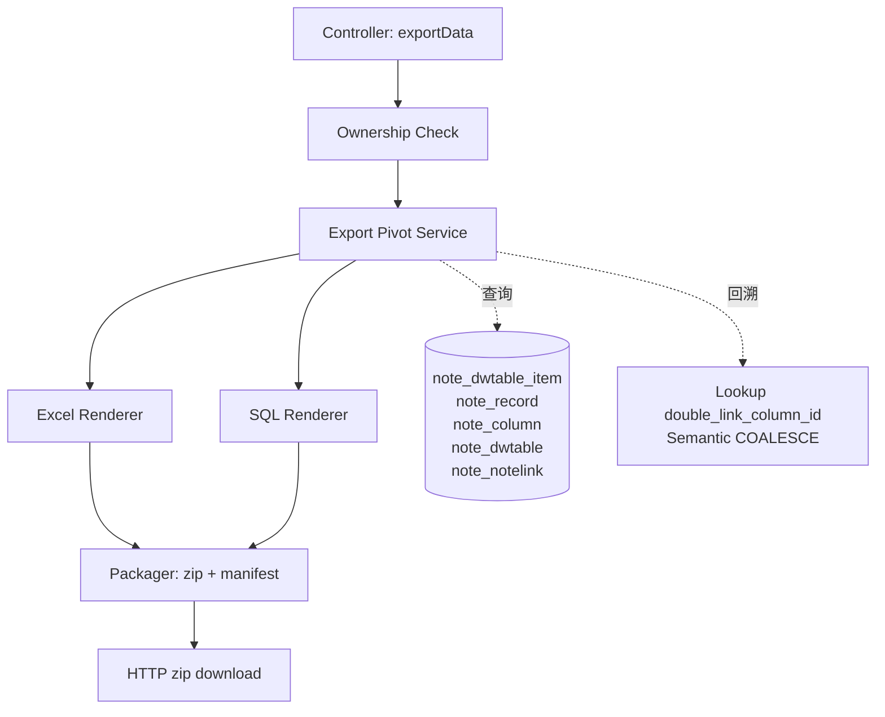
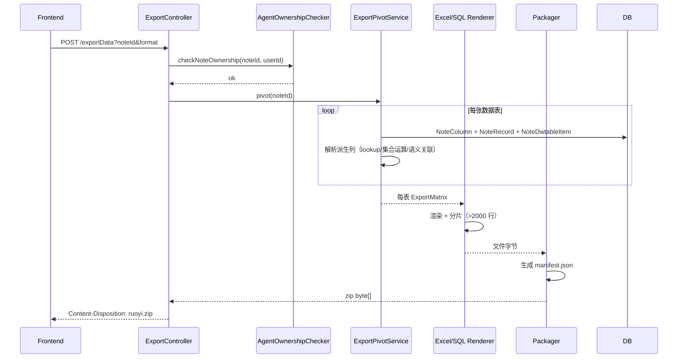

# 多维表格导出功能实现计划

## Summary

为多维表格新增导出能力：用户选择一个多维表格（noteId）与格式（Excel/SQL），后端把该 noteId 下全部数据表 pivot 成行×列矩阵，按列类型渲染规则输出（关联/派生类列双列、记录 id 列必出、超限表按行分片），打包为 zip 下载。本计划新建独立的导出 pivot 服务与渲染/打包组件，复用既有归属校验、审计注解与限流注解，不修改 `selectNoteDwtableDataById` 桩。

## Problem Frame

多维表格数据以 EAV 形式存储在 `note_dwtable_item`，前端靠 pivot 展示，但后端无可复用的 pivot 服务（`NoteDwtableServiceImpl.selectNoteDwtableDataById` 是空循环桩），`ExcelUtil` 全注解驱动不支持动态列。导出功能需要从零构建 pivot + 动态列渲染 + 打包下载链路，同时满足派生列（lookup/集合运算/语义关联）的取值语义、PII 审计、速率限制等约束。

来源需求文档：[2026-08-06-multitable-export-requirements.md](file:///d:/WorkSpace/RuoYi-Vue/docs/brainstorms/2026-08-06-multitable-export-requirements.md)

---

## Requirements

实现需覆盖以下来源需求（R-IDs）与验收示例（AE-IDs），完整定义见 origin 文档：

- **范围与触发**：R1, R2, R3
- **分片与压缩包**：R21, R22, R23, R24, R25, R26
- **数据形态**：R4, R5, R6
- **列类型渲染**：R7, R8, R9, R10, R11, R12
- **Excel 格式**：R13, R14, R15
- **SQL 格式**：R16, R17, R18
- **双格式共同**：R19, R20
- **安全与审计**：R27, R28
- **关键流程**：F1
- **验收示例**：AE1–AE8

---

## Key Technical Decisions

- **KTD1. 新建独立导出 pivot 服务，不补全 `selectNoteDwtableDataById` 桩**。导出矩阵的形态（关联列双列、记录 id 列必出、隐藏列过滤）与 `/data/{id}` 的展示载荷不同；补全桩会让展示接口承载导出语义，破坏单一职责。新建 `NoteDwtableExportPivotService` 独立产出导出矩阵，桩保持现状（origin Dependencies 已标注其为未完成）。

- **KTD2. Excel 渲染直接用 POI `SXSSFWorkbook`，不扩展 `ExcelUtil`**。`ExcelUtil` 所有公开导出方法接收 `List<T>`（`@Excel` 注解 POJO，见 `ExcelUtil.java:196` 构造器与 `:517/:531` exportExcel），无动态列入口；导出列每表动态，无法用固定 POJO。直接用 POI 流式 API 构建工作簿，控制超限表大 sheet 的内存占用。

- **KTD3. SQL 类型映射区分标量锚点与多值列**。记录 id 列（R6）映射 `BIGINT`，是 SQL 中唯一可 JOIN 的标量锚点；关联/派生类 ID 列与文本列因逗号分隔多值映射 `VARCHAR`，只能 `FIND_IN_SET` 查询（不可作为标量外键 JOIN，见 R18 修订）。映射表：数字→`INT`/`DECIMAL`、文本→`VARCHAR`/`TEXT`、日期→`DATETIME`、大文本→`TEXT`、附件原值→`VARCHAR`。

- **KTD4. 大文本超 Excel 32767 字符上限时截断并加 `[TRUNCATED]` 标记**。POI 对超限单元格会抛异常或静默截断，导致导出失败或数据丢失；显式截断到 32767 并在末尾追加 `[TRUNCATED]` 标记保证导出不失败且可识别。SQL 模式映射 `TEXT`/`LONGTEXT` 无此约束，完整输出。

- **KTD5. manifest 索引文件用 JSON 格式**。承载文件名无法表达的信息：导出来源（noteId）、格式、数据表清单与各自记录数、生成时间戳、schema 版本。分片关系与执行顺序由文件名编码（按片号排序执行），manifest 为人工/编排参考，非数据恢复所必需（R23 修订）。

- **KTD6. zip 打包用 JDK `java.util.zip.ZipOutputStream`，不引入 zip4j**。`GenTableServiceImpl.downloadCode`（`ruoyi-generator/.../GenTableServiceImpl.java:228`）已用此模式返回 `byte[]`，`GenController.genCode` 设置响应头下载，可直接复用此下载模式。

- **KTD7. 派生列取值复用项目既有的回溯/兜底模式**。lookup 经 `property.double_link_column_id` 回溯到底层双向关联列的 `linkRecordId`（solutions `lookup-column-set-operation-logic-errors.md` 记录的 `getLookupLinkRecordIds` 模式）；语义关联经 LEFT JOIN `note_dwtable` + `COALESCE(linkNoteId, note_dwtable.noteId)` 兜底历史 null（solutions `notelink-linknoteid-null-recovery.md`）。

- **KTD8. 限流改为按用户维度（`LimitType.USER`），扩展既有 `LimitType` 枚举与 `RateLimiterAspect`**。原 `LimitType` 只有 `DEFAULT`（全局限流，所有用户共享计数）与 `IP`（按请求者 IP）两种；`RateLimiterAspect.getCombineKey`（`ruoyi-framework/.../RateLimiterAspect.java:77`）只对 IP 分支追加 IP 段。导出端点若用 `DEFAULT`，单用户高频拉取会耗尽全局配额、阻断所有用户；若用 `IP`，企业出口 NAT 同 IP 多用户会互相挤占。新增 `LimitType.USER`，在 `getCombineKey` 中对 `USER` 分支追加 `SecurityUtils.getUserId()`，使每个用户独立计数。扩展点放在 common/framework 模块，不污染导出服务本身；扩展后 `@RateLimiter` 对所有调用方可用，未来其他端点可直接复用。

- **KTD9. SQL 值转义 + 标识符净化在渲染层强制执行，不依赖目标库参数化**。导出物是离线执行的 `.sql` 脚本，不可能用 `PreparedStatement` 占位符——所有 `INSERT` 值必须以字面量形式写入 SQL 文本。因此 U3 渲染器对所有字符串值做 SQL 转义：单引号 `'` 转为 `''`、反斜杠 `\` 转为 `\\`、`\0`/`\n`/`\r`/`\x1a` 等 MySQL 特殊字符按 `mysql_real_escape_string` 等价规则转义；数值列值先做 `Double.parseDouble` 校验再原样输出（防止 `"1; DROP TABLE--"` 注入）。标识符（表名/列名）走白名单正则 `^[A-Za-z_][A-Za-z0-9_]{0,62}$`，命中则用反引号包裹（`` `name` ``），不命中（保留字、含空格/特殊字符/超长）按规则归一化（替换非法字符为 `_`、截断到 64 字符、冲突时追加 `_col{原列id}` 后缀）。转义失败时该值写为 `NULL` 并记 warning，不阻断整次导出。

- **KTD10. zip slip 防护采用"入口名净化 + 落地路径校验"双层防御**。导出物文件名由 `NoteDwtable.name` / `NoteColumn.name` 派生，用户可控，若包含 `../` 或绝对路径前缀，解压端可能写到 zip 根目录之外（CVE-2018-1002201 类）。U4 打包器在写入 `ZipEntry` 前对 name 做净化：剥离前导 `/`/`\`、替换 `..` 段为 `_`、替换路径分隔符为安全字符、整体限制长度。同时下游解压（虽非本服务职责）建议调用方校验 `entry.getName()` 解析后路径不逃离目标目录；U4 的测试场景以"恶意 name 经净化后落到预期子目录"作为验证目标，避免产出可被利用的恶意 zip。

- **KTD11. PII 审计走专用结构化日志通道，含数据量字段，不新建审计表**。R27 要求审计字段含导出人、noteId、表名、格式、时间戳、含 PII 标记；`ce-doc-review` 追加要求记录数据量（防止审计无法追溯大批量外流）。复用 RuoYi 既有的 logback 通道，新增专用 logger `piiExportAudit`，输出 JSON 行（含上述字段 + `recordCount`、`shardCount`、`zipBytes` 数据量字段），落 `logs/pii-export-audit.log`，与 `sys_oper_log` 解耦避免改表结构。复用 `@Log(businessType=BusinessType.EXPORT)` 作为基线操作日志，PII 专用日志在 `@Log` 之外额外写一条——前者记录"谁触发了导出端点"，后者记录"导出了哪些含 PII 的表与数据量"。

---

## High-Level Technical Design

### 组件协作

### 导出请求时序

---

## Implementation Units

### U1. 导出 pivot 服务（EAV→矩阵 + 派生列解析）

- **Goal:** 把 noteId 下每张数据表的 EAV 单元格 pivot 成行×列矩阵，按列类型渲染规则产出每行的列值（含关联列双列、记录 id 列、派生列取值语义）。
- **Requirements:** R2, R4, R5, R6, R7, R8, R9, R10, R11, R12, R20, F1
- **Dependencies:** 无（首个单元，下游 U2/U3/U5 依赖其产出）
- **Files:**
  - 新建 `ruoyi-system/src/main/java/com/ruoyi/system/service/INoteDwtableExportPivotService.java`
  - 新建 `ruoyi-system/src/main/java/com/ruoyi/system/service/impl/NoteDwtableExportPivotServiceImpl.java`
  - 新建 `ruoyi-system/src/main/java/com/ruoyi/system/domain/dto/ExportMatrix.java`（每表矩阵：表名、列定义列表、行数据列表）
  - 新建 `ruoyi-system/src/main/java/com/ruoyi/system/domain/dto/ExportColumn.java`（列名、原始列类型、是否双列、是否记录id列）
  - 测试 `ruoyi-system/src/test/java/com/ruoyi/system/service/impl/NoteDwtableExportPivotServiceImplTest.java`
- **Approach:**
  - 查询 noteId 下全部 `NoteDwtable`；对每表查 `NoteColumn`（过滤 `isShow` 为隐藏，R5）、`NoteRecord`（按 `sort` 排序，R4/R26）、`NoteDwtableItem`。
  - 构建 recordId→itemMap 的内存索引避免 N+1；派生列需批量预取关联记录的可读名称（一次 `IN` 查询而非逐行回查）。
  - 列渲染规则：
    - 记录 id 列（R6）：每表首位，值=`NoteRecord.id`。
    - 基础类型列（1/2/3/4/5/7/11/13/15/17/22）：直接取 `value`（R11）；单选/多选若 `value` 为选项 id，按选项定义解析为文本（默认解析，Deferred 项）。
    - 系统列（1001–1005）：按语义输出可读值（R12）；创建人/修改人输出用户标识（id 或名称，Deferred）。
    - 双向关联(21)/单向关联(18)：双列——ID 列=`linkRecordId`（逗号分隔），文本列=关联记录 `name` 回查。
    - lookup(26)：ID 列经 `property.double_link_column_id` 回溯到底层双向关联列 item 的 `linkRecordId`（复用 `getLookupLinkRecordIds` 模式，solutions `lookup-column-set-operation-logic-errors.md`）；文本列=`source_column_id` 在那些记录上的值。
    - 集合运算(24)：ID 列=集合运算后的 `linkRecordId` 结果列表（`CollectionUtils` 并/交/差/补）；文本列=记录 id 回查的可读名称。
    - 语义关联(25)：ID 列=`linkNoteId`（去重，历史 null 按 `COALESCE(linkNoteId, note_dwtable.noteId)` 兜底，solutions `notelink-linknoteid-null-recovery.md`）；文本列=对应笔记标题/名称。不出现 `NoteNotelink.id`。
  - 空表（无记录）仍产出列定义，行数据为空（R20）。
- **Patterns to follow:**
  - `NoteRecordServiceImpl.getLookupLinkRecordIds`（lookup 回溯 helper，solutions 文档 L71 标注位置）。
  - `NoteNotelinkMapper.selectNoteNotelinkByNoteId` 的 LEFT JOIN + COALESCE SQL 模式。
- **Test scenarios:**
  - Covers AE1. 双列渲染：表 A 双向关联列指向表 B，`linkRecordId="100,101"` → ID 列=`100,101`，文本列=`张三,李四`。
  - Covers AE2. lookup 回溯：lookup 列 L 的 `double_link_column_id` 指向双向关联列 D，D 的 `linkRecordId="200,201"`，`source_column_id` 在 200/201 上值为"产品X"/"产品Y" → L 的 ID 列=`200,201`，文本列=`产品X,产品Y`。
  - Covers AE3. 语义关联 ID 取值：语义关联列关联到笔记 P(50)/Q(51) → ID 列=`50,51`，文本列=`需求文档,会议纪要`，不含 `NoteNotelink.id`；历史 null 行经 COALESCE 兜底为 `note_dwtable.noteId`。
  - Covers AE4. 记录 id 列必出：3 条记录 → 导出物含记录 id 列，值=10/11/12，位于首位，UI 隐藏该列时导出物仍含。
  - Covers AE5. 空表导出：0 记录 → 矩阵列定义非空、行数据为空。
  - 隐藏列过滤：`isShow` 为隐藏的列不出现在矩阵列定义中。
  - 单选/多选解析：`value` 为选项 id 时解析为选项文本。
  - 批量预取性能：1000 记录 × 5 关联列的表，pivot 完成时关联记录名称查询次数应为 O(表数) 而非 O(行数×列数)。
- **Verification:** 单元测试覆盖 AE1–AE5 场景；pivot 产出的 `ExportMatrix` 结构含表名、有序列定义、有序行数据；关联列在列定义中标记为双列。

### U2. Excel 渲染器（SXSSF 动态列 + 多 sheet 分片）

- **Goal:** 把 `ExportMatrix` 渲染为 Excel 工作簿字节，每表一 sheet，超限表按行分片为多 sheet。
- **Requirements:** R13, R14, R15, R21, R24, R26, R11（大文本不截断完整输出）, KTD2, KTD4
- **Dependencies:** U1
- **Files:**
  - 新建 `ruoyi-system/src/main/java/com/ruoyi/system/service/impl/NoteDwtableExcelRenderer.java`
  - 测试 `ruoyi-system/src/test/java/com/ruoyi/system/service/impl/NoteDwtableExcelRendererTest.java`
- **Approach:**
  - 用 `SXSSFWorkbook`（流式）构建工作簿，控制超限表大 sheet 内存。
  - 列名行：按 `ExportColumn` 顺序输出列名；关联/派生类列占两列（`列名_ID` / `列名_文本`，命名约定 Deferred）。
  - 数据行：按 `NoteRecord.sort` 顺序；超 2000 行触发分片，每片 2000 行，sheet 命名 `表名_p1`/`表名_p2`（R24）；合格表单 sheet 名为数据表名。
  - 大文本超 32767 字符截断并追加 `[TRUNCATED]`（KTD4）。
  - sheet 名含非法字符（`[]`、`:` 等）按 Excel 通用规则替换（具体规则 Deferred）。
  - 整个导出物为单个工作簿字节（R13），再交给 U4 打包。
- **Patterns to follow:**
  - POI `SXSSFWorkbook` 流式 API（`createSheet`/`createRow`/`createCell`）。
- **Test scenarios:**
  - Covers AE7. 超限表分片（Excel）：5000 行表 → 3 个 sheet `T_p1`(1-2000)/`T_p2`(2001-4000)/`T_p3`(4001-5000)；三 sheet 列名行一致；按片号顺序拼接还原 5000 条无丢失无重复。
  - 空表 sheet：0 记录表 → sheet 只有列名行。
  - 双列占位：关联列在 sheet 中占两列，列名分别为 `列名_ID`/`列名_文本`。
  - 大文本截断：`value` 长 40000 字符 → 单元格值为前 32767 字符 + `[TRUNCATED]`。
  - 多表同簿：2 张合格表 → 同一工作簿含 sheet `T1`/`T2`。
- **Verification:** 渲染产出的工作簿字节可用 POI `XSSFWorkbook` 读回校验 sheet 数量、列名行、数据行数、单元格值。

### U3. SQL 渲染器（CREATE TABLE + INSERT + 多文件分片 + 值转义/标识符净化）

- **Goal:** 把 `ExportMatrix` 渲染为 SQL 文件字节列表，每表一 `.sql`，超限表多文件分片，首片含 DDL；所有值与标识符经安全转义/净化，产出可在 MySQL 直接执行且不可注入。
- **Requirements:** R16, R17, R18, R20, R21, R25, R26, KTD3, KTD9
- **Dependencies:** U1
- **Files:**
  - 新建 `ruoyi-system/src/main/java/com/ruoyi/system/service/impl/NoteDwtableSqlRenderer.java`
  - 新建 `ruoyi-system/src/main/java/com/ruoyi/system/service/impl/SqlValueEscaper.java`（MySQL 字符串值转义工具：`'`→`''`、`\`→`\\`、`\0`/`\n`/`\r`/`\x1a` 等控制字符转义、`NULL` 处理）
  - 新建 `ruoyi-system/src/main/java/com/ruoyi/system/service/impl/SqlIdentifierSanitizer.java`（标识符合法化：白名单正则、保留字反引号、特殊字符替换、长度截断、冲突追加列 id 后缀）
  - 测试 `ruoyi-system/src/test/java/com/ruoyi/system/service/impl/NoteDwtableSqlRendererTest.java`
  - 测试 `ruoyi-system/src/test/java/com/ruoyi/system/service/impl/SqlValueEscaperTest.java`
  - 测试 `ruoyi-system/src/test/java/com/ruoyi/system/service/impl/SqlIdentifierSanitizerTest.java`
- **Approach:**
  - 每表产出一个 `ExportFile`（文件名 + 字节）；超 2000 行触发分片，每片 2000 行，文件名 `表名_p1.sql`/`表名_p2.sql`（R25）。
  - 首片含 `CREATE TABLE`（表名/列名经 `SqlIdentifierSanitizer` 净化）+ 前 2000 条 `INSERT`；后续片为纯 `INSERT`。
  - 合格表单文件含一段 `CREATE TABLE` + `INSERT`。
  - **值转义（KTD9）**：所有 `INSERT` 字符串值经 `SqlValueEscaper.escape()` 写入；数值列值先 `Double.parseDouble` 校验再原样输出，校验失败写 `NULL` + warning；日期/时间值校验为合法 `DateTime` 格式；`null` 值写 `NULL`。禁止字符串拼接裸值到 SQL 文本。
  - **标识符净化（KTD9）**：表名/列名走 `SqlIdentifierSanitizer.sanitize()`——白名单正则 `^[A-Za-z_][A-Za-z0-9_]{0,62}$` 命中则反引号包裹；MySQL 保留字（`order`/`group`/`select`/`table` 等，内置一份保留字集合）强制反引号；含空格/特殊字符/超长者替换非法字符为 `_`、截断到 64 字符；冲突时追加 `_col{原列id}` 后缀保证唯一。
  - 类型映射（KTD3）：记录 id 列 `BIGINT`、数字 `INT`/`DECIMAL`、文本 `VARCHAR`/`TEXT`、大文本 `TEXT`/`LONGTEXT`、日期 `DATETIME`、关联列 ID 与文本列 `VARCHAR`（逗号分隔多值，仅 `FIND_IN_SET`）。
  - 目标方言 MySQL（与现库一致）。
  - 空表：`CREATE TABLE` 语句但无 `INSERT`（R20）。
- **Patterns to follow:**
  - 标准 MySQL DDL/INSERT 语法；标识符合法化参考 MySQL 8.0 保留字列表。
  - 值转义规则等价于 `mysql_real_escape_string`（PHP/MySQL 客户端约定），不引入新依赖（纯 JDK 实现）。
- **Test scenarios:**
  - Covers AE8. 超限表分片（SQL）：5000 行表 → `T_p1.sql`/`T_p2.sql`/`T_p3.sql`；`T_p1.sql` 含 `CREATE TABLE` + 前 2000 条 `INSERT`，其余仅 `INSERT`；按文件名顺序执行后目标库恢复 5000 条。
  - 空表 SQL：0 记录 → 文件含 `CREATE TABLE` 无 `INSERT`。
  - 类型映射：数字列 → `INT`/`DECIMAL`；关联列 ID 与文本列 → `VARCHAR`；记录 id 列 → `BIGINT`。
  - **SQL 注入防护（值）**：单元格值含 `'; DROP TABLE T; --` → 经转义后 SQL 文本中值为 `''; DROP TABLE T; --`（被单引号包裹为字面量），在 MySQL 执行时为该单元格的纯文本值，不触发 DDL。
  - **SQL 注入防护（数值）**：数字列值 `"1; DROP TABLE--"` → `Double.parseDouble` 失败 → 写 `NULL` + warning，不写出注入串。
  - **标识符合法化（保留字）**：列名 `order` → `` `order` ``；列名 `select` → `` `select` ``。
  - **标识符合法化（特殊字符）**：列名 `创建时间` / `col name` / 65 字符长名 → 分别归一化为合法标识符（替换非法字符、截断、反引号包裹）。
  - **标识符合法化（冲突）**：同表两列归一化后同名 → 后者追加 `_col{原列id}` 后缀。
  - 多表多文件：2 张合格表 → 2 个 `.sql` 文件。
- **Verification:** 渲染产出的 SQL 文件字节可被 MySQL 语法校验器（或 H2 MySQL 模式）解析且执行无注入风险；执行后表结构与行数符合 `ExportMatrix`；`SqlValueEscaper` 与 `SqlIdentifierSanitizer` 单元测试覆盖注入向量、保留字、特殊字符、长度边界、冲突场景。

### U4. 压缩包打包器（zip + manifest 索引文件 + zip slip 防护）

- **Goal:** 把渲染器产出的所有文件字节打包为 zip，生成 manifest.json 索引文件一并打入；所有 `ZipEntry` name 经净化，产出不含路径穿越向量的安全 zip。
- **Requirements:** R22, R23, R26, KTD5, KTD6, KTD10
- **Dependencies:** U2, U3
- **Files:**
  - 新建 `ruoyi-system/src/main/java/com/ruoyi/system/service/impl/NoteDwtableExportPackager.java`
  - 新建 `ruoyi-system/src/main/java/com/ruoyi/system/service/impl/ZipEntryNameSanitizer.java`（入口名净化：剥离前导 `/`/`\`、替换 `..` 段、替换路径分隔符、长度限制）
  - 新建 `ruoyi-system/src/main/java/com/ruoyi/system/domain/dto/ExportManifest.java`（noteId、format、tables[{name,records,shardCount}]、generatedAt、schemaVersion）
  - 测试 `ruoyi-system/src/test/java/com/ruoyi/system/service/impl/NoteDwtableExportPackagerTest.java`
  - 测试 `ruoyi-system/src/test/java/com/ruoyi/system/service/impl/ZipEntryNameSanitizerTest.java`
- **Approach:**
  - 用 `java.util.zip.ZipOutputStream`（KTD6，复用 `GenTableServiceImpl.downloadCode` 模式）把所有 `ExportFile` 写入 zip。
  - **入口名净化（KTD10）**：写入 `ZipEntry` 前对 name 经 `ZipEntryNameSanitizer.sanitize()`——剥离前导 `/`/`\`（防绝对路径）、按段拆分后替换 `..` 段为 `_`（防 `../` 穿越）、替换路径分隔符 `/`/`\` 为 `_`（本导出物为扁平结构无需子目录）、整体长度限制 255 字符。净化失败回退到安全名 `entry_{idx}`。Excel 工作簿文件名固定为 `multitable-export.xlsx`，manifest 固定为 `manifest.json`，二者不用户可控；用户可控的表名派生文件名（`{tableName}.sql` / `{tableName}_p{n}.sql` / sheet 名）必须经净化。
  - 生成 `manifest.json`（KTD5）：含 noteId、format、tables 列表（每表名、记录数、分片数）、generatedAt（ISO-8601）、schemaVersion。
  - 分片关系与执行顺序由文件名编码（`表名_p1`/`表名_p2` 按片号排序执行），manifest 不重复此信息（R23 修订）。
  - 返回 `byte[]` 供控制器下载。
- **Patterns to follow:**
  - `GenTableServiceImpl.downloadCode`（`ruoyi-generator/.../GenTableServiceImpl.java:228`）的 `ZipOutputStream` + `ByteArrayOutputStream` 模式。
  - `GenController.genCode`（`ruoyi-generator/.../GenController.java:204`）的响应头设置模式。
  - OWASP zip slip 防护建议（入口名净化 + 解压端路径校验双层）。
- **Test scenarios:**
  - Covers AE6. 多表一次导出：2 张合格表 Excel → zip 内含 1 个 Excel 工作簿 + `manifest.json`；SQL → zip 内含 `T1.sql`/`T2.sql`/`manifest.json`。
  - manifest 字段：含正确 noteId、format、每表记录数与分片数、generatedAt、schemaVersion。
  - 分片文件名编码：5000 行表 → zip 内含 `T_p1.sql`/`T_p2.sql`/`T_p3.sql`，按文件名排序即可还原顺序，不依赖 manifest。
  - zip 完整性：解压后文件数与 `ExportFile` 数 + 1（manifest）一致。
  - **zip slip 防护（绝对路径）**：表名 `/etc/passwd` → 净化后 entry name 为 `etc_passwd.sql`，不含前导 `/`。
  - **zip slip 防护（穿越）**：表名 `../../etc/passwd` → 净化后 entry name 为 `__etc_passwd.sql`，不含 `..` 段。
  - **zip slip 防护（反斜杠）**：表名 `..\..\windows\system32` → 净化后 entry name 为 `____windows_system32.sql`。
  - **zip slip 防护（长度）**：表名 300 字符 → 截断到 255 字符，仍含 `.sql` 扩展名。
  - **净化失败兜底**：净化异常 → entry name 回退为 `entry_{idx}.sql`，不阻断打包。
  - 解压端路径校验（验证侧）：用 `ZipInputStream` 读回，所有 `entry.getName()` 解析到目标目录内，无 `..` 逃离。
- **Verification:** 产出的 zip `byte[]` 可用 `java.util.zip.ZipInputStream` 读回，文件清单与 `ExportFile` 列表 + manifest 一致；manifest JSON 可被反序列化为 `ExportManifest`；所有 entry name 经 `ZipEntryNameSanitizerTest` 覆盖绝对路径/穿越/反斜杠/长度/兜底场景，不含可利用的路径穿越向量。

### U5. 导出端点 + 权限/审计/限流

- **Goal:** 新增导出端点，串联 pivot→渲染→打包→下载链路，加权限校验、按用户维度的速率限制、含数据量的 PII 结构化审计。
- **Requirements:** R1, R3, R19, R27, R28, F1, KTD8, KTD11
- **Dependencies:** U1, U2, U3, U4, U6（限流基础设施扩展）
- **Files:**
  - 修改 `ruoyi-admin/src/main/java/com/ruoyi/web/controller/system/NoteDwtableController.java`（新增 `exportData` 端点）
  - 新建 `ruoyi-system/src/main/java/com/ruoyi/system/service/INoteDwtableExportService.java`（编排入口）
  - 新建 `ruoyi-system/src/main/java/com/ruoyi/system/service/impl/NoteDwtableExportServiceImpl.java`
  - 新建 `ruoyi-system/src/main/java/com/ruoyi/system/service/impl/PiiExportAuditLogger.java`（专用 PII 审计 logger：JSON 行输出到 `logs/pii-export-audit.log`，含 R27 字段 + 数据量字段）
  - 新建 `ruoyi-system/src/main/resources/logback/pii-export-audit.xml`（logback appender 配置，独立 logger 与 `sys_oper_log` 解耦）
  - 测试 `ruoyi-admin/src/test/java/com/ruoyi/web/controller/system/NoteDwtableControllerExportTest.java`
  - 测试 `ruoyi-system/src/test/java/com/ruoyi/system/service/impl/PiiExportAuditLoggerTest.java`
- **Approach:**
  - 新端点 `POST /system/dwtable/exportData`（参数 `noteId`、`format`∈{excel,sql}），返回 zip `byte[]` 下载（复用 `GenController.genCode` 响应头模式，`Content-Disposition: attachment; filename="multitable-export.zip"`）。
  - 权限：调用 `AgentOwnershipChecker.checkNoteOwnership(noteId, SecurityUtils.getUserId())`（R19，复用既有归属校验，admin 通行）。
  - **限流（KTD8 修订）**：`@RateLimiter(time=60, count=N, limitType=LimitType.USER)`——按用户维度计数，单用户高频拉取只阻断自己，不影响其他用户；`USER` 类型由 U6 扩展到 `LimitType` 枚举与 `RateLimiterAspect`。具体 `count` 值 Deferred（初始建议 10/60s，含 PII 表可考虑更严，本计划初始值统一 10/60s，校准见 Outstanding Questions）。
  - **PII 审计（KTD11 修订）**：双层审计——
    - 基线层：`@Log(title="多维表格导出", businessType=BusinessType.EXPORT)` 复用既有 `sys_oper_log`，记录端点被谁触发。
    - PII 专用层：在 `NoteDwtableExportServiceImpl` 中，遍历每张表检测是否含 PII 列（人员 11、创建人 1003、修改人 1004）；含 PII 的表通过 `PiiExportAuditLogger.log(record)` 写一条 JSON 行到 `logs/pii-export-audit.log`，字段含：`operatorUserId`、`operatorName`、`noteId`、`tableName`、`format`、`timestamp`（ISO-8601）、`containsPii=true`、**数据量字段**`recordCount`（该表记录数）、`shardCount`（分片数）、`zipBytes`（整次导出物字节大小）。不含 PII 的表不写专用审计日志，但仍写基线 `@Log`。
    - 审计写入失败不阻断导出（catch + error log），但需在监控告警中体现。
  - 多表叠加超时兜底：若 noteId 下总记录数超过阈值（Deferred，初始建议 10000），返回优雅失败提示而非超时（Dependencies 已记录多表叠加最坏情况需验证）。
- **Patterns to follow:**
  - `NoteDwtableController.export`（既有 `/export` 端点）的 `@Log` + `BusinessType.EXPORT` 模式。
  - `AgentOwnershipChecker.checkNoteOwnership`（`ruoyi-system/.../agent/security/AgentOwnershipChecker.java:56`）。
  - `GenController.genCode` 响应头设置模式。
  - logback 专用 logger + appender 配置模式（参考既有 `logback.xml` 的 logger 定义）。
- **Test scenarios:**
  - 无权限拒绝：用户 A 导出用户 B 的笔记 → 抛 `ServiceException("无权操作他人数据")`，不进入 pivot。
  - admin 通行：admin 导出任意 noteId → 正常导出。
  - Covers R27. 含 PII 审计：导出含人员列的表 → `PiiExportAuditLogger` 写一条 JSON 到 `logs/pii-export-audit.log`，含 `operatorUserId`/`operatorName`/`noteId`/`tableName`/`format`/`timestamp`/`containsPii=true`/`recordCount`/`shardCount`/`zipBytes` 字段。
  - Covers R27. 不含 PII 不写专用日志：导出仅含文本/数字列的表 → 只写基线 `@Log`，不写 `pii-export-audit.log`。
  - **数据量字段校验**：审计 JSON 含 `recordCount=5000`、`shardCount=3`、`zipBytes=12345`，与实际导出物一致。
  - **审计失败不阻断**：`PiiExportAuditLogger.log()` 抛异常 → 被 catch + error log，导出仍返回 zip 字节。
  - Covers R28. 按用户限流触发：同一 userId 60s 内调用超过 N 次 → 第 N+1 次返回限流错误；同时另一 userId 调用不受影响（验证 `LimitType.USER` 隔离性）。
  - **限流 key 隔离**：用户 A 触发限流后，用户 B 同时刻调用 → B 成功，证明 key 含 userId 而非全局。
  - 多表超时兜底：总记录数超阈值 → 返回优雅失败提示，不超时。
  - 端点返回：响应头 `Content-Disposition: attachment; filename="multitable-export.zip"`，body 为 zip 字节。
- **Verification:** 端点集成测试覆盖权限/审计/限流/兜底；`PiiExportAuditLogger` 单元测试覆盖 PII 检测、字段完整性、数据量字段、写入失败兜底；`LimitType.USER` 隔离性在 U6 单元测试中验证；响应可被客户端保存为 zip 并解压。

### U6. 限流基础设施扩展（LimitType.USER）

- **Goal:** 扩展 `LimitType` 枚举新增 `USER` 类型，`RateLimiterAspect.getCombineKey` 对 `USER` 分支追加 `SecurityUtils.getUserId()`，使 `@RateLimiter` 支持按用户维度计数；为 U5 导出端点提供基础设施。
- **Requirements:** R28, KTD8
- **Dependencies:** 无（独立基础设施变更，U5 依赖其产出）
- **Files:**
  - 修改 `ruoyi-common/src/main/java/com/ruoyi/common/enums/LimitType.java`（新增 `USER` 枚举值）
  - 修改 `ruoyi-framework/src/main/java/com/ruoyi/framework/aspectj/RateLimiterAspect.java`（`getCombineKey` 增 `USER` 分支）
  - 测试 `ruoyi-framework/src/test/java/com/ruoyi/framework/aspectj/RateLimiterAspectTest.java`（新增或补充）
- **Approach:**
  - 在 `LimitType` 枚举追加 `USER` 值，注释说明"按请求者用户 id 限流"。
  - 在 `RateLimiterAspect.getCombineKey` 中追加分支：`if (rateLimiter.limitType() == LimitType.USER) { stringBuffer.append(SecurityUtils.getUserId()).append("-"); }`，置于 IP 分支之后、`targetClass` 拼接之前。
  - `SecurityUtils.getUserId()` 在未登录上下文抛 `ServiceException`——`@RateLimiter` 注解的端点都已通过认证过滤器，进入切面时 `SecurityUtils.getUserId()` 必有值；为防御异常路径，`getCombineKey` 内 try-catch，取不到 userId 时回退到 IP 维度（降级而非阻断，记 warning）。
  - 不修改既有 `DEFAULT`/`IP` 行为，纯追加。
- **Patterns to follow:**
  - 既有 IP 分支的 `stringBuffer.append(...)` 模式（`RateLimiterAspect.java:80-83`）。
  - `SecurityUtils.getUserId()`（`ruoyi-common/.../utils/SecurityUtils.java`）。
- **Test scenarios:**
  - **USER 限流 key 含 userId**：用户 A（id=100）调用端点 → combine key 含 `100-`，与用户 B（id=200）的 key 不同。
  - **USER 隔离性**：用户 A 调用达到上限 → 用户 B 同时调用不受影响（独立计数）。
  - **未登录降级**：`SecurityUtils.getUserId()` 抛异常 → 回退到 IP 维度 key，记 warning，不阻断请求。
  - **DEFAULT 不受影响**：`limitType=DEFAULT` 时 key 不含 userId，行为与改动前一致（回归保护）。
  - **IP 不受影响**：`limitType=IP` 时 key 含 IP，行为与改动前一致（回归保护）。
- **Verification:** `RateLimiterAspectTest` 覆盖 USER/DEFAULT/IP 三种类型的 key 生成与隔离性；回归测试确认既有 `@RateLimiter(limitType=DEFAULT/IP)` 端点行为不变；U5 端点用 `LimitType.USER` 集成验证。

### U7. 前端触发（含 loading/error/disabled 状态）

- **Goal:** 在多维表格页加导出入口，选择格式后触发下载；按钮与弹窗覆盖 loading、error、disabled 三态，错误场景有明确提示。
- **Requirements:** R1, F1
- **Dependencies:** U5
- **Files:**
  - 修改 `notepad/src/.../多维表格页`（具体组件路径 Deferred，按既有前端结构定位）
  - 新建导出按钮 + 格式选择弹窗组件（按既有前端组件规范）
- **Approach:**
  - 在多维表格页工具栏加"导出"按钮，点击弹格式选择（Excel/SQL）。
  - 调用 `/system/dwtable/exportData`，blob 响应触发浏览器下载 `multitable-export.zip`。
  - 复用既有下载工具（按前端既有 `download.js` 或同等工具）。
  - **三态处理（ce-doc-review 修订）**：
    - **disabled**：未选中多维表格（无 noteId）时按钮禁用，hover 提示"请先选择多维表格"。
    - **loading**：点击导出后按钮进入 loading 态（禁用 + spinner），直到 blob 下载完成或失败；防止用户重复点击触发多次后端请求。
    - **error**：后端返回非 2xx 时（无权限 `ServiceException`、限流 `访问过于频繁`、超时兜底 `数据量过大`），前端解析错误码并 toast 对应中文提示；网络异常（断连、socketTimeout）toast "导出超时，请缩小数据范围后重试"。
    - **格式选择校验**：弹窗需选中 Excel 或 SQL 才能点"确认导出"，未选时确认按钮 disabled。
- **Patterns to follow:**
  - 既有前端下载工具（按 notepad 前端结构定位）。
  - 既有 loading/error/disabled 按钮组件模式（如其他工具栏操作按钮）。
- **Test scenarios:**
  - 触发下载：点击导出→选 Excel→浏览器下载 `multitable-export.zip`，解压含 Excel 文件。
  - 格式切换：选 SQL→下载的 zip 含 `.sql` 文件。
  - **disabled 态**：未选 noteId 时按钮 disabled，不可点击。
  - **loading 态**：点击导出后按钮变 loading + disabled，期间再次点击无效；下载完成后恢复。
  - **error 态（无权限）**：后端返回无权限错误 → toast "无权操作他人数据"。
  - **error 态（限流）**：后端返回限流错误 → toast "访问过于频繁，请稍候再试"。
  - **error 态（超时兜底）**：后端返回数据量过大 → toast 提示缩小数据范围。
  - **error 态（网络）**：请求超时或断连 → toast "导出超时，请缩小数据范围后重试"。
  - **格式校验**：弹窗未选格式时确认按钮 disabled。
- **Verification:** 前端 e2e 或手动验证：导出按钮可用、格式选择生效、下载文件正确、loading/disabled/error 三态覆盖完整、错误场景有对应提示。

---

## Scope Boundaries

### Deferred for later

- 按视图（`NoteView`）筛选/排序导出（origin Deferred）。
- 导入功能（origin Deferred）。
- 列宽、单元格样式、Excel 公式等美化（origin Deferred）。
- 异步后台导出任务（origin Deferred，仅同步 + 分片）。
- PII 列脱敏选项（哈希/替换昵称，origin Deferred，默认输出原始标识）。

### Outside this product's identity

- 跨多维表格批量导出（origin Outside）。
- 导出为 CSV/JSON 等其他格式（origin Outside）。
- 导出物内嵌跨表外键关系图或 ER 图（origin Outside）。

### Deferred to Follow-Up Work

- 多表叠加总导出时间的最坏情况性能验证与兜底阈值校准（U5 实现初始阈值，后续按实测调整）。
- 附件列(17) `value` 存储格式核实与解析优化（origin Deferred to planning，pivot 阶段输出原值，解析优化后续）。

---

## Risks & Dependencies

- **多表叠加超 60s socketTimeout**：2000 行阈值为单表口径，多表叠加未做最坏情况论证。U5 实现初始总记录数上限兜底，阈值数值待性能测试校准（origin Dependencies）。
- **派生列解析 N+1 性能**：每记录每列查 DB 会导致大表性能崩溃。U1 必须批量预取关联记录名称（一次 `IN` 查询），测试场景已覆盖。
- **POI SXSSF 内存**：超限表分片已控制单 sheet 2000 行，避免 OOM。
- **既有桩 `selectNoteDwtableDataById` 未完成**：本计划不依赖、不修改该桩（KTD1），保持 `/data/{id}` 展示接口现状。
- **`ExcelUtil` 注解驱动不支持动态列**：KTD2 决定直接用 POI，不扩展工具类。
- **PII 外流风险**：R27 审计（KTD11 专用日志 + 数据量字段）+ R28 按用户限流（KTD8）+ 默认输出原值（服务离线 join 需求）共同约束，脱敏选项 Deferred。
- **SQL 注入风险**：导出物为离线 `.sql` 脚本无法参数化，KTD9 + U3 的 `SqlValueEscaper`/`SqlIdentifierSanitizer` 在渲染层强制转义/净化，测试场景覆盖注入向量。
- **zip slip 风险**：导出物文件名用户可控，KTD10 + U4 的 `ZipEntryNameSanitizer` 在打包层净化 entry name，测试场景覆盖路径穿越向量。
- **限流基础设施扩展回归风险**：U6 修改 `LimitType` 枚举与 `RateLimiterAspect`，影响所有 `@RateLimiter` 调用方。U6 测试场景含 DEFAULT/IP 回归保护，扩展为纯追加不修改既有行为。

---

## System-Wide Impact

- **新增端点** `POST /system/dwtable/exportData`，无破坏性变更，既有端点保持不变。
- **基础设施扩展（跨模块影响）**：U6 修改 `ruoyi-common` 的 `LimitType` 枚举与 `ruoyi-framework` 的 `RateLimiterAspect`，新增 `LimitType.USER` 类型。此扩展为纯追加，既有 `@RateLimiter(limitType=DEFAULT/IP)` 调用方行为不变；新类型对全仓库所有 `@RateLimiter` 使用方可用，未来其他端点可直接复用按用户限流能力。
- **复用既有基础设施**：`AgentOwnershipChecker`（归属校验）、`@Log`+`BusinessType.EXPORT`（基线审计）、`@RateLimiter`（Redis 限流，扩展后用 USER 类型）、`java.util.zip`（下载模式）。
- **新增审计通道**：`logs/pii-export-audit.log`（KTD11），独立于 `sys_oper_log`，运维需配置日志轮转与监控告警（审计写入失败需告警）。
- **无新依赖**：POI 4.1.2、fastjson2、JDK zip、logback 均已在 `pom.xml`/`ruoyi-common/pom.xml`；`SqlValueEscaper`/`SqlIdentifierSanitizer`/`ZipEntryNameSanitizer` 纯 JDK 实现。
- **受影响方**：多维表格使用者（A1）获得导出能力；运维需关注按用户限流参数、PII 审计日志量与轮转、`LimitType.USER` 对既有 `@RateLimiter` 的回归验证。

---

## Outstanding Questions

### Resolve Before Implementation

- 无。所有阻塞决策已在 brainstorm 与本计划中明确；`ce-doc-review` 安全发现（限流维度、SQL 转义、zip slip、PII 审计存储、前端三态）已通过 KTD8–KTD11 与 U3/U4/U5/U6/U7 修订解决。

### Deferred to Implementation

- 隐藏列默认不导出是否需"导出全部列"开关（origin Deferred，本计划实现默认不导出）。
- 单选/多选 `value` 为选项 id 时的解析路径（U1 实现，具体选项定义查询路径待代码定位）。
- 创建人/修改人系统列输出用户 id 还是名称（U1 实现，默认 id 待确认）。
- SQL 标识符合法化的 MySQL 保留字集合具体清单（U3 实现，参考 MySQL 8.0 官方保留字列表，内置一份集合）。
- Excel sheet 名含非法字符的具体处理规则（U2 实现，`[]`/`:` 替换）。
- 关联/派生类双列的列名命名约定（U2 实现，`列名_ID`/`列名_文本`）。
- 附件列(17) `value` 的具体存储格式（U1 输出原值，格式核实后续）。
- manifest.json 的具体字段结构细节（U4 实现，按 KTD5 字段）。
- 压缩包命名规则与内部目录结构（U4 实现）。
- 2000 行分片阈值的性能测试校准（U2/U3 实现后压测）。
- `@RateLimiter(count=N, limitType=LimitType.USER)` 的具体 `count` 值（U5 实现，初始建议 10/60s；含 PII 表是否需更严阈值待安全评估）。
- 多表叠加总记录数上限兜底阈值（U5 实现，初始建议 10000）。
- 前端多维表格页导出按钮的具体组件位置（U7 实现，按 notepad 前端结构定位）。
- `LimitType.USER` 在未登录上下文的降级策略是否需告警（U6 实现，初始记 warning，是否升级为告警待运维确认）。
- `pii-export-audit.log` 的日志轮转策略与保留期（U5/U6 实现后运维配置）。

---

## Sources & Research

- **需求文档**：[docs/brainstorms/2026-08-06-multitable-export-requirements.md](file:///d:/WorkSpace/RuoYi-Vue/docs/brainstorms/2026-08-06-multitable-export-requirements.md)
- **领域词汇**：[CONCEPTS.md](file:///d:/WorkSpace/RuoYi-Vue/CONCEPTS.md) — NoteDwtable、NoteDwtableItem、NoteColumn、Double Link Column、Lookup Column、Set Operation Column、Semantic Link Column、NoteNotelink、back_field_id。
- **既有代码**：
  - [NoteDwtableItem.java](file:///d:/WorkSpace/RuoYi-Vue/ruoyi-system/src/main/java/com/ruoyi/system/domain/NoteDwtableItem.java) — EAV 单元格实体（value/linkRecordId:String/linkColumnId:Long/linkNoteId:Long）。
  - [NoteColumn.java](file:///d:/WorkSpace/RuoYi-Vue/ruoyi-system/src/main/java/com/ruoyi/system/domain/NoteColumn.java) — 列定义（type/property:JSON/isShow/sort）。
  - [NoteRecord.java](file:///d:/WorkSpace/RuoYi-Vue/ruoyi-system/src/main/java/com/ruoyi/system/domain/NoteRecord.java) — 行实体（id/sort/name/dwtableId）。
  - [NoteDwtableController.java](file:///d:/WorkSpace/RuoYi-Vue/ruoyi-admin/src/main/java/com/ruoyi/web/controller/system/NoteDwtableController.java) — 既有 `/export`（注解驱动元数据）、`/data/{id}`（空桩）、`/list`/`/pageList`。
  - [ExcelUtil.java](file:///d:/WorkSpace/RuoYi-Vue/ruoyi-common/src/main/java/com/ruoyi/common/utils/poi/ExcelUtil.java) — 注解驱动，无动态列方法（KTD2 依据）。
  - [AgentOwnershipChecker.java](file:///d:/WorkSpace/RuoYi-Vue/ruoyi-system/src/main/java/com/ruoyi/system/agent/security/AgentOwnershipChecker.java) — `checkNoteOwnership(noteId, userId)`，admin 通行（R19 依据）。
  - [RateLimiter.java](file:///d:/WorkSpace/RuoYi-Vue/ruoyi-common/src/main/java/com/ruoyi/common/annotation/RateLimiter.java) — Redis 限流注解（R28 依据）。
  - [LimitType.java](file:///d:/WorkSpace/RuoYi-Vue/ruoyi-common/src/main/java/com/ruoyi/common/enums/LimitType.java) — 限流类型枚举，当前只有 `DEFAULT`/`IP`，U6 扩展新增 `USER`（KTD8 依据）。
  - [RateLimiterAspect.java](file:///d:/WorkSpace/RuoYi-Vue/ruoyi-framework/src/main/java/com/ruoyi/framework/aspectj/RateLimiterAspect.java) — 限流切面，`getCombineKey`（:77）只处理 IP 分支，U6 增 `USER` 分支（KTD8 依据）。
  - `GenTableServiceImpl.downloadCode` / `GenController.genCode` — JDK `ZipOutputStream` + 响应头下载模式（KTD6 依据）。
  - `NoteDwtableServiceImpl.selectNoteDwtableDataById` — 未完成桩，本计划不修改（KTD1 依据）。
- **机构沉淀（docs/solutions/）**：
  - [lookup-column-set-operation-logic-errors.md](file:///d:/WorkSpace/RuoYi-Vue/docs/solutions/logic-errors/lookup-column-set-operation-logic-errors.md) — lookup 列 `double_link_column_id` 回溯取 `linkRecordId` 的 `getLookupLinkRecordIds` 模式（U1 依据）。
  - [notelink-linknoteid-null-recovery.md](file:///d:/WorkSpace/RuoYi-Vue/docs/solutions/database-issues/notelink-linknoteid-null-recovery.md) — 语义关联 `COALESCE(linkNoteId, note_dwtable.noteId)` LEFT JOIN 兜底（U1 依据）。
- **依赖版本**：Apache POI 4.1.2（`pom.xml` `<poi.version>4.1.2</poi.version>`）、fastjson2、JDK `java.util.zip`、MySQL 驱动（`application.yml` `socketTimeout: 60000`）。
