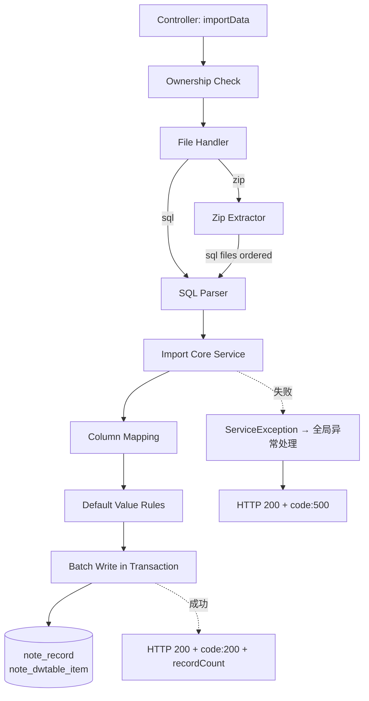
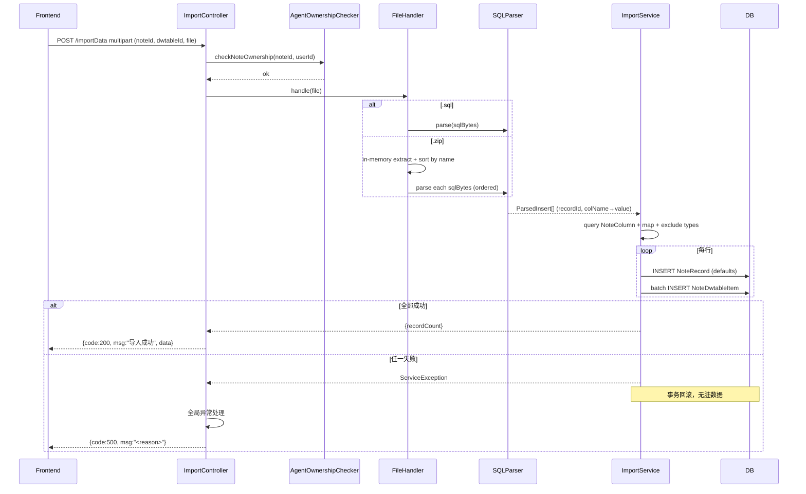

# 多维表格导入功能实现计划

## Summary

为多维表格新增 SQL 导入能力：用户在导出按钮左侧点击"导入"，上传 `.sql` 或 `.zip` 文件，后端在单个事务内解析 INSERT、按列名宽松匹配目标表列、跳过排除类型列（18/20/21/23/24/25/26），为每行创建新 `NoteRecord` + 批量 `NoteDwtableItem`；成功弹框→确定→回调刷新，失败弹框→事务已回滚无需清理。复用既有 `LimitType.USER` 限流、`AgentOwnershipChecker` 归属校验、RuoYi 全局异常处理；不修改 `NoteRecordServiceImpl.insertNoteRecord`。

## Problem Frame

多维表格已有 SQL 导出能力（见 `docs/plans/2026-08-06-001-feat-multitable-export-plan.md`），用户可下载 `.sql`/`.zip` 备份或迁移数据，但缺少反向导入能力。数据丢失或迁移到新实例时，用户只能手动重新录入或直接操作数据库，前者费时易错，后者绕过应用层校验与默认值规则。

本轮导入补齐 SQL 导出的反向闭环：复用导出产物格式，使"导出→导入"形成完整 round-trip。导入严格走应用层，复用 `insertNoteRecord` 的默认值行为（实现上重新实现等价逻辑，不直接调用），确保数据落库行为与 UI 新增一致。

来源需求文档：[2026-08-25-multitable-import-requirements.md](file:///d:/WorkSpace/RuoYi-Vue/docs/brainstorms/2026-08-25-multitable-import-requirements.md)

---

## Requirements

本计划落地 origin 文档定义的 R-IDs（R1-R27）与验收示例（AE1-AE8），不重新发明需求级 R-IDs。各 Implementation Unit 的 Requirements 列表与内联引用直接使用 origin R-IDs，完整定义见 origin 文档。

- **导入触发与按钮**：R1（按钮位置 + disabled/loading 联动）, R2（文件选择器 + accept + 立即导入）
- **目标范围与文件格式**：R3（目标 = 当前 noteId/dwtableId）, R4（仅写 note_record + note_dwtable_item）, R5（接受 .sql/.zip）, R6（.sql 文件格式）, R7（CREATE TABLE 忽略）, R8（.zip 多 .sql 升序追加）
- **列映射**：R9（按 NoteColumn.name 宽松匹配）, R10（SQL 有/目标表无 → 跳过）, R11（目标表有/SQL 无 → 默认值）, R12（排除类型列）
- **数据写入与默认值**：R13（NoteRecord 默认值）, R14（NoteRecord.name 由 deriveRecordName 派生）, R15（NoteDwtableItem 写入 + NULL→""）, R16（link 字段不导入）, R17（record_id 仅用于行内分组）
- **事务与失败处理**：R18（单事务）, R19（失败回滚）, R20（失败响应 HTTP 200 + code:500）
- **成功与失败 UX**：R21（成功弹框 + 回调刷新）, R22（失败弹框）
- **安全与限流**：R23（归属校验）, R24（速率限制）, R25（zip-bomb 防护）, R26（PII 不进日志）
- **客户端断连与取消**：R27（服务端跑至事务完成，无视客户端断连）
- **关键流程**：F1（导入触发流）
- **验收示例**：AE1-AE8

---

## Key Technical Decisions

- **KTD1. 自定义 SQL 解析器，不引入 JSqlParser 依赖**。origin Deferred 列出自写解析器、JSqlParser、正则三选项。本计划选自写解析器：origin 限定为"与导出格式 round-trip"，列名/值规则由 `NoteDwtableSqlRenderer` + `SqlIdentifierSanitizer` + `SqlValueEscaper` 已固定（反引号标识符、单引号字符串、`''` 转义、`NULL` 关键字），自写解析器可精确匹配此契约。JSqlParser 引入新依赖且过度通用（处理 DDL/DCL/复杂查询）非本场景所需；正则在多行字符串与转义边界脆弱。解析器失败抛 `ServiceException` 触发事务回滚（R19）。外部 SQL 源（非本项目导出）的兼容性留待 v2 评估。

- **KTD2. 默认值策略：导入服务内重新实现，不直接调用 `insertNoteRecord`**。origin R13 表述"`viewId`/`property`/`linkRecordId`/`sort`/`linkName` 按 `insertNoteRecord` 的默认值规则填入"，但 feasibility 残留指出 `NoteRecordServiceImpl.insertNoteRecord`（L83-139）并未为 `property`/`linkRecordId`/`sort`/`linkName` 显式设默认值，与 R13 表述不一致。直接调用 `insertNoteRecord` 会暴露该不一致且修改既有 UI 新增路径（影响范围扩大）。本计划在导入服务内重新实现等价逻辑：`NoteRecord.dwtableId` = 当前目标表 id；`viewId` = null（与 UI 新增一致）；`property` = null；`linkRecordId` = null；`sort` = 当前最大 sort + 1（追加语义）；`linkName` = null；`name` 由 `NoteRecordServiceImpl.deriveRecordName(dwtableId, null, items)` 派生（直接调用该方法，非整个 `insertNoteRecord`；第三参数传 `NoteDwtableItem` 列表作为 existingItems，匹配 `recomputeRecordNamesForTable` L1492 模式）。

- **KTD3. zip 处理在内存中，无落盘，含 zip-bomb 与 zip-slip 双重防护**。`.zip` 用 `java.util.zip.ZipInputStream` 流式读入内存（`ByteArrayOutputStream`），不写入磁盘临时文件，避免 IO 与清理开销。zip-bomb 防护（R25）：解压累计字节数超阈值（初始 100MB，Deferred）或压缩比超阈值（初始 100:1，Deferred）即拒绝并抛 `ServiceException` 复用 R20 失败响应。zip-slip 防护（KTD3 自身）：内存解压本身无落盘路径穿越风险，但入口名仍需净化以避免下游按入口名排序时被恶意名注入；净化规则复用 `ZipEntryNameSanitizer` 模式（来自导出计划 U4）。

- **KTD4. 列名匹配规则：去反引号 + trim，区分大小写，不做全角/半角转换**。origin Deferred 列出此问题。本计划决策：SQL 列名剥离反引号后做 `trim()`，与目标表 `NoteColumn.name` 字符串相等比较（`String.equals`，区分大小写）；不做全角/半角归一化、不做大小写折叠。原因：`NoteColumn.name` 存储原值，导出端 `SqlIdentifierSanitizer` 保留中文与原字符，round-trip 场景下严格相等匹配即可；全角/半角折叠为额外特性，留待 v2。

- **KTD5. 单事务批量写入：`@Transactional` + MyBatis `foreach` 批量 insert（`#{}` 参数化）**。origin R18 要求整次导入包在单个事务内。本计划决策：导入服务方法标 `@Transactional(rollbackFor = Exception.class)`；每行 `NoteRecord` 单条 insert（取自增 id），同行的 `NoteDwtableItem` 通过 MyBatis `foreach` 拼一条批量 `INSERT INTO note_dwtable_item (...) VALUES (...), (...), ...`；多行则多批。**所有值占位符必须使用 `#{}`（如 `#{item.value}`），禁止 `${}` 字符串拼接**——`SqlValueEscaper` 仅用于导出端 `.sql` 文本字面量，不适用于导入端 DB 写入；新 foreach mapper 参考既有 `NoteDwtableItemMapper.insertNoteDwtableItem` 的 `#{}` 参数化契约。任一步骤抛 `ServiceException` 即整体回滚（R19）。批量大小由行内单元格数决定，单批上限 Deferred（初始 500 单元格/批）。

- **KTD6. 复用导出基础设施：`LimitType.USER` 限流、`AgentOwnershipChecker` 归属校验、RuoYi 全局异常处理**。导出计划 U6 已扩展 `LimitType.USER` 与 `RateLimiterAspect.getCombineKey` USER 分支，本计划直接复用 `@RateLimiter(time=60, count=10, limitType=LimitType.USER)`（对称导出参数）；`AgentOwnershipChecker.checkDwtableOwnership(dwtableId, SecurityUtils.getUserId())` 复用既有归属校验（admin 通行，传递验证 dwtableId→noteId→auth 链）；额外断言 `dwtable.noteId.equals(noteId)` 防 noteId↔dwtableId 不匹配（导出端点无 dwtableId 参数，"对称导出"仅适用于限流与异常处理，不适用于权限校验路径）；失败响应复用 RuoYi 全局异常处理返回 HTTP 200 + JSON `{code:500, msg}`，对称导出 API 失败模式。

---

## High-Level Technical Design

### 组件协作

### 导入请求时序

---

## Implementation Units

### U1. SQL 解析器（INSERT → 列名 + 值 + record_id 分组）

- **Goal:** 把 `.sql` 文本解析为 `ParsedInsert` 列表，每条含源 `record_id`（首列）与列名→值映射；忽略 `CREATE TABLE`，处理反引号标识符、单引号字符串、`''` 转义、`NULL` 关键字、多行 INSERT。
- **Requirements:** R6, R7, R17, KTD1
- **Dependencies:** 无（首个单元，U3 依赖其产出）
- **Files:**
  - 新建 `ruoyi-system/src/main/java/com/ruoyi/system/service/impl/SqlInsertParser.java`
  - 新建 `ruoyi-system/src/main/java/com/ruoyi/system/domain/dto/ParsedInsert.java`（recordId:Long, columnValues:Map<String,String>，NULL 已转为 null）
  - 测试 `ruoyi-system/src/test/java/com/ruoyi/system/service/impl/SqlInsertParserTest.java`
- **Approach:**
  - 逐行扫描跳过 `CREATE TABLE` 与非 `INSERT` 语句；遇 `INSERT INTO` 起始解析。
  - 表名解析：跳过 `INSERT INTO` 与 `(` 之间的标识符（含反引号）；`CREATE TABLE` 表名与 `INSERT INTO` 表名均忽略（R3 不创建新表）。
  - 列名解析：`(` 与 `)` 之间按逗号分割，每段去反引号 + trim 得列名；首列固定 `record_id`（R6/R17）。
  - 值解析：`VALUES` 之后按 SQL 语法解析元组列表（支持多行、多组）；单引号字符串识别 `''` 转义与 `\\` 转义；`NULL` 关键字转为 Java null；数值/日期原样保留为字符串（导入服务按列类型处理）。
  - 多行 INSERT（一条 `INSERT ... VALUES (...),(...),(...)`）展开为多条 `ParsedInsert`，每条复用同一列名顺序、对应位置值。
  - 解析失败抛 `ServiceException("SQL 解析失败：<detail>")` 触发 R19 回滚。
- **Patterns to follow:**
  - `SqlValueEscaper`（导出计划 U3）的转义规则作为解析器反向契约：`'`→`''`、`\`→`\\`、控制字符转义。
  - `SqlIdentifierSanitizer`（导出计划 U3）的反引号包裹规则作为列名剥离契约。
- **Test scenarios:**
  - Covers AE1. 单 INSERT 解析：`INSERT INTO \`T\` (\`record_id\`,\`名称\`) VALUES (10,'foo')` → `ParsedInsert(recordId=10, {名称=foo})`。
  - 多 INSERT 顺序：3 条独立 `INSERT` 语句 → 3 条 `ParsedInsert`，顺序保留。
  - 多行 INSERT 展开：`INSERT INTO ... VALUES (10,'a'),(11,'b'),(12,'c')` → 3 条 `ParsedInsert`。
  - NULL 值：`VALUES (10, NULL)` → `columnValues.get(col)=null`。
  - 字符串转义：`VALUES (10, 'It''s a test')` → 值为 `It's a test`。
  - 反斜杠转义：`VALUES (10, 'a\\b')` → 值为 `a\b`。
  - NUL 转义：`VALUES (10, 'a\0b')` → 值为 `a` + NUL char(0) + `b`。
  - 换行转义：`VALUES (10, 'a\nb')` → 值为 `a` + LF char + `b`（含换行符）。
  - 回车转义：`VALUES (10, 'a\rb')` → 值为 `a` + CR char + `b`（含回车符）。
  - Ctrl-Z 转义：`VALUES (10, 'a\u001ab')` → 值为 `a` + char(26) + `b`。
  - 双引号转义：`VALUES (10, 'a\"b')` → 值为 `a"b`。
  - CREATE TABLE 忽略：含 `CREATE TABLE` + `INSERT` 的文件 → 仅解析 `INSERT`，DDL 丢弃。
  - 中文列名：`INSERT INTO \`T\` (\`record_id\`,\`创建时间\`) VALUES (10, '2026-08-25')` → `columnValues` 含 `创建时间` 键。
  - 解析失败（缺 VALUES）：`INSERT INTO T (a) (1)` → 抛 `ServiceException`，msg 含 `SQL 解析失败`。
  - 解析失败（括号不平衡）：`INSERT INTO T (a VALUES (1)` → 抛 `ServiceException`。
- **Verification:** 单元测试覆盖 AE1 + NULL/转义/多行/中文/失败场景；`ParsedInsert` 结构含 `recordId` 与 `columnValues`；解析失败时抛 `ServiceException` 含可读 detail。

### U2. zip 处理器（内存解压 + 文件名升序 + zip-bomb/zip-slip 防护）

- **Goal:** 接收 `.zip` 字节，在内存中按文件名升序输出内部全部 `.sql` 文件字节列表；含 zip-bomb 与 zip-slip 防护，无落盘。
- **Requirements:** R5, R8, R25, KTD3
- **Dependencies:** 无（独立组件，U4 依赖其产出）
- **Files:**
  - 新建 `ruoyi-system/src/main/java/com/ruoyi/system/service/impl/ZipImportExtractor.java`
  - 测试 `ruoyi-system/src/test/java/com/ruoyi/system/service/impl/ZipImportExtractorTest.java`
- **Approach:**
  - `ZipInputStream` 流式读 `ZipEntry`，每个 entry 用 `ByteArrayOutputStream` 累积字节（不落盘）。
  - **zip-bomb 防护（R25）**：解压累计字节数超 `maxDecompressedBytes`（初始 100MB，Deferred）或单 entry 解压后大小 / entry 压缩大小 > `maxCompressionRatio`（初始 100:1，Deferred）即抛 `ServiceException("压缩包解压超限：...")` 触发 R20 失败响应。
  - **zip-slip 防护（KTD3）**：内存解压本身无落盘路径穿越风险；entry name 经 `ZipEntryNameSanitizer.sanitize()` 净化（复用导出计划 U4 同名工具，剥离前导 `/`/`\`、替换 `..` 段为 `_`、替换路径分隔符为 `_`、长度限制 255）后再用于按文件名升序排序。
  - 仅处理 `.sql` 扩展名的 entry，其他扩展名跳过并 log（不含 PII，仅 entry name 与跳过原因）。
  - 空包（无 .sql entry）抛 `ServiceException("压缩包内无 .sql 文件")`。
  - 损坏 zip（`ZipException`）抛 `ServiceException("压缩包解析失败：<detail>")`。
- **Patterns to follow:**
  - `ZipEntryNameSanitizer`（导出计划 U4）入口名净化模式。
  - `java.util.zip.ZipInputStream` 流式 API。
- **Test scenarios:**
  - Covers AE7. 多 .sql 升序：zip 含 `T_p3.sql`/`T_p1.sql`/`T_p2.sql` → 输出顺序 `T_p1.sql`/`T_p2.sql`/`T_p3.sql`。
  - 单 .sql：zip 含 1 个 `T.sql` → 输出 1 个文件字节。
  - 非 .sql 跳过：zip 含 `T.sql` + `readme.txt` → 仅输出 `T.sql`，log 跳过 `readme.txt`。
  - 空包拒绝：zip 无 .sql entry → 抛 `ServiceException("压缩包内无 .sql 文件")`。
  - **zip-bomb 字节超限**：解压累计 > 100MB → 抛 `ServiceException` 含 `压缩包解压超限`。
  - **zip-bomb 压缩比超限**：单 entry 压缩 1KB / 解压 200KB（200:1） → 抛 `ServiceException`。
  - **zip-slip 入口净化**：entry name `../etc/passwd.sql` → 净化后为 `__etc_passwd.sql`，参与排序。
  - **zip-slip 绝对路径**：entry name `/etc/passwd.sql` → 净化后为 `etc_passwd.sql`。
  - 损坏 zip：截断的 zip 字节 → 抛 `ServiceException("压缩包解析失败")`。
  - 内存约束：解压 50MB 的合法 .sql → 不写盘，全部在内存。
- **Verification:** 单元测试覆盖 AE7 + 空/损坏/zip-bomb/zip-slip/扩展名跳过场景；产出为有序 `List<byte[]>`；所有路径均不写盘（可通过临时目录断言验证无文件生成）。

### U3. 导入核心服务（列映射 + 默认值 + 单事务批量写入）

- **Goal:** 接收 `ParsedInsert` 列表与目标表信息，按列名宽松匹配 + 排除类型 + 默认值规则，在单个 `@Transactional` 内批量写入 `NoteRecord` + `NoteDwtableItem`；任一失败抛 `ServiceException` 触发整体回滚。
- **Requirements:** R3, R4, R9, R10, R11, R12, R13, R14, R15, R16, R17, R18, R19, R26, KTD2, KTD5
- **Dependencies:** U1, U2
- **Files:**
  - 新建 `ruoyi-system/src/main/java/com/ruoyi/system/service/INoteDwtableImportService.java`
  - 新建 `ruoyi-system/src/main/java/com/ruoyi/system/service/impl/NoteDwtableImportServiceImpl.java`
  - 新建 `ruoyi-system/src/main/java/com/ruoyi/system/domain/dto/ImportContext.java`（noteId, dwtableId, userId, parsedInserts）
  - 测试 `ruoyi-system/src/test/java/com/ruoyi/system/service/impl/NoteDwtableImportServiceImplTest.java`
- **Approach:**
  - 查询目标表 `NoteColumn` 列表（按 `dwtableId`），构建 `Map<String, NoteColumn>`（key = name，区分大小写，KTD4）。
  - 对每个 `ParsedInsert`：
    - **创建 `NoteRecord`**（KTD2 默认值规则）：`dwtableId` = 当前目标表 id；`viewId` = null；`property` = null；`linkRecordId` = null；`sort` = 当前最大 sort + 1（首条为 0，逐条递增）；`linkName` = null；`name` 调用 `NoteRecordServiceImpl.deriveRecordName(dwtableId, items, null)` 派生（直接调用该方法，非整个 `insertNoteRecord`，避免默认值不一致）。
    - **遍历 `columnValues`**：
      - 列名在目标表且类型 ∉ 排除清单（18/20/21/23/24/25/26） → 写 `NoteDwtableItem(recordId=新 NoteRecord.id, dwtId=dwtableId, columnId=映射列 id, value=SQL 值或 "" 若 null)`（R15，NULL→""，与 `insertNoteRecord` 的 `item.setValue` 一致）。
      - 列名在目标表但类型 ∈ 排除清单 → 跳过，不写 `NoteDwtableItem`（R12）。
      - 列名不在目标表 → 跳过，log 列名 + 跳过原因（不记录值，R10/R26）。
      - `record_id` 首列（`ParsedInsert.recordId`）仅用于行内分组，不写任何表（R17）。
    - **link 字段不导入**（R16）：`NoteDwtableItem` 的 `linkRecordId`/`linkItemId`/`linkColumnId`/`linkBlockId`/`linkNoteId` 一律 null。
    - **目标表有但 SQL 无的列**（R11）：不写 `NoteDwtableItem`，与 `insertNoteRecord` 在 items 缺失时的行为一致。
  - **批量写入（KTD5）**：每行 `NoteRecord` 单条 insert（取自增 id）；同行的 `NoteDwtableItem` 通过 MyBatis `foreach` 拼一条批量 `INSERT INTO note_dwtable_item (...) VALUES (...),(...),...`；多行则多批。单批上限 500 单元格（Deferred，初始值）。
  - **单事务（R18/R19）**：方法标 `@Transactional(rollbackFor = Exception.class)`；任一步骤抛 `ServiceException` 即整体回滚。
  - **PII 姿态（R26）**：所有日志只记录列名、行号、跳过/失败原因，不记录单元格值。
  - 返回 `ImportResult(recordCount=N)`。
- **Patterns to follow:**
  - `NoteRecordServiceImpl.deriveRecordName`（直接调用，非整个 `insertNoteRecord`）。
  - `NoteDwtableItem` 实体的 `setValue` null→"" 行为（与 `insertNoteRecord` 一致）。
  - `NoteDwtableExportPivotServiceImpl` 的 `DUAL_TYPES` 常量（含 18/21/24/25/26 双列关系类型分类依据；20 公式 / 23 数学公式为单独排除，不在 `DUAL_TYPES` 中）。
- **Test scenarios:**
  - Covers AE1. round-trip 完整导入：3 行 `ParsedInsert` + 列名与目标表一致 → 3 条 `NoteRecord` + 对应 `NoteDwtableItem`；`NoteRecord.name` 经 `deriveRecordName` 派生；`NoteRecord.id` 由 DB 分配（非源 record_id）。
  - Covers AE2. SQL 列多于目标表：`[record_id, 名称, 状态, 备注]`，目标表无"备注" → "备注"列值跳过，log 列名"备注"（不记录值）；`NoteDwtableItem` 数 = 2。
  - Covers AE3. 目标表列多于 SQL：`[record_id, 名称]`，目标表有"状态""备注" → 仅"名称"写 `NoteDwtableItem`，"状态""备注"不写。
  - Covers AE4. 排除类型列跳过：SQL 与目标表都有"关联列"（type=21） → "关联列"对应的 `NoteDwtableItem` 不写。
  - Covers AE8. 排除类型在目标表但不在 SQL：目标表有"公式列"（type=20）但 SQL 无 → 不写"公式列"的 `NoteDwtableItem`。
  - Covers AE5/AE6. 失败回滚：100 行中第 50 行写入抛 `SQLException` → 前 49 行已写的全部回滚，0 条 `NoteRecord` 残留。
  - NULL 值处理：`ParsedInsert.columnValues.get(col)=null` → `NoteDwtableItem.value=""`。
  - record_id 不映射：源 `record_id=10` → 新 `NoteRecord.id` 由 DB 分配（非 10）。
  - 默认值规则：`NoteRecord.viewId`/`property`/`linkRecordId`/`linkName` 为 null；`sort` 递增。
  - name 派生：`NoteRecord.name` == `deriveRecordName(dwtableId, items, null)` 返回值。
  - link 字段不导入：所有 `NoteDwtableItem` 的 `linkRecordId`/`linkItemId`/`linkColumnId`/`linkBlockId`/`linkNoteId` 均为 null。
  - PII 不进日志：跳过列时 log 输出仅含列名与"跳过原因"，不含 SQL 值。
  - 批量写入性能：100 行 × 10 列的导入 → `INSERT INTO note_dwtable_item` 次数为 O(行数) 而非 O(行数×列数)。
- **Verification:** 单元 + 集成测试覆盖 AE1-AE8 + NULL/默认值/link 字段/PII/批量性能场景；事务回滚后查 `note_record` 与 `note_dwtable_item` 行数为 0；`NoteRecord.name` 等于 `deriveRecordName` 返回值。

### U4. 导入端点（auth + rate limit + multipart + 错误响应）

- **Goal:** 新增 `POST /system/dwtable/importData` 端点接收 multipart 文件，串联 U1/U2/U3 完成；含归属校验、按用户限流、错误响应复用 RuoYi 全局异常处理。
- **Requirements:** R3, R5, R18, R19, R20, R23, R24, R25, R26, F1, KTD6
- **Dependencies:** U1, U2, U3
- **Files:**
  - 修改 `ruoyi-admin/src/main/java/com/ruoyi/web/controller/system/NoteDwtableController.java`（新增 `importData` 端点）
  - 测试 `ruoyi-admin/src/test/java/com/ruoyi/web/controller/system/NoteDwtableControllerImportTest.java`
- **Approach:**
  - 端点签名：`POST /system/dwtable/importData`，参数 `noteId:Long, dwtableId:Long, file:MultipartFile`（multipart/form-data）。
  - **权限（R23/KTD6）**：调用 `AgentOwnershipChecker.checkDwtableOwnership(dwtableId, SecurityUtils.getUserId())`（admin 通行，复用导出端点既有归属校验链 `dwtableId→noteId→auth`）。端点签名收 `noteId`+`dwtableId` 两参数，须额外断言 `dwtable.noteId.equals(noteId)` 防 noteId↔dwtableId 不匹配（导出端点无 `dwtableId` 参数，"对称导出"仅适用于限流与异常处理，不适用于权限校验路径）。
  - **限流（R24/KTD6）**：`@RateLimiter(time=60, count=10, limitType=LimitType.USER)`（复用导出计划 U6 已扩展的 `LimitType.USER`，对称导出参数）。
  - **文件大小**：依赖 RuoYi/Spring Boot multipart 默认上限（`spring.servlet.multipart.max-file-size`），超限由全局异常处理返回友好错误（具体阈值 Deferred 至实现期 read config）。
  - **分流**：按文件扩展名分流——`.sql` → 直接调 U1 解析；`.zip` → 调 U2 解压得有序 `.sql` 字节列表 → 逐个调 U1 解析；其他扩展名 → 抛 `ServiceException("不支持的文件类型")`。
  - **整合**：所有 `ParsedInsert` 合并后调 U3 写入。
  - **成功响应（R21 后端触发）**：`HTTP 200 + JSON {code:200, msg:"导入成功", data:{recordCount:N}}`，前端收到后弹 R21 成功弹框。
  - **失败响应（R20/KTD6）**：所有 `ServiceException` 经 RuoYi 全局异常处理返回 `HTTP 200 + JSON {code:500, msg:"<失败原因>"}`，对称导出 API 失败模式。
  - `@Log(title="多维表格导入", businessType=BusinessType.IMPORT)` 作为基线操作日志（不写 PII 专用日志，因导入是数据流入而非流出，R26 仅约束不记录单元格值）。
- **Patterns to follow:**
  - `NoteDwtableController.exportData`（导出计划 U5）的端点结构、`@Log` + `BusinessType.EXPORT` 模式、`AgentOwnershipChecker` 调用、`@RateLimiter` 注解。
  - RuoYi 全局异常处理（`@RestControllerAdvice`）返回 `{code:500, msg}` 模式。
- **Test scenarios:**
  - Covers R3. 端点存在：`POST /system/dwtable/importData` 返回 200 + JSON（端点收 noteId+dwtableId 落地 R3 目标范围）。
  - Covers R23. 无权限拒绝：用户 A 导入用户 B 的笔记 → 抛 `ServiceException("无权操作他人数据")` → 响应 `{code:500, msg:"无权操作他人数据"}`。
  - Covers R23. noteId↔dwtableId 不匹配：传入的 `noteId` 与 `dwtableId.noteId` 不一致 → 抛 `ServiceException("noteId 与 dwtableId 不匹配")` → 响应 `{code:500, msg:"noteId 与 dwtableId 不匹配"}`，不进入解析/写入流程。
  - admin 通行：admin 导入任意 noteId → 正常导入。
  - Covers R24. 按用户限流：同一 userId 60s 内调用 11 次 → 第 11 次响应 `{code:500, msg:"访问过于频繁"}`；同时另一 userId 调用不受影响。
  - Covers R5. 文件类型分流：`.sql` 单文件 → 直接解析；`.zip` → 解压 + 有序解析；`.txt` → `{code:500, msg:"不支持的文件类型"}`。
  - Covers R20. 解析失败响应：损坏 SQL → `{code:500, msg:"SQL 解析失败：<detail>"}`。
  - Covers R20/R25. zip 失败响应：损坏 zip → `{code:500, msg:"压缩包解析失败"}`；zip-bomb → `{code:500, msg:"压缩包解压超限"}`。
  - Covers R21. 成功响应：3 行合法 SQL → `{code:200, msg:"导入成功", data:{recordCount:3}}`。
  - 事务回滚后无脏数据：导入失败后查 `note_record`/`note_dwtable_item` 行数未变。
- **Verification:** 端点集成测试覆盖权限/限流/文件分流/成功响应/各类失败响应；响应 JSON 结构符合 R20/R21；事务回滚后无脏数据残留。

### U5. 前端导入按钮 + 弹框反馈（左置 + disabled/loading/error + 成功回调刷新 + 失败提示）

- **Goal:** 在多维表格页导出按钮左侧新增"导入"按钮，点击触发文件选择器；导入中显示 loading；成功弹框→确定→回调刷新；失败弹框→确定→无需清理。
- **Requirements:** R1, R2, R21, R22, R27, F1
- **Dependencies:** U4
- **Files:**
  - 修改 `notepad/src/components/baseTable/index.vue`（在导出按钮 tooltip 块之前插入导入按钮 tooltip 块，复用 `exportDisabled` 联动）
  - 新建 `notepad/src/api/import.ts`（封装 `POST /system/dwtable/importData` multipart 请求，参考 `notepad/src/api/export.ts`）
- **Approach:**
  - **按钮位置（R1）**：在 [index.vue](file:///d:/WorkSpace/RuoYi-Vue/notepad/src/components/baseTable/index.vue) L8-23 现有导出 tooltip/button 块之前插入导入 tooltip/button 块，使导入按钮位于导出按钮左侧（Toolbar 内 DOM 顺序）。
  - **disabled 联动（R1）**：复用 `exportDisabled` 计算属性（未选多维表格时为 true），导入按钮与导出按钮共享同一禁用条件；hover 提示"请先选择多维表格"。
  - **loading 联动（R1）**：点击导入后按钮进入 loading + disabled 态，期间禁止重复点击；同时调 `message.loading({ content: '正在导入，请稍候…', duration: 0 })`（对称导出 L586 `message.loading({ content: '正在导出，请稍候…', duration: 0 })` 模式）显示全屏轻提示；导入完成（成功或失败）后 `message.destroy()` 关闭 loading 提示并恢复按钮态。
  - **文件选择（R2）**：点击导入按钮触发 `<input type="file" accept=".sql,.zip">`，用户选择文件后立即开始导入，无中间确认弹窗（与导出的格式选择弹窗不同——导入无格式选择需求）。
  - **成功路径（R21）**：后端返回 `{code:200, msg:"导入成功", data:{recordCount:N}}` → 弹框 `Modal.success({title:"导入成功", content:`成功导入 ${N} 条记录`})` → 用户点击"确定" → 回调调用既有表格刷新方法 `table.get.list()`（[index.vue](file:///d:/WorkSpace/RuoYi-Vue/notepad/src/components/baseTable/index.vue) L359，delete 后刷新同一入口）。注：导出端点仅下载文件不刷新表格，"与导出后刷新一致"表述不准确，此处明确为 `table.get.list()`。
  - **失败路径（R22）**：后端返回 `{code:500, msg:"<reason>"}` → 弹框 `Modal.error({title:"导入失败", content:msg})` → 用户点击"确定" → 无需额外清理（事务已回滚）。
  - **客户端断连（R27）**：导入在服务端跑至事务完成，无视客户端断连；本轮不提供客户端取消入口；若用户在导入过程中离开页面，下次加载时表格反映已提交状态（成功则新记录可见，失败则无变化），不再补弹框。
  - **网络异常**：请求超时或断连 → 弹框 `Modal.error({title:"导入失败", content:"导入超时或网络异常"})`。
- **Patterns to follow:**
  - 既有导出按钮的 `a-tooltip` + `a-button` + `exportDisabled` + `exportModal.loading` 三态模式（[index.vue](file:///d:/WorkSpace/RuoYi-Vue/notepad/src/components/baseTable/index.vue) L8-23）。
  - `notepad/src/api/export.ts` 的 API 封装模式（multipart 文件上传）。
  - 既有表格刷新方法 `table.get.list()`（[index.vue](file:///d:/WorkSpace/RuoYi-Vue/notepad/src/components/baseTable/index.vue) L359，delete 后刷新同一入口；导出端点仅下载文件不调用此方法）。
- **Test scenarios:**
  - Covers R1. 按钮位置：导入按钮在导出按钮左侧（DOM 顺序在导出 tooltip 块之前）。
  - Covers R1. disabled 态：未选多维表格 → 导入按钮 disabled，hover 显示"请先选择多维表格"。
  - Covers R1. loading 态：点击导入后按钮 loading + disabled，期间再次点击无效；完成（成功或失败）后恢复。
  - Covers R1/R2. 触发文件选择：点击导入 → 文件选择器弹出，accept 仅 `.sql`/`.zip`。
  - Covers R21. 成功弹框 + 回调刷新：导入成功 → `Modal.success` 显示"导入成功"与记录数；点击"确定" → 表格刷新显示新记录。
  - Covers R22. 失败弹框：导入失败 → `Modal.error` 显示后端 `msg`；点击"确定" → 表格未变化（事务回滚）。
  - Covers R22. 网络异常：请求超时 → `Modal.error` 显示"导入超时或网络异常"。
  - 文件类型限制：accept 仅接受 `.sql`/`.zip`；选择其他扩展名被浏览器过滤。
- **Verification:** 前端 e2e 或手动验证：按钮位置正确、disabled/loading/error 三态覆盖、成功弹框回调刷新、失败弹框显示后端原因、accept 限制文件类型。

---

## Scope Boundaries

### Deferred for later

- Excel/CSV 等非 SQL 格式导入（origin Deferred for later）。
- 双向链接/单向关联/语义关联/lookup/公式/数学公式/集合运算列的导入值（origin Deferred for later；排除清单 18/20/21/23/24/25/26）。
- 导入前 dry-run 预校验（origin Deferred for later；本轮用事务回滚兜底）。
- 重复导入去重（origin Deferred for later；每次导入即新记录）。
- 跨实例 ID 一致性（origin Deferred for later；不保留源 `record_id`）。
- 外部 SQL 源（非本项目导出）的兼容性解析（KTD1 决策依据；JSqlParser 评估留待 v2）。
- 全角/半角列名归一化（KTD4 决策依据；v2 特性）。

### Outside this product's identity

- 跨表 schema 迁移（origin Outside；导入仅写入当前目标表，不创建新表）。
- 直接执行任意 SQL（origin Outside；仅解析 `INSERT` 的列名与值，不执行任意 SQL）。

### Deferred to Follow-Up Work

- zip-bomb 阈值校准（U2 实现初始 100MB / 100:1，后续按实测调整）。
- 批量写入单批上限校准（U3 实现初始 500 单元格/批，后续按性能测试调整）。
- multipart 文件大小上限的配置读取（U4 实现期 read RuoYi/Spring Boot multipart config）。
- "导入成功"弹框的具体文案（U5 实现期，按 R25 + 记录数模板）。

---

## Risks & Dependencies

- **超大单事务撑爆 undo log / 长时间持锁**：R18 要求整次导入在单个 `@Transactional` 内，AE7 用例为 5000 行单事务，但未声明上限（origin F-007 deferred）。U3 实现单事务批量写入，超大导入（数十万行）可能撑爆 MySQL undo log 或长时间持有锁影响实例可用性。本轮不做分批事务，依赖运维侧通过 multipart 文件大小上限间接限制规模；阈值校准 Deferred。
- **`insertNoteRecord` 默认值不一致暴露**：feasibility 残留指出 `insertNoteRecord`（L83-139）未为 `property`/`linkRecordId`/`sort`/`linkName` 显式设默认值。KTD2 决策在导入服务内重新实现等价逻辑，避免直接调用 `insertNoteRecord` 暴露该不一致；但导入服务的默认值规则需与 UI 新增路径行为对齐，需在 U3 测试场景中显式验证。
- **错表导入成功落库**：adversarial 残留指出 R10/R11 宽松匹配下，用户上传错表 SQL 到当前目标表会成功落库（"用户自行对齐目标表"在 origin 中已声明，但产生误导性成功状态）。本轮不引入预校验（origin Scope Boundaries 已声明），依赖用户自觉；后续可考虑 dry-run 预校验（Deferred）。
- **zip-slip 解压路径遍历**：KTD3 + U2 通过内存解压（无落盘）+ 入口名净化双层防护；内存解压本身无路径穿越风险，净化仅为避免下游按入口名排序时被恶意名注入。
- **PII 单元格值泄露到日志**：R26 + U3 通过日志只记录列名 + 行号 + 跳过/失败原因约束；U3 测试场景显式验证跳过列时不记录单元格值。
- **限流基础设施已就绪**：导出计划 U6 已扩展 `LimitType.USER` 与 `RateLimiterAspect.getCombineKey` USER 分支，本计划 U4 直接复用 `@RateLimiter(limitType=LimitType.USER)`，无新基础设施变更。
- **多 `INSERT` 多行批量写入性能**：U3 通过 MyBatis `foreach` 批量 `INSERT`，避免逐单元格写入；测试场景覆盖批量性能（O(行数) 而非 O(行数×列数)）。

---

## System-Wide Impact

- **新增端点** `POST /system/dwtable/importData`，无破坏性变更，既有端点保持不变。
- **复用既有基础设施**：`AgentOwnershipChecker`（归属校验，对称导出）、`@Log` + `BusinessType.IMPORT`（基线审计）、`@RateLimiter(limitType=LimitType.USER)`（按用户限流，复用导出计划 U6 扩展）、`java.util.zip.ZipInputStream`（内存解压）、RuoYi 全局异常处理（失败响应 `{code:500, msg}`）。
- **无新依赖**：JSqlParser 不引入（KTD1），zip 处理用 JDK `java.util.zip`，SQL 解析与默认值规则纯 JDK + Spring/MyBatis 既有栈。
- **无 `insertNoteRecord` 修改**：KTD2 决策在导入服务内重新实现等价逻辑，UI 新增路径行为不变。
- **新增日志约束**：导入处理与跳过日志一律不记录单元格值（R26），运维侧无需新建审计通道（导入是数据流入而非流出，与导出的 PII 专用日志通道不对称；R26 仅约束不记录单元格值，本计划沿用此约束）。
- **受影响方**：多维表格使用者（A1）获得导入能力；运维需关注按用户限流参数（60s/10，对称导出）、multipart 文件大小上限配置、单事务规模上限的运营监控。

---

## Outstanding Questions

### Resolve Before Implementation

- 无。所有阻塞决策已在 brainstorm、`ce-doc-review` 修订与本计划 KTD1-KTD6 中明确：SQL 解析方案（KTD1）、默认值策略（KTD2）、zip 处理（KTD3）、列名匹配规则（KTD4）、事务与批量策略（KTD5）、基础设施复用（KTD6）。

### Deferred to Implementation

- zip-bomb 阈值具体数值（U2 实现初始 100MB / 100:1，按实测校准）。
- 批量写入单批上限（U3 实现初始 500 单元格/批，按性能测试校准）。
- multipart 文件大小上限配置读取（U4 实现期 read `spring.servlet.multipart.max-file-size`）。
- "导入成功"弹框的具体文案模板（U5 实现期，按 R25 + 记录数）。
- `ParsedInsert.columnValues` 中数值/日期值的类型处理（U3 实现期，按 `NoteColumn.type` 决定是否需要解析为数字/日期对象或保留字符串）。
- 单选/多选 `value` 为选项 id 时的导入行为（U3 实现期，按 origin Deferred 决策——保留 SQL 原值不解析为选项文本，与导出端 pivot 后的文本值 round-trip；如需选项 id 反向映射留待 v2）。
- 前端多维表格页导入按钮的具体 DOM 插入位置（U5 实现期，按 [index.vue](file:///d:/WorkSpace/RuoYi-Vue/notepad/src/components/baseTable/index.vue) L8-23 现有导出 tooltip 块之前）。
- `@RateLimiter` 在导入端点的 `count` 值校准（U4 实现初始 10/60s 对称导出，按安全评估调整）。

---

## Sources & Research

- **需求文档**：[docs/brainstorms/2026-08-25-multitable-import-requirements.md](file:///d:/WorkSpace/RuoYi-Vue/docs/brainstorms/2026-08-25-multitable-import-requirements.md)
- **对称导出计划**：[docs/plans/2026-08-06-001-feat-multitable-export-plan.md](file:///d:/WorkSpace/RuoYi-Vue/docs/plans/2026-08-06-001-feat-multitable-export-plan.md) — 端点结构、限流基础设施（U6 `LimitType.USER`）、归属校验、`SqlValueEscaper`/`SqlIdentifierSanitizer`/`ZipEntryNameSanitizer` 工具的契约来源。
- **领域词汇**：[CONCEPTS.md](file:///d:/WorkSpace/RuoYi-Vue/CONCEPTS.md) — NoteDwtableItem、NoteColumn、Double Link Column、Lookup Column、Set Operation Column、Semantic Link Column。
- **既有代码**：
  - [NoteRecordServiceImpl.java](file:///d:/WorkSpace/RuoYi-Vue/ruoyi-system/src/main/java/com/ruoyi/system/service/impl/NoteRecordServiceImpl.java) L83-139 — `insertNoteRecord` 实现（KTD2 决策依据：未为 `property`/`linkRecordId`/`sort`/`linkName` 显式设默认值）；`deriveRecordName(dwtableId, items, null)` 派生方法（U3 直接调用）。
  - [NoteDwtableExportPivotServiceImpl.java](file:///d:/WorkSpace/RuoYi-Vue/ruoyi-system/src/main/java/com/ruoyi/system/service/impl/NoteDwtableExportPivotServiceImpl.java) L43-78 — 列类型常量 `TYPE_DOUBLE_LINK=21L`/`TYPE_SEMANTIC_LINK=25L`/`TYPE_LOOKUP=26L` + `DUAL_TYPES` 分类（U3 排除清单依据，含 type 18/24）。
  - [NoteDwtableSqlRenderer.java](file:///d:/WorkSpace/RuoYi-Vue/ruoyi-system/src/main/java/com/ruoyi/system/service/impl/NoteDwtableSqlRenderer.java) — SQL 渲染器，定义 `CREATE TABLE` + `INSERT` 结构、`SHARD_SIZE=2000` 分片规则、列名经 `SqlIdentifierSanitizer` 包裹（U1 解析器反向契约）。
  - [SqlIdentifierSanitizer.java](file:///d:/WorkSpace/RuoYi-Vue/ruoyi-system/src/main/java/com/ruoyi/system/service/impl/SqlIdentifierSanitizer.java) — 列名/表名净化工具，保留中文与反引号规则（U1 列名剥离契约）。
  - [SqlValueEscaper.java](file:///d:/WorkSpace/RuoYi-Vue/ruoyi-system/src/main/java/com/ruoyi/system/service/impl/SqlValueEscaper.java) — SQL 值转义工具（U1 值反向解析契约：`'`→`''`、`\`→`\\`、控制字符转义）。
  - [NoteDwtableController.java](file:///d:/WorkSpace/RuoYi-Vue/ruoyi-admin/src/main/java/com/ruoyi/web/controller/system/NoteDwtableController.java) — 既有导出端点 `exportData` 结构（U4 对称参考）。
  - [AgentOwnershipChecker.java](file:///d:/WorkSpace/RuoYi-Vue/ruoyi-system/src/main/java/com/ruoyi/system/agent/security/AgentOwnershipChecker.java) — `checkNoteOwnership(noteId, userId)`，admin 通行（U4 权限校验）。
  - [LimitType.java](file:///d:/WorkSpace/RuoYi-Vue/ruoyi-common/src/main/java/com/ruoyi/common/enums/LimitType.java) — 限流类型枚举，含 `USER`（导出计划 U6 已扩展，U4 复用）。
  - [RateLimiterAspect.java](file:///d:/WorkSpace/RuoYi-Vue/ruoyi-framework/src/main/java/com/ruoyi/framework/aspectj/RateLimiterAspect.java) — 限流切面，`getCombineKey` 含 USER 分支（导出计划 U6 已扩展）。
  - [baseTable/index.vue](file:///d:/WorkSpace/RuoYi-Vue/notepad/src/components/baseTable/index.vue) L8-23 — 现有导出按钮位置与 disabled/loading 联动（U5 导入按钮左置参考）。
  - [notepad/src/api/export.ts](file:///d:/WorkSpace/RuoYi-Vue/notepad/src/api/export.ts) — 导出 API 封装（U5 导入 API 封装对称参考）。
- **依赖版本**：JDK `java.util.zip`、Spring Boot multipart、MyBatis foreach、fastjson2（均已在 `pom.xml`/`ruoyi-common/pom.xml`）；无新依赖引入。

## Deferred / Open Questions

### From 2026-08-26 review

- **sort=max+1 diverges from UI new path; 'equivalent logic' claim is false** — KTD2 (P1, adversarial, confidence 75)

  Imported records will sort inconsistently against UI-new records because the plan invents sort=max+1 behavior that the UI new path does not have. NoteRecordController.add (L134-150) never sets sort on the new NoteRecord, and insertNoteRecord (L83-139) does not compute max+1 — so UI-new records land with sort=null while imported records land with sort=0,1,2,.... NoteRecordMapper.xml uses 'order by sort', and MySQL sorts nulls first in ASC, so UI-new records cluster at the top while imported records interleave below — a visible behavioral divergence the plan's 'equivalent logic' claim masks and U3's test scenarios never verify against.

- **KTD4 round-trip breaks for column names with spaces/special chars** — KTD4 (P1, adversarial, confidence 75)

  Column names containing spaces, punctuation, or any non-\p{L}\p{N}_ character will silently fail to match on import, producing rows with missing cells and no error. The plan claims '导出端 SqlIdentifierSanitizer 保留中文与原字符', but SqlIdentifierSanitizer L112 replaces [^\p{L}\p{N}_] with '_' — so a column named 'Column Name' is exported as `Column_Name`, and the import's String.equals comparison against target NoteColumn.name='Column Name' fails. NoteColumn.name has no validation (free-form String in insertNoteColumn), so users can and do create columns with spaces, making this a common round-trip failure mode rather than an edge case.

- **multipart limit does not bound .zip transaction size as claimed** — Risks & Dependencies (P2, adversarial, confidence 75)

  Ops setting spring.servlet.multipart.max-file-size will believe they've bounded import transaction size, but for .zip imports the multipart limit bounds only compressed bytes — the 100MB decompressed cap (KTD3) is the actual bound, and it permits roughly 2M one-row INSERTs in a single @Transactional (AE7 is 5000 rows; 2M is 400x). That far exceeds typical MySQL undo-log and lock-duration comfort. The plan's stated mitigation ('multipart limit indirectly bounds scale') is incorrect for the .zip path, so the undo-log/lock risk it claims to mitigate is effectively unmitigated, and the deferred calibration has no concrete ceiling to calibrate against.
