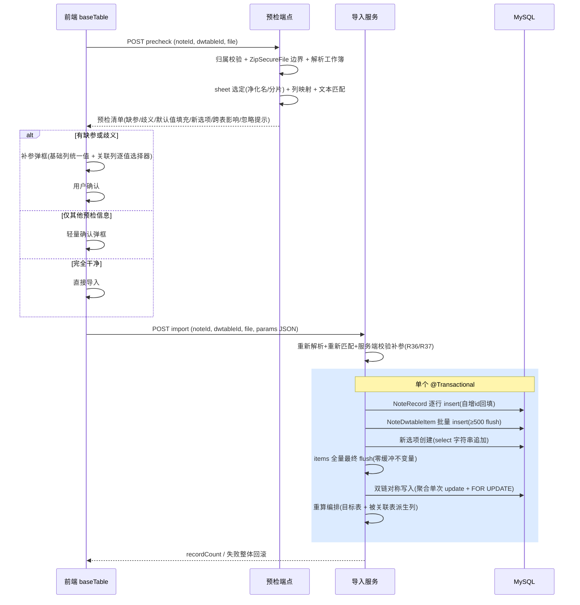

# feat: 多维表格 Excel 导入

## Summary

为多维表格导入扩展 Excel（.xlsx）格式：两阶段交互（预检返回缺参与影响面清单 → 用户补参 → 单事务导入），配套六类基础列的列默认值配置，关联列按记录名文本匹配目标表现有记录并完成双链对称写入。全部实现落在 worktree `feat/multitable-import` 分支（该分支是主分支的严格超集，含全部导入基础设施），含 POI 4.1.2 → 5.4.0+ 依赖升级。

---

## Problem Frame

现有导入仅接受 SQL/zip（`docs/brainstorms/2026-08-25-multitable-import-requirements.md`，已在 feat/multitable-import 分支实现），Excel 格式（本系统导出产物与外部数据的最通用载体）无法导入。本计划兑现该需求文档的全部 38 条需求（R1-R38，已经 7 人代理审查修订），并解决其遗留的 2 条 Open Questions（记录选择器粒度、无缺参路径的确认形态）。

---

## Key Technical Decisions

- **KTD1 实现落点：worktree `feat/multitable-import` 分支继续叠加提交。** Excel 导入复用的全部基础设施（`AgentOwnershipChecker` USER 限流切面、`insertNoteDwtableItems` 批量 mapper、前端导入按钮与 `notepad/src/api/import.ts`、SQL 导入服务模式）只存在于该分支；该分支基于主 checkout HEAD `a12bf0d1`，是其严格超集，无 rebase 负担。主 checkout 的 67 个未提交文件（agent 迭代）与 worktree 存在 4 个重叠文件（CONCEPTS.md、`notepad/src/components/baseTable/index.vue`（U6 目标文件）、两个 untracked 的 agent 规格类——untracked 文件在合并时会被 git 直接拒绝而非内容冲突，index.vue 需人工合并）。合并时机由用户决定（SQL 导入与 Excel 导入一起或分批合回）。

- **KTD2 POI 升级 4.1.2 → 5.4.0（或更高 5.x）。** 4.x 已 EOL；本功能首次引入不可信 xlsx 解析，而 poi-ooxml <5.4.0 存在 CVE-2025-31672（重复 zip 条目名校验缺失）。外部研究证实：5.x 全系 Java 8+，现有 `ruoyi-common` ExcelUtil 用法零编译改动，工作量在依赖治理（移除旧 `ooxml-schemas`、对齐 commons-io ≥2.11、加 `log4j-to-slf4j` 桥）。选 5.4.0 而非 5.2.5：后者不修 CVE-2025-31672。

- **KTD3 双链对称写入独立实现，不复用 `updateNoteRecord`。** 该方法深度耦合单记录 itemMap 时序（集合运算在入库前触发、依赖内存新数据不变量），批量导入场景结构性不可用，逐行调用是 N+1。独立实现遵循 SQL 导入 KTD2 先例（绕过 UI 写入路径），并补齐三件事：back_field_id 配对解析、双向 item 写入（`linkRecordId`/`linkItemId`/`linkColumnId`/`value` 四字段对齐 UI 路径 L485-560）、语义等价测试对冲双实现漂移。**两处对 UI 路径的有意修正**（深审确认的缺陷，不复刻）：① `value` 追加的去重键统一为 recordId（UI 路径按记录名判重，同名新记录会使 value 与 linkRecordId 列表长度错位）；② 配对 item 不存在时 upsert 创建（UI 路径 null 仅打印日志即 NPE）。**聚合与并发**：对称写入聚合键=配对 item（recordId+columnId）本身，同 item 的全部追加在内存合并后单次 update；update 前对涉及行 `SELECT ... FOR UPDATE`，防并发 UI 编辑丢失更新。

- **KTD4 关联文本匹配批量预解析。** 按 ImportContext 模式：预检/导入时对每个被关联表一次性查询全部 `NoteRecord` 构建 name→id 映射（sort 升序迭代，同名首条胜出即 sort 最靠前），避免逐单元格查询的 N+1。匹配含整串优先规则：单元格文本先整串匹配记录名，命中则不拆分（处理记录名含逗号），未命中再按英文逗号拆分逐个匹配。

- **KTD5 两阶段 API：预检结果回传前端，阶段二重新解析重新匹配。** 预检不写库、结果随响应回传；阶段二携带补参 JSON 重新上传文件，服务端重新解析、重新执行列映射与文本匹配。补参按"列名 + 未命中名"键应用，语义规则（深审修订）：**补参覆盖的键以补参为准（含显式留空=不建立关联）**——用户刻意留空或映射到其他记录是显式指令，即便本次重新匹配该名字已命中也不覆盖用户意图；仅未覆盖的键用当下匹配结果。**反向漂移 fail-fast**：阶段二重新匹配后，若出现预检清单之外的未命中名/歧义变化、或补参记录 ID 已不存在，抛 `ServiceException`（"数据已变化，请重新预检"）整体拒绝，禁止静默降级丢关联。**文件同一性**：补参 JSON 附预检响应返回的文件指纹（size+hash），阶段二不一致即拒绝（防预检 A 文件、导入 B 文件的补参错位命中）。代价是文件解析两次——外部研究证实 50000 行用户态 API <20s，可接受。

- **KTD6 列默认值存于 `NoteColumn.property` JSON 的 `default` 键，写入走 mapper 直更。** 结构 `{"default": "<显示值>"}`（单选/多选存选项文本，日期存 `yyyy-MM-dd HH:mm:ss`，复选框存 `"true"/"false"`）。**路由不变量**：仅当列保存 diff 只含 `property.default` 键变更时走 `noteColumnMapper.updateNoteColumn` 直更（读原 property → 合并 `default` 键）；携带任何其他字段变更（name/isShow 等）仍走 `NoteColumnServiceImpl.updateNoteColumn` 原路径，保住列改名后的 recomputeRecordNamesForTable 等合法副作用（深审补充：绕过 service 须有明确边界，否则静默吞掉合法副作用）。**补充不变量（文档审查）**：diff 由后端在保存入口做字段级比对（前端提交不可信）；直更前执行与 service 路径等价的 `checkColumnOwnership` 归属校验（该校验只存在于 service 方法体内，Controller @PreAuthorize 已注释）；任何 property 写入路径（edit.vue 重建、service 覆盖、agent 更新）先读原 property 合并保留 `default` 键——否则改名/改选项保存会静默清除默认值。

- **KTD7 记录选择器按未命中名逐值选择（解决审查 Open Question）。** 关联列弹框按 distinct 未命中名分组，各自独立搜索选择目标记录或留空；不再"一条记录应用到全部未命中单元格"（统一值语义对实体引用不成立）。歧义项同样进入选择器，预选 sort 靠前记录可改选。

- **KTD8 派生列重算纳入导入事务，先 flush 后调用，编排范围覆盖目标表与被关联表。** `recomputeLookupColumnValues` + `recomputeSetOperationsForLookup` 经 `INoteRecordService` 接口注入调用（Spring 代理 → REQUIRED 加入导入事务）；调用前必须先 flush 累积的批量 items 使同事务内可见。**重算编排清单**（深审修订——对称写入修改 B 表配对列后，B 表派生列同样需要刷新）：目标表全部 lookup(26) 列 + 每个对称写入涉及的被关联表中以配对列为源（`double_link_column_id` 指向配对列，或集合运算 columnA/B 直接引用配对列）的 lookup 与集合运算(24) 列。已知局限随计划接受并记录：两方法内部逐 record try-catch 吞异常（单条重算失败不回滚导入），级联仅一层；重算对全表存量记录无差别 select+update 是事务时长的主导项之一（见 Risks）。目标表中 columnA/B **直接引用导入 18/21 列**的集合运算列：`recomputeSetOperationsForLookup` 以 lookup 列为键，此类列无现成批量方法，需提取/复用 `updateNoteRecord` 内联集合运算逻辑（唯一需新写重算入口的一块）。公式(20/23)列值由运行时计算、不存储 item（对齐 SQL 导入先例），无需重算。

- **KTD9 单元格值统一经 `DataFormatter` 取显示文本。** 与导出对称（导出写什么显示值，导入读什么显示值），日期单元格经 `DateUtil.isCellDateFormatted` 判定后格式化为 `yyyy-MM-dd HH:mm:ss` 字符串；数字列类型校验对显示文本做 parse 校验，违规单元格计入预检按缺参处理。

---

## High-Level Technical Design

---

## Requirements

### 文件与解析

- R1. 导入入口接受 `.xlsx`（accept 扩展），既有 SQL/zip 行为不变 (origin R1)。
- R2. sheet 选定：单 sheet 直用；多 sheet 先按净化名匹配（`[]:*?/\`→`_`、31 字符截断），无同名时识别"表名_p<序号>"分片家族按序合并为逻辑表，两者皆无报错；其余 sheet 忽略并提示 (origin R2)。已知限制：表名净化后 ≥29 字符时"_p序号"后缀被 31 字符截断破坏、识别失效（导出端行为），报错提示缩短表名。
- R3. 行数上限 50000、文件 10MB，超限快速失败 (origin R4)。
- R4. 解析资源边界：`ZipSecureFile` 三参数配置（minInflateRatio 默认 0.01、maxEntrySize 64MB、maxTextSize）、行×列数上限、落盘 File 打开 (origin R38)。

### 列映射

- R5. 列名精确匹配（区分大小写）优先；round-trip 后缀（`列名_文本`/`列名_ID`）与 record_id 列仅识别未精确命中的表头；目标表存在同名真实用户列时预检报表头冲突 (origin R5-R7)。
- R6. 隐藏列（isShow=1）不参与导入 (origin R8)。

### 列默认值

- R7. 六类基础列（1/2/3/4/5/7）支持 property JSON `default` 键配置，保存时格式校验拒绝非法值 (origin R9, R12)。
- R8. 默认值仅对导入与 UI 新增记录生效（预填可改），不回填存量 (origin R10, R11)。

### 预检与补参

- R9. 两阶段：预检（不写库）返回清单；导入携带补参执行；单表模型——目标为当前选定表 (origin R13, R3)。
- R10. 缺参三种情形（缺列/缺值[关联列空单元格除外]/关联未命中），填充优先级默认值 > 弹框 (origin R14, R15)。
- R11. 预检清单含：缺参项、默认值填充项（列名+默认值+行数）、新选项创建项、对称写入跨表影响（表名+记录数）、忽略 sheet/列提示、歧义统计；数字/日期/复选框单元格类型校验违规按缺参走补值链路 (origin R13)。
- R12. 弹框覆盖六类基础列与关联列(18/21)；基础列输入统一值，关联列按 distinct 未命中名逐值记录选择器（KTD7）(origin R16-R18)。
- R13. 无缺参且无歧义直接导入；有其他预检信息（默认值填充/新选项/跨表影响/忽略提示）显示轻量确认弹框，用户确认后导入 (origin R19 + OpenQ 决策)。

### 关联一致性

- R14. 文本匹配含整串优先规则（KTD4）；歧义默认 sort 靠前、进弹框预选可改选 (origin R20, R21)。
- R15. 未命中走逐值选择器；空单元格不建立关联不算缺参 (origin R22)。
- R16. 双链(21)对称写入四字段对齐 UI 路径；单向(18)仅写本表 item (origin R23, R24)。

### 派生与特殊列

- R17. 公式(20/23)/语义关联(25)不导入值（公式列值由运行时计算、不存储 item——对齐 SQL 导入先例）；lookup(26)/集合运算(24)靠重算——重算范围覆盖目标表（含 columnA/B 直接引用导入 18/21 列的集合运算列）**及对称写入涉及的被关联表**派生列，纳入阶段二同事务 (origin R25, R26, KTD8)。
- R18. 系统列(1001-1005)按系统语义生成 (origin R27)。
- R19. 单选整格、多选逗号拆分（与 `{"select": "..."}` 逗号字符串存储一致）逐个匹配，未命中自动追加新选项；选项上限每列每次导入 100 条，超限中止 (origin R28 + 审查补充)。

### 写入与事务

- R20. 每行新 `NoteRecord`：sort=maxSort+1 递增、name 按首个 type=1 列派生（同 SQL 导入） (origin R29)。
- R21. 单元格值三源合并：Excel 值 > 默认值 > 用户输入；NULL→空串 (origin R30)。
- R22. 阶段二全部写入（记录/单元格/选项/对称写入/重算）单事务，失败 `ServiceException` 整体回滚 (origin R31, R32)。

### 安全

- R23. 两阶段均做归属校验；被关联表（property.table_id）须同 noteId 且过归属校验，否则为预检错误响应（阻断整次导入，信息含列名与原因），不静默跳列 (origin R33, R37)。
- R24. 预检与导入端点均纳入 `@RateLimiter(time=60, count=10, USER)` (origin R34)。
- R25. 日志不含单元格值 (origin R35)。
- R26. 阶段二服务端独立校验补参：记录 ID 归属与访问范围、补值类型格式；预检结果不作可信输入 (origin R36, KTD5)。

---

## Implementation Units

### U1. POI 升级与安全解析基础

- **Goal:** poi-ooxml 4.1.2 → 5.4.0+，建立不可信 xlsx 的资源边界与动态列读取工具。
- **Requirements:** R3, R4（10MB 上限与资源边界）
- **Dependencies:** 无
- **Files:**
  - `pom.xml`（`<poi.version>`）
  - `ruoyi-common/pom.xml`（如需显式对齐 commons-io / log4j-to-slf4j）
  - `ruoyi-system/src/main/java/com/ruoyi/system/service/impl/ExcelWorkbookReader.java`（新建）
  - `ruoyi-system/src/test/java/com/ruoyi/system/service/impl/ExcelWorkbookReaderTest.java`（新建）
- **Approach:** 升级版本后先排查移除旧 `ooxml-schemas`/`poi-ooxml-schemas` 残留（5.x 改名 poi-ooxml-lite，冲突会类初始化失败）；对齐传递依赖（以 `mvn dependency:tree` 核对 POI 5.4.0 声明的 commons-io 传递版本并同步上调根 pom 钉版——现钉 2.11.0，≥2.11 只是历史下限；加 `log4j-to-slf4j`）。`ExcelWorkbookReader` 职责限定为**纯解析与资源边界**（深审修订：不承载导入域策略）——ZipSecureFile 三参数设置 → MultipartFile 落盘临时文件 → `WorkbookFactory.create(file)` → 返回全部 sheet 的表头（首行 `DataFormatter` 显示值）与数据行惰性迭代（行/列数上限检查），sheet 选定策略归 U3。临时文件 try-finally 删除。入口显式 `file.getSize()` 超 10MB 快速失败（R3，不依赖容器 multipart 配置隐式兜底）。`WorkbookFactory.create` 为 DOM 全量加载（创建时全量物化，"惰性"仅指遍历）：单元格总数上限须与 maxEntrySize 64MB、部署 JVM 堆联合定标，并发预检各持一份内存。临时文件用 `Files.createTempFile`（限定目录、不可预测名），originalFilename 不参与路径拼接（防目录穿越）。
- **Patterns to follow:** `ruoyi-common/src/main/java/com/ruoyi/common/utils/poi/ExcelUtil.java` 的 CellType 枚举用法（已核实 5.x 兼容）；`NoteDwtableExcelRenderer` 的 sheet 名净化逻辑（`sanitizeSheetName`，导入侧逆向复用其变换规则）。
- **Test scenarios:**
  - 升级后既有 Excel 相关测试回归：worktree 既有自动化仅 `NoteDwtableExcelRendererTest`（渲染器导出路径，不经 ExcelUtil）——全绿是最低门槛。
  - 资源边界：压缩比 <1% 的构造 zip 拒绝（ZipSecureFile）；>50000 行拒绝；列数超限拒绝；>10MB 文件显式拒绝。
  - 临时文件清理：读取完成/异常后临时文件删除。
- **Verification:** `mvn test -pl ruoyi-system,ruoyi-admin -am -DfailIfNoTests=false -B` 全绿（在 worktree 内执行）；手测两轮——Excel 导出下载正常 + **ExcelUtil 导入路径一次**（如系统用户 Excel 导入，POI 读路径是 4→5 行为差异最易命中处）。

### U2. 列默认值模型与配置 UI

- **Goal:** 六类基础列的默认值配置（property JSON `default` 键）、后端校验、前端列设置面板与 UI 新增记录预填。
- **Requirements:** R7, R8
- **Dependencies:** 无（与 U1/U3 并行）
- **Files:**
  - `ruoyi-system/src/main/java/com/ruoyi/system/service/impl/ColumnDefaultValueSupport.java`（新建，静态工具：读取/合并/校验默认值）
  - `ruoyi-admin/src/main/java/com/ruoyi/web/controller/system/NoteColumnController.java`（列更新端点接入校验）
  - `notepad/src/components/baseTable/field/edit.vue`（列属性编辑面板增加默认值输入）
  - `notepad/src/components/baseTable/index.vue`（UI 新增记录预填）
  - `ruoyi-system/src/test/java/com/ruoyi/system/service/impl/ColumnDefaultValueSupportTest.java`（新建）
- **Approach:** 校验规则：文本(1)任意非空；数字(2)可 parse；单选(3)/多选(4)须是选项集（select 逗号字符串）的子集（多选可多值）；日期(5)可解析为 `yyyy-MM-dd HH:mm:ss`；复选框(7) `"true"/"false"`。列保存路径（KTD6 路由不变量）：后端在保存入口对原列与提交列做字段级 diff——仅 `property.default` 变更时走 `noteColumnMapper.updateNoteColumn` 直更（读原 property 合并 `default` 键，直更前执行等价 `checkColumnOwnership` 归属校验）；携带 name/isShow 等其他变更仍走 `NoteColumnServiceImpl.updateNoteColumn` 原路径。default 键保留：任何 property 写入路径（edit.vue 重建、service 覆盖、agent 更新）先读原 property 合并保留 `default` 键（统一经 ColumnDefaultValueSupport）；空输入=移除 `default` 键（清除语义）。输入控件最低限度类型化：复选框用开关、单选/多选从选项集选取、日期不强制手输完整格式串（控件选型归实现）。UI 预填：前端按 `property.default` 键约定读取（与后端一致的 JSON 契约，非复用 Java 工具）。
- **Patterns to follow:** `field/edit.vue` 现有 `select` 属性的 `{select: "选项A,选项B"}` 写入模式（onFinish，全角逗号归一为半角）。
- **Test scenarios:**
  - 合法默认值六类型各一：保存成功、property JSON 含 `default` 键、原 `select` 等键保留。
  - 非法默认值：数字列 "abc"、日期列 "2026-13-01"、单选列 "不存在选项" 拒绝。
  - 路由守卫：同时含 name 变更与 default 变更走 service 原路径（recomputeRecordNamesForTable 触发）；仅 default 变更走直更（零 service 副作用、归属校验先行）。
  - Covers AE9. UI 新增预填："状态"默认"进行中"新建行预填可改，存量记录不受影响（前端手测）。
- **Verification:** 单测全绿；前端 `npm run build` 通过；手测列设置保存与新建行预填。

### U3. Excel 解析与列映射

- **Goal:** sheet 选定、表头→目标列映射、round-trip 双列/record_id 识别、单元格显示值读取与类型校验。
- **Requirements:** R2, R5, R6, R11（类型校验部分）
- **Dependencies:** U1（ExcelWorkbookReader）
- **Files:**
  - `ruoyi-system/src/main/java/com/ruoyi/system/service/impl/ExcelColumnMatcher.java`（新建，命名避开 MyBatis mapper 惯例——深审修订）
  - `ruoyi-system/src/test/java/com/ruoyi/system/service/impl/ExcelColumnMatcherTest.java`（新建）
- **Approach:** 先做 **sheet 选定**（自 U1 移入的导入域策略）：单 sheet 直用；多 sheet 净化名匹配（`[]:*?/\`→`_`、31 字符截断）→ `表名_p<序号>` 分片家族按序合并为逻辑表 → 皆无报错。再做列映射，优先级（KTD/R5）：先对全部表头做精确匹配（含目标列名区分大小写）→ 未命中的表头尝试 `列名_文本` 后缀剥离后匹配（须匹配到 18/21 类关联列才有效）→ `列名_ID` 后缀与 record_id 表头标记忽略 → 目标表存在与忽略项同名的真实用户列时报冲突。隐藏列过滤。单元格读取统一 `DataFormatter` 显示文本；数字/日期/复选框列做类型校验（违规标记该单元格为缺参）。**双列错位警戒**：遍历列定义消费行数据时用独立数据索引（导出侧 ae70682d 修复的同族问题）。
- **Patterns to follow:** `NoteDwtableImportServiceImpl.buildContext` 的 columnByName 精确键 + 净化名兜底键模式。
- **Test scenarios:**
  - sheet 选定：单 sheet 直用；多 sheet 同名命中（含特殊字符表名净化后命中）；无同名但有 `T_p1/T_p2` 分片按序合并；两者皆无报错。Covers AE10.
  - 精确匹配命中：同名列写入；大小写不同不命中。
  - round-trip：`关联_文本` 表头剥离后缀命中 type=21 列；`关联_ID` 与 `record_id` 忽略。Covers AE1（列映射部分）。
  - 冲突：目标表存在名为 `record_id` 真实列时报错不静默丢弃。
  - 类型校验：数字列 "abc" 标记缺参；日期列 "2026/1/1" 经 DataFormatter+判定合法。
- **Verification:** 单测全绿。

### U4. 预检服务与端点

- **Goal:** 阶段一：解析+列映射+关联文本匹配+缺参与影响面汇总，返回预检清单。
- **Requirements:** R9, R10, R11, R14, R15（匹配部分）, R23, R24, R25
- **Dependencies:** U1, U2（默认值读取）, U3
- **Files:**
  - `ruoyi-system/src/main/java/com/ruoyi/system/service/impl/NoteDwtableExcelImportServiceImpl.java`（新建，实现 `INoteDwtableExcelImportService` 预检部分）
  - `ruoyi-system/src/main/java/com/ruoyi/system/service/INoteDwtableExcelImportService.java`（新建）
  - `ruoyi-admin/src/main/java/com/ruoyi/web/controller/system/NoteDwtableController.java`（新增 `POST /system/dwtable/precheckExcelImport`）
  - `ruoyi-system/src/test/java/com/ruoyi/system/service/impl/NoteDwtableExcelImportServiceImplTest.java`（新建）
  - `ruoyi-admin/src/test/java/com/ruoyi/web/controller/system/NoteDwtableControllerExcelImportTest.java`（新建）
- **Approach:** 预检流程：归属校验+noteId↔dwtableId 断言（复制 importData 模式）→ ExcelWorkbookReader 解析 → ExcelColumnMatcher 映射 → 对每个 18/21 关联列：解析 property（table_id/back_field_id）→ 校验被关联表归属（R23）→ 一次性查被关联表全部 NoteRecord 构建 name→id 映射（sort 升序、同名首条，KTD4）→ 单元格文本整串优先→逗号拆分匹配 → 汇总清单：缺参项（列+类型+行号集或行数；关联未命中类型含未命中名清单，每名带行号集——与 KTD5/KTD7 键口径对齐）、歧义项（列+名+候选数+预选 id）、默认值填充项、新选项创建项（列+选项文本+次数）、对称写入影响（被关联表名+将修改记录数）、忽略 sheet/列提示、类型校验违规。预检不触碰任何写路径。被关联表归属失败=预检错误响应（R23，阻断）。跳过列在后端日志记录列名与跳过原因（不含单元格值）。文件级异常（空文件/损坏/加密 xlsx）统一映射 `ServiceException` 中文提示，与导入端点一致。端点注解栈：`@Log(isSaveRequestData=false, isSaveResponseData=false)`（R25：补参 JSON 与预检清单含单元格派生值，禁入 sys_oper_log）+ `@RateLimiter(time=60, count=10, USER)` + `@PostMapping`，返回 `AjaxResult.success().put("data", 清单DTO)`。
- **Patterns to follow:** `NoteDwtableController.importData`（L150-193）的校验栈与响应模式；`NoteDwtableImportServiceImpl.buildContext` 的上下文预解析。
- **Test scenarios:**
  - 预检无缺参：返回空缺参+完整影响面；不写库（verify 零 mapper 写调用）。Covers AE1.
  - 缺列有默认值：不进缺参清单，进默认值填充项。Covers AE2.
  - 缺值无默认值：进缺参项含行数。Covers AE3.
  - 歧义：同名两记录预选 sort 靠前。Covers AE4.
  - 未命中：进歧义/未命中项供选择器。Covers AE5.
  - 整串优先：记录名 "Smith, John" 整串命中不被拆分。
  - 被关联表归属失败：预检错误响应（阻断）。
  - 损坏 xlsx：`ServiceException` 中文提示，预检契约不破。
  - Controller 测试：MockMultipartFile + SecurityContextHolder 塞 LoginUser（照 NoteDwtableControllerImportTest 模式）。
- **Verification:** 单测全绿；Swagger/curl 手测预检端点返回清单结构。

### U5. 导入写入服务

- **Goal:** 阶段二：服务端重新解析+补参校验+单事务全部写入（含对称写入/选项创建/重算）。
- **Requirements:** R16, R17, R18, R19, R20, R21, R22, R23, R24, R25, R26
- **Dependencies:** U4（共用服务与上下文）
- **Files:**
  - `ruoyi-system/src/main/java/com/ruoyi/system/service/impl/NoteDwtableExcelImportServiceImpl.java`（导入方法）
  - `ruoyi-system/src/main/java/com/ruoyi/system/mapper/NoteDwtableItemMapper.java` + `ruoyi-system/src/main/resources/mapper/system/NoteDwtableItemMapper.xml`（新增按 (recordId, columnId) 的 FOR UPDATE 锁定查询——现有 select 为快照读不可复用；批量 insert 扩展 link 字段列集，或 18 列 link 字段改单条 insert 路径）
  - `ruoyi-system/src/main/java/com/ruoyi/system/mapper/NoteColumnMapper.java`（选项 property 读取的锁定支撑，如需）
  - `ruoyi-admin/src/main/java/com/ruoyi/web/controller/system/NoteDwtableController.java`（新增 `POST /system/dwtable/importExcelData`：noteId + dwtableId + file + params JSON 字符串；注解栈 `@Log(isSaveRequestData=false, isSaveResponseData=false)` + `@RateLimiter(time=60, count=10, USER)`，与预检端点一致——params JSON 含单元格派生值禁入 sys_oper_log）
  - 测试文件同 U4（追加用例）
- **Approach:** 导入流程：归属校验 → 文件指纹校验（size 优先，廉价检查先于全量重新解析）→ 重新解析+重新映射+重新匹配（KTD5，与预检同一私有方法链）→ 补参服务端校验（R26：记录 ID 须属于该列被关联表且用户有权访问、文本补值过类型校验；params JSON 解析失败给明确拒绝文案）→ 反向漂移 fail-fast（KTD5 全触发集：预检外新缺参/歧义变化/补参 ID 失效——预检响应携带歧义与未命中状态摘要作比对基线；歧义分组的确认选择同样按列名+名写入补参键）→ `@Transactional(rollbackFor=Exception.class)` 内：逐行 NoteRecord insert（自增 id 回填）→ items 累积（含三源合并值：Excel>默认>用户）≥500 flush → 单选/多选未知选项追加（select 字符串去重追加，每列上限 100）→ **items 全量最终 flush（零缓冲不变量——对称写入的 linkItemId 须引用已落库的本表 item id，深审 P0 修订）** → 双链对称写入（独立实现，KTD3：按配对 item 聚合，同 item 全部追加内存合并后单次 update，update 前对涉及行 `SELECT ... FOR UPDATE`；`String.join` 序列化——绝不用 `List.toString().replace`）→ 重算编排（KTD8：目标表全部 lookup 列 + 被关联表以配对列为源的 lookup/集合运算列）→ 返回 recordCount。失败抛 `ServiceException` 整体回滚。系统列(1001-1005)不写 item：创建时间/创建人取导入事务写入的 NoteRecord 审计字段，展示值由既有 pivot 从记录元数据生成（对齐 SQL 导入行为，R18）。
- **Patterns to follow:** `NoteDwtableImportServiceImpl` 的 @Transactional + BATCH_LIMIT=500 + allocateSort 模式；`NoteRecordServiceImpl.updateNoteRecord` L485-560 的对称写入字段语义（仅语义参照，实现独立）。
- **Test scenarios:**
  - 三源合并：Excel 有值用 Excel；缺参处默认值；无默认值用用户输入。Covers AE3（导入部分）.
  - 对称写入：A 表新记录关联命中 B 表 r100 → B 表 r100 配对列 item 四字段追加；与 UI 路径字段语义等价（对照测试，含 KTD3 两处有意修正的偏离断言）。Covers AE6.
  - 同名新记录：两条同名记录关联同一 r100 → linkRecordId 与 value 列表长度一致（recordId 去重键修正生效）。
  - 末批 <500 边界：总单元格数模 500 ≠ 0 时，对称写入四字段完整（零缓冲不变量）。
  - 配对 item 不存在：B 表 r100 无配对列 item → upsert 创建且四字段完整（UI 路径 null-NPE 缺陷不复刻）。
  - 双向闭合：导入后断言 A 新 item.linkRecordId 与 B r100 配对 item.linkRecordId 互指且 value 一致。
  - 聚合：多个源 21 列指向同一 B 列、同一 r100 → 单次 update、无覆盖丢失。
  - 选项自动创建：多选 "高,中" 拆分、未知 "紧急" 追加、超 100 上限中止。Covers AE7.
  - 重算编排：目标表 lookup 列刷新 + B 表以配对列为源的 lookup 列刷新（verify recompute 按编排清单调用且在最终 flush 之后）。
  - 回滚：第 50 行失败 → 目标表零写入 + B 表存量 item 零修改 + 选项零追加。Covers AE8.
  - 反向漂移 fail-fast：预检全命中、阶段二被关联记录被删 → 整体拒绝零写入；文件指纹不一致拒绝。
  - 补参校验：伪造记录 ID（不属于被关联表/无权限）拒绝；伪造文本补值类型非法拒绝。
  - 单向(18)列 link 字段落库：经扩展列集或单条路径写入，不被批量 insert 静默丢弃。
  - 补参优先语义：未命中名显式留空或改选后，阶段二即便重新匹配命中也以补参为准。
  - params JSON 非法：解析失败明确拒绝。
- **Verification:** 单测全绿；手测端到端（导出→修改→导回）。

### U6. 前端两阶段交互

- **Goal:** accept 扩展、预检弹框（逐值记录选择器）、轻量确认弹框、导入 UX。
- **Requirements:** R1, R12, R13
- **Dependencies:** U4, U5（端点就绪）
- **Files:**
  - `notepad/src/components/baseTable/index.vue`（importState 扩展：.xlsx 白名单 + 预检调用分流）
  - `notepad/src/components/baseTable/ImportPrecheckModal.vue`（新建：补参弹框）
  - `notepad/src/api/import.ts`（新增 precheckExcelImport / importExcelData 封装）
- **Approach:** importState.onFileChosen 按扩展名分流：.sql/.zip 走现有路径；.xlsx 走 `precheckExcelImport` → 响应分流（KTD/R13）：完全干净直接 `importExcelData`；有缺参/歧义打开 ImportPrecheckModal；仅影响面信息打开轻量确认态。ImportPrecheckModal 结构仿 exportModal/notePicker（`a-modal :footer="null"` + `destroyOnClose` + `centered`）：基础列每列一行 `a-input`（统一值，可留空；确认前按列类型做前端格式校验——数字可 parse/日期 `yyyy-MM-dd HH:mm:ss`/复选框 true|false，非法即标错并禁用确认）；关联列按 distinct 未命中名分组，每组 `a-select show-search` 搜索被关联表记录（KTD7；数据源安全判据：优先预检响应内嵌候选（已过 R23 归属校验），如需远程搜索必须用经 AgentOwnershipChecker 归属校验的端点——现有 `searchList`/`dataList` 无归属校验，禁止复用；@search 加约 300ms 防抖）；歧义项预选 sort 靠前；分组规模策略：distinct 未命中名超过阈值（约 20）时折叠仅展开未处理项并提供"全部留空"批量操作（阈值与形态归实现）；底部影响面摘要（默认值填充 N 行/新选项 M 个/将修改表 B K 条记录）+ 取消/确认导入。确认导入按钮点击后 loading+禁用（导入非幂等防双击）；弹框保持打开直至导入返回——成功销毁并刷新表格，失败保留已填全部补参（Modal.error 后可再确认或取消）。params JSON 发射规则：每个选择器分组（含歧义预选被清空者）确认时均发射"列名+未命中名"键，未选择编码为显式空值（KTD5 显式留空语义），禁止只发射非空选择。
- **Patterns to follow:** importState（L626-667）的 loading/Modal 模式；notePicker 的远程搜索 select 模式；exportModal 的 `:footer="null"` 自定义按钮模式。
- **Test scenarios:**
  - 前端无测试框架——`npm run build` 通过 + 手测清单：干净文件直接导入；缺参弹框逐列补值；关联列逐值选择器（多个未命中名各自独立选择）；取消终止无写入；成功刷新表格；轻量确认分支（仅影响面信息）确认后导入；导入失败 Modal.error 且表格无变更、弹框保留补参可重试。Covers AE1, AE3, AE5（前端路径）.
- **Verification:** `npm run build` 通过（notepad 目录，worktree 的 node_modules 是主仓 junction）；手测全流程。

---

## Scope Boundaries

### Deferred to Follow-Up Work

- Agent 操作注册（`dwtable.importExcel`，对称 SQL 导入的 AgentOperationRegistry 接入）：SQL 导入合并后另行接入。
- 多 sheet 多表一次导入（跨表源 ID→新 ID 映射）、按记录 id 原地更新的 round-trip 更新模式、自关联列同批引用重建：origin Deferred 的既定边界。
- `docs/solutions/` 知识沉淀（`multitable-sql-import-pipeline.md` 的 Deferred 节将部分失效）与 `CONCEPTS.md` 更新：实现落地后走 ce-compound。
- 主 checkout 未提交变更与 worktree 的合并协调：由用户在合并时机决策，不在本计划内。

### Non-goals

- CSV 等其他格式；默认值回填存量；跨表 schema 迁移；执行任意 Excel 公式/脚本。

---

## Risks & Dependencies

- **POI 升级全局回归（中）**：影响 `ruoyi-common` ExcelUtil 的全部使用方（系统用户/角色导入导出）。缓解：U1 首个落地、既有测试全绿 + 手测回归后才继续；升级失败回退方案是锁定 4.1.2 + 在业务层加强资源边界（牺牲 CVE-2025-31672 修复）。
- **大事务性能（中高，深审上调）**：重算编排（目标表+被关联表全表存量记录无差别 select+update）叠加对称写入，是事务时长主导项——50000 行导入 × 大表重算可能显著超时并长时间持有行锁。缓解：实测事务时长设监控门槛；重算方法"值未变跳过 update"的优化评估；超门槛再决策分批导入或异步化（本轮明确接受同步+上限）。
- **并发丢失更新（中）**：对称写入与选项 property 的读-改-写与并发 UI 编辑存在竞争窗口（MySQL RR 下后提交覆盖先提交）。缓解：`SELECT ... FOR UPDATE` 锁定涉及行（KTD3）；选项追加同理加锁或增量 SQL。已知残余：FOR UPDATE 对不存在的行仅加间隙锁且 (recordId, columnId) 无唯一约束——并发 upsert 配对 item 可能重复创建，锁内复核行存在性缓解；导入大事务与 UI 无锁读-改-写构成死锁对（MySQL 回滚一方，导入侧整体回滚可重试）。锁窗口代价计入上一条性能评估。
- **双实现漂移（中）**：对称写入独立实现 vs UI 路径语义。缓解：U5 对照测试锁定四字段语义等价 + 两处有意修正的偏离断言（KTD3）。
- **重算静默失败（低，已知接受）**：recompute 内部逐 record 吞异常，单条失败不回滚导入且无失败信号。缓解：测试覆盖调用时序；局限记录于 KTD8；后续可加失败计数日志。
- **分支依赖（结构性）**：本计划全部工作依赖 worktree feat/multitable-import 分支未先于完成被合并/变基。

---

## Sources / Research

- 需求文档：`docs/brainstorms/2026-09-14-excel-import-requirements.md`（38 条需求 + 2 条 Open Questions 已在本计划 R13/KTD7 解决）
- SQL 导入先例：`.worktrees/feat/multitable-import/ruoyi-system/src/main/java/com/ruoyi/system/service/impl/NoteDwtableImportServiceImpl.java`（事务/批量/上下文预解析模式）；`docs/solutions/architecture-patterns/multitable-sql-import-pipeline.md`（worktree 分支上，双列错位教训 ae70682d、Agent 自调用陷阱）
- 对称写入语义参照：`ruoyi-system/src/main/java/com/ruoyi/system/service/impl/NoteRecordServiceImpl.java` L485-560；重算契约 L1156/L1252（无事务边界、吞异常局限）
- 选项存储结构：`notepad/src/components/baseTable/field/edit.vue`（`{select: "逗号字符串"}` 写入）；`NoteColumnServiceImpl` L242-244（property 整体覆盖，须绕过）
- POI 升级与安全解析：Apache POI 官方（versioning/configuration/FAQ #14、CVE-2025-31672 公告）——5.x Java 8+、ExcelUtil 零编译改动、ZipSecureFile 三参数、File vs InputStream 内存行为、50000 行用户态 API 基准
- 前端模式：`.worktrees/feat/multitable-import/notepad/src/components/baseTable/index.vue`（importState/exportModal/notePicker）；`notepad/src/api/import.ts`
- 测试约定：worktree 纯 Mockito 模式（`NoteDwtableImportServiceImplTest`/`NoteDwtableControllerImportTest`）；命令 `mvn test -pl ruoyi-system,ruoyi-admin -am -DfailIfNoTests=false -B`；前端 `npm run build`（无测试框架）
